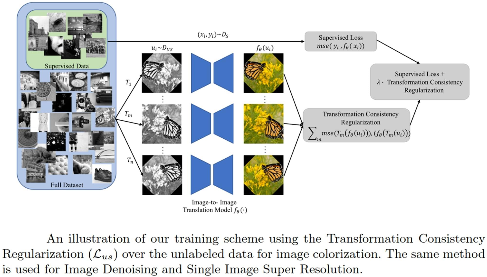

## Table of Contents

## What is image super-resolution in the context of machine learning?

Image super-resolution in machine learning is a technique used to enhance the quality of images by increasing their resolution. This means taking a low-resolution image, which might look blurry or pixelated, and turning it into a high-resolution image that looks clearer and more detailed. Machine learning models learn how to do this by studying many pairs of low and high-resolution images. Once trained, these models can predict what a high-resolution version of a new low-resolution image should look like.

The process involves using algorithms, often based on deep learning, to understand the patterns and details in images. For example, a model might learn to recognize that certain blurry shapes in a low-resolution image usually correspond to specific details like leaves on a tree or the texture of fabric in a high-resolution image. By applying this learned knowledge, the model can reconstruct the image to include these details, making it appear sharper and more lifelike. This technology is useful in many fields, such as medical imaging, where clearer images can help with diagnosis, or in entertainment, where it can improve the quality of old movies or video games.

## Why is image super-resolution important and what are its applications?

Image super-resolution is important because it helps us make blurry or low-quality images look much better. When we take photos with old cameras or zoom in on a small part of a picture, the image can become pixelated and hard to see clearly. Super-resolution fixes this problem by using computers to guess what the missing details should look like, making the whole image sharper and more detailed. This is really helpful because it lets us use old images or photos taken from far away in a new way, making them useful again.

There are many ways we use image super-resolution in real life. In medicine, doctors can use it to make their scans and x-rays clearer, which can help them see problems better and treat patients more effectively. In the world of movies and TV, old films can be made to look new again, bringing them back to life for new audiences. Also, in security, clearer images from cameras can help police identify people or vehicles more easily, making cities safer. So, image super-resolution is a powerful tool that makes a big difference in many different areas.

## What are the basic principles behind image super-resolution models?

Image super-resolution models work by learning how to turn blurry, low-quality images into clear, high-quality ones. They do this by studying lots of pairs of low and high-resolution images. The model looks at the patterns and details in these images and figures out how to add the missing details to make a low-resolution image look better. This is like teaching a computer to fill in the blanks, using what it has learned from other images to guess what the missing parts should look like.

The basic idea behind these models is to use math to predict what the high-resolution image should be. They use something called a [neural network](/wiki/neural-network), which is a type of computer program that can learn from examples. The neural network takes the low-resolution image as input and tries to create a high-resolution version. It does this by adjusting its internal settings, or weights, to get better at making the right guesses. Over time, as it sees more and more images, it gets better at adding the right details to make the image look clearer.

In simple terms, image super-resolution is about making educated guesses. The model looks at the blurry image and uses what it has learned to add details that make sense. For example, if it sees a blurry shape that usually looks like a tree in high-resolution images, it will add leaves and branches to make the image look more like a real tree. This way, even if the original image was not very clear, the model can make it look much better.

## How do traditional methods of image super-resolution differ from machine learning approaches?

Traditional methods of image super-resolution, like interpolation, work by using math to guess what the missing details in a low-resolution image should look like. For example, if you have a blurry picture, these methods might use a simple rule like "if a pixel is surrounded by other pixels of a certain color, it should probably be that color too." This can make the image a bit clearer, but it often doesn't add the right details because it doesn't know what the image is supposed to show. It's like trying to fill in a puzzle without knowing what the final picture should look like.

Machine learning approaches, on the other hand, learn from lots of examples to make better guesses about what the missing details should be. They use neural networks, which are like computer brains that can learn from data. When you show a [machine learning](/wiki/machine-learning) model many pairs of low and high-resolution images, it starts to understand patterns and can add the right details to make the image look more realistic. For example, if it sees a blurry shape that usually looks like a tree in high-resolution images, it will add leaves and branches to make the image look more like a real tree. This way, machine learning can make images much clearer and more detailed than traditional methods.

In summary, traditional methods use simple math rules to try and make images clearer, but they often don't add the right details. Machine learning methods, however, learn from lots of examples and can add the right details to make images look much better. This is why machine learning is becoming more popular for image super-resolution.

## What is the PULSE model and how does it approach image super-resolution?

The PULSE model, which stands for Photo Upsampling via Latent Space Exploration, is a special way to make blurry images look clearer. It uses a type of machine learning called a Generative Adversarial Network (GAN). GANs have two parts that work together: one part creates images, and the other part checks if they look real. PULSE uses this idea to guess what a high-quality version of a blurry image should look like. It does this by starting with a blurry image and then making small changes to it until it looks like a clear, high-resolution image that could have been made by the GAN.

PULSE works by exploring a space called the latent space, which is like a map of all the possible images the GAN can create. It starts with a blurry image and then moves around in this space to find a spot that matches the blurry image but is much clearer. Imagine you're trying to find your way to a clear version of your blurry photo by walking through a big, complicated park. PULSE keeps walking until it finds the right spot. This method is good because it can make images look very realistic, even if they started out very blurry.

## How does the ClassSR model work and what makes it unique in super-resolution tasks?

The ClassSR model, which stands for Class-Specific Super-Resolution, works by understanding that different types of images need different ways to be made clearer. For example, a photo of a dog might need different details added than a photo of a building. ClassSR uses machine learning to learn about these different types of images. It separates images into different groups, or classes, and then uses a special model for each group to make the images in that group look clearer. By doing this, ClassSR can add the right details that match the type of image it's working on, making the final picture look more realistic.

What makes ClassSR unique is that it doesn't use just one model for all images. Instead, it uses many models, each designed for a specific type of image. This means it can be very good at making different kinds of images look clearer because it knows what details to add for each type. For example, if it's working on a picture of a person's face, it will add details like eyes and hair in a way that looks natural. This approach helps ClassSR to create high-resolution images that are more accurate and detailed than if it used a one-size-fits-all model.

## What are the key differences between PULSE and ClassSR in terms of performance and application?

PULSE and ClassSR are two different approaches to making images clearer, and they have different strengths and uses. PULSE works by using a GAN to explore a space of possible images until it finds a clear version of a blurry photo. This method is good at making images look very realistic because it uses what it knows about how real images are made. PULSE is especially useful when you have a very blurry image and want it to look as clear and real as possible. It's like finding the best path in a big park to get to a clear picture.

ClassSR, on the other hand, works by understanding that different types of images need different ways to be made clearer. It separates images into different groups and uses a special model for each group. This means ClassSR can be very good at adding the right details for each type of image, like adding realistic eyes and hair to a picture of a person's face. ClassSR is useful when you know what kind of image you're working with and want to make sure the details added are accurate for that type of image. It's like using a different tool for each kind of puzzle you're trying to solve.

## What datasets are commonly used to train and evaluate image super-resolution models?

To train and evaluate image super-resolution models, researchers often use datasets like the DIV2K dataset, which contains 1,000 high-resolution images. Another common dataset is the Set5, which has five images, and the Set14, which has 14 images. These datasets are used because they have both low-resolution and high-resolution versions of the same images, which helps the models learn how to make blurry images clearer. For example, the DIV2K dataset is popular because it has a lot of different types of images, like landscapes and people, which helps the model understand many different kinds of details.

When evaluating these models, researchers also use datasets like Urban100, which has 100 images of urban scenes, and BSD100, which has 100 images from the Berkeley Segmentation Dataset. These datasets help test how well the models can handle different types of images. For instance, Urban100 is useful for checking if the model can add the right details to buildings and streets. By using a variety of datasets, researchers can make sure their models work well for many different kinds of images and situations.

## What metrics are used to evaluate the performance of image super-resolution models?

When people want to see how well an image super-resolution model works, they use special numbers called metrics. One common metric is the Peak Signal-to-Noise Ratio (PSNR). PSNR measures how close the clear image made by the model is to the real high-quality image. A higher PSNR means the model did a better job at making the image clear. Another important metric is the Structural Similarity Index (SSIM). SSIM looks at how similar the clear image is to the real one in terms of things like brightness, contrast, and structure. A higher SSIM means the model did a good job at keeping the important parts of the image the same.

There are also other metrics that people use, like the Learned Perceptual Image Patch Similarity (LPIPS). LPIPS tries to see how similar the clear image looks to a human, not just to a computer. This is important because sometimes a model can make an image that looks good to a computer but not to a person. By using these different metrics, researchers can get a full picture of how well their super-resolution model is working. They can see if the model is good at making images clear and if those images look right to people too.

## How can one implement a basic image super-resolution model using popular machine learning frameworks?

To implement a basic image super-resolution model, you can use popular machine learning frameworks like TensorFlow or PyTorch. Let's use PyTorch as an example. First, you need to prepare your dataset, which should include pairs of low-resolution and high-resolution images. You can use libraries like PIL to load and preprocess these images. Then, you'll create a simple neural network, often called a Convolutional Neural Network (CNN), which is good at understanding images. In PyTorch, you might define this network using the `nn.Module` class. You'll set up layers that learn to add details to the low-resolution images, making them look clearer. After defining your model, you'll need to train it using an optimizer like Adam and a loss function like Mean Squared Error (MSE) to compare the model's output to the high-resolution images.

Here's a simple example of how you might set up and train a basic super-resolution model in PyTorch:

```python
import torch
import torch.nn as nn
import torch.optim as optim
from torchvision import transforms, datasets

# Define the CNN model
class SuperResolutionModel(nn.Module):
    def __init__(self):
        super(SuperResolutionModel, self).__init__()
        self.conv1 = nn.Conv2d(3, 64, kernel_size=9, padding=4)
        self.conv2 = nn.Conv2d(64, 32, kernel_size=1, padding=0)
        self.conv3 = nn.Conv2d(32, 3, kernel_size=5, padding=2)

    def forward(self, x):
        x = torch.relu(self.conv1(x))
        x = torch.relu(self.conv2(x))
        x = self.conv3(x)
        return x

# Set up the model, loss function, and optimizer
model = SuperResolutionModel()
criterion = nn.MSELoss()
optimizer = optim.Adam(model.parameters(), lr=0.001)

# Load and preprocess the dataset
transform = transforms.Compose([transforms.ToTensor()])
train_dataset = datasets.ImageFolder('path_to_your_dataset', transform=transform)
train_loader = torch.utils.data.DataLoader(train_dataset, batch_size=4, shuffle=True)

# Training loop
num_epochs = 10
for epoch in range(num_epochs):
    for data in train_loader:
        inputs, labels = data
        optimizer.zero_grad()
        outputs = model(inputs)
        loss = criterion(outputs, labels)
        loss.backward()
        optimizer.step()
    print(f'Epoch [{epoch+1}/{num_epochs}], Loss: {loss.item():.4f}')
```

This code sets up a basic super-resolution model and trains it on a dataset. You'll need to adjust the paths and parameters to fit your specific dataset and needs. After training, you can use the model to make low-resolution images clearer by passing them through the network. Remember, this is a simple example, and more advanced models might use different architectures or techniques to achieve better results.

## What are the current challenges and limitations faced by image super-resolution models?

Image super-resolution models face several challenges and limitations. One big problem is that they can sometimes make images look a bit too perfect or fake. This happens because the models are trying to guess what the missing details should be, and sometimes they add details that aren't quite right. Another challenge is that these models need a lot of good examples to learn from. If they don't have enough high-quality images to study, they might not be able to make the blurry images look as clear as we want. Also, these models can take a long time to train and need a lot of computer power, which can be a problem for people who don't have strong computers.

Another limitation is that super-resolution models can struggle with very blurry images. If an image is too blurry, the model might not be able to guess what the details should be, and the final image might still look unclear. There's also the issue of different types of images needing different ways to be made clearer. A model that works well for pictures of people might not work as well for pictures of buildings or landscapes. This means that one model might not be good for all kinds of images, and researchers need to keep working on ways to make the models more flexible and accurate for different situations.

## What are the future directions and potential advancements in the field of image super-resolution?

In the future, image super-resolution is likely to get even better as researchers keep finding new ways to make blurry images clearer. One exciting direction is using more advanced types of neural networks, like Generative Adversarial Networks (GANs), to make images look more realistic. These networks can learn to add details that look very natural, almost like they were taken with a high-quality camera. Another area of focus is making models that can work well with all kinds of images, whether they are pictures of people, buildings, or landscapes. This means the models will need to understand the different patterns in different types of images and add the right details for each one.

Another potential advancement is making super-resolution models faster and easier to use. Right now, these models can take a long time to train and need a lot of computer power. But in the future, researchers might find ways to make them work more quickly and on regular computers, so more people can use them. Also, there's a lot of interest in using super-resolution for videos, not just still images. Making videos clearer is harder because the model has to understand how things move from one frame to the next, but it could be really useful for things like old movies or security footage. As technology keeps improving, image super-resolution will become even more powerful and helpful in many different areas.