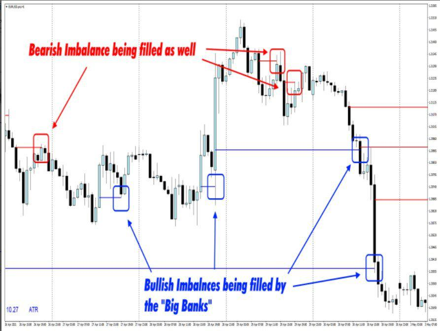

In the world of finance, algorithmic trading plays a crucial role, emphasizing the need for speed and precision in trading decisions. Algorithmic trading involves the use of computer systems to execute trading orders at speeds and frequencies that are impossible for human traders. Among its several approaches, imbalance-based trading signals are gaining attention, highlighting their unique methodology within this domain.

Imbalance-based trading signals, as a subset of algorithmic trading signals, emerge from analyzing the discrepancies between buy and sell orders for a particular asset. These signals tap into the concept of market imbalance, characterized by an uneven distribution of buy and sell orders. By identifying such imbalances, traders can gain insights into potential market shifts that present advantageous trading opportunities.



This article focuses on exploring the intricacies of imbalance-based signals, examining their application within algorithmic trading, and shedding light on both the benefits and challenges they encompass. Understanding these signals enhances a trader's ability to navigate the fast-paced environment of modern trading. By scrutinizing the mechanics of imbalance-based signals, one can appreciate their critical role in elevating trading strategies.

Through a detailed investigation, we seek to elucidate how imbalance-based trading signals aid traders in identifying trends, predicting price movements, and optimizing trading strategies within financial markets. With technology and market access constantly advancing, the importance of these signals is expected to grow, offering traders who effectively utilize them a competitive edge.

## Table of Contents

## What Are Imbalance-Based Trading Signals?

Imbalance-based trading signals are derived from analyzing the differences between buy and sell orders within a specific financial asset. These signals focus on the concept of market imbalance, which arises when there is an unequal distribution of orders between buyers and sellers. Such imbalances can be pivotal in identifying market conditions that may present advantageous trading opportunities. By scrutinizing the flow of orders and their respective magnitudes, these signals offer valuable insights into probable market movements and trends.

Market imbalance stems from the idea that supply and demand dynamics are not always in equilibrium. When the quantity of buy orders substantially outweighs sell orders, it may indicate upward price pressure, suggesting a potential uptrend. Conversely, a predominance of sell orders can signal downward pressure, pointing towards a potential downtrend. The signals derived from these analyses are especially beneficial in forecasting price movements and identifying emerging trends in various financial markets.

To quantify imbalances, traders often assess the Order Book, which records active buy and sell orders. A common metric used is the Order Imbalance Ratio (OIR), defined as:

$$
\text{OIR} = \frac{\text{Volume of Buy Orders} - \text{Volume of Sell Orders}}{\text{Total Volume of Orders}}
$$

This ratio helps determine the extent of the imbalance. A positive OIR suggests buying pressure, whereas a negative OIR indicates selling pressure.

Imbalance-based signals are instrumental in revealing market sentiment and [liquidity](/wiki/liquidity-risk-premium), offering insights that go beyond traditional price-based indicators. By focusing on real-time order data, these signals can capture nuances that are often missed by relying solely on historical price patterns, thereby opening new avenues for predictive analysis and trading profitability.

## How Imbalance-Based Signals Work in Algo Trading

Algorithmic trading, commonly referred to as algo trading, automates the execution of trades through advanced mathematical models and algorithms. The integration of imbalance-based signals into these algorithms provides an efficient method for identifying trading opportunities by examining order imbalances. These signals stem from assessing the [volume](/wiki/volume-trading-strategy) and direction of buy and sell orders, thereby highlighting potential trends in price movements.

Once an imbalance is detected—characterized by a significant discrepancy between buy and sell orders—the algo can make prompt decisions regarding trade entry and [exit](/wiki/exit-strategy) points. This timely response enables traders to optimize profit potential while reducing associated risks. The mathematical foundation of imbalance-based signals can be expressed through the calculation of order flow imbalance (OFI), which is given by:

$$
\text{OFI} = \sum (\text{Buy Volume} - \text{Sell Volume})
$$

This formula measures the net order flow within a specified time window and serves as a primary indicator of market sentiment and potential price shifts.

The operational mechanism of the trading algorithm generally involves several steps. Initially, the algo continuously monitors [order book](/wiki/order-book-trading-strategies) data for the specified asset. It then computes the OFI, assessing both current and historical data to establish trends. If a significant imbalance consistent with a trend pattern is observed, the algorithm initiates trades that align with the predicted market movement.

By focusing on real-time order flows, imbalance-based algorithms effectively capitalize on market inefficiencies. Python, being a prominent language in data analysis and [machine learning](/wiki/machine-learning), is frequently employed to implement these models. An example snippet for calculating OFI in Python is as follows:

```python
def calculate_ofi(buy_volumes, sell_volumes):
    return sum(buy_volumes) - sum(sell_volumes)

# Sample order volumes
buy_volumes = [100, 150, 200]
sell_volumes = [90, 120, 180]

ofi = calculate_ofi(buy_volumes, sell_volumes)
print("Order Flow Imbalance:", ofi)
```

In this example, the function `calculate_ofi` computes the net order volume imbalance, providing a basis for the trading decisions made by the algorithm. These precise reactions to identified imbalances allow traders to swiftly benefit from shifts in market dynamics, underscoring the tactical advantage imbalance-based signals impart within [algorithmic trading](/wiki/algorithmic-trading).

## Advantages of Using Imbalance-Based Signals

Imbalance-based trading signals offer several advantages that make them a valuable component of algorithmic trading strategies. One of their primary benefits is the ability to provide timely trading opportunities, allowing traders to act quickly in dynamic market conditions. By analyzing the disparities between buy and sell orders, these signals reveal insights into market sentiment and liquidity, which are essential for identifying buying or selling pressure. This can be particularly beneficial in fast-paced financial markets where swift decision-making is crucial.

Moreover, imbalance-based signals enhance the performance of algorithmic trading strategies by integrating real-time data analysis. Unlike traditional methods that rely heavily on historical price patterns, which may not always accurately reflect current market conditions, imbalance-based signals focus on the immediate order flow. This focus on real-time data helps traders respond more effectively to emerging trends and market anomalies, reducing the risk of relying on outdated information.

The effectiveness of imbalance signals is especially pronounced in volatile markets. In such environments, price movements can be abrupt and substantial, presenting both risks and opportunities. Imbalance-based signals enable traders to make informed decisions rapidly by highlighting potential shifts in market dynamics. This capability ensures that traders are not only reacting to market changes but are also strategically positioned to capitalize on them.

By incorporating imbalance-based signals into their trading algorithms, traders gain a more nuanced understanding of the market landscape. This approach reduces dependence on historical data and enhances the adaptability of trading strategies. Consequently, traders can optimize profit potential while minimizing risk, ultimately leading to more successful trading outcomes.

## Challenges and Considerations

Imbalance-based trading signals, while advantageous, present several challenges that traders must address to utilize them effectively. One primary challenge is the reliance on high-quality and timely market data. The accuracy and efficiency of these signals are contingent upon the granularity and freshness of data that accurately reflects current market conditions. Without this, the signals may become obsolete, leading to potential misinterpretations and trading errors.

In rapidly moving markets, the dynamics of order imbalances can change swiftly, complicating the reliable capture of these signals. For instance, sudden inflows or outflows in buy or sell orders might momentarily create false impressions of a trend that is not sustainable. This necessitates the development of algorithms capable of quickly adapting to changes and maintaining precision under volatile conditions. Algorithms must be able to discern between temporary fluctuations and genuine imbalances indicative of market trends.

Furthermore, traders need to construct robust algorithms that can effectively filter out noise and false positives inherent in trading data. Noise, as understood in this context, includes random fluctuations in order flows that do not contribute to meaningful market insights. Traders can use statistical techniques or machine learning models to differentiate noise from true signals. For example, one might implement a rolling average or employ advanced techniques such as Kalman filters to smooth data and reduce the impact of erratic variations.

Moreover, implementing these signals requires substantial technical expertise and infrastructure. The complexity of balancing between accurate data processing and the speed of execution involves sophisticated hardware and software solutions. High-performance computing resources may be necessary to achieve the low-latency processing required by many algorithmic trading strategies. Additionally, the integration of these signals within existing trading systems can be technically challenging, often necessitating custom solutions tailored to the specific nuances of a trader’s strategy and the markets in which they engage.

In summary, while imbalance-based trading signals hold significant promise for enhancing trading strategies, traders must navigate the challenges of data quality, rapid market shifts, noise filtration, and technical infrastructure to harness their full potential.

## Conclusion

Imbalance-based trading signals offer a compelling approach to identifying trading opportunities in algorithmic trading. These signals excel in providing timely insights into market dynamics, allowing traders to respond effectively to market conditions. However, traders must remain vigilant of the associated challenges. The success of these signals hinges on the quality of the underlying data and the robustness of the algorithms employed. Data inaccuracies or poor algorithm design can lead to false signals and suboptimal trading decisions.

With careful implementation, imbalance-based trading signals can greatly enhance trading strategies and outcomes. Their ability to decode real-time market sentiments and order flows offers traders a significant advantage. This advantage is particularly pronounced as technology and market access continue to improve, fostering greater precision and efficiency in trading.

As the influence of algorithmic trading expands, the role of imbalance-based signals is likely to grow, further enhancing their utility in diverse financial markets. Traders who effectively harness these signals can secure a competitive edge, translating into superior performance and profitability. In conclusion, while the adoption of imbalance-based signals requires diligence and technical expertise, the potential rewards they offer in terms of strategic trading advancements and market competitiveness are substantial.

## References

1. Aldridge, I. (2013). *High-Frequency Trading: A Practical Guide to Algorithmic Strategies and Trading Systems*. John Wiley & Sons.
   - This book provides an extensive overview of algorithmic trading strategies, including the development and implementation of trading systems that utilize market imbalances. It is a valuable resource for understanding the intricacies involved in crafting effective trading algorithms.

2. Chan, E. (2009). *Quantitative Trading: How to Build Your Own Algorithmic Trading Business*. John Wiley & Sons.
   - Chan’s work delves into how quantitative methods can be applied to trading, offering insights on how imbalance-based signals can be integrated into broader trading strategies. It serves as a guide for implementing these concepts in practical trading environments.

3. Kissell, R. (2014). *The Science of Algorithmic Trading and Portfolio Management*. Academic Press.
   - This book covers advanced topics in algorithmic trading, including the use of imbalance-based signals to assess market sentiment and liquidity, offering a scientific approach to understanding market imbalances.

4. Chaboud, A. P., Chiquoine, B., Hjalmarsson, E., & Vega, C. (2014). *Rise of the Machines: Algorithmic Trading in the Foreign Exchange Market*. The Journal of Finance, 69(5), 2045-2084.
   - This journal article investigates the increasing influence of algorithmic trading in the forex market, highlighting how automated trading systems, including those based on order imbalances, influence market behavior.

5. Cartea, Á., Jaimungal, S., & Penalva, J. (2015). *Algorithmic and High-Frequency Trading*. Cambridge University Press.
   - The authors explore various algorithmic trading strategies, focusing on high-frequency trading. This book provides insights into how imbalance-based signals can be effectively used in high-frequency trading contexts.

6. Cont, R., & Kukanov, A. (2017). *Optimal order placement in limit order markets*. Quantitative Finance, 17(6), 905-919.
   - This paper discusses the dynamics of limit order markets and how traders can improve order placement strategies. It includes discussions on market imbalances and how these imbalances can signal profitable trading opportunities.

7. Gsell, M. (2010). *Assessing the Impact of Algorithmic Trading on Markets: A Simulation Approach*. Deutsche Börse AG.
   - This report evaluates the effects of algorithmic trading on market stability and efficiency, focusing on how market imbalances play a role in algorithmic strategies.

8. Narang, R. K. (2013). *Inside the Black Box: A Simple Guide to Quantitative and High-Frequency Trading*. John Wiley & Sons.
   - Narang provides a look inside the mechanics of quantitative trading, including discussions on how imbalance-based signals are utilized in creating effective trading strategies.

9. Zhang, F., & Guo, L. J. (2016). *The dynamics of market liquidity and order imbalance*. Journal of Financial Markets, 28, 111-132.
   - This paper examines how market liquidity is impacted by order imbalances, offering quantitative insights into the patterns that drive these imbalances and their implications for trading strategies.

## References & Further Reading

[1]: Aldridge, I. (2013). ["High-Frequency Trading: A Practical Guide to Algorithmic Strategies and Trading Systems"](https://www.wiley.com/en-us/High+Frequency+Trading%3A+A+Practical+Guide+to+Algorithmic+Strategies+and+Trading+Systems%2C+2nd+Edition-p-9781118343500). John Wiley & Sons.

[2]: Chan, E. (2009). ["Quantitative Trading: How to Build Your Own Algorithmic Trading Business"](https://github.com/justinchou/books-quantitative-trading). John Wiley & Sons.

[3]: Kissell, R. (2014). ["The Science of Algorithmic Trading and Portfolio Management"](https://www.sciencedirect.com/book/9780124016897/the-science-of-algorithmic-trading-and-portfolio-management). Academic Press.

[4]: Chaboud, A. P., Chiquoine, B., Hjalmarsson, E., & Vega, C. (2014). ["Rise of the Machines: Algorithmic Trading in the Foreign Exchange Market"](https://papers.ssrn.com/sol3/papers.cfm?abstract_id=1501135). The Journal of Finance, 69(5), 2045-2084.

[5]: Cartea, Á., Jaimungal, S., & Penalva, J. (2015). ["Algorithmic and High-Frequency Trading"](https://assets.cambridge.org/97811070/91146/frontmatter/9781107091146_frontmatter.pdf). Cambridge University Press.

[6]: Cont, R., & Kukanov, A. (2017). ["Optimal order placement in limit order markets"](https://arxiv.org/pdf/1210.1625). Quantitative Finance, 17(6), 905-919.

[7]: Gsell, M. (2010). ["Assessing the Impact of Algorithmic Trading on Markets: A Simulation Approach"](https://www.semanticscholar.org/paper/Assessing-the-Impact-of-Algorithmic-Trading-on-A-Gsell/820fa261b451f5b57decf4f8ccf526247fcbc2ff). Deutsche Börse AG.

[8]: Narang, R. K. (2013). ["Inside the Black Box: A Simple Guide to Quantitative and High-Frequency Trading"](https://onlinelibrary.wiley.com/doi/book/10.1002/9781118662717). John Wiley & Sons.

[9]: Zhang, F., & Guo, L. J. (2016). ["The dynamics of market liquidity and order imbalance"](https://www.sciopen.com/article/10.1186/s43897-024-00090-7). Journal of Financial Markets, 28, 111-132.