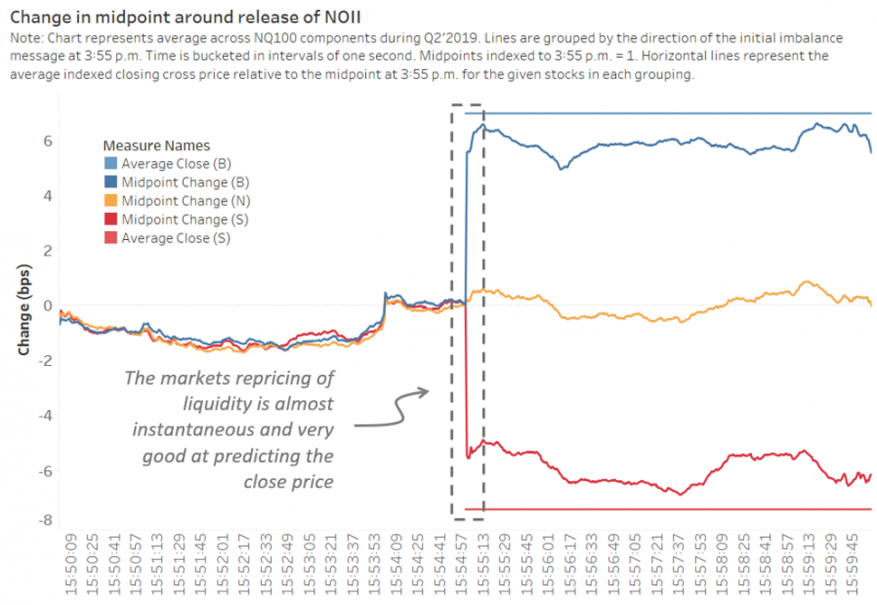

## Table of Contents

## What are Imbalance Only Orders (IOOs)?

Imbalance Only Orders (IOOs) are a type of order used in stock trading. They are designed to help balance the market when there are more buyers than sellers or more sellers than buyers. IOOs are only executed during a special period at the opening or closing of the market, called the imbalance period. This period helps to match up all the orders that couldn't be filled during regular trading hours.

When there is an imbalance, it means that there are more orders on one side of the market. For example, if there are a lot more people wanting to buy a stock than sell it, there is a buy-side imbalance. IOOs are used to fill these imbalances by only allowing trades that help to even out the number of buy and sell orders. This helps to make sure the market opens or closes at a fair price, reflecting the true supply and demand for the stock.

## How do Imbalance Only Orders function in the market?

Imbalance Only Orders, or IOOs, are special orders that only get used at the start or end of the trading day. They help fix a problem called "imbalance," which happens when there are a lot more people wanting to buy a stock than sell it, or the other way around. When the market is about to open or close, there's a short time called the imbalance period. During this time, IOOs step in to match up the extra buy or sell orders that couldn't be filled during the regular trading time.

IOOs work by only allowing trades that help balance out the market. If there are too many people wanting to buy a stock, IOOs will only let sell orders go through. This way, they help make sure that the market opens or closes at a price that's fair for everyone. By doing this, IOOs help keep the market stable and make sure that the price of a stock reflects what people really want to buy or sell it for.

## What is the primary purpose of using Imbalance Only Orders?

The main reason for using Imbalance Only Orders, or IOOs, is to help balance the market when there are more people wanting to buy or sell a stock than the other way around. This situation is called an imbalance. When the market is about to open or close, there's a special time called the imbalance period. During this time, IOOs are used to match up the extra orders that couldn't be filled during regular trading hours.

By only allowing trades that help even out the number of buy and sell orders, IOOs make sure the market starts or ends the day at a fair price. This helps keep the market stable and makes sure the price of a stock shows what people really want to buy or sell it for. In simple terms, IOOs help fix the problem of too many buyers or sellers, making the market work better for everyone.

## In which types of markets are Imbalance Only Orders typically used?

Imbalance Only Orders, or IOOs, are mostly used in stock markets. They help when there are more people wanting to buy or sell a stock than the other way around. This can happen at the start or end of the trading day. When the market is about to open or close, there's a special time called the imbalance period. During this time, IOOs step in to match up the extra orders that couldn't be filled during regular trading hours.

IOOs are important because they help keep the market fair and stable. They make sure that the price of a stock at the start or end of the day shows what people really want to buy or sell it for. By only allowing trades that help balance out the number of buy and sell orders, IOOs make sure the market opens or closes at a fair price. This is why they are used in stock markets where keeping the balance is key to having a smooth trading day.

## How do Imbalance Only Orders differ from other types of orders?

Imbalance Only Orders, or IOOs, are different from other types of orders because they only work during a special time at the start or end of the trading day. This time is called the imbalance period. When there are more people wanting to buy or sell a stock than the other way around, it creates an imbalance. IOOs step in to fix this by only allowing trades that help balance out the market. Other types of orders, like market orders or limit orders, can be used anytime during the trading day and don't focus on fixing imbalances.

For example, a market order is an order to buy or sell a stock at the best available price right away. A limit order lets you set a specific price at which you want to buy or sell. These orders don't care about balancing the market; they just want to get the trade done. IOOs, on the other hand, are all about making sure the market starts or ends the day at a fair price. They only let trades happen that help even out the number of buy and sell orders, which is why they are used during the imbalance period.

## What are the specific conditions under which an Imbalance Only Order can be executed?

Imbalance Only Orders, or IOOs, can only be used during a special time at the start or end of the trading day. This time is called the imbalance period. When there are a lot more people wanting to buy a stock than sell it, or more people wanting to sell than buy, it creates an imbalance. IOOs are there to fix this problem by only letting trades happen that help balance out the market.

During the imbalance period, if there are too many people wanting to buy a stock, IOOs will only let sell orders go through. If there are too many people wanting to sell, then only buy orders will be allowed. This way, IOOs help make sure the market opens or closes at a fair price, showing what people really want to buy or sell the stock for. By only working during the imbalance period and focusing on fixing imbalances, IOOs are different from other types of orders that can be used anytime during the trading day.

## Can you explain the role of Imbalance Only Orders during market openings and closings?

Imbalance Only Orders, or IOOs, play a special role when the stock market opens and closes. They help fix a problem called "imbalance," which happens when there are a lot more people wanting to buy a stock than sell it, or the other way around. When the market is about to open or close, there's a short time called the imbalance period. During this time, IOOs step in to match up the extra buy or sell orders that couldn't be filled during the regular trading time.

IOOs work by only allowing trades that help balance out the market. If there are too many people wanting to buy a stock, IOOs will only let sell orders go through. This way, they help make sure that the market opens or closes at a price that's fair for everyone. By doing this, IOOs help keep the market stable and make sure that the price of a stock reflects what people really want to buy or sell it for.

## What are the potential benefits of using Imbalance Only Orders for traders?

Imbalance Only Orders, or IOOs, can help traders by making sure the market starts or ends the day at a fair price. When there are a lot more people wanting to buy or sell a stock than the other way around, it can cause the price to be off. IOOs fix this by only letting trades happen that help balance out the market. This means traders can feel more confident that the price they see at the start or end of the day is a good one, based on what people really want to buy or sell the stock for.

Another benefit of using IOOs is that they can help traders get their orders filled when there's a big imbalance. If a trader wants to sell a stock but there are too many people wanting to buy it, their order might not get filled during regular trading time. But during the imbalance period, IOOs will only let sell orders go through if there are too many buyers. This gives the trader a better chance of selling their stock at a fair price. By helping to balance the market, IOOs make trading smoother and more predictable for everyone.

## What are the risks or limitations associated with Imbalance Only Orders?

Using Imbalance Only Orders, or IOOs, can have some risks and limitations. One big risk is that IOOs only work during a short time at the start or end of the trading day. If a trader wants to use an IOO but misses this time, their order won't get filled. This can be a problem if the trader really needs to buy or sell a stock at that time. Also, because IOOs only let trades happen that help balance the market, a trader might not get the price they want. If there are too many people wanting to buy a stock, the price might go up a lot before the IOO can be used, and the trader might end up selling for less than they hoped.

Another limitation is that IOOs can be hard to predict. Since they depend on what other people are doing in the market, a trader can't be sure if their IOO will get filled or at what price. This can make it tricky to plan trades. Also, because IOOs are only used during the imbalance period, they might not be the best choice for traders who want to buy or sell stocks at other times during the day. Traders need to think carefully about when and how to use IOOs to make sure they work well for their trading plans.

## How do regulatory frameworks affect the use of Imbalance Only Orders?

Regulatory frameworks set rules that can change how traders use Imbalance Only Orders, or IOOs. These rules are made by groups like the Securities and Exchange Commission (SEC) to keep the stock market fair and safe. For example, the SEC might say that IOOs can only be used at certain times of the day or that they must follow certain steps to make sure they don't cause problems in the market. These rules help make sure that IOOs are used in a way that helps balance the market without causing too much trouble.

Because of these rules, traders need to know what they can and can't do with IOOs. If a trader doesn't follow the rules, they might get in trouble or their orders might not work. This means that traders have to be careful and keep up with any changes in the rules. By following the regulatory frameworks, traders can use IOOs to help balance the market at the start or end of the trading day, but they have to do it the right way.

## What advanced strategies can be implemented using Imbalance Only Orders?

Traders can use Imbalance Only Orders, or IOOs, to take advantage of the price changes that happen when the market opens or closes. If a trader thinks there will be a lot more people wanting to buy a stock than sell it, they can place an IOO to sell their stock during the imbalance period. This can help them get a better price than if they sold during regular trading time. On the other hand, if they think there will be too many sellers, they can use an IOO to buy the stock at a lower price. By understanding how imbalances work, traders can plan their orders to make the most of these price movements.

Another advanced strategy is to use IOOs to manage risk. If a trader has a big position in a stock and they're worried about what might happen when the market opens or closes, they can use IOOs to balance out their position. For example, if they own a lot of a stock and they think there will be a big sell-off at the opening, they can place an IOO to sell some of their stock during the imbalance period. This can help them reduce their risk and protect their investment. By using IOOs smartly, traders can make their trading plans more flexible and safer.

## How can one optimize the use of Imbalance Only Orders based on market data analysis?

To optimize the use of Imbalance Only Orders, or IOOs, traders need to look at market data to see when there might be a lot more people wanting to buy or sell a stock than the other way around. By studying past data, traders can spot patterns that show when imbalances are likely to happen. For example, if a stock often has a big buy-side imbalance at the start of the trading day, a trader can place an IOO to sell their stock during that time. This way, they can take advantage of the higher prices that come with the imbalance. Also, by keeping an eye on news and events that might affect the stock, traders can predict imbalances and use IOOs to get the best prices.

Another way to use market data to optimize IOOs is by looking at the size of the imbalances. If the data shows that the imbalances are usually small, a trader might not want to use an IOO because the price change might not be big enough to make it worth it. But if the data shows big imbalances, using an IOO can be a good way to get a better price. Traders can also use tools like order [books](/wiki/algo-trading-books) and [volume](/wiki/volume-trading-strategy) data to see how many people are buying or selling a stock. By understanding these numbers, traders can decide when to use IOOs to balance their positions and manage their risk better.

## References & Further Reading

[1]: Harris, L. (2003). ["Trading and Exchanges: Market Microstructure for Practitioners"](https://www.amazon.com/Trading-Exchanges-Market-Microstructure-Practitioners/dp/0195144708). Oxford University Press.

[2]: Hasbrouck, J. (2007). ["Empirical Market Microstructure: The Institutions, Economics, and Econometrics of Securities Trading"](https://academic.oup.com/book/52241). Oxford University Press.

[3]: Ahn, H.-J., Cao, C., & Choe, H. (1998). ["Imbalancing the Order Imbalance: Monitoring Liquidity Dynamics Before and After Trades"](https://www.researchgate.net/publication/288745624_The_performance_of_imbalance-based_trading_strategy_on_tender_offer_announcement_day). Journal of Financial Markets, 1(1), 20-41.

[4]: Aldridge, I. (2013). ["High-Frequency Trading: A Practical Guide to Algorithmic Strategies and Trading Systems, Second Edition"](https://onlinelibrary.wiley.com/doi/pdf/10.1002/9781119203803.fmatter). Wiley.

[5]: Kissell, R. (2014). ["The Science of Algorithmic Trading and Portfolio Management"](https://www.sciencedirect.com/book/9780124016897/the-science-of-algorithmic-trading-and-portfolio-management). Academic Press.