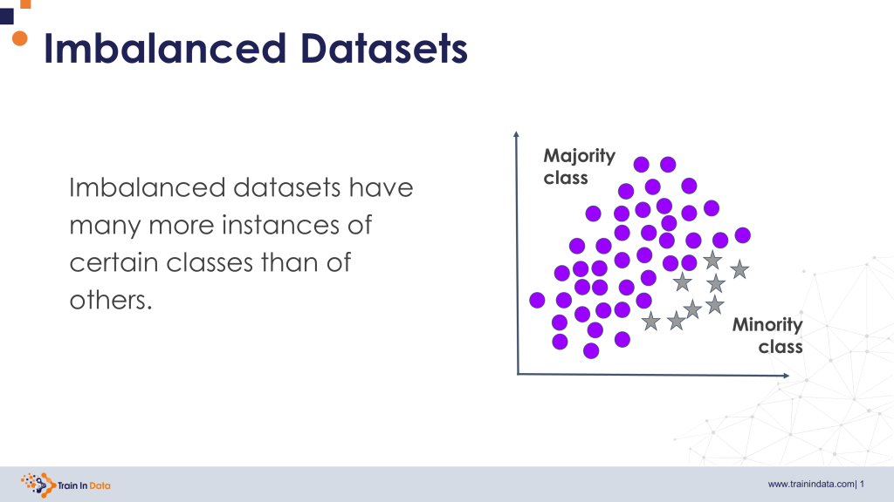

## Table of Contents

## What is an imbalanced dataset in machine learning?

An imbalanced dataset in machine learning is when the number of examples in one class is much larger than the number of examples in another class. For example, if you are trying to predict whether an email is spam or not, and 95% of your emails are not spam, then you have an imbalanced dataset. This can cause problems because the machine learning model might learn to just predict the majority class (in this case, not spam) most of the time, and not do a good job at predicting the minority class (spam).

To deal with imbalanced datasets, people use different techniques. One common method is called oversampling, where you make more copies of the minority class to balance it out with the majority class. Another method is undersampling, where you remove some examples from the majority class to make the dataset more balanced. There are also more advanced techniques, like using special algorithms that are designed to work well with imbalanced data, or changing the way the model is trained to pay more attention to the minority class.

## Why is dealing with imbalanced datasets important?

Dealing with imbalanced datasets is important because it helps machine learning models make better predictions. When a dataset is imbalanced, the model might focus too much on the majority class and ignore the minority class. This means the model might be good at predicting the common cases but bad at predicting the rare ones. For example, if you're trying to predict rare diseases, an imbalanced dataset could make the model miss these diseases because it's trained to see healthy cases more often.

Fixing imbalanced datasets helps make sure the model pays attention to all classes, not just the most common ones. This is crucial in areas like medical diagnosis, fraud detection, or any situation where missing the minority class can have serious consequences. By using techniques like oversampling, undersampling, or special algorithms, we can train models that are fairer and more accurate across all classes, leading to better decision-making and outcomes.

## What are common causes of dataset imbalance?

Dataset imbalance often happens because the real world is not always balanced. For example, in a bank, there are way more normal transactions than fraud ones. This means when we collect data, we end up with more examples of normal transactions than fraud ones. Another common reason is how we collect data. If we use a method that only looks at certain kinds of data, we might miss out on other kinds, causing imbalance. For instance, if a survey only reaches people in cities, it might miss out on people in rural areas, leading to an imbalanced dataset.

Sometimes, imbalance comes from the way we label data. If it's hard to tell what class something belongs to, we might end up labeling most things as the easier class. This can happen in medical diagnoses where it's hard to tell if someone has a rare disease, so doctors might label them as not having it, causing an imbalance. Also, as time goes on, the balance in a dataset can change. What was balanced a year ago might not be balanced now because the world changes. Keeping datasets up to date is important to avoid imbalance caused by time.

## How can imbalanced datasets affect model performance?

Imbalanced datasets can make [machine learning](/wiki/machine-learning) models perform badly because they might focus too much on the common cases and ignore the rare ones. For example, if you're trying to predict whether a credit card transaction is fraud or not, and most transactions are not fraud, the model might learn to always say "not fraud" because that's what it sees most often. This means the model will be good at predicting normal transactions but bad at catching the few fraud ones, which can be a big problem if you need to stop fraud.

To fix this, people use different methods like making more copies of the rare cases (oversampling) or removing some of the common cases (undersampling). They might also use special math tricks or change how the model learns to make sure it pays attention to all cases, not just the common ones. By doing this, the model can learn to predict both common and rare cases better, making it more useful in real life where catching those rare but important events, like fraud or rare diseases, is crucial.

## What are some basic techniques to handle imbalanced datasets?

One simple way to handle imbalanced datasets is by using a technique called oversampling. This means making more copies of the examples from the minority class until it's about the same size as the majority class. For example, if you have a dataset where 90% of the examples are of one class and only 10% are of another, you could make more copies of the 10% to balance it out. This helps the machine learning model see more examples of the rare class, so it can learn to predict it better.

Another basic technique is called undersampling. This means removing some examples from the majority class to make the dataset more balanced. If you have a lot more examples of one class than another, you can take away some of the extra ones from the bigger class. This way, the model doesn't get overwhelmed by the common cases and can focus on learning the rare ones too. Both oversampling and undersampling can help make the model better at predicting all classes, not just the most common ones.

There are also other methods like changing the way the model learns. For example, you can use something called class weights, where you tell the model to pay more attention to the minority class. This can be done by giving higher weights to the minority class during training. Another approach is to use different algorithms that are designed to work well with imbalanced data, like Random Forests or Support Vector Machines with special settings. These methods help the model learn from all parts of the dataset, making its predictions more accurate and fair.

## Can you explain oversampling and undersampling?

Oversampling is a way to fix imbalanced datasets by making more copies of the examples from the smaller class. Imagine you have a dataset where most examples are of one type, like normal emails, and only a few are of another type, like spam emails. To balance it out, you could make more copies of the spam emails until you have about the same number of spam and normal emails. This helps the machine learning model see more examples of the rare class, so it can learn to predict it better. A common way to do this is by using a method called SMOTE (Synthetic Minority Over-sampling Technique), which creates new, similar examples of the minority class instead of just copying the existing ones.

Undersampling is another way to deal with imbalanced datasets, but instead of adding more examples, it removes some from the bigger class. If you have a lot more examples of one class than another, you can take away some of the extra ones from the bigger class. For example, if you have a lot of normal transactions and only a few fraud ones, you could remove some normal transactions to make the numbers more even. This way, the model doesn't get overwhelmed by the common cases and can focus on learning the rare ones too. Both oversampling and undersampling can help make the model better at predicting all classes, not just the most common ones.

## What is SMOTE and how does it work?

SMOTE, which stands for Synthetic Minority Over-sampling Technique, is a way to fix imbalanced datasets by making new examples of the smaller class. Imagine you have a dataset where most examples are of one type, like normal emails, and only a few are of another type, like spam emails. SMOTE helps by creating new, similar examples of the spam emails. It does this by looking at each spam email and finding its nearest neighbors. Then, it picks one of these neighbors and creates a new example that's a mix of the original spam email and its neighbor. This new example is like a fake spam email that's similar to the real ones but not exactly the same.

The way SMOTE works is pretty simple. For each example in the minority class, SMOTE finds its k nearest neighbors. Usually, k is set to 5, but you can change it. Then, it picks one of these neighbors at random and creates a new example by taking a mix of the original example and the chosen neighbor. If the original example is $$x_i$$ and the chosen neighbor is $$x_{zi}$$, the new example $$x_{new}$$ is created using the formula $$x_{new} = x_i + \lambda (x_{zi} - x_i)$$, where $$\lambda$$ is a random number between 0 and 1. This way, SMOTE makes the dataset more balanced by adding new, similar examples to the minority class, helping the machine learning model learn better from the rare cases.

## How do ensemble methods like Random Forest handle imbalanced data?

Ensemble methods like Random Forest can handle imbalanced data well because they use many decision trees to make predictions. Each tree in a Random Forest looks at different parts of the data and votes on what the final prediction should be. When dealing with imbalanced data, Random Forest can be set up to pay more attention to the rare cases. This is done by using something called class weights, where the trees are told to care more about getting the minority class right. This way, even if there are fewer examples of the rare class, the Random Forest can still learn to predict it well.

Another way Random Forest helps with imbalanced data is by using a technique called bootstrapping. This means each tree in the forest is trained on a random sample of the data, which might include more examples of the rare class by chance. This randomness helps make sure the model doesn't just focus on the common cases. By combining the predictions from all these trees, Random Forest can make better guesses about the rare cases, making it a good choice for dealing with imbalanced datasets.

## What are the advantages and disadvantages of using class weights in models?

Using class weights in models is a good way to handle imbalanced data. It helps the model pay more attention to the rare cases by giving them more importance during training. For example, if you're trying to predict rare diseases, you can tell the model to care more about getting those right by setting higher weights for the rare disease class. This can make the model better at predicting all classes, not just the common ones. It's easy to use and doesn't need to change the data, so it's a simple fix for imbalanced datasets.

However, using class weights also has some downsides. Sometimes, it can make the model too focused on the rare cases, causing it to miss the common ones. This can happen if the weights are set too high for the minority class. Also, finding the right weights can be tricky. You might need to try different weights to see what works best, which can take time. So, while class weights can help, they need to be used carefully to make sure the model works well for all classes.

## How can you evaluate model performance on imbalanced datasets?

When you have an imbalanced dataset, the usual ways to check how good your model is might not work well. For example, if you just look at accuracy, it might seem like your model is doing great because it gets most of the common cases right. But if it misses all the rare cases, that's a problem. So, instead of just using accuracy, you can use other ways to see how well your model is doing. One good way is to use something called a confusion matrix, which shows how many times your model got each class right or wrong. From this, you can calculate things like precision, recall, and F1-score, which give you a better idea of how well your model is doing with both common and rare cases.

Precision tells you how many of the times your model said "yes" to a class were actually right. Recall tells you how many of the actual cases of a class your model found. The F1-score is a mix of precision and recall, so it gives you a good overall idea of how well your model is doing. You can use these measures to see if your model is good at finding the rare cases without missing too many common ones. Another useful tool is the ROC curve and the AUC score, which show how well your model can tell the difference between classes. The AUC score is a number between 0 and 1, and a higher number means your model is better at telling the classes apart. By using these different ways to check your model, you can make sure it's doing a good job with all parts of your imbalanced dataset.

## What advanced techniques exist for dealing with severe imbalance?

When dealing with severe imbalance in datasets, one advanced technique is to use cost-sensitive learning. This method adjusts the cost of misclassifying different classes, making it more expensive for the model to get the minority class wrong. For example, if you're trying to predict rare diseases, you can set a higher cost for missing a case of the disease than for misdiagnosing a healthy person. This encourages the model to focus more on getting the rare cases right. Another technique is to use ensemble methods like boosting, which combines multiple models to improve performance. Boosting works by training models in sequence, where each new model focuses more on the examples that the previous models got wrong. This can help the model learn from the minority class better because it keeps trying to improve on the hard cases.

Another advanced method is to use anomaly detection algorithms. These algorithms are designed to find unusual or rare events in data, which can be useful when the minority class is very rare. For example, if you're looking for fraud in a sea of normal transactions, anomaly detection can help by focusing on finding the unusual patterns. Additionally, you can use techniques like SMOTE with its variations, such as Borderline-SMOTE or ADASYN. These methods create synthetic examples of the minority class but do so in a smarter way. Borderline-SMOTE focuses on creating new examples near the decision boundary, where the model might be unsure, while ADASYN creates more synthetic examples for the minority class samples that are harder to learn. These methods can help balance the dataset more effectively and improve the model's ability to predict the rare cases.

## How do you choose the right approach for handling imbalanced data in a specific project?

When you're trying to choose the right way to handle imbalanced data in a project, you need to think about what you want the model to do and how bad the imbalance is. For example, if you're trying to predict rare diseases where missing a case can be really bad, you might want to use methods like oversampling or cost-sensitive learning. These methods help the model focus more on the rare cases. If the imbalance isn't too bad, simpler methods like using class weights or undersampling might be enough. You also need to think about how much data you have and how much time you can spend on trying different methods.

After you pick a few methods that might work, you should test them out. You can try different methods like SMOTE, Random Forest with class weights, or even ensemble methods like boosting. See which one helps your model predict both the common and rare cases the best. You can use measures like precision, recall, and the F1-score to check how well your model is doing. Sometimes, you might need to try a few different methods and see which one works best for your specific project. By testing and comparing, you can find the best way to handle the imbalanced data and make your model as good as it can be.