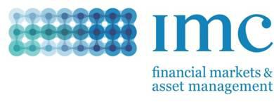

IMC Financial Markets is a prominent proprietary trading firm and market maker with a significant presence in the global financial industry. Established in 1989, IMC is known for its expertise in leveraging advanced technology and data analytics to facilitate high-frequency trading and market-making activities. The firm operates on major exchanges worldwide, providing liquidity and contributing to the efficiency and stability of financial markets.

Algorithmic trading, a method of executing orders using automated and pre-programmed trading instructions, has become increasingly important in today's financial landscape. By utilizing complex algorithms and computational techniques, it allows trading firms to make decisions at unprecedented speeds and volumes, enhancing trading efficiency and minimizing market impact. Algorithmic trading accounts for a substantial portion of trading volume on major exchanges and is pivotal in determining market dynamics.

IMC Financial Markets plays a crucial role in the sphere of algorithmic trading. Renowned for its innovative approach, the firm integrates state-of-the-art technology and sophisticated trading strategies to optimize its market-making and trading operations. By doing so, IMC enhances market liquidity and facilitates more efficient price discovery.

The purpose of this article is to explore the operations of IMC Financial Markets, focusing on its involvement in algorithmic trading. It will examine the firm's history, technology, strategies, and impact on the global financial markets. Understanding algorithmic trading is essential for comprehending modern financial markets, as it influences key aspects such as liquidity, volatility, and market efficiency. The following sections will delve into IMC Financial Markets' strategic approach to algorithmic trading and its significance in shaping the future of trading.

## Table of Contents

## Understanding IMC Financial Markets

IMC Financial Markets is a prominent player in global financial services, known for its significant contributions to trading and market making. This company was founded in 1989 in Amsterdam, Netherlands, by two traders who began by trading equity options on the floor of the Amsterdam exchanges. Over the years, IMC has evolved from its roots as a local market maker to a global entity engaged in high-frequency trading and liquidity provision across a variety of financial instruments.

### Core Services and Operations

IMC is primarily engaged in proprietary trading, with an emphasis on algorithmic and high-frequency trading strategies. The firm's operations span several key areas, including:

- **Market Making**: IMC provides liquidity in various asset classes such as equities, derivatives, bonds, and commodities. By continuously quoting buy and sell prices, IMC helps ensure efficient and orderly markets.

- **Proprietary Trading**: Utilizing sophisticated algorithms, IMC engages in trading activities purely for its own account. This involves deploying capital to take advantage of short-term market inefficiencies.

- **Technology Development**: As a technology-driven trading firm, IMC invests heavily in developing cutting-edge software and hardware solutions to optimize trading performance and manage risk effectively.

### Global Reach and Market Presence

From its beginnings in the Netherlands, IMC has expanded its geographical footprint and now has offices in major financial hubs including Chicago, Sydney, and Hong Kong. This global presence allows IMC to trade on more than 100 venues across the world, providing it with a strategic advantage in capturing diverse market opportunities.

### Achievements and Milestones

Throughout its history, IMC has achieved several significant milestones:

- **Pioneering Technological Advancements**: IMC was one of the early adopters of electronic trading systems in the 1990s, which revolutionized its trading operations and strategy.

- **Global Expansion**: In 2000, IMC expanded into the United States, marking the beginning of its international growth strategy. This move was complemented by the establishment of trading operations in the Asia-Pacific region.

- **Recognition for Liquidity Provision**: IMC is acknowledged for its contribution to maintaining market liquidity, which is crucial for efficient market functioning.

### Commitment to Innovation and Technology

IMC Financial Markets places a strong emphasis on innovation as a core element of its business model. The company continuously invests in the latest technologies to enhance its trading capabilities. This includes leveraging [machine learning](/wiki/machine-learning) and [artificial intelligence](/wiki/ai-artificial-intelligence) to optimize trading algorithms, and using state-of-the-art infrastructure to achieve nanosecond-level execution speeds.

In conclusion, IMC Financial Markets has evolved substantially since its inception, establishing itself as a technology-driven leader in proprietary trading and [market making](/wiki/market-making). With a commitment to innovation, a robust global presence, and a history of significant achievements, IMC continues to play a critical role in the modern financial markets.

## Algorithmic Trading Explained

Algorithmic trading, often referred to as algo trading, is a method of executing trades using pre-programmed instructions considering variables such as time, price, and [volume](/wiki/volume-trading-strategy). This form of trading enables traders to execute orders at speeds and frequencies that human traders cannot. The primary components of [algorithmic trading](/wiki/algorithmic-trading) systems include:

1. **Trading Algorithms**: These are the core instructions or strategies used to make trading decisions. They analyze market conditions and execute orders automatically based on predetermined criteria.

2. **Execution Platforms**: These send orders to the market once trading signals are generated by the algorithms. They need to be fast and reliable to provide the best opportunities for the execution of trades.

3. **Data Feeds**: This involves real-time access to market data for analysis and order execution. Data types include price, volume, and order book data. Accurate and timely data is crucial for the system's performance.

4. **Backtesting and Simulation Tools**: These enable traders to test their algorithms on historical data to evaluate their effectiveness before deploying them in live trading. It helps in refining strategies and improving performance.

Algorithmic trading carries several advantages. It significantly increases market [liquidity](/wiki/liquidity-risk-premium) and efficiency by allowing for the quick execution of trades. Algorithms can scan multiple markets and exchanges simultaneously for trading opportunities, allowing for diversification and more effective risk management. Additionally, algorithmic trading eliminates human errors related to emotions and biases by following exact instructions.

Common strategies in algorithmic trading include statistical [arbitrage](/wiki/arbitrage), market making, [trend following](/wiki/trend-following), and mean reversion. For instance, a trend-following strategy might employ technical indicators such as moving averages to decide on buy or sell signals. Mean reversion strategies could use statistical measurements like Bollinger Bands to identify potential price reversals.

Despite its many benefits, algorithmic trading also faces challenges and risks. These include the potential for system failures, market risks due to unforeseen circumstances, and the possibility of introducing large volumes of trades that could impact market prices. Misleading signals from [backtesting](/wiki/backtesting) due to overfitting are an additional risk, where an algorithm is optimized for historical data but performs poorly in real-time markets.

Therefore, developing robust risk management processes and monitoring systems is crucial to identify and mitigate these risks effectively. As algorithmic trading technology and strategies continue to evolve, the focus remains on balancing the speed and efficiency of trade executions with the systemic stability and fairness of financial markets.

## IMC Financial Markets’ Approach to Algo Trading

IMC Financial Markets has established a significant presence in the field of algorithmic trading through its distinctive philosophy and strategic approach, designed to ensure optimum performance, efficiency, and accuracy. The company's algo trading philosophy centers on leveraging cutting-edge technologies and comprehensive data analytics, promoting a culture of innovation and continuous improvement.

IMC employs a variety of advanced technologies and tools to support its algorithmic trading activities. Central to this technological framework is the utilization of high-frequency trading ([HFT](/wiki/high-frequency-trading-strategies)) platforms, which are optimized for minimal latency and execution speed. These platforms are often supported by sophisticated software algorithms written in programming languages such as C++ and Python, capable of executing thousands of trades per second with high precision.

The company's strategy for maintaining speed, efficiency, and accuracy is grounded in the infrastructure that supports its trading operations. This includes co-location of servers in proximity to exchange data centers to minimize latency, the use of high-speed data feeds, and advanced networking technologies. IMC continually refines its algorithms and systems to adapt to changing market conditions, ensuring rapid trade execution and minimal slippage.

Data and analytics play a pivotal role in IMC’s trading algorithms. The firm employs large-scale data analysis to optimize trading strategies and improve decision-making processes. This includes the use of machine learning algorithms to analyze historical market data, identify patterns, and forecast future market trends. The ability to process vast quantities of data efficiently allows IMC to maintain a competitive edge in dynamically adjusting strategies in real-time.

Innovation is at the heart of IMC's approach to algorithmic trading. The firm is dedicated to fostering a culture of continuous improvement, encouraging its team of technologists and traders to explore novel ideas and solutions. This commitment is exemplified by the development of proprietary trading algorithms and the integration of cloud computing resources to enhance computational power. Moreover, IMC invests heavily in research and development to stay at the forefront of technological advancements in algorithmic trading.

In summary, IMC Financial Markets' approach to algorithmic trading is characterized by a robust integration of technology and innovation. By harnessing sophisticated tools, maintaining high-speed and accurate systems, and continuously leveraging data analytics, IMC remains a leader in the ever-evolving landscape of algo trading.

## Impact of Algo Trading on Financial Markets

Algorithmic trading has transformed the financial markets by enhancing liquidity and efficiency. One of the primary positive effects is the significant increase in market liquidity. Algorithms facilitate higher trading volumes by executing trades at speeds and frequencies unattainable by human traders. This increased activity often leads to narrower bid-ask spreads and reduced transaction costs, making markets more efficient and appealing to investors [1].

Despite these advantages, algorithmic trading also faces several criticisms and potential downsides. One major concern is the risk of market [volatility](/wiki/volatility-trading-strategies). High-frequency trading can exacerbate fluctuations, leading to phenomena such as the notorious "flash crash" events. The speed and automation of algo trading might inadvertently increase market instability during periods of stress or unpredictability.

To mitigate ethical concerns and ensure responsible trading practices, IMC Financial Markets adheres to stringent ethical and regulatory standards. IMC addresses ethical considerations by integrating rigorous compliance protocols within its trading systems. The company employs a comprehensive risk management framework to monitor and regulate trading activities actively. This approach ensures alignment with both legal requirements and moral obligations.

IMC's impact through algorithmic trading can be highlighted with specific case studies. For example, its involvement in providing liquidity to equity and derivatives markets showcases how algorithmic trading can contribute positively to market dynamics. Through advanced trading algorithms and infrastructure, IMC supports orderly market conditions, thereby reinforcing its role as a stabilizing force in the financial ecosystem.

Regulatory compliance is vital in algorithmic trading to prevent market abuse and maintain integrity. Worldwide regulatory bodies, such as the U.S. Securities and Exchange Commission (SEC) and the European Securities and Markets Authority (ESMA), impose strict guidelines for algorithmic trading activities. IMC aligns its operations with these regulations by maintaining transparency in its trading algorithms and systems. Furthermore, the company invests in continuous improvement of its compliance infrastructure to adapt to evolving regulatory landscapes.

By balancing innovation with strict adherence to ethical standards and regulatory requirements, IMC Financial Markets exemplifies how algorithmic trading can positively impact financial markets, enhancing liquidity and efficiency while addressing potential risks and maintaining ethical practices.

References:
1. Jones, Charles M. "A Century of Stock Market Liquidity and Trading Costs." The Review of Financial Studies, vol. 15, no. 2, 2002, pp. 509-541.

## The Future of Algo Trading at IMC Financial Markets

Emerging trends in algorithmic trading at IMC Financial Markets focus on the integration of sophisticated technologies such as artificial intelligence (AI) and machine learning (ML), which are reshaping the landscape of financial markets. These technologies enhance predictive analytics, enabling traders to process and analyze vast datasets with remarkable precision and speed. By employing AI, IMC aims to refine its trading algorithms, optimize trade execution, and improve decision-making processes.

IMC's vision for the future encompasses maintaining its competitive advantage by continuously upgrading its trading infrastructure and systems. The firm emphasizes the importance of data-driven strategies, leveraging big data to gain insights into market trends and behaviors. The commitment to harnessing cutting-edge technologies ensures that IMC remains at the forefront of algorithmic trading innovation.

Artificial intelligence and machine learning are essential components of IMC's future strategies. These technologies facilitate the development of algorithms that learn and adapt over time, thus improving their trading strategies' accuracy and efficiency. For instance, AI models can swiftly adjust to changing market conditions and identify profitable trading opportunities, offering a substantial edge in high-frequency trading.

IMC anticipates challenges such as the need for robust cybersecurity measures to protect trading systems from cyber threats, compliance with evolving regulatory frameworks, and the management of algorithmic risk to prevent undesirable market impacts. Addressing these challenges requires a proactive approach, involving ongoing research and development, risk management practices, and collaboration with regulatory bodies to ensure adherence to compliance standards.

Looking ahead, the potential growth and evolution of algorithmic trading at IMC are substantial. By investing in research and technology, IMC is well-positioned to capitalize on emerging opportunities in global markets. The continuous integration of AI and ML into their trading systems not only ensures enhanced market performance but also supports the firm's commitment to innovation and excellence in trading. As algorithmic trading continues to evolve, IMC's strategic focus and adaptive methodologies will likely sustain its leadership role in the financial industry, making significant contributions to market liquidity, efficiency, and transparency.

## Conclusion

IMC Financial Markets holds a crucial position within the financial industry, particularly as an influential participant in the algorithmic trading arena. This influence is largely attributed to IMC's strategic deployment of cutting-edge technology and innovative trading strategies, which have revolutionized financial markets. Algorithmic trading essentially allows for the processing of complex algorithms to execute trades at speeds and volumes unattainable by human traders, promoting efficiency and liquidity within the markets. IMC's integration of these systems underscores the advantages of speed, accuracy, and data-driven decision-making, thus significantly enhancing its competitive edge.

The key impact of algorithmic trading extends beyond mere efficiency; it fosters market liquidity and reduces transaction costs, contributing positively to market stability. IMC's commitment to excellence is evident through its continuous investment in technology and innovation, ensuring its algorithms remain at the forefront of trading advancements. The company's dedication not only enhances its operational capabilities but also sets a benchmark within the industry for others to follow.

Looking ahead, the future of algorithmic trading at IMC is intertwined with the progressive incorporation of artificial intelligence and machine learning. These technologies promise to refine data analysis processes and optimize trading strategies. IMC is poised to address upcoming challenges by leveraging these technologies, ensuring regulatory compliance, and maintaining ethical standards in its operations.

In conclusion, as IMC and the broader financial landscape evolve, the importance of staying informed on developments in algorithmic trading cannot be overstated. Given the rapid advancement in technologies and trading methodologies, stakeholders, including investors, financial professionals, and regulators, must remain vigilant and adaptive to these changes. This continuous learning and adaptation will be crucial in harnessing the full potential of algorithmic trading while mitigating associated risks.

## References & Further Reading

[1]: Jones, Charles M. "A Century of Stock Market Liquidity and Trading Costs." The Review of Financial Studies, vol. 15, no. 2, 2002, pp. 509-541.

[2]: ["Advances in Financial Machine Learning"](https://www.amazon.com/Advances-Financial-Machine-Learning-Marcos/dp/1119482089) by Marcos Lopez de Prado

[3]: Aldridge, Irene. ["High-Frequency Trading: A Practical Guide to Algorithmic Strategies and Trading Systems."](https://www.amazon.com/High-Frequency-Trading-Practical-Algorithmic-Strategies/dp/1118343506) Wiley, 2013.

[4]: Hasbrouck, Joel. ["Empirical Market Microstructure: The Institutions, Economics, and Econometrics of Securities Trading."](https://academic.oup.com/book/52241) Oxford University Press, 2007.

[5]: Narang, Rishi K. ["Inside the Black Box: The Simple Truth About Quantitative Trading."](https://www.amazon.com/Inside-Black-Box-Quantitative-Trading/dp/0470432063) Wiley, 2010.

[6]: Hendershott, Terrence, Charles M. Jones, and Albert J. Menkveld. "Does Algorithmic Trading Improve Liquidity?" Journal of Finance 66, no. 1 (2011): 1-33.