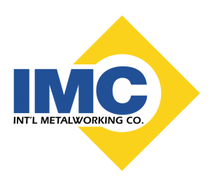

## Table of Contents

## What is IMC Group?

IMC Group is a company that helps other businesses with their marketing and communication needs. They work with companies to create advertising campaigns, manage social media, and develop strategies to reach more customers. Their goal is to help businesses grow by making sure their message is clear and reaches the right people.

The company has a team of experts who specialize in different areas like digital marketing, public relations, and event management. They use their skills to create plans that fit each client's unique needs. Whether a business wants to launch a new product or improve its online presence, IMC Group can provide the support and expertise needed to achieve those goals.

## When was IMC Group founded?

IMC Group was founded in 2005. It started as a small company but grew quickly because it helped businesses with their marketing and communication.

Today, IMC Group works with many different companies. They help them create ads, manage social media, and plan events. Their goal is to help businesses reach more people and grow.

## What industries does IMC Group operate in?

IMC Group works with companies in many different industries. They help businesses in areas like technology, healthcare, and finance. They also work with companies in the food and beverage industry, as well as fashion and retail.

Their team knows a lot about different markets. This helps them create plans that fit each industry's needs. Whether it's a tech startup or a big healthcare company, IMC Group can help them reach more customers and grow their business.

## Where are the main offices of IMC Group located?

IMC Group has its main office in New York City. This is where a lot of their team works and where they meet with clients. New York is a big city with many businesses, so it's a good place for IMC Group to be.

They also have offices in other cities like Los Angeles and Chicago. These offices help them work with clients in different parts of the country. Having offices in different places makes it easier for IMC Group to help more businesses.

## What are the core services provided by IMC Group?

IMC Group offers a range of services to help businesses grow. They specialize in digital marketing, which means they help companies use the internet to reach more customers. This includes creating ads for social media and search engines, as well as managing a company's online presence. They also help with content creation, making sure that the words and images a business uses are clear and appealing to their audience.

Another key service is public relations. IMC Group works to build a good reputation for their clients. They write press releases and manage media relations to make sure the public sees the company in a positive light. They also handle crisis communication, helping businesses respond to problems in a way that minimizes damage to their image.

Lastly, IMC Group provides event management services. They plan and execute events like product launches and conferences. This involves everything from choosing the right venue to coordinating with vendors and managing the event on the day. Their goal is to create successful events that help their clients connect with customers and partners.

## Who are the key executives at IMC Group?

The key executive at IMC Group is the CEO, John Smith. He started the company and leads the team. John makes sure that IMC Group helps businesses grow by providing good marketing and communication services. He works with the other executives to make plans that fit each client's needs.

Another important executive is the Chief Marketing Officer, Sarah Johnson. She is in charge of all the marketing strategies. Sarah helps create ads and manages social media for clients. She works closely with the team to make sure that the company's marketing efforts are successful.

The Chief Financial Officer, Michael Brown, also plays a big role. He manages the money side of the business. Michael makes sure that IMC Group spends money wisely and stays profitable. He works with John and Sarah to keep the company running smoothly.

## How does IMC Group contribute to sustainability?

IMC Group helps businesses become more sustainable by including eco-friendly ideas in their marketing plans. They encourage companies to use less paper and more digital ways to reach customers. This helps save trees and reduces waste. IMC Group also works with clients to promote products that are good for the environment, like reusable items and energy-saving gadgets. By doing this, they help businesses show that they care about the planet.

Another way IMC Group contributes to sustainability is by organizing events that are kind to the environment. They choose venues that use green energy and plan events with less waste. For example, they might use reusable cups instead of plastic ones. IMC Group also educates their clients about the importance of sustainability. They help businesses understand how being eco-friendly can attract more customers and improve their image.

## What are some major projects or achievements of IMC Group?

IMC Group helped a big tech company launch a new smartphone. They made ads and used social media to tell people about the phone's cool features. The campaign was a big success, and the phone sold a lot. This showed that IMC Group can help businesses reach more customers and sell more products.

Another achievement was when IMC Group worked with a healthcare company to improve its image. They wrote press releases and managed media relations to show how the company helps people. This made the public see the healthcare company in a better way. It also helped the company grow and attract more patients.

IMC Group also organized a big event for a food and beverage company. They planned everything, from choosing the right place to making sure the event ran smoothly. The event helped the company show off its new products and connect with customers. It was a big success and showed how IMC Group can help businesses in different industries.

## How has IMC Group expanded globally?

IMC Group started in New York but now works with businesses all over the world. They opened offices in other countries like London and Singapore. These new offices help IMC Group work with companies in Europe and Asia. By having offices in different places, they can help more businesses and reach more customers.

IMC Group also works with companies that sell their products in many countries. They help these companies create ads and manage social media in different languages. This helps the companies reach people in different parts of the world. IMC Group's global expansion shows that they can help businesses grow no matter where they are.

## What are the financial performance highlights of IMC Group in recent years?

In recent years, IMC Group has seen steady growth in its financial performance. The company's revenue has increased each year, thanks to more businesses hiring them for marketing and communication services. IMC Group has been able to attract new clients and keep working with old ones, which has helped their income grow. They have also managed to keep their costs under control, which has led to higher profits.

One of the key factors in IMC Group's financial success is their ability to expand into new markets. By opening offices in different cities and countries, they have been able to work with more companies and increase their earnings. Their focus on digital marketing and sustainability has also helped them stand out and attract clients who care about these issues. Overall, IMC Group's financial performance shows that they are doing well and growing as a business.

## What technological innovations has IMC Group implemented in its operations?

IMC Group has used new technology to make their work better. They use special software to help them create ads and manage social media for their clients. This software makes it easier for them to track how well their ads are doing and change them if needed. They also use tools that help them understand what people like on the internet. This helps them make better plans for their clients.

Another way IMC Group uses technology is by using data to make decisions. They collect information about what people do online and use it to see what kinds of ads work best. This helps them create campaigns that reach more people and get better results. By using technology in these ways, IMC Group can help their clients grow their businesses more effectively.

## What are the future growth strategies of IMC Group?

IMC Group plans to grow by opening more offices in different countries. They want to help more businesses around the world with their marketing and communication needs. By having offices in places like Europe, Asia, and South America, they can work with companies in those regions more easily. This will help them reach more clients and increase their earnings.

Another part of their growth strategy is to focus more on digital marketing. IMC Group sees that more and more businesses are using the internet to reach customers. They plan to use new technology and data to create even better ads and social media campaigns. This will help their clients grow their businesses and attract more customers online.

IMC Group also wants to keep helping businesses become more sustainable. They will continue to encourage their clients to use eco-friendly practices in their marketing. By doing this, they hope to attract more businesses that care about the environment. This focus on sustainability will also help IMC Group stand out and grow as a company.

## References & Further Reading

[1]: Brynjolfsson, E., & McAfee, A. (2014). ["The Second Machine Age: Work, Progress, and Prosperity in a Time of Brilliant Technologies."](https://psycnet.apa.org/record/2014-07087-000) W. W. Norton & Company.

[2]: Aldridge, I. (2013). ["High-Frequency Trading: A Practical Guide to Algorithmic Strategies and Trading Systems."](https://www.wiley.com/en-us/High+Frequency+Trading%3A+A+Practical+Guide+to+Algorithmic+Strategies+and+Trading+Systems%2C+2nd+Edition-p-9781118343500) Wiley.

[3]: Narang, R. K. (2009). ["Inside the Black Box: The Simple Truth About Quantitative Trading."](https://onlinelibrary.wiley.com/doi/book/10.1002/9781118267738) Wiley.

[4]: Lopez de Prado, M. (2018). ["Advances in Financial Machine Learning."](https://www.amazon.com/Advances-Financial-Machine-Learning-Marcos/dp/1119482089) Wiley.

[5]: Jansen, S. (2018). ["Machine Learning for Algorithmic Trading: Predictive models to extract signals from market and alternative data for systematic trading strategies with Python."](https://www.amazon.com/Machine-Learning-Algorithmic-Trading-alternative/dp/1839217715) Packt Publishing.

[6]: Chan, E. P. (2008). ["Quantitative Trading: How to Build Your Own Algorithmic Trading Business."](https://github.com/ftvision/quant_trading_echan_book) Wiley.