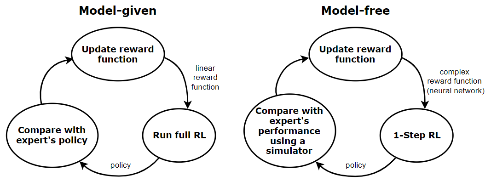

## Table of Contents

## What is Imitation Learning in the context of Machine Learning?

Imitation Learning is a type of machine learning where a computer learns to perform tasks by copying how humans do them. Imagine you are teaching a robot to make a sandwich. Instead of programming every single step, you show the robot how you make a sandwich, and the robot tries to do the same thing. This method is useful because it can be easier to demonstrate a task than to explain every detail in code.

In Imitation Learning, the computer watches many examples of the task being done correctly. It then tries to mimic these examples to perform the task on its own. Sometimes, the computer might make mistakes, but it learns from these mistakes and gets better over time. This approach is often used in areas like self-driving cars, where the car learns to drive by watching how human drivers handle different situations on the road.

## How does Imitation Learning differ from other Machine Learning approaches?

Imitation Learning is different from other machine learning approaches because it focuses on copying human behavior directly. In other methods, like supervised learning, a computer is given a lot of data with correct answers and tries to find patterns to make predictions. For example, in supervised learning, you might show a computer many pictures of dogs and cats, labeled as such, and the computer learns to tell them apart. But in Imitation Learning, you show the computer how you do something, like driving a car or playing a game, and it tries to do the same thing.

Another key difference is how Imitation Learning handles feedback. In [reinforcement learning](/wiki/reinforcement-learning), a computer learns by trying things out and getting rewards or penalties for its actions. It explores different options to find the best way to do something. Imitation Learning, on the other hand, doesn't usually explore new ways on its own; it sticks to what it has seen humans do. This can make it quicker to learn a specific task, but it might not be as good at finding new solutions that a human hasn't shown it.

Overall, Imitation Learning is great when you have a clear example of what you want the computer to do, and you want it to learn quickly. It's like teaching by showing rather than explaining, which can be easier for some tasks. However, it might not be as flexible as other methods that let the computer explore and learn on its own.

## What are some common applications of Imitation Learning?

Imitation Learning is used a lot in self-driving cars. The computer watches how human drivers handle different situations on the road, like turning at an intersection or merging into traffic. By copying these actions, the car learns to drive safely. This method helps the car learn quickly because it doesn't have to figure out everything from scratch. Instead, it can use what humans already know about driving.

Another common use of Imitation Learning is in robotics. Imagine you want a robot to perform a task like [picking](/wiki/asset-class-picking) up objects or assembling a product. Instead of programming every tiny movement, you show the robot how to do it. The robot then tries to copy your actions. This is helpful in factories where robots need to do complex tasks that are hard to explain with just code.

Imitation Learning is also used in video games. Game developers can use it to create smarter AI opponents. By watching how good players play the game, the AI learns to make similar moves and strategies. This makes the game more challenging and fun for players because the AI can mimic the clever tactics used by humans.

## Can you explain the basic concept behind the Parrot method of Imitation Learning?

The Parrot method of Imitation Learning is a simple way to teach a computer to do something by showing it examples. Imagine you want to teach a computer to play a game. You play the game many times, and the computer watches what you do. It tries to copy your moves exactly, like a parrot copying sounds. The computer doesn't try to understand why you made those moves; it just tries to do the same thing.

This method is good because it's easy to use. You don't need to explain every detail to the computer; you just show it what to do. But it can also be a problem if the computer only copies what it sees and doesn't learn to handle new situations. If you always turn left at a certain point in the game, the computer will always turn left there, even if turning right would be better sometimes.

## How does IQ-Learn improve upon traditional Imitation Learning techniques?

IQ-Learn, or Inverse Q-Learning, improves upon traditional Imitation Learning by combining the strengths of both Imitation Learning and reinforcement learning. In traditional Imitation Learning, the computer tries to copy what it sees without understanding why those actions are good. IQ-Learn adds a layer of understanding by using a concept called Q-values, which help the computer figure out how good each action is. By learning these Q-values from the examples it sees, the computer can not only copy what it sees but also understand why those actions are beneficial, making it smarter and more flexible.

This method allows the computer to handle new situations better than traditional Imitation Learning. For example, if a self-driving car using IQ-Learn sees a human driver slow down at a yellow light, it learns not just to slow down but also understands that slowing down is a good action in that situation. This understanding helps the car make better decisions even when it faces a situation it hasn't seen before. By blending Imitation Learning with the decision-making power of reinforcement learning, IQ-Learn creates a more robust and adaptable learning system.

## What is the main idea behind PWIL (Preference-based Weakly-supervised Imitation Learning)?

PWIL, or Preference-based Weakly-supervised Imitation Learning, is a way to teach a computer to do tasks without needing perfect examples. Instead of showing the computer exactly what to do all the time, you can give it rough ideas or preferences about what you like. For example, if you're teaching a robot to pick up toys, you might tell it that you prefer it picks up toys quickly rather than slowly, but you don't need to show it every single move.

This method is useful because it makes learning easier and more flexible. The computer learns from general guidance rather than needing to copy every detail. It's like teaching a kid to clean their room by saying you like it tidy, rather than showing them exactly where each toy should go. PWIL helps the computer understand what's important and make good choices, even if it hasn't seen every possible situation before.

## How does CLIPort utilize language and vision for Imitation Learning?

CLIPort, or Contrastive Language-Image Pre-training for Robotics, uses both pictures and words to teach robots new tasks. Imagine you want a robot to pick up a red ball. Instead of showing the robot exactly how to do it every time, you can just tell it to "pick up the red ball" and show it a picture of a red ball. The robot uses a special computer program called CLIP, which understands both pictures and words. This program helps the robot figure out what a "red ball" looks like and how to pick it up based on what it sees and what you say.

This method makes it easier for robots to learn new tasks quickly. Because CLIPort can understand both language and vision, you don't need to show the robot every possible situation. For example, if you later want the robot to pick up a blue cube, you can just tell it to "pick up the blue cube" and show it a picture of a blue cube. The robot uses what it learned before to understand the new task. This makes teaching robots much more flexible and efficient, as they can adapt to new instructions and objects more easily.

## What are the key components of b2b transfer learning in Imitation Learning?

b2b transfer learning in Imitation Learning is about taking what a computer learned from one task and using it to help it learn another task. Imagine you taught a robot to pick up a red ball. Now, you want it to pick up a blue ball. Instead of starting from scratch, b2b transfer learning lets the robot use what it already knows about picking up balls to learn the new task faster. This method is useful because it saves time and makes learning new things easier for the computer.

The key components of b2b transfer learning include the source task, which is the first task the robot learned, and the target task, which is the new task it needs to learn. The robot uses the knowledge and skills from the source task to help it understand and perform the target task. For example, if the robot learned to pick up a red ball (source task), it can use that knowledge to pick up a blue ball (target task) more quickly. This transfer of knowledge helps the robot adapt to new situations without needing to learn everything from the beginning.

## Can you describe the process and benefits of CILO (Curriculum Imitation Learning Optimization)?

CILO, or Curriculum Imitation Learning Optimization, is a way to teach a computer new tasks by starting with easy examples and slowly moving to harder ones. Imagine you're teaching a kid to read. You start with simple words and then move to longer, harder sentences. CILO works the same way. It begins by showing the computer simple examples of a task, like picking up a ball in a clear space. As the computer gets better, CILO shows it more complex situations, like picking up a ball in a cluttered room. This step-by-step approach helps the computer learn more effectively because it builds on what it already knows.

The benefits of CILO are that it makes learning faster and more efficient. By starting with easy tasks, the computer can quickly understand the basics without getting overwhelmed. As it moves to harder tasks, it uses what it learned from the easier ones to figure out the new challenges. This method helps the computer avoid making too many mistakes early on, which can slow down learning. Overall, CILO helps the computer master new skills in a way that feels natural and smooth, much like how humans learn by gradually increasing the difficulty of what they're trying to do.

## What are the challenges faced when implementing Imitation Learning methods in real-world scenarios?

One of the main challenges in implementing Imitation Learning in real-world scenarios is the need for high-quality demonstration data. To learn effectively, the computer needs to see many examples of the task done correctly. In real life, it's hard to get enough good examples. People might make mistakes or do things differently each time, which can confuse the computer. If the computer sees too many wrong or varied examples, it might learn the wrong way to do the task. This means a lot of time and effort must go into collecting and cleaning the data to make sure the computer learns the right way.

Another challenge is dealing with new situations that the computer hasn't seen before. Imitation Learning works well when the computer can copy what it has seen, but real life is full of surprises. For example, a self-driving car might learn to drive on clear roads but struggle in heavy rain or snow. The computer needs to be able to adapt to these new situations, but Imitation Learning alone might not be enough. Combining it with other methods, like reinforcement learning, can help, but it also makes the system more complex to develop and maintain.

## How can one evaluate the performance of different Imitation Learning methods?

To evaluate the performance of different Imitation Learning methods, you can use a few simple measures. One common way is to see how well the computer does the task compared to how a human would do it. For example, if you're teaching a robot to pick up toys, you can count how many toys it picks up correctly and how fast it does it. Another way is to use a score that shows how close the computer's actions are to what it was shown. This can be done by comparing the computer's moves to the human examples and giving a score based on how similar they are.

Another important part of evaluating Imitation Learning methods is to test them in different situations. You want to see if the computer can handle new and unexpected tasks, not just the ones it was trained on. This can be done by changing the environment or adding new challenges and seeing how well the computer adapts. For example, if a self-driving car was trained on clear roads, you might test it in rain or heavy traffic to see if it can still drive safely. By using these different ways to measure performance, you can get a good idea of which Imitation Learning method works best for your needs.

## What are the latest advancements in Imitation Learning and their potential impacts on the field?

One of the latest advancements in Imitation Learning is the development of Generative Adversarial Imitation Learning (GAIL). GAIL uses two computer programs that work together to learn from examples. One program tries to mimic human actions, while the other program checks how well the first one is doing. This back-and-forth helps the computer learn faster and more accurately. GAIL is exciting because it can learn from fewer examples than traditional methods, making it easier to use in real-world situations where getting lots of good examples is hard. This could make self-driving cars and robots that help in homes and hospitals much better and more common.

Another important advancement is the use of meta-learning in Imitation Learning. Meta-learning helps the computer learn how to learn from new tasks quickly. For example, if a robot learns to pick up a ball, meta-learning can help it figure out how to pick up a cube much faster. This is really useful because it makes the computer more flexible and able to handle new situations. As a result, machines could become better at adapting to changes in their environment, which is key for things like self-driving cars that need to handle all sorts of road conditions. These advancements could make Imitation Learning a bigger part of everyday technology, helping machines do more of what humans do, but faster and without getting tired.