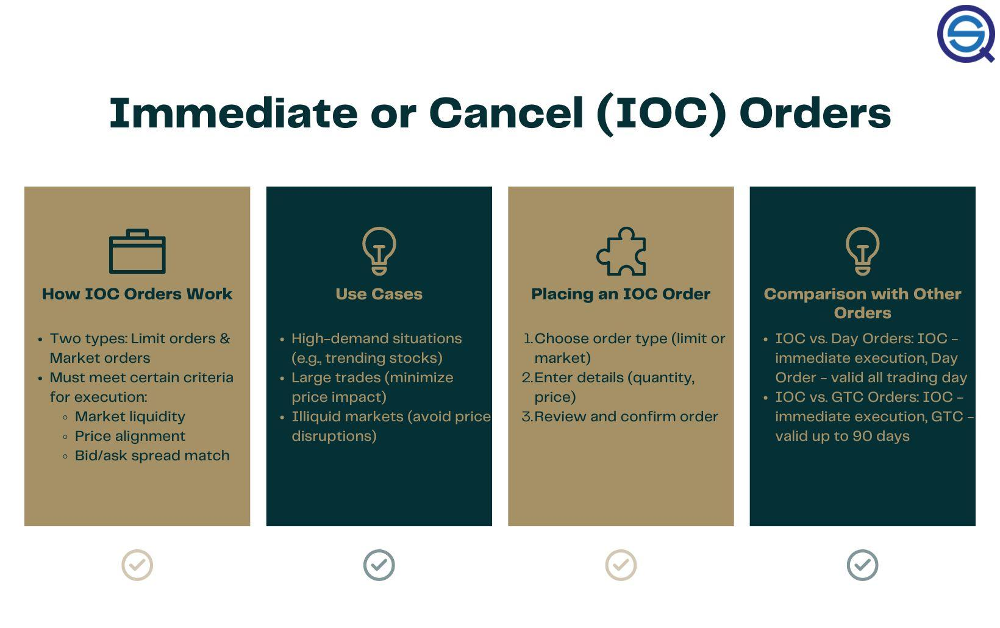

## Table of Contents

## What is an Immediate or Cancel (IOC) order?

An Immediate or Cancel (IOC) order is a type of order used in trading where you want to buy or sell something right away. If you can't buy or sell all of it immediately, the part that can't be bought or sold right away is canceled. This means you don't have to wait for the whole order to be filled.

For example, if you want to buy 100 shares of a company and only 60 shares are available right now, an IOC order will let you buy those 60 shares immediately. The other 40 shares you wanted won't be bought because they weren't available right away. This type of order is useful if you want to make sure you get what you can right now, without waiting.

## How does an IOC order differ from other types of orders?

An IOC order is different from other types of orders because it focuses on getting the trade done right away. With an IOC order, if you can't buy or sell everything you want immediately, the part you can't trade right away gets canceled. This is different from a "Fill or Kill" (FOK) order, where the whole order must be filled right away or it gets canceled completely. It's also different from a "Good 'Til Canceled" (GTC) order, which stays active until you cancel it or the trade is completed, even if it takes a long time.

Another type of order is a "Day" order, which stays active only until the end of the trading day. If it's not filled by then, it gets canceled. In contrast, an IOC order doesn't wait until the end of the day; it tries to fill as much as possible right away and cancels the rest. This makes IOC orders useful when you want to grab what's available now without waiting, while other orders might keep trying to fill over time or have different rules about when they expire.

## What are the main benefits of using an IOC order?

Using an IOC order can be really helpful because it lets you buy or sell something right away without waiting. If you want to buy 100 shares of a company and only 60 are available now, an IOC order will let you buy those 60 shares immediately. The rest of the order for the other 40 shares will be canceled, so you don't have to keep waiting for them. This is great if you need to make a quick decision and don't want to miss out on what's available now.

Another benefit of IOC orders is that they help you manage risk better. Since the order only fills what's available right away and cancels the rest, you won't be stuck with an order that's waiting to be filled for a long time. This can be important in fast-moving markets where prices can change quickly. By using an IOC order, you can take advantage of the current market conditions without exposing yourself to too much risk from price changes while you wait.

## In which trading scenarios is an IOC order most useful?

IOC orders are most useful in fast-moving markets where prices can change quickly. If you're trading stocks, commodities, or currencies, and you see a good price that you want to grab right away, an IOC order can help you buy or sell what's available at that moment. This is great if you think the price might go up or down soon, and you don't want to miss out on the current opportunity.

Another scenario where IOC orders are helpful is when you're trying to buy or sell a large amount of something, but you don't want to wait for the whole order to be filled. If you can only get part of what you want right away, an IOC order will let you take that part and cancel the rest. This way, you can start trading with what you have, instead of waiting for the entire order to be filled, which might take too long or never happen at all.

## How can an IOC order help manage trading risks?

An IOC order helps manage trading risks by letting you buy or sell what's available right away, without waiting for the whole order to be filled. This is important in fast-moving markets where prices can change quickly. If you see a good price and want to grab it, an IOC order lets you take what you can get at that moment. This way, you don't have to worry about the price changing while you wait for your entire order to be filled.

By using an IOC order, you can also avoid being stuck with an order that might never be filled. If you can only buy or sell part of what you want right away, the IOC order will cancel the rest. This means you won't be exposed to the risk of holding onto an unfilled order for a long time, which could lead to losses if the market moves against you. So, IOC orders help you take advantage of current market conditions while keeping your risks under control.

## What are the potential drawbacks of using an IOC order?

One potential drawback of using an IOC order is that you might not get all of what you want to buy or sell. If you want to buy 100 shares but only 60 are available right away, the IOC order will only let you buy those 60 shares. The rest of your order for the other 40 shares will be canceled, so you might miss out on getting everything you need.

Another issue with IOC orders is that they might not be the best choice if you're okay with waiting for a better price. If you use an IOC order, you have to take what's available right away, even if the price isn't the best. If you're willing to wait, you might be able to get a better deal with a different type of order, like a GTC order, which stays active until it's filled or you cancel it.

## How do you place an IOC order on a trading platform?

To place an IOC order on a trading platform, you first need to find the order entry section. This is usually labeled as "Order Entry," "Trade," or something similar. Once you're there, you'll see options for different types of orders. Look for the option that says "IOC" or "Immediate or Cancel." Click on it to select it as your order type. Then, you'll need to enter the details of your order, like the stock symbol, the number of shares you want to buy or sell, and the price you're willing to pay or accept.

After you've entered all the details, double-check everything to make sure it's correct. When you're ready, click the button to submit your order. The trading platform will then try to fill as much of your order as possible right away. If it can't fill the whole order immediately, the part that can't be filled will be canceled. You'll get a confirmation from the platform telling you how much of your order was filled and if any part was canceled.

## What happens to the unfilled portion of an IOC order?

When you place an IOC order, the part of your order that can't be filled right away gets canceled. This means if you want to buy 100 shares but only 60 are available now, you'll only get those 60 shares. The other 40 shares you wanted won't be bought because they weren't available immediately.

This is different from other types of orders where you might have to wait for the whole order to be filled. With an IOC order, you don't have to wait. If the market can't give you everything you want right away, the unfilled part of your order is canceled, and you can decide what to do next.

## Can you partially fill an IOC order, and if so, how?

Yes, an IOC order can be partially filled. If you want to buy or sell a certain amount of something, like 100 shares of a company, but only part of it is available right away, the IOC order will let you get that part. For example, if only 60 shares are available when you want to buy 100, you'll get those 60 shares immediately. The IOC order makes sure you can take what's available without waiting.

The rest of your order, the part that can't be filled right away, gets canceled. So, in the example, the other 40 shares you wanted won't be bought because they weren't available immediately. This means you don't have to wait for the whole order to be filled, which can be helpful if you need to act quickly or if you don't want to miss out on what's available now.

## How do market conditions affect the success of an IOC order?

Market conditions can really change how well an IOC order works. If the market is moving fast and there are a lot of people buying and selling, you might be able to get more of your order filled right away. This is good because you can take advantage of the current prices without waiting. But if the market is slow or there aren't many people trading, you might only get a small part of your order filled, or maybe none at all. This means you could miss out on buying or selling what you wanted.

Also, the price of what you're trying to trade can affect your IOC order. If the price is good and a lot of people want to trade at that price, you might get more of your order filled. But if the price is not so good or it's changing a lot, you might only get a little bit of your order filled before the rest gets canceled. So, it's important to think about what's happening in the market when you decide to use an IOC order.

## What are the best practices for using IOC orders effectively?

When using IOC orders, it's important to know what you want to achieve. If you need to buy or sell something quickly and don't want to wait, an IOC order can help you grab what's available right away. Make sure you check the current market conditions before placing your order. If the market is busy and moving fast, you might get more of your order filled. But if it's slow, you might only get a little bit or nothing at all.

Another good practice is to be ready to act quickly after placing your IOC order. Since any unfilled part of your order will be canceled, you need to decide what to do next. You might want to place another order right away or wait for better market conditions. Also, think about the price you're willing to pay or accept. If the price is good and many people want to trade at that price, you're more likely to get your order filled. But if the price isn't great, you might need to adjust your expectations or try a different type of order.

## How do advanced traders integrate IOC orders into their trading strategies?

Advanced traders use IOC orders as part of their trading strategies to take advantage of quick market movements. They might use IOC orders when they see a good price and want to buy or sell something right away without waiting. This is helpful in fast-moving markets where prices can change quickly. By using an IOC order, they can grab what's available at that moment and avoid missing out on a good opportunity. They also use IOC orders to manage risk better, as they don't have to worry about holding onto an unfilled order for a long time, which could lead to losses if the market moves against them.

Another way advanced traders use IOC orders is to break up large orders into smaller parts. If they want to buy or sell a lot of something, they might place several IOC orders to get as much as they can right away. This way, they can start trading with what they have without waiting for the whole order to be filled. They also keep an eye on market conditions and adjust their strategies accordingly. If the market is slow, they might use other types of orders, but when it's busy, IOC orders help them act quickly and effectively.

## References & Further Reading

[1]: ["Advances in Financial Machine Learning"](https://www.amazon.com/Advances-Financial-Machine-Learning-Marcos/dp/1119482089) by Marcos Lopez de Prado

[2]: ["Evidence-Based Technical Analysis: Applying the Scientific Method and Statistical Inference to Trading Signals"](https://www.amazon.com/Evidence-Based-Technical-Analysis-Scientific-Statistical/dp/0470008741) by David Aronson

[3]: ["Machine Learning for Algorithmic Trading"](https://github.com/stefan-jansen/machine-learning-for-trading) by Stefan Jansen

[4]: ["Quantitative Trading: How to Build Your Own Algorithmic Trading Business"](https://www.amazon.com/Quantitative-Trading-Build-Algorithmic-Business/dp/1119800064) by Ernest P. Chan

[5]: Hasbrouck, J. (2007). ["Empirical Market Microstructure: The Institutions, Economics, and Econometrics of Securities Trading."](https://archive.org/details/empiricalmarketm0000hasb) Oxford University Press.

[6]: Aldridge, I. (2013). ["High-Frequency Trading: A Practical Guide to Algorithmic Strategies and Trading Systems."](https://www.ahmetbeyefendi.com/wp-content/uploads/2020/07/High-Frequency-Trading-Irene-Aldridge.pdf) Wiley.

[7]: Narang, R. K. (2013). ["Inside the Black Box: A Simple Guide to Quantitative and High Frequency Trading."](https://onlinelibrary.wiley.com/doi/book/10.1002/9781118662717) Wiley.