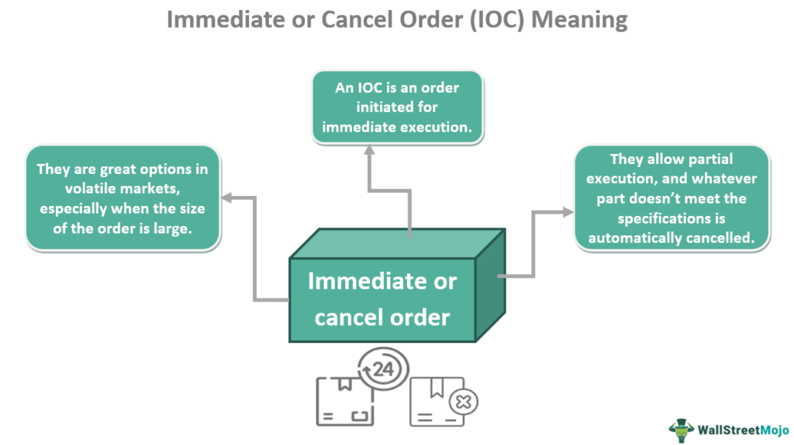

Understanding the complexities of stock orders and finance is essential for anyone looking to engage seriously with trading. Stock orders serve as fundamental instructions in financial markets, dictating the buying or selling of securities. They are the building blocks upon which trading strategies are structured, with types such as market orders, limit orders, and stop orders each offering distinct strategic advantages. 

In recent years, algorithmic trading (or algo trading) has revolutionized these strategies. Traditionally, trading required significant manual input and decision-making, often limited by human speed and cognitive capacity. Algo trading, however, harnesses the power of computers and mathematical algorithms to execute trades with speed and precision unattainable by human traders alone.

This article will explore the intersection of stock orders, finance, and algo trading, offering a comprehensive overview suitable for novice investors and seasoned traders alike. We will uncover how financial analysis guides strategic decision-making, employing principles of leverage, liquidity, and risk management. Moreover, the introduction of algorithmic trading into this mix has streamlined processes, optimizing stock orders through advanced technology. 

By the end of this read, you should have a clearer picture of how stock orders are managed and optimized through finance and technology. Insights into the nuanced mechanics of algo trading will illuminate how it leverages speed and precision, while also highlighting the challenges and considerations necessary for effective implementation. As financial markets continue to evolve, staying informed about these fundamental concepts will be crucial in shaping successful trading ventures.

## Table of Contents

## Understanding Stock Orders

Stock orders are fundamental tools in financial markets, representing traders' intentions to buy or sell securities. The effectiveness of these orders can be pivotal, particularly in volatile market conditions where precision in timing and price execution is crucial. This section offers an examination of the primary types of stock orders and their strategic applications.

### Market Orders
Market orders are straightforward commands to buy or sell a security immediately at the current market price. They guarantee execution but not the execution price. This order type is ideal for traders looking to quickly enter or [exit](/wiki/exit-strategy) positions, particularly in highly liquid markets where price fluctuations are minimal. However, during periods of high [volatility](/wiki/volatility-trading-strategies), market orders may lead to slippage, where the final execution price is different from the expected price due to rapid market movements.

### Limit Orders
Limit orders set a specific price limit for buying or selling a security, providing more control over the execution price. A buy limit order is set below the current market price, while a sell limit order is placed above it. This type of order ensures that traders do not buy at a price higher than specified or sell at a price lower than desired, protecting against adverse market shifts. Limit orders are essential in strategies where price precision is more critical than speed of execution.

### Stop Orders
Stop orders, also known as stop-loss orders, are used to limit losses or protect profits on existing positions. A sell stop order is placed below the current market price and is activated if the price falls to that level, converting into a market order. Conversely, a buy stop order is set above the market price, becoming active when the price reaches that level. Stop orders are crucial for managing risk, as they automate the process of exiting a position once a predetermined level of loss is reached.

### Other Order Types
Beyond the common market, limit, and stop orders, there are several more specialized order types that cater to complex trading strategies:

1. **Stop-Limit Orders**: Combine the features of stop orders and limit orders. Once the stop price is reached, the order becomes a limit order rather than a market order.

2. **Trailing Stop Orders**: Allow traders to set a fixed percentage or dollar amount below or above the market price. As the price fluctuates, the trailing stop price adjusts, enabling traders to lock in profits while limiting losses.

3. **Iceberg Orders**: Used primarily by institutional traders, these orders break down large orders into smaller visible parts. This strategy helps avoid influencing market prices by concealing the full order size.

### Strategic Application
Choosing the right type of stock order is a critical decision for traders, impacting the success of trading strategies. In fast-moving markets, the speed of execution offered by market orders can be advantageous, while in more stable environments, the price control of limit orders might be preferable. For risk management, stop and trailing stop orders provide automated mechanisms to protect against adverse price movements.

In conclusion, understanding the distinctions between various stock order types and their strategic uses is fundamental for effective trading. The decision on which order type to use depends on market conditions, the trader's goals, and their tolerance for price fluctuations. Each type of order presents unique benefits and risks, underscoring the importance of selecting the right tool for the right market scenario.

## The Role of Finance in Trading

Finance plays an indispensable role in the development and execution of trading strategies. A sophisticated understanding of financial concepts allows traders to navigate the complex landscape of financial markets effectively. Analyzing market trends is one of the foundational tasks in trading. This involves interpreting historical data to predict future price movements, which is crucial for timing entry and exit points in trades. Tools such as moving averages, relative strength index (RSI), and other technical indicators are often employed for this purpose.

Risk evaluation is another critical component of finance within trading. Traders use various models and metrics to assess the risk associated with different trades. Value at Risk (VaR) models, for example, estimate the potential loss in the value of a portfolio over a defined period for a given confidence interval. Proper risk management ensures that traders allocate capital wisely and avoid significant losses.

Moreover, efficient capital management is essential for sustaining trading activities. This involves strategizing on how to allocate capital across various positions to maximize returns while maintaining acceptable levels of risk. A key financial concept here is leverage, which allows traders to magnify their exposure to financial markets beyond their initial investment. While leverage can amplify gains, it also increases the risk of losses, making a thorough understanding of its implications necessary.

Liquidity is also a significant [factor](/wiki/factor-investing) in trading strategies. High [liquidity](/wiki/liquidity-risk-premium) means that traders can enter and exit positions easily without causing significant changes in the price of the asset. This is especially pertinent in volatile markets where prices can change rapidly. Liquidity risks can lead to challenges in executing orders efficiently, potentially impacting profitability.

Diversification is a strategy used to manage risk in trading by spreading investments across various financial instruments, industries, or other categories. The principle is based on the idea that a diverse portfolio is less susceptible to market volatility because the performance of individual assets is less likely to impact the entire portfolio.

Incorporating these financial principles into trading operations requires a disciplined approach and continuous learning. As financial markets evolve, staying informed about new tools and strategies is crucial for successful trading. By balancing profit potential with risk, traders can enhance their decision-making processes and improve their chances of achieving their trading objectives.

 to Algo Trading

Algorithmic trading, often abbreviated as algo trading, is a method of executing trades using automated algorithms and pre-programmed instructions. These algorithms take into account various variables such as timing, price, and [volume](/wiki/volume-trading-strategy), enabling traders to execute orders with a speed and frequency that human traders cannot achieve. This capacity for rapid and large-volume trading has significantly transformed financial markets.

Central to [algorithmic trading](/wiki/algorithmic-trading) are advancements in technology, particularly in [artificial intelligence](/wiki/ai-artificial-intelligence) (AI) and [machine learning](/wiki/machine-learning). These technologies provide algorithms with the ability to learn from historical data to identify patterns and predict potential market movements, thus optimizing trading strategies. AI and machine learning empower traders to design sophisticated models that assess risk, allocate assets efficiently, and maximize returns.

The benefits of algo trading are manifold. By minimizing human intervention, it reduces the likelihood of errors and emotional biases in trading decisions. It also allows for high-frequency trading ([HFT](/wiki/high-frequency-trading-strategies)), a subset of algo trading characterized by the rapid execution of a large number of trades to capture small price differentials. HFT firms often hold positions for only milliseconds or seconds, profiting from minute price discrepancies.

High-frequency trading has become a significant component of today's trading environment. By analyzing market conditions and reacting swiftly, HFT can enhance liquidity and contribute to more efficient markets. However, it also raises concerns such as market instability and the potential for algorithmic glitches that could trigger flash crashes.

Despite these concerns, the role of algo trading in modern financial markets continues to grow. Its ability to process vast amounts of data quickly and make precise trading decisions is indispensable in the fast-paced world of finance. As technology evolves, the algorithms driving these trades are likely to become even more refined, shaping the future landscape of trading. 

In conclusion, algorithmic trading bridges the gap between traditional trading methods and modern technological advancements, offering a strategic edge in a competitive market. Both its efficiency and the challenges it presents make it an essential area of focus for contemporary traders.

## How Algo Trading Enhances Stock Order Execution

Algorithmic trading, a hallmark of modern financial markets, significantly enhances the execution of stock orders by leveraging automation and advanced computational techniques. By minimizing human errors and streamlining processes, algo trading ensures precision and efficiency, which are crucial for optimizing trade execution.

One of the primary advantages of algo trading is its ability to factor in a multitude of variables such as order type, market conditions, and specific trading goals, thereby ensuring optimal execution. Market participants can employ various types of stock orders, including market orders, limit orders, and stop orders, each serving strategic purposes. Algorithms are designed to assess these variables in real-time, adjusting strategies rapidly in response to changing market conditions. This capability is especially vital in volatile markets where rapid price fluctuations can affect execution quality.

The speed and precision offered by algorithmic trading systems allow traders to exploit short-lived market opportunities that may go unnoticed by human traders. High-Frequency Trading (HFT) is an illustrative example. HFT algorithms can execute thousands of orders in fractions of a second, capturing minuscule discrepancies in prices that are generally imperceptible in real time. This ability to trade on small price differentials quickly translates to significant cumulative profits.

Several specific trading strategies illustrate how algo trading improves stock order execution:

1. **Scalping**: This strategy focuses on profiting from small price changes by executing a large number of trades rapidly. Scalping algorithms are programmed to enter and exit positions in seconds or milliseconds, capturing short-lived price movements that manual trading would miss. The efficiency of algorithms ensures that trades are executed at the most favorable prices, optimizing profitability.

2. **Arbitrage**: Arbitrage strategies seek to exploit price discrepancies of the same asset across different markets or related financial instruments. Algorithmic systems can simultaneously access multiple trading venues, executing buy and sell orders seamlessly to lock in risk-free profits from price differentials. The speed at which algorithms operate is integral to successful arbitrage, as these opportunities are usually fleeting.

3. **Momentum Trading**: This strategy employs algorithms to identify and trade in the direction of prevailing market trends. By analyzing volumes, technical indicators, and other data points, momentum-based algorithms determine the strength and duration of trends, executing trades that align with the dominant market direction. The predictive capability of algorithms in assessing trend continuations enhances execution accuracy.

Implementing these algorithmic strategies effectively requires a robust understanding of both market dynamics and technological infrastructure. Algorithms must be backtested rigorously to ensure their reliability across diverse market conditions. As algo trading systems evolve, incorporating machine learning and artificial intelligence further enhances their capacity to process complex datasets and refine trading strategies dynamically.

In summary, algorithmic trading transforms stock order execution by providing unprecedented accuracy and speed, enabling traders to capitalize on transient market opportunities. The application of algorithms across various trading strategies, such as [scalping](/wiki/gamma-scalping), [arbitrage](/wiki/arbitrage), and [momentum](/wiki/momentum) trading, showcases their effectiveness in improving trade outcomes. As technology continues to advance, the breadth and depth of algorithmic trading will likely expand, shaping the future landscape of financial markets.

## Challenges and Considerations in Algo Trading

Algorithmic trading, while advantageous for its speed, precision, and ability to handle complex trading strategies, presents several significant challenges that traders and developers must address. These challenges can influence the overall effectiveness and sustainability of algorithmic trading operations.

### System Failures

One of the primary concerns in algorithmic trading is the potential for system failures. These failures might result from hardware malfunctions, software bugs, or network issues, and can lead to significant financial losses due to missed trading opportunities or incorrect order executions. To mitigate these risks, robust infrastructure and backup systems are essential. Traders often implement redundant systems and real-time monitoring to quickly identify and address any operational anomalies.

### Algorithmic Bias

Algorithmic bias refers to the inadvertent introduction of systematic errors favoring certain securities or outcomes in trading algorithms. This bias can result from the data used to train machine learning models or from inherent biases coded into the algorithms. Biases can lead to skewed trading decisions, impacting profitability and fairness. To counteract this, algorithms should be trained on diverse and representative datasets, and regularly reviewed for unintended biases. Implementing fairness constraints during the development phase can also reduce bias.

### Market Impact

Algorithmic trading can significantly impact markets, especially when large orders are executed without properly considering liquidity. These trades can move the market against the intended direction, known as market impact, leading to increased execution costs and reduced profits. To minimize market impact, traders often employ smart order routing and slicing strategies that divide large orders into smaller, more manageable pieces that can be executed over time without significantly influencing market prices.

### Regulatory Considerations and Ethical Implications

As algorithmic trading becomes more prevalent, regulatory bodies have imposed stricter rules to ensure market integrity and protect investors. Regulations such as the Markets in Financial Instruments Directive (MiFID II) in Europe and the Securities and Exchange Commission (SEC) guidelines in the United States mandate transparency and risk management protocols. Traders must remain compliant by maintaining comprehensive records of trading activities and implementing safeguards against manipulative practices. Ethical considerations also arise, particularly concerning the use of algorithms that could exploit market inefficiencies at the expense of less-equipped investors.

### Testing and Validation

Rigorous testing and validation processes are vital to ensuring that trading algorithms perform as intended in various market conditions. Backtesting, using historical data to simulate trading scenarios, helps in evaluating the algorithm's performance. Stress testing further subjects algorithms to extreme conditions to observe their behavior under adverse scenarios. Additionally, live testing on sandbox environments enables developers to analyze the algorithm's real-time decision-making capabilities without risking capital. Continuous testing and validation are crucial, as market dynamics and trading environments are constantly evolving.

In conclusion, while algorithmic trading offers substantial benefits, addressing its inherent challenges is essential for maintaining robust and ethical trading practices. The integration of rigorous testing, regulatory compliance, and ethical considerations will play a pivotal role in shaping the future landscape of algorithmic trading.

## Conclusion

The fusion of stock orders, finance, and algo trading represents a significant evolution in trading. This integration provides traders with the tools to implement more sophisticated, efficient, and potentially profitable strategies. By leveraging algorithmic trading, market participants can benefit from rapid decision-making and execution speed, which human traders cannot match. As technology advances, algo trading’s role in finance is projected to expand, aligning with the increasing complexity of financial markets.

However, both experienced and novice traders must remain aware of the inherent risks and complexities associated with algorithmic trading. The potential for system failures, algorithmic bias, and unintended market impacts necessitates vigilant oversight and continuous optimization. It is also crucial to consider regulatory requirements and ethical concerns when deploying trading algorithms.

To succeed in this dynamic environment, traders should focus on acquiring knowledge and adapting to new technologies. Continuous learning and a proactive approach to innovation can offer a competitive edge, ensuring traders are well-positioned to capitalize on the opportunities presented by the evolving landscape of stock orders, finance, and algorithmic trading.

## References & Further Reading

[1]: ["Advances in Financial Machine Learning"](https://www.amazon.com/Advances-Financial-Machine-Learning-Marcos/dp/1119482089) by Marcos Lopez de Prado

[2]: ["Evidence-Based Technical Analysis: Applying the Scientific Method and Statistical Inference to Trading Signals"](https://www.amazon.com/Evidence-Based-Technical-Analysis-Scientific-Statistical/dp/0470008741) by David Aronson

[3]: ["Machine Learning for Algorithmic Trading"](https://github.com/stefan-jansen/machine-learning-for-trading) by Stefan Jansen

[4]: ["Quantitative Trading: How to Build Your Own Algorithmic Trading Business"](https://www.amazon.com/Quantitative-Trading-Build-Algorithmic-Business/dp/1119800064) by Ernest P. Chan

[5]: Hasbrouck, J. (2007). ["Empirical Market Microstructure: The Institutions, Economics, and Econometrics of Securities Trading."](https://archive.org/details/empiricalmarketm0000hasb) Oxford University Press.

[6]: Aldridge, I. (2013). ["High-Frequency Trading: A Practical Guide to Algorithmic Strategies and Trading Systems."](https://www.ahmetbeyefendi.com/wp-content/uploads/2020/07/High-Frequency-Trading-Irene-Aldridge.pdf) Wiley.

[7]: Narang, R. K. (2013). ["Inside the Black Box: A Simple Guide to Quantitative and High Frequency Trading."](https://onlinelibrary.wiley.com/doi/book/10.1002/9781118662717) Wiley.