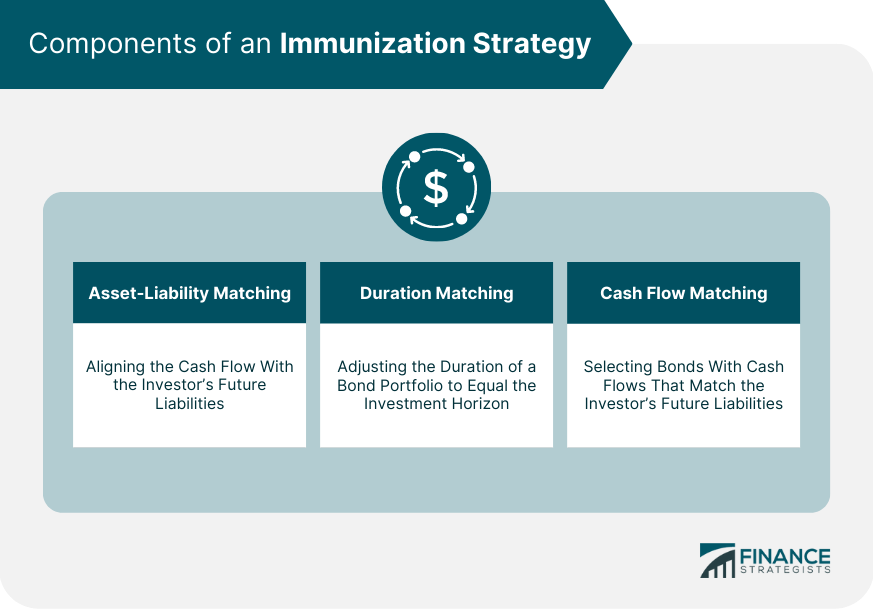

## Table of Contents

## What is immunization in the context of investment strategies?

Immunization in the context of investment strategies is a technique used to protect a portfolio from interest rate risk. It involves matching the duration of assets and liabilities so that changes in interest rates do not affect the overall value of the portfolio. This strategy is commonly used by pension funds and insurance companies that have long-term liabilities and need to ensure they can meet these obligations regardless of fluctuations in interest rates.

To immunize a portfolio, an investor would typically invest in a mix of bonds with different maturities. The goal is to create a cash flow from these bonds that matches the timing and amount of the liabilities. By doing this, the investor can ensure that the portfolio's value remains stable even if interest rates change. This strategy requires careful planning and regular adjustments to maintain the balance between assets and liabilities as market conditions change.

## How does immunization help in managing investment risks?

Immunization helps in managing investment risks by balancing the timing of cash flows from investments with the timing of when money is needed to pay for liabilities. Imagine you have a big bill coming due in the future. If you invest in bonds that pay you back just when that bill is due, you don't have to worry about interest rates going up or down. This way, you know you'll have the money you need exactly when you need it.

By using immunization, you can protect your investments from the ups and downs of the market. Interest rates can change a lot, and if you're not careful, these changes can hurt the value of your investments. But with immunization, you set up your investments so that these changes don't affect you as much. It's like having a safety net that keeps your financial plan on track, no matter what happens with interest rates.

## What are the key components of an immunization strategy?

An immunization strategy involves matching the timing of cash flows from your investments with the timing of your financial obligations. To do this, you need to pick investments, like bonds, that will pay you back at just the right time to cover your bills or other liabilities. The key is to make sure the money coming in from your investments lines up perfectly with the money going out for your obligations.

Another important part of immunization is managing the duration of your investments. Duration is a measure of how sensitive your investments are to changes in interest rates. By choosing bonds with the right durations, you can set up your portfolio so that it's not affected too much by interest rate changes. This helps keep your investments stable and ensures you can meet your financial needs without worrying about market ups and downs.

Regular monitoring and adjustments are also crucial for an immunization strategy. As interest rates and other market conditions change, you may need to tweak your investments to keep them aligned with your liabilities. This might mean buying or selling bonds to adjust the duration or cash flow timing. By staying on top of these changes, you can maintain the effectiveness of your immunization strategy and keep your financial plan secure.

## Can you explain the difference between immunization and duration matching?

Immunization and duration matching are both strategies used to manage investment risks, especially related to interest rate changes, but they work a bit differently. Immunization is a more comprehensive approach that aims to match the cash flows from investments with the timing of liabilities. This means you pick investments like bonds that pay you back exactly when you need money to cover your bills or other financial obligations. By doing this, you make sure you have the money you need at the right time, no matter what happens with interest rates.

Duration matching, on the other hand, focuses specifically on matching the duration of your assets with the duration of your liabilities. Duration is a way to measure how sensitive your investments are to interest rate changes. By matching the durations, you can protect your portfolio from the ups and downs of interest rates. While duration matching is a key part of immunization, it's not the whole picture. Immunization goes a step further by also considering the timing of cash flows, making it a more complete strategy for managing investment risks.

## What types of securities are typically used in an immunization strategy?

In an immunization strategy, the most commonly used securities are bonds. Bonds are chosen because they provide a predictable stream of cash flows, which can be matched with the timing of liabilities. Government bonds, like those issued by the U.S. Treasury, are often used because they are considered very safe and have reliable interest payments. Corporate bonds can also be used, but they come with a bit more risk, so investors need to be careful when [picking](/wiki/asset-class-picking) them.

Besides bonds, other fixed-income securities like mortgage-backed securities can be part of an immunization strategy. These securities also offer regular payments that can be lined up with when money is needed. The key is to pick securities that will give you the money you need at just the right time, so your financial plan stays on track no matter what happens with interest rates.

## How do interest rate changes affect an immunization strategy?

Interest rate changes can affect an immunization strategy, but the goal of immunization is to minimize this impact. When interest rates go up or down, the value of bonds and other fixed-income securities can change. If you have set up your immunization strategy correctly, these changes in interest rates won't mess up your financial plan. That's because you've matched the timing of the money coming in from your investments with the timing of your bills or other obligations. So, even if interest rates move, you'll still have the money you need when you need it.

However, keeping your immunization strategy working well means you need to keep an eye on things and make adjustments when needed. If interest rates change a lot, you might need to buy or sell some bonds to keep the timing of your cash flows in line with your liabilities. This way, you can keep your portfolio protected from interest rate changes. It's like constantly fine-tuning your plan to make sure it stays on track, no matter what happens in the market.

## What are the steps to implement an immunization strategy for a portfolio?

To implement an immunization strategy for a portfolio, you first need to understand your liabilities. This means knowing exactly when and how much money you'll need to pay for bills or other financial obligations in the future. Once you have this information, you can start picking investments that will give you money at the right times. Bonds are usually the best choice for this because they pay interest regularly and return your money when they mature. You'll want to choose a mix of bonds with different maturity dates so that the money you get from them matches up with when you need to pay your liabilities.

After setting up your initial portfolio, it's important to keep an eye on it and make adjustments as needed. Interest rates can change, and if they do, the value of your bonds might go up or down. To keep your portfolio immunized, you might need to buy or sell bonds to make sure the timing of your cash flows still matches your liabilities. This ongoing monitoring and tweaking is crucial to make sure your strategy keeps working well. By doing this, you can protect your portfolio from interest rate changes and make sure you have the money you need when you need it.

## How can an investor monitor and adjust an immunization strategy over time?

To monitor an immunization strategy, an investor needs to keep an eye on how their investments are doing and how interest rates are changing. They should regularly check the value of their bonds and other fixed-income securities to see if they are still in line with their liabilities. This means looking at the timing and amount of cash flows from their investments to make sure they match up with when they need to pay their bills or other financial obligations. If interest rates go up or down, the value of the bonds can change, so it's important to stay on top of these changes.

If the investor notices that the timing of their cash flows is off or if interest rates have shifted a lot, they might need to make some adjustments. This could mean buying or selling bonds to change the mix of their portfolio. For example, if interest rates have gone up, they might need to sell some shorter-term bonds and buy longer-term ones to keep the duration of their assets in line with their liabilities. By making these adjustments, the investor can keep their portfolio immunized and make sure they have the money they need at the right time, no matter what happens with interest rates.

## What are the limitations and potential drawbacks of immunization?

Immunization is a good way to protect your investments from interest rate changes, but it has some limitations. One big problem is that it can be hard to keep everything perfectly balanced. You have to keep adjusting your investments to make sure the money coming in still matches when you need to pay your bills. This takes a lot of time and effort. Also, if interest rates change a lot, it can be tough to keep up with all the adjustments you need to make. This means you might not be able to keep your portfolio completely safe from interest rate changes.

Another issue with immunization is that it might limit how much money you can make. When you focus on matching your investments with your liabilities, you might miss out on other investments that could give you a higher return. This means you might not grow your money as much as you could if you took on more risk. Plus, immunization works best with very predictable liabilities. If your financial needs change a lot or are hard to predict, it can be tough to use this strategy effectively. So, while immunization can help keep your investments safe, it's not perfect and has some trade-offs you need to think about.

## How does immunization apply to different types of investment portfolios, such as bond ladders?

Immunization can be used with different types of investment portfolios, like bond ladders. A bond ladder is a way of spreading out your investments in bonds so that they mature at different times. This gives you a steady stream of money coming in. To use immunization with a bond ladder, you would set up your bonds so that the money you get from them matches up with when you need to pay your bills or other financial obligations. This way, even if interest rates change, you'll still have the money you need at the right time.

For example, if you have a big expense coming up in five years, you could buy a bond that matures in five years. You'd also buy bonds that mature at other times to cover other expenses. By doing this, you make sure that the money coming in from your bond ladder lines up with your financial needs. This helps protect your portfolio from interest rate changes, but you still need to keep an eye on things and make adjustments if interest rates move a lot.

## Can you discuss a case study where immunization was successfully used in a real-world scenario?

A good example of immunization being used successfully is with a pension fund in the United States. This pension fund had to pay out money to retirees over many years. To make sure they had enough money to do this, no matter what happened with interest rates, they used an immunization strategy. They invested in a mix of government and corporate bonds that would give them money at just the right times to cover their payments to retirees. By doing this, they made sure they could meet their obligations without worrying about interest rate changes.

The pension fund's managers kept a close eye on their investments. When interest rates went up or down, they made small adjustments to their portfolio. For example, if rates went up, they might sell some shorter-term bonds and buy longer-term ones to keep everything balanced. This careful monitoring and adjusting helped them keep their portfolio immunized. As a result, the pension fund was able to pay out money to retirees on time and in full, even when the market was unpredictable. This case shows how immunization can work well in the real world to protect a portfolio from interest rate risks.

## What advanced techniques can be used to enhance the effectiveness of an immunization strategy?

To make an immunization strategy work even better, investors can use something called cash flow matching. This means picking bonds that pay you back at the exact times you need money to pay your bills. It's like setting up a perfect schedule where the money coming in matches the money going out. By doing this, you can make sure you have the money you need when you need it, no matter what happens with interest rates. It's a bit more work to set up, but it can make your immunization strategy very strong.

Another advanced technique is using derivatives, like interest rate swaps or options. These can help you protect your portfolio from big changes in interest rates. For example, if you think rates might go up, you could use an interest rate swap to change the interest payments you get from your bonds. This way, if rates do go up, you won't lose as much money. Using derivatives takes some know-how, but they can be a powerful tool to make your immunization strategy even more effective.

## What is Immunization in Finance?

Immunization in finance is a strategic approach designed to shield investment portfolios from the impact of interest rate fluctuations. This technique is predominantly focused on ensuring that changes in interest rates do not adversely affect the net worth of a portfolio. The cornerstone of immunization involves matching the duration of assets with that of liabilities. Duration, in this context, refers to the weighted average time until a bond's cash flows are received. By aligning the duration of assets and liabilities, investors can effectively neutralize the sensitivity of the portfolio's value to changes in interest rates.

The primary objective of immunization is to stabilize the portfolio’s value despite external shifts in interest rates. This is particularly advantageous for institutions such as banks, insurance companies, and pension funds, which are obligated to meet fixed future liabilities. These institutions often adopt immunization strategies to ensure that they can meet their financial commitments regardless of interest rate dynamics.

Immunization can be achieved through various methods:

1. **Cash Flow Matching**: This approach involves selecting a portfolio of securities whose cash flows are designed to coincide with the timing and amount of the future liabilities. By doing so, the cash received from the assets directly covers the liabilities without needing to sell or reinvest at uncertain future interest rates.

2. **Duration Matching**: In this technique, the duration of the portfolio's assets is adjusted to match the duration of its liabilities. By equalizing the duration, the interest rate risk is minimized since the price sensitivity of assets and liabilities will be similar. The mathematical expression for duration matching can be represented as:
$$
   D_A = D_L

$$
   where $D_A$ is the duration of assets and $D_L$ is the duration of liabilities.

3. **Convexity Matching**: This method addresses the limitations of simple duration matching by considering the curvature of the price-yield relationship. Convexity measures how the duration of a bond changes as interest rates change. By aligning both the duration and convexity of assets and liabilities, investors can achieve a more robust immunization against interest rate movements.

Despite its effectiveness, it is important to note that immunization requires continuous adjustments and careful monitoring, especially in volatile [interest rate](/wiki/interest-rate-trading-strategies) environments. Additionally, it is essential for the chosen assets to have predictable cash flows, making this strategy less suitable for assets with uncertain or variable cash flows, such as equities. Nonetheless, when executed properly, immunization serves as a vital tool for preserving the value of investment portfolios against interest rate uncertainties.

## What are examples of immunization in practice?

Consider a pension fund that has a liability to pay retirement benefits in 15 years. To manage interest rate risk effectively, the fund can adopt specific immunization strategies. 

One common approach is to invest in zero-coupon bonds that mature at the same time these liabilities are due. Zero-coupon bonds are attractive for immunization because they do not pay periodic interest; instead, they are issued at a discount and pay their face value at maturity. This aligns perfectly with a pension fund's need to meet a future liability, ensuring that the return at the bond's maturity matches the liability timing. Therefore, the pension fund can protect itself against interest rate fluctuations, as the bond's value does not depend on reinvestment rates.

Another strategy involves utilizing duration matching with coupon bonds. Duration is a measure of the sensitivity of the price of a bond to changes in interest rates, and it represents the weighted average time until the bond's cash flows are received. By aligning the duration of the portfolio with the investment horizon of 15 years, the pension fund can ensure that the change in the value of assets equals the change in the value of liabilities, regardless of fluctuations in interest rates. Coupon bonds can be structured so that their payment timelines align with future liabilities, securing the portfolio’s value even as rates fluctuate.

Algorithmic trading can further enhance these strategies by offering precision and efficiency in executing large numbers of transactions. Algorithms can be used to constantly adjust the portfolio to maintain duration matching as market conditions change or to handle large orders efficiently when acquiring zero-coupon bonds, minimizing transaction costs and optimizing execution speed. Techniques such as dynamic rebalancing can be implemented in [algorithmic trading](/wiki/algorithmic-trading) systems to ensure that the bond portfolio remains aligned with the pension fund's liability timelines, offering an efficient and cost-effective approach to immunization in a fluctuating interest rate environment.

Mathematically, this approach can be expressed via equal duration between assets ($D_A$) and liabilities ($D_L$):

$$
D_A = D_L
$$

And an optimization problem can be formulated to minimize the duration gap, which ensures changes in interest rates will have a negligible effect on the net value of the portfolio. Integrating these strategies, seasoned with the capabilities of algorithmic trading, assures a high level of protection against interest rate [volatility](/wiki/volatility-trading-strategies) while preserving the value of the pension fund's investment portfolio.

## References & Further Reading

[1]: Fabozzi, F. J., & Mann, S. V. (2010). ["The Handbook of Fixed Income Securities"](https://www.amazon.com/Handbook-Fixed-Income-Securities-Ninth/dp/1260473899). McGraw-Hill Education.

[2]: Hull, J. C. (2018). ["Options, Futures, and Other Derivatives"](https://www.semanticscholar.org/paper/Options%2C-Futures%2C-and-Other-Derivatives-Hull/89bdee500c8623864fc9eb7a471546aa713acc44). Pearson.

[3]: ["Modern Portfolio Theory and Investment Analysis"](https://books.google.com/books/about/Modern_Portfolio_Theory_and_Investment_A.html?id=181CEAAAQBAJ) by Edwin J. Elton, Martin J. Gruber, Stephen J. Brown, & William N. Goetzmann

[4]: ["Financial Risk Management Applications in Market Finance"](https://www.wiley.com/en-us/Financial+Risk+Management%3A+Applications+in+Market%2C+Credit%2C+Asset+and+Liability+Management+and+Firmwide+Risk+-p-9781119135517) by Thierry Roncalli

[5]: Fabozzi, F. J., & Fabozzi, T. D. (2005). ["The Theory and Practice of Investment Management"](https://onlinelibrary.wiley.com/doi/book/10.1002/9781118267028). Wiley.

[6]: ["Algorithmic Trading: Winning Strategies and Their Rationale"](https://books.google.com/books/about/Algorithmic_Trading.html?id=WAlFDwAAQBAJ) by Ernie Chan

[7]: ["Bond Mathematics, Theory, and Practice"](https://www.wiley.com/en-us/Bond+Math%3A+The+Theory+Behind+the+Formulas-p-9781118268001) by Donald J. Smith

[8]: ["Interest Rate Risk Modeling"](https://www.communitybankingconnections.org/Articles/2024/R1/interest-rate-risk-modeling) by Sanjay K. Nawalkha, Gloria M. Soto, & Natalia A. Beliaeva