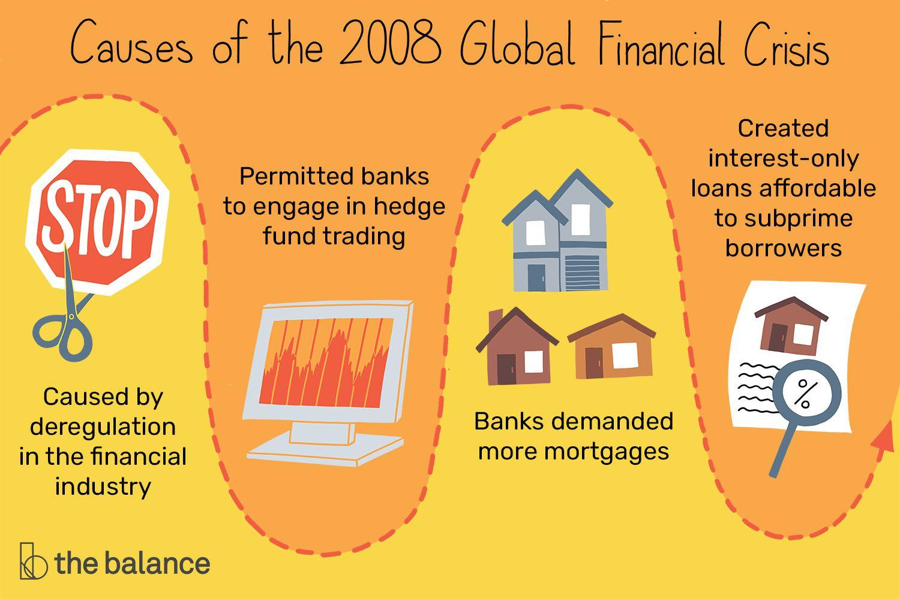

## Table of Contents

## What was the 2008 Financial Crisis?

The 2008 Financial Crisis was a big economic problem that started in the United States but affected the whole world. It began because many people took loans to buy houses they couldn't afford. Banks gave out these loans, called subprime mortgages, thinking that house prices would keep going up. But when house prices started to fall, many people couldn't pay back their loans. This caused a lot of banks to lose money and some even went bankrupt.

As banks lost money, they stopped lending to each other and to businesses. This made it hard for companies to get the money they needed to operate, leading to job losses and business failures. Governments around the world had to step in to save the banks and help the economy recover. The crisis led to a big recession, which means a period of time when the economy was doing very badly. Many people lost their jobs and homes, and it took years for the economy to get better.

## Which banks were most affected by the 2008 Financial Crisis?

The 2008 Financial Crisis hit many banks hard, but some were affected more than others. In the United States, Lehman Brothers was one of the worst hit. It was a big investment bank that went bankrupt in September 2008. This event scared a lot of people and made the crisis worse. Another bank that was heavily impacted was Bear Stearns. It was also an investment bank that nearly collapsed and was bought by JPMorgan Chase at a very low price.

In the U.S., other big banks like Citigroup and Bank of America also faced huge problems. They lost a lot of money because of the bad loans they had given out. The government had to step in to help them survive. Outside of the U.S., banks in Europe were also affected. For example, in the UK, Royal Bank of Scotland and HBOS were in big trouble. The British government had to take over these banks to keep them from failing.

Overall, the crisis showed how risky it was for banks to give out loans that people couldn't pay back. Many banks around the world had to be rescued by their governments to avoid total collapse.

## How did the crisis impact the liquidity of banks?

The 2008 Financial Crisis made it really hard for banks to have enough money to operate. When people couldn't pay back their loans, banks lost a lot of money. This made banks worried about lending money to each other because they were afraid they wouldn't get it back. So, banks held onto their money tightly, which is called a [liquidity](/wiki/liquidity-risk-premium) crunch. This meant there was less money flowing around in the economy, making it hard for businesses and people to get loans when they needed them.

To fix this problem, governments and central banks around the world stepped in. They gave banks extra money and lowered interest rates to make it easier for banks to lend. This was like giving banks a big safety net so they would feel more comfortable lending money again. Slowly, this helped to bring more money back into the system, but it took a long time for things to get back to normal.

## What were the immediate effects on bank stock prices following the crisis?

When the 2008 Financial Crisis hit, bank stock prices dropped a lot right away. People were scared because banks were losing money from bad loans. They started selling their bank stocks quickly, which made the prices go down even more. For example, when Lehman Brothers went bankrupt, its stock price crashed to almost nothing. Other big banks like Citigroup and Bank of America also saw their stock prices fall sharply because everyone was worried about the whole banking system.

The drop in bank stock prices was a big problem because it made people lose trust in banks. When stock prices go down, it means the value of the bank goes down too. This made it harder for banks to raise new money they needed to keep going. The government had to step in to help by buying some of the bank stocks and giving banks more money to stay afloat. It took a long time for bank stock prices to start going back up as the economy slowly got better.

## How did government interventions affect the banking sector during the crisis?

During the 2008 Financial Crisis, governments around the world stepped in to help the banking sector because many banks were in big trouble. They did this by giving banks money directly, which is called a bailout. For example, in the United States, the government started a program called the Troubled Asset Relief Program (TARP) to buy bad loans from banks and give them money to stay open. This helped banks to keep lending money to people and businesses, which was important to stop the economy from getting even worse. Governments also took over some banks that were about to fail, like in the UK with Royal Bank of Scotland and HBOS, to make sure they didn't go bankrupt.

These interventions had a big impact on the banking sector. They helped to calm people down because everyone was scared about what would happen if more banks failed. By giving banks money and taking over some of them, governments made sure that the banking system didn't completely fall apart. This helped to slowly bring back trust in banks. However, it also meant that taxpayers had to pay for the bailouts, and some people were upset about that. Over time, as the economy started to recover, the banks that got help were able to pay back some of the money they received, but it took years for everything to get back to normal.

## What changes in banking regulations were implemented post-2008 crisis?

After the 2008 Financial Crisis, governments around the world made new rules to make sure banks were safer and less likely to cause another big problem. One big change was the Dodd-Frank Act in the United States. This law made banks keep more money in reserve, so they would have a cushion if things went wrong again. It also created a new group called the Consumer Financial Protection Bureau to watch over banks and make sure they were treating people fairly. In Europe, they made similar rules, like the Basel III agreement, which told banks to have more money set aside and be more careful about the risks they were taking.

These new rules also made banks do more checks before giving out loans, to make sure people could really afford them. Banks had to be more open about what they were doing, so people could see if they were being risky. Governments also started doing more regular checks on banks to make sure they were following the new rules. All these changes were meant to make the banking system stronger and stop another big crisis from happening. It took time for everyone to get used to the new rules, but they were important steps to make the economy safer.

## How did the crisis influence the risk management strategies of banks?

The 2008 Financial Crisis made banks change how they handle risk. Before the crisis, many banks took big risks by giving out loans to people who couldn't afford them. After the crisis, banks started being more careful. They made stricter rules for giving out loans, checking more carefully if people could pay them back. Banks also started keeping more money in reserve, like a safety net, so they could handle problems better if they came up again. They used new tools and methods to watch their risks more closely, making sure they weren't taking chances that could hurt them badly.

Another big change was that banks started doing more stress tests. These tests help banks see how they would do if another crisis happened. By running these tests, banks could find weak spots and fix them before they became big problems. Governments also made new rules that told banks to be more open about their risks. This way, everyone could see what risks the banks were taking, and it helped keep the banks honest. Overall, the crisis taught banks to be more careful and prepared, so they could avoid another big problem in the future.

## What was the impact on the global banking sector's stability and trust?

The 2008 Financial Crisis shook the global banking sector's stability and trust a lot. Before the crisis, people and businesses trusted banks to keep their money safe and help the economy grow. But when big banks like Lehman Brothers went bankrupt, people got very scared. They started taking their money out of banks because they were worried their money wasn't safe anymore. This made the whole banking system less stable because banks needed that money to lend and keep the economy going.

After the crisis, governments stepped in to help banks and make new rules to keep them safer. This slowly helped to bring back some trust in banks. People saw that governments were working to fix the problems and make sure it wouldn't happen again. But it took a long time for trust to fully come back. Even now, people remember the crisis and are more careful with their money. Banks have to work hard to show they are stable and trustworthy, so people will keep their money with them and the economy can keep growing.

## How did the crisis affect bank lending practices and credit availability?

The 2008 Financial Crisis made banks change how they lend money. Before the crisis, banks were giving out loans to people who couldn't afford them, which was risky. After the crisis, banks became much more careful. They started checking people's ability to pay back loans more closely. This meant they were less likely to give loans to people who might not be able to pay them back. Banks also had to keep more money in reserve, which made them less able to lend as much money as before.

Because banks were more careful and had less money to lend, it became harder for people and businesses to get loans. This made it tough for businesses to grow and for people to buy things like houses or cars. The crisis also made banks more worried about lending to each other, which slowed down the flow of money in the economy. Over time, as things got better, banks started lending more again, but it took a while for credit to become as available as it was before the crisis.

## What long-term effects did the 2008 crisis have on the structure of the banking industry?

The 2008 Financial Crisis changed the banking industry in big ways. Many banks that were in trouble got help from the government, but some banks went out of business or were taken over by other banks. This led to fewer banks overall, and the ones that survived got bigger. Big banks like JPMorgan Chase and Bank of America grew even larger because they bought other banks that were struggling. This made the banking industry more concentrated, with a few big banks having a lot of power.

The crisis also made banks change how they work. They started following stricter rules to make sure they didn't take too many risks. Banks had to keep more money in reserve and be more careful about who they lent money to. Governments made new laws to watch over banks more closely and make sure they were being safe. These changes made the banking industry more stable, but it also meant that banks had to be more careful and sometimes couldn't lend as much money as before. Overall, the crisis made the banking industry safer but also more cautious and less competitive.

## How did the crisis influence the development of fintech and alternative banking solutions?

The 2008 Financial Crisis made people lose trust in big banks. They started looking for other ways to handle their money. This led to the growth of fintech, which is short for financial technology. Fintech companies use new technology to offer services like online banking, mobile payments, and quick loans. These services were easier to use and often cheaper than what big banks offered. People liked that fintech companies were different from the banks that had caused the crisis.

Because of the crisis, banks had to follow stricter rules and be more careful about lending money. This made it harder for some people and small businesses to get loans from banks. Fintech companies saw this as a chance to help. They started offering alternative ways to borrow money, like peer-to-peer lending, where people lend money to each other directly. These new ways of banking helped fill the gaps left by traditional banks and made the financial world more diverse and competitive.

## What lessons can be learned from the 2008 Financial Crisis to prevent future banking sector crises?

The 2008 Financial Crisis taught us a lot about how to keep banks safe and stop another big problem from happening. One big lesson is that banks need to be careful about the risks they take. Before the crisis, banks were giving out loans to people who couldn't afford them. This made banks lose a lot of money when people couldn't pay back their loans. Now, banks have to check more carefully if people can really pay back their loans. They also need to keep more money in reserve, like a safety net, so they can handle problems better if they come up again.

Another important lesson is that governments need to watch over banks more closely. After the crisis, new rules were made to make sure banks are being safe and honest. Governments do regular checks on banks to make sure they are following these rules. They also set up groups to protect people from being treated unfairly by banks. By keeping a close eye on banks, governments can catch problems early and stop them from getting worse. This helps keep the whole banking system stable and makes people feel more confident about their money.

Finally, the crisis showed us that trust is really important. When big banks failed, people got scared and started taking their money out of banks. This made the crisis worse. To build trust back, banks need to be open about what they are doing and show that they are being careful with people's money. Governments can help by making sure banks are safe and by helping them if they get into trouble. By working together, banks and governments can make the financial world safer and prevent another big crisis from happening.

## References & Further Reading

[1]: Blinder, A. S. (2013). ["After the Music Stopped: The Financial Crisis, the Response, and the Work Ahead."](https://www.tandfonline.com/doi/full/10.1080/14697688.2014.949836) Penguin Books.

[2]: Philipp Bagus (2012). ["The Tragedy of the Euro"](https://archive.org/details/TheTragedyOfTheEuro2) Mises Institute.

[3]: Gorton, G. B. (2010). ["Slapped by the Invisible Hand: The Panic of 2007."](https://papers.ssrn.com/sol3/papers.cfm?abstract_id=1401882) Oxford University Press.

[4]: Shiller, R. J. (2015). ["Irrational Exuberance."](https://link.springer.com/article/10.1007/s00712-015-0462-4) Princeton University Press.

[5]: ["Stress Test: Reflections on Financial Crises"](https://www.amazon.com/Stress-Test-Reflections-Financial-Crises/dp/0804138613) by Timothy F. Geithner

[6]: Lewis, M. (2010). ["The Big Short: Inside the Doomsday Machine."](https://books.google.com/books/about/The_Big_Short_Inside_the_Doomsday_Machin.html?id=eParwQ0YdrcC) W.W. Norton & Company.