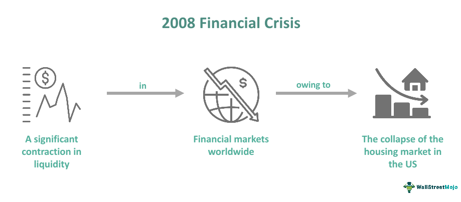

The 2008 Financial Crisis stands as a pivotal moment in recent economic history, sending shockwaves throughout the global economy and fundamentally altering financial landscapes. Sparked by the unraveling of a housing bubble in the United States, this crisis revealed vulnerabilities within the financial system, prompting a cascading effect that influenced economies worldwide. Banks, at the heart of the finance sector, faced unprecedented challenges, from massive write-downs due to toxic assets to a significant erosion of consumer confidence and interbank lending.

The crisis emphasized how interconnected global economies and financial institutions had become, highlighting the systemic risk that could arise from localized financial instabilities. At the epicenter of the turmoil were complex financial instruments, such as Collateralized Debt Obligations (CDOs), which were intricately linked to subprime mortgages that formed the crux of the housing bubble. The collapse of these instruments eroded trust in financial markets and led to the downfall of pivotal banks and financial institutions—most notably Lehman Brothers, whose bankruptcy was a key event in the crisis timeline.



During this period, algorithmic trading emerged and evolved, marking a significant transformation in financial markets. This automated form of trading, leveraging mathematical models and high-frequency data inputs, began to play an increasingly significant role as traditional market players sought technological solutions to survive and capitalize in volatile conditions. The adoption of algorithmic trading was initially driven by the need for efficiency and speed in market operations, but its growth during the post-crisis era raised questions about market stability and the future of trading strategies.

The following examination will explore these themes in detail, dissecting the origins of the 2008 Financial Crisis, its impact on the banking sector, the regulatory responses that followed, and the subsequent rise of algorithmic trading. This exploration aims to provide a comprehensive understanding of how these elements intertwine to shape the modern financial environment, offering insights into ongoing challenges and emerging opportunities within the industry.

## Table of Contents

## Understanding the 2008 Financial Crisis

The 2008 Financial Crisis marked a pivotal period in economic history, primarily originating from the U.S. housing market. The crisis was rooted in the rapid expansion of the housing bubble, driven by a combination of speculative home buying and lenient lending practices. The housing bubble burst in 2007, leading to precipitous declines in home prices and widespread foreclosures. This housing market collapse ultimately unveiled the fragility of the financial system, which was significantly exposed to mortgage-related assets.

At the core of the destabilization were subprime mortgages, a category of home loans extended to borrowers with poor credit histories who generally posed a higher risk of default. Financial institutions, enticed by short-term profits, aggressively marketed these high-interest loans, often without rigorous assessments of borrowers’ repayment capabilities. The proliferation of subprime mortgages was coupled with the widespread use of complex financial instruments, such as Collateralized Debt Obligations (CDOs). CDOs pooled various subprime mortgages into tradable securities, ostensibly spreading risk but ultimately obfuscating it. Investors, attracted by high returns and reassured by mistaken credit ratings, poured capital into these securities, inadvertently exacerbating systemic risk. The collapse of the housing market led to a steep devaluation of CDOs, causing massive losses for institutional investors.

Several key events crystallized the severity of the financial crisis, most notably the bankruptcy of Lehman Brothers. In September 2008, Lehman Brothers, a major financial services firm deeply entrenched in mortgage-backed securities and CDOs, filed for bankruptcy after failing to secure a rescue deal. Lehman's fall precipitated a crisis of confidence in global financial markets, leading to [liquidity](/wiki/liquidity-risk-premium) issues as banks became wary of lending to each other. This freeze in interbank lending further strained the capacity of financial institutions to operate and extend credit to businesses and consumers.

In response to the spiraling crisis, governments worldwide initiated unprecedented financial bailouts to stabilize the banking sector and prevent economic collapse. In the United States, the Troubled Asset Relief Program (TARP) was implemented to purchase distressed assets and inject capital directly into banks. Additionally, the Federal Reserve slashed interest rates and implemented quantitative easing strategies, buying substantial quantities of government bonds to increase money supply and encourage lending. These interventions were instrumental in preventing a complete financial meltdown, although the crisis prompted a reevaluation of risk management and regulatory frameworks in global finance.

## Impact on the Banking Sector

The 2008 Financial Crisis exerted a significant impact on the banking sector, manifesting immediately through a loss of consumer confidence, a freeze in interbank lending, and substantial financial losses for banks globally. These events marked the beginning of a transformational journey for the banking industry, shaping its present and future operations.

### Immediate Impacts

**Loss of Consumer Confidence**: The banking crisis eroded public trust as financial institutions faced liquidity challenges and insolvencies, exemplified by the failure of iconic banks like Lehman Brothers. This distrust was fueled by consumers' fear of losing deposits and investments, prompting a rapid withdrawal of funds, further stressing the banking infrastructure.

**Interbank Lending Freeze**: The panic resulting from the collapse of major financial entities led to a reluctance among banks to lend to each other. This phenomenon, known as the credit crunch, occurred as banks became wary of counterparties’ solvency, halting liquidity in the market and freezing the regular flow of capital, which is crucial for daily banking operations.

**Banks' Financial Losses**: The devaluation of mortgage-backed securities and other toxic assets forced banks to write down massive losses. This not only weakened their balance sheets but also depleted capital reserves, necessitating emergency interventions to stabilize the system. Banks faced significant capital shortfalls, which were partially addressed by government bailouts in several countries.

### Long-term Consequences

In response to these immediate impacts, the banking sector underwent several long-term changes aimed at enhancing its resilience against future shocks:

**Stricter Banking Regulations**: The crisis underscored the need for rigorous regulatory oversight, leading to the implementation of measures such as stress testing and higher capital requirements. Enhanced scrutiny and supervisory mechanisms were introduced to prevent excessive risk-taking and to ensure that financial institutions maintained sufficient reserves.

**Operational Changes**: Banks restructured their operational models to focus on improving risk management practices and transparency. This involved revisiting risk assessment frameworks, strengthening internal controls, and adopting more robust credit evaluation procedures to prevent the recurrence of unchecked lending practices.

### Regulatory Responses

**Dodd-Frank Act**: In the United States, the Dodd-Frank Wall Street Reform and Consumer Protection Act was enacted to prevent the recurrence of such financial disasters. The Act aimed to increase accountability and transparency in the financial system, protect consumers from abusive financial services practices, and end the idea of 'too big to fail' by empowering regulators to dismantle a failing firm that threatens economic stability.

**Basel III Regulations**: The international banking community responded with the Basel III framework, which introduced stricter capital and liquidity requirements and developed new regulatory standards on bank leverage and market liquidity risks. Basel III emphasized the need for banks to have more high-quality capital and established a leverage ratio to control the expansion of balance sheets beyond sustainable levels.

### Debates on Effectiveness

The efficacy of such regulations has been a topic of extensive debate. Proponents argue that these measures have made banks more resilient by creating a safer and sounder financial environment. Opponents, however, contend that overly stringent regulations might stifle economic growth by constraining banks' ability to lend. Additionally, the administrative burden of compliance has been a concern, especially for smaller banking institutions.

In conclusion, the 2008 Financial Crisis initiated a paradigm shift in the banking sector, prompting comprehensive reforms and a reevaluation of existing regulatory measures. The lessons learned continue to influence the sector's evolution, ensuring that it adapts to emerging risks and remains robust in the face of future challenges.

## Regulatory Changes and Their Implementation

The aftermath of the 2008 Financial Crisis prompted comprehensive regulatory reforms aimed at fortifying the global financial system and preventing the recurrence of such a catastrophic event. Two of the most significant regulatory responses were the Dodd-Frank Wall Street Reform and Consumer Protection Act in the United States and the Basel III international banking regulations.

The Dodd-Frank Act, enacted in 2010, marked a substantial overhaul of financial regulation in the U.S. Designed to increase accountability and transparency within the financial system, its provisions were intended to mitigate systemic risk, protect consumers, and end the practice of bailouts for banks deemed "too big to fail." Key elements of the Act include the Volcker Rule, which limits proprietary trading by banks, and the establishment of the Financial Stability Oversight Council (FSOC), responsible for identifying risks to the financial stability of the United States. The Act also created the Consumer Financial Protection Bureau (CFPB), which aims to ensure consumer protection in financial markets.

On the international stage, Basel III emerged as a critical set of reforms developed by the Basel Committee on Banking Supervision, with the goal of improving regulation, supervision, and risk management within the banking sector. Basel III introduced stricter capital requirements and enhanced the minimum capital ratios that banks must maintain, particularly focusing on Tier 1 capital, which acts as a buffer against losses. It also introduced the Liquidity Coverage Ratio (LCR) and the Net Stable Funding Ratio (NSFR) to ensure that banks maintain sufficient liquidity for a 30-day stress scenario and promote more stable and longer-term sources of funding, respectively.

The effectiveness of these regulations in fostering a resilient banking sector is a subject of ongoing debate. Critics of the Dodd-Frank Act argue that its complexity and the regulatory burdens it imposes could stifle financial innovation and growth. Conversely, its proponents cite increased oversight, improved risk management practices, and greater consumer protection as evidence of its necessity and success.

Similarly, Basel III has received both praise and criticism. On one hand, it has been credited with strengthening banks' capital bases and enhancing their ability to withstand economic shocks. Nevertheless, some argue that the stringent capital requirements could hinder banks' abilities to lend, thereby slowing economic recovery and growth. Furthermore, there are concerns about the varying pace of implementation across jurisdictions, which could lead to regulatory [arbitrage](/wiki/arbitrage).

Overall, these regulatory frameworks represent critical steps towards creating a more stable and secure financial environment. However, their real-world impact continues to be closely scrutinized as both the banking sector and regulatory bodies adapt to the evolving economic landscape.

## The Rise of Algorithmic Trading

Algorithmic trading is a method of executing orders using automated pre-programmed trading instructions, taking into account variables such as time, price, and [volume](/wiki/volume-trading-strategy). This form of trading leverages the processing power of computers to rapidly analyze market conditions and execute transactions with minimal human intervention. The core advantage is the ability to process vast amounts of data at speeds unimaginable for human traders, thus optimizing trading strategies and potentially increasing profitability.

The 2008 Financial Crisis served as a catalyst for the increased adoption of [algorithmic trading](/wiki/algorithmic-trading). The [volatility](/wiki/volatility-trading-strategies) and uncertainty during the crisis highlighted the need for more sophisticated and efficient trading mechanisms. Traditional trading methods were often too slow and cumbersome to respond to rapid market changes. In contrast, algorithmic trading offered the ability to quickly adapt to evolving market conditions, making it a valuable tool in managing the heightened risks associated with such turbulent times.

Algorithmic trading systems employ different strategies ranging from [statistical arbitrage](/wiki/statistical-arbitrage), where algorithms scrutinize historical price relationships and patterns to exploit temporary market inefficiencies, to high-frequency trading, which focuses on executing a large number of orders at extremely high speeds to capitalize on minute price discrepancies. These strategies can be modeled using quantitative techniques and statistical methods, which can be programmed into the algorithms.

Here's a simple example of a trading algorithm in Python using a moving average crossover strategy:

```python
import pandas as pd

def moving_average_crossover(data, short_window=40, long_window=100):
    # Calculate short and long moving averages
    data['Short_MA'] = data['Close'].rolling(window=short_window, min_periods=1, center=False).mean()
    data['Long_MA'] = data['Close'].rolling(window=long_window, min_periods=1, center=False).mean()

    # Create signals
    data['Signal'] = 0
    data['Signal'][short_window:] = np.where(data['Short_MA'][short_window:] > data['Long_MA'][short_window:], 1, 0)
    data['Position'] = data['Signal'].diff()

    return data

# Assuming 'stock_data' is a DataFrame with a 'Close' price column
# stock_data = pd.read_csv('stock_data.csv')
# result = moving_average_crossover(stock_data)
```

The implications of algorithmic trading for market stability and efficiency are multifaceted. On one hand, algorithms can enhance liquidity and reduce the costs associated with trading. By executing trades based on preset rules and constantly monitoring market conditions, they help maintain a steady flow of transactions. This can lead to narrower bid-ask spreads and more efficient price discovery.

However, the reliance on algorithmic trading also raises concerns about systemic risks. The speed and volume of transactions can exacerbate price swings and contribute to market instability, as evidenced by events like the 2010 Flash Crash. Furthermore, the complexity of trading algorithms can obscure understanding and oversight, leading to potential manipulations or unintended consequences in the market.

In summary, while algorithmic trading has introduced significant efficiencies and innovations in executing trades, it also poses challenges that require careful management and regulation to safeguard financial markets against volatility and instability.

## Current State of the Banking Sector

The banking sector, more than a decade after the 2008 financial crisis, has demonstrated increased resilience against economic uncertainties, largely due to significant regulatory reforms and technological innovations. One notable aspect is the improved capitalization of banks, with increased capital reserves and liquidity ratios designed to withstand shocks similar to those experienced during the crisis. This resilience is largely attributed to global regulatory frameworks such as Basel III, which introduced higher capital requirements and leveraged ratios to ensure the banks' ability to absorb losses in financial downturns.

Technological advancements have profoundly influenced modern banking practices, with algorithmic trading playing a pivotal role. This approach to trading involves using computer algorithms to execute trades based on pre-defined criteria, an evolution accelerated post-crisis as institutions sought enhanced efficiency and reduced human error. Algorithmic trading contributes to market liquidity and can lead to narrower bid-ask spreads, providing potential cost benefits to market participants. However, it also poses challenges, such as increased risk of market volatility and systemic risks, given the speed and volume of transactions executed by algorithms.

The integration of [artificial intelligence](/wiki/ai-artificial-intelligence) (AI) and [machine learning](/wiki/machine-learning) (ML) technologies into banking practices has further transformed the sector. These technologies enable banks to analyze vast datasets with precision, improving decision-making in risk management and customer service through personalized product offerings and fraud detection algorithms. Python, a programming language extensively used in finance for its simplicity and powerful libraries, underpins many AI and ML financial models. For instance, using Python's `pandas` library for data manipulation and `scikit-learn` for implementing machine learning models allows financial analysts to optimize trading strategies and predict market movements more accurately.

```python
import pandas as pd
from sklearn.ensemble import RandomForestClassifier

# Sample code for creating a simple financial model using historical data
data = pd.read_csv('financial_data.csv')
X = data[['feature1', 'feature2', 'feature3']]
y = data['market_movement']

model = RandomForestClassifier(n_estimators=100)
model.fit(X, y)

# Predict future market movement
predictions = model.predict(X)
```

The integration of distributed ledger technology, most notably blockchain, also promises to redefine transaction security and transparency within banking. By reducing transaction costs and settlement times, blockchain can boost operational efficiency.

In conclusion, the current state of the banking sector reflects a landscape shaped by improved safeguards and cutting-edge technology, both serving to enhance stability and foster innovation within financial markets. Such advancements are crucial to sustaining growth and counterbalancing potential economic shocks, highlighting the sector's adaptation since the 2008 crisis.

## Lessons Learned and Future Outlook

The 2008 Financial Crisis offered profound lessons in risk management and financial stability, reshaping approaches within the banking sector. One pivotal lesson was the critical importance of prudent risk assessment and management. The crisis highlighted the dangers of excessive leverage and inadequate understanding of complex financial products, such as collateralized debt obligations (CDOs) and mortgage-backed securities (MBS). As financial institutions underestimated the risk associated with subprime mortgages, it became apparent that robust risk management frameworks are essential to mitigate potential systemic threats. 

Since the crisis, there has been increased emphasis on capital adequacy and liquidity coverage. The Basel III framework introduced more stringent capital requirements, including a higher minimum common equity tier 1 (CET1) ratio, to bolster financial resilience. Enhanced stress testing practices have been implemented to evaluate a bank's ability to withstand economic turmoil, ensuring that financial institutions maintain sufficient buffers against unexpected losses.

Another critical aspect learned from the crisis pertains to reinforcing transparency and accountability within financial markets. Regulators now focus more on monitoring and reducing opaque financial dealings, which were prevalent before the crisis. The implementation of the Volcker Rule, part of the Dodd-Frank Act, restricted proprietary trading activities by banks, aiming to minimize conflicts of interest and speculative risks.

Looking forward, the future of the banking sector appears increasingly intertwined with technological innovation. Algorithmic trading, which gained [momentum](/wiki/momentum) during the post-crisis era, is expected to continue its expansion, profoundly impacting market dynamics. By employing mathematical models and computer systems to execute trades at high speed and frequency, algorithmic trading enhances liquidity and market efficiency. However, it also presents challenges, such as the potential for market volatility and flash crashes, necessitating sophisticated risk management systems.

The ongoing digital transformation of banking, characterized by the adoption of artificial intelligence, machine learning, and blockchain technology, will further influence the sector's trajectory. These innovations promise significant efficiency gains and improved customer experiences but also require vigilant regulatory oversight to ensure ethical and secure deployment.

Regulatory measures remain central to safeguarding financial stability, ensuring that risks are adequately monitored and managed. As financial markets evolve, regulators must adapt to emerging risks associated with new technologies and interconnected global markets. The development of international regulatory standards, such as those provided by Basel III, will continue to support a resilient banking infrastructure.

Ultimately, the lessons of the 2008 Financial Crisis have reinforced the necessity of adaptive risk management, robust regulatory frameworks, and technological innovation to foster a secure and efficient banking sector. The future underscores the need for a balanced approach that leverages technological advancements while maintaining stringent safeguards to protect against potential disruptions in the financial system.

## Conclusion

The 2008 Financial Crisis profoundly reshaped the banking sector and catalyzed the rise of algorithmic trading. The crisis, triggered by the collapse of the U.S. housing bubble and exacerbated by complex financial instruments like subprime mortgages and collateralized debt obligations (CDOs), led to critical events such as the fall of Lehman Brothers and extensive government bailouts. These events eroded consumer confidence, froze interbank lending, and resulted in massive financial losses for banks. In response to the vulnerabilities exposed, regulatory frameworks such as the Dodd-Frank Act and Basel III were implemented, aimed at enhancing financial stability and imposing stricter oversight on banking operations.

Algorithmic trading, which involves using computer algorithms to execute trades automatically, gained traction as financial institutions sought to improve market efficiency and manage risks better. While it offers advantages in terms of speed and precision, it also raises concerns regarding market stability and the potential for exacerbating volatility during financial crises.

The financial industry continues to face challenges, such as adapting to evolving regulatory requirements and ensuring that technological innovations like algorithmic trading enhance rather than undermine market stability. Meanwhile, opportunities abound in leveraging technology to improve risk management and operational efficiency. As the industry moves forward, it must balance innovation with the need to maintain robust regulatory oversight to safeguard against potential future crises.

## References & Further Reading

[1]: Blinder, A. S. (2013). ["After the Music Stopped: The Financial Crisis, the Response, and the Work Ahead."](https://www.tandfonline.com/doi/full/10.1080/14697688.2014.949836) Penguin Books.

[2]: Philipp Bagus (2012). ["The Tragedy of the Euro"](https://archive.org/details/TheTragedyOfTheEuro2) Mises Institute.

[3]: Gorton, G. B. (2010). ["Slapped by the Invisible Hand: The Panic of 2007."](https://papers.ssrn.com/sol3/papers.cfm?abstract_id=1401882) Oxford University Press.

[4]: Shiller, R. J. (2015). ["Irrational Exuberance."](https://link.springer.com/article/10.1007/s00712-015-0462-4) Princeton University Press.

[5]: ["Stress Test: Reflections on Financial Crises"](https://www.amazon.com/Stress-Test-Reflections-Financial-Crises/dp/0804138613) by Timothy F. Geithner

[6]: Lewis, M. (2010). ["The Big Short: Inside the Doomsday Machine."](https://books.google.com/books/about/The_Big_Short_Inside_the_Doomsday_Machin.html?id=eParwQ0YdrcC) W.W. Norton & Company.