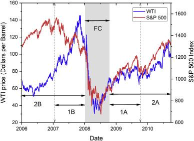

## Table of Contents

## What was the 2008 Financial Crisis?

The 2008 Financial Crisis was a big economic problem that started in the United States but affected the whole world. It happened because banks and other financial companies made risky decisions, like giving loans to people who couldn't pay them back. These loans were often for buying houses, and when people couldn't pay, many houses were taken back by the banks. This caused the value of houses to drop a lot, and banks lost a lot of money. Because banks were in trouble, they stopped lending money to businesses and people, which made the economy slow down.

Governments and central banks around the world had to step in to help. In the U.S., the government created programs to help banks and homeowners. They also lowered interest rates to make borrowing easier. Despite these efforts, many people lost their jobs, and it took years for the economy to recover. The crisis showed how connected the global economy is and how important it is for banks to be careful with their decisions. It also led to new rules to make the financial system safer.

## How did the 2008 Financial Crisis affect global economies?

The 2008 Financial Crisis had a big impact on economies all around the world. It started in the United States, but because countries trade with each other and rely on each other's economies, the problems spread quickly. Many countries saw their economies shrink as businesses stopped investing and people stopped spending money. Banks in other countries also got into trouble because they had invested in the risky financial products from the U.S. This led to a global economic slowdown, with many countries going into a recession, which means their economies got smaller for a while.

In Europe, the crisis hit hard, especially in countries like Greece, Spain, and Ireland. These countries had big debts and struggled to pay them back, leading to what was called the European debt crisis. Governments had to cut spending and raise taxes, which made life harder for many people. In Asia, countries like Japan and China were affected too, but they managed to recover a bit faster because they had strong economies and could help their businesses and people more easily. Overall, the crisis showed how connected the world's economies are and how a problem in one place can affect everyone.

## What is the oil and gas sector?

The oil and gas sector is all about finding, taking out of the ground, moving, and selling oil and natural gas. These are important energy sources that people use every day for things like driving cars, heating homes, and making electricity. Companies in this sector explore places around the world to find new oil and gas deposits. Once they find them, they drill into the ground to get the oil and gas out. This can be a tricky and expensive job, but it's important because so many things depend on these energy sources.

After the oil and gas are taken out of the ground, they need to be moved to where people can use them. This is usually done through pipelines, ships, or trucks. Once they reach their destination, the oil might be turned into different products like gasoline or diesel at a refinery. Natural gas might be cleaned up and sent to homes and businesses through more pipelines. The oil and gas sector is a big part of the world's economy, but it also faces challenges like making sure it's safe and good for the environment.

## How dependent is the oil and gas sector on economic stability?

The oil and gas sector really depends on how stable the economy is. When the economy is doing well, people and businesses use more energy. They drive more, factories run more machines, and there's more need for oil and gas. This means oil and gas companies can sell more of what they produce, and they make more money. But if the economy is not doing well, like during a recession, people and businesses use less energy. They might drive less or factories might slow down, so they don't need as much oil and gas. This can make it hard for oil and gas companies because they have less to sell and their profits can go down.

Also, the price of oil and gas can change a lot depending on what's happening in the economy. If there's a big economic crisis, like the one in 2008, the prices can drop a lot because people are scared and not spending money. Oil and gas companies might have to cut back on looking for new oil and gas because it's too expensive and risky when prices are low. On the other hand, if the economy is growing and doing well, the prices of oil and gas might go up because there's more demand. So, the oil and gas sector needs a stable economy to plan and invest in finding and producing oil and gas without too much risk.

## What immediate impacts did the 2008 Financial Crisis have on oil prices?

The 2008 Financial Crisis had a big effect on oil prices right away. Before the crisis, oil prices were very high, reaching almost $150 a barrel in July 2008. But when the crisis hit, people and businesses got scared and started using less oil. They drove less and factories slowed down, so the demand for oil dropped a lot. This made oil prices fall quickly. By December 2008, the price of oil had dropped to around $30 a barrel, which was a huge drop from just a few months before.

This big drop in oil prices hurt oil companies a lot. They had to cut back on looking for new oil because it was too expensive when prices were so low. Many oil workers lost their jobs, and some oil companies even went bankrupt. The crisis showed how much the oil industry depends on the economy doing well. When the economy is in trouble, oil prices can fall fast, and it can take a long time for them to go back up.

## How did the crisis affect oil and gas companies' stock prices?

The 2008 Financial Crisis made the stock prices of oil and gas companies go down a lot. Before the crisis, many people wanted to buy their stocks because oil prices were high and the companies were making a lot of money. But when the crisis started, people got scared and started selling their stocks. They were worried about the economy and didn't want to lose more money. This made the stock prices of oil and gas companies drop quickly. Some companies lost a lot of value in just a few months.

The drop in stock prices was also because the demand for oil and gas went down. People and businesses were using less energy because they were worried about money. This meant oil and gas companies were making less money, and their stocks became less valuable. Many investors lost a lot of money, and some oil and gas companies had a hard time getting the money they needed to keep working. It took a long time for the stock prices to start going back up again, and some companies never fully recovered from the crisis.

## What were the changes in oil and gas production levels post-2008?

After the 2008 Financial Crisis, oil and gas production levels changed a lot. Before the crisis, many oil and gas companies were producing a lot because prices were high and they were making good money. But when the crisis hit, oil prices dropped very quickly, and it became much harder for these companies to make money. Because of this, many companies had to cut back on how much oil and gas they were producing. They also had to stop looking for new oil and gas because it was too expensive and risky when prices were so low.

Over time, as the economy started to recover, oil and gas production levels began to go up again. By around 2010, oil prices started to rise, and companies felt more confident about investing in new projects. This led to an increase in production, especially in places like the United States where new technology like fracking helped find and produce more oil and gas. However, the recovery was slow, and it took several years for production levels to get back to where they were before the crisis. Even then, the oil and gas industry had to be careful because prices could still go up and down a lot depending on what was happening in the economy.

## How did the crisis influence oil and gas exploration and drilling activities?

The 2008 Financial Crisis made oil and gas companies cut back a lot on exploring for new oil and gas. Before the crisis, when oil prices were high, these companies were looking for new places to drill all over the world. But when the crisis hit and oil prices dropped, it became too expensive and risky to keep searching for new oil and gas. Many companies had to stop their exploration projects because they couldn't afford them anymore. This meant fewer new oil and gas fields were being found, which could affect how much oil and gas would be available in the future.

As the economy started to get better after the crisis, oil and gas companies slowly started exploring again. By around 2010, oil prices began to go up, and companies felt more confident about spending money on new projects. They started looking for new oil and gas again, but they had to be careful because prices could still change a lot. In the United States, new technology like fracking helped find and produce more oil and gas, which helped increase exploration and drilling activities. Even so, it took a long time for the oil and gas industry to get back to the level of exploration they had before the crisis.

## What long-term effects did the 2008 Financial Crisis have on the oil and gas sector?

The 2008 Financial Crisis had a big impact on the oil and gas sector in the long run. After the crisis, oil and gas companies had to be more careful about how they spent their money. They learned that prices could go up and down a lot, so they had to be ready for that. Many companies started to focus more on finding new ways to save money and make their operations more efficient. They also started to think more about the future and how they could keep making money even if oil prices were low. This led to more investment in new technology, like fracking in the United States, which helped find and produce more oil and gas.

Another long-term effect was that the crisis made the oil and gas sector more focused on renewable energy. People and governments started to worry more about the environment and the future of energy. This pushed oil and gas companies to start looking into other types of energy, like wind and solar power. They knew that oil and gas might not always be the main source of energy, so they wanted to be ready for a world that used more renewable energy. This shift helped the sector become more diverse and ready for changes in the energy market.

## How did government policies and regulations change in response to the crisis affecting the oil and gas industry?

After the 2008 Financial Crisis, governments around the world changed their policies and regulations to help the oil and gas industry and make sure it didn't happen again. They wanted to make the economy more stable and safe. One big change was that they made new rules for banks and financial companies. These rules said they had to be more careful with their money and not take too many risks. This was important for the oil and gas industry because it depended a lot on banks for loans to explore and drill for new oil and gas. If banks were more careful, it could be harder for oil and gas companies to get the money they needed, but it also meant the financial system would be safer.

Governments also started to help the oil and gas industry more directly. They gave money to companies that were in trouble and made it easier for them to borrow money. This was to keep the industry going and make sure people kept their jobs. Over time, governments also started to think more about the future of energy. They made new rules to encourage the use of renewable energy like wind and solar power. This was because they wanted to move away from oil and gas, which can be bad for the environment. These changes helped the oil and gas industry recover from the crisis but also pushed it to change and be ready for a world with more renewable energy.

## What strategies did oil and gas companies employ to mitigate the impacts of the crisis?

When the 2008 Financial Crisis hit, oil and gas companies had to find ways to deal with the big drop in oil prices and the problems it caused. One thing they did was cut back on spending. They stopped looking for new oil and gas because it was too expensive when prices were low. They also let go of some workers and closed down some of their operations to save money. This helped them stay in business even though they were making less money. Another thing they did was focus on making their operations more efficient. They looked for ways to use less money and still produce the same amount of oil and gas. This meant they could keep going even when times were tough.

As time went on and the economy started to get better, oil and gas companies started to think about the future. They knew that oil prices could go up and down a lot, so they wanted to be ready for that. They started to invest in new technology, like fracking, which helped them find and produce more oil and gas. They also began to look into other types of energy, like wind and solar power. They knew that the world might use less oil and gas in the future, so they wanted to be ready for that. By doing these things, oil and gas companies were able to recover from the crisis and be more prepared for whatever might happen next.

## How did the 2008 Financial Crisis alter the global energy market dynamics in relation to oil and gas?

The 2008 Financial Crisis changed how the global energy market worked, especially for oil and gas. Before the crisis, oil prices were very high, and everyone wanted to buy oil and gas. But when the crisis hit, people and businesses got scared and started using less energy. This made the demand for oil and gas go down a lot, and prices dropped quickly. Oil and gas companies had to cut back on finding new oil and gas because it was too expensive when prices were low. This made the global energy market less stable because there was less new oil and gas coming into the market.

As time went on and the economy started to get better, oil and gas companies slowly started to look for new oil and gas again. But they had to be careful because prices could still change a lot. The crisis also made people and governments think more about using other types of energy, like wind and solar power. They wanted to move away from oil and gas because it can be bad for the environment. This pushed the global energy market to start changing, with more focus on renewable energy. The 2008 crisis showed how connected the energy market is to the economy and how important it is to be ready for big changes.

## References & Further Reading

[1]: Hamilton, J. D. (2009). ["Understanding Crude Oil Prices."](https://www.nber.org/papers/w14492) National Bureau of Economic Research, Working Paper No. 14492.

[2]: Gorton, G. B., & Rouwenhorst, K. G. (2006). ["Facts and Fantasies about Commodity Futures."](https://www.nber.org/papers/w10595) Financial Analysts Journal, 62(2), 47-68.

[3]: Fernandez, P., & Fernandez-Maciá, A. (2010). ["The 2008 Financial Crisis: From the Bailouts to Pricing Corners."](https://scholar.google.com/citations?user=IhNRfoAAAAAJ) IESE Business School, University of Navarra.

[4]: Aldridge, I. (2010). ["High-Frequency Trading: A Practical Guide to Algorithmic Strategies and Trading Systems"](https://onlinelibrary.wiley.com/doi/pdf/10.1002/9781119203803.fmatter). John Wiley & Sons.

[5]: Yergin, D. (2011). ["The Quest: Energy, Security, and the Remaking of the Modern World"](https://archive.org/details/questenergysecur0000yerg). Penguin Books.

[6]: Fabozzi, F. J., & Focardi, S. M. (2008). ["The Subprime Mortgage Crisis: Causes and Consequences."](https://www.semanticscholar.org/paper/Quantitative-Equity-Investing%3A-Techniques-and-Fabozzi-Focardi/1c49a2a53919f7e65cb96f16691b8ff726fd3cd7) Journal of Risk Finance, Volume 9, Issue 3.

[7]: Lopez de Prado, M. (2018). ["Advances in Financial Machine Learning"](https://www.amazon.com/Advances-Financial-Machine-Learning-Marcos/dp/1119482089). John Wiley & Sons.