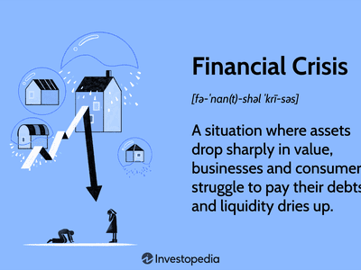

The 2008 financial crisis, triggered by the collapse of the housing market and subprime mortgage defaults, had extensive repercussions across numerous economic sectors. Among these, the oil and gas industry experienced significant disruptions. This article examines the economic ramifications of the crisis on this vital sector and considers the role of algorithmic trading during this period of financial instability. By analyzing historical data alongside contemporary trading mechanisms, this article offers a thorough understanding of a complex and multifaceted topic. Specifically, we focus on the dramatic decline in oil prices, from a high of $133.88 per barrel in June 2008 to a low of $39.09 by February 2009, and the resulting shifts within the industry landscape. The crisis led to diminished revenues for oil companies and subsequently, a reduction in exploration and production activities. Additionally, the tightening of credit conditions increased borrowing costs, thereby affecting the long-term profitability of companies involved.

Algorithmic trading emerged as a prominent tool during the financial crisis. Characterized by the use of computerized algorithms to execute trades rapidly, it allowed market participants to respond quickly to price changes, providing liquidity even amidst volatile economic conditions. Nonetheless, the unpredictability of market movements during the crisis presented substantial challenges, necessitating rapid adaptations to trading strategies. 

This analysis not only highlights how the oil and gas industry navigated the immediate pressures of the crisis but also examines how the sector and financial markets adapted for the future. Through this exploration, we gain insights into the strategies implemented to manage the crisis and the foundational changes that set the stage for subsequent industry and market evolution.

## Table of Contents

## The 2008 Financial Crisis: A Brief Overview

The 2008 financial crisis originated from the collapse of the subprime mortgage market in the United States, marking the beginning of a global economic downturn. Initially, the crisis was rooted in the excessive issuance of high-risk mortgages to borrowers with poor credit histories, which were often bundled and sold as mortgage-backed securities (MBS) to investors. As housing prices began to decline, mortgage defaults surged, leading to significant losses for financial institutions and triggering a cascade of events that destabilized the global financial system.

The contraction in credit markets was inevitable as financial institutions faced liquidity crises, resulting in tightened lending conditions and a reduction in credit availability worldwide. This credit crunch exacerbated financial instability, as both businesses and consumers found it increasingly difficult to secure loans, stifling economic growth and investment.

The crisis also resulted in sizable declines in asset values, including stocks and real estate, which further weakened consumer wealth and confidence. As asset prices tumbled, consumer spending—which comprises a substantial portion of economic activity in many countries—decreased significantly. The ripple effects of this decline were particularly felt in sectors characterized by high capital expenditures, such as the oil and gas industry. Companies in these sectors faced dual challenges of weakened demand and reduced capital availability, which hampered exploration, production, and new investments.

Understanding these dynamics is crucial as the crisis serves as a stark reminder of the interconnectedness of global financial systems and the vulnerabilities inherent in high-risk financial practices.

## Impact on the Oil and Gas Sector

The 2008 financial crisis had a profound impact on the oil and gas sector, characterized by a dramatic fall in oil prices, dwindling revenues, and constrained capital investments. During this period, the oil prices fell sharply from a peak of $133.88 per barrel in June 2008 to a nadir of $39.09 by February 2009. This significant reduction in oil prices was primarily driven by the global economic slowdown that reduced demand, as industries across the board struggled to cope with restricted financial resources and decreasing consumer spending.

The drastic fall in oil prices resulted in a substantial decline in revenues for oil companies, which in turn caused a slowdown in exploration and production (E&P) activities. Exploration and production are capital-intensive operations, and with oil prices plummeting, many projects that were previously economically viable became financially unfeasible. The industry witnessed a curtailment in capital expenditures, with companies either shelving or completely abandoning projects that no longer promised acceptable returns on investment. 

Furthermore, the tight financial conditions resulting from the crisis adversely impacted the borrowing costs for oil and gas companies. During this turbulent period, credit markets were constrained, leading to an increase in the cost of capital. Companies found it challenging to secure financing for both ongoing operations and future projects, which further dampened the prospects of recovery in exploration and production activities. The increased borrowing costs translated into lower profits and, in some cases, threatened the solvency of companies deeply invested in high-cost extraction projects.

The financial crisis compelled oil and gas companies to reassess their strategies, driving them to find ways to operate more efficiently and cost-effectively. Some companies resorted to mergers and acquisitions as a way to achieve scale and synergies, while others focused on technological innovations to reduce costs. These strategic shifts, though forced by adverse circumstances, laid the groundwork for more resilient business models capable of withstanding future economic shocks.

## Algorithmic Trading in the Financial Crisis

Algorithmic trading experienced a significant boost in prominence during the 2008 financial crisis, providing both advantages and challenges within the financial markets. This trading approach, which leverages computer algorithms to execute and manage orders, became crucial for navigating the high [volatility](/wiki/volatility-trading-strategies) encountered during this period.

The primary advantage of [algorithmic trading](/wiki/algorithmic-trading) lies in its ability to react swiftly to market changes. Algorithms can process vast amounts of data in real-time, allowing them to identify and capitalize on fleeting market opportunities faster than any human trader could. This capability was particularly beneficial during the financial crisis when markets were extremely volatile, and rapid decision-making was essential to minimize losses and maximize profits. Algorithmic trading contributed to market [liquidity](/wiki/liquidity-risk-premium) by facilitating a constant flow of buy and sell orders, which is especially valuable during periods of stress when human traders might withdraw due to uncertainty.

Despite these advantages, the unpredictable nature of the market during the crisis posed considerable challenges. The chaotic conditions required algorithms to adapt quickly, a task for which many were initially unprepared. Traditional strategies often failed in such volatile environments, necessitating rapid adjustments. The need for adaptation highlighted the limitations of some algorithmic strategies that were not designed to handle extreme volatility, leading to increased attention on refining algorithms to be more robust.

Algorithm designers responded to these challenges by developing more sophisticated models, capable of better understanding and predicting market trends. Innovations included incorporating [machine learning](/wiki/machine-learning) techniques, which allow algorithms to learn and adapt based on new market data. These advancements aimed to enhance the flexibility and robustness of algorithmic strategies, thereby enabling them to cope with future shocks more effectively.

The experience of the 2008 financial crisis underlined the need for continuous monitoring and adjustment of algorithmic strategies. Firms that were able to reconfigure their algorithms quickly managed to stay competitive, while those reliant on static models faced significant setbacks. The crisis served as a catalyst for further innovation in algorithmic trading, prompting the development of strategies that could better handle unforeseen market conditions. Therefore, while algorithmic trading proved to be a double-edged sword during the financial crisis, it ultimately paved the way for more resilient trading systems equipped to navigate complex financial landscapes.

## Recovery and Shifts Post-Crisis

Aggressive fiscal and monetary policies implemented in the wake of the 2008 financial crisis played a pivotal role in stabilizing global markets and fostering economic recovery. Central banks, particularly the Federal Reserve in the United States, employed unconventional monetary tools such as quantitative easing, which injected liquidity into the financial system and lowered interest rates. These measures helped restore confidence, leading to increased investment and consumption, thus gradually improving economic conditions.

The oil and gas industry experienced a resurgence in demand as these policies stimulated economic growth and increased energy consumption. However, the crisis brought about structural changes that had lasting impacts on the sector. Companies prioritized operational efficiency and cost management to remain competitive in a potentially volatile market environment. This period also saw a shift towards natural gas and renewables as energy sources, influenced by changing regulatory landscapes and environmental considerations.

Parallelly, algorithmic trading continued to evolve in response to the challenges posed by the financial crisis. Initially, algorithmic trading models struggled with the market's volatility and rapid fluctuations. However, advancements in technology and computational capacities allowed these systems to incorporate sophisticated strategies that could adapt to market changes more swiftly. Machine learning and [artificial intelligence](/wiki/ai-artificial-intelligence) have become integral to the development of trading algorithms. These technologies enhance pattern recognition and predictive capabilities, allowing for more precise decision-making and risk management.

Modern algorithmic models now utilize vast datasets and machine learning techniques to anticipate market trends and respond in real-time. The use of historical data, coupled with real-time analytics, aids in identifying profitable trading opportunities while mitigating potential risks. Moreover, the integration of machine learning has facilitated the development of algorithms that continuously learn and adapt to evolving market conditions, increasing their resilience to future economic disruptions.

As these advancements unfold, both the oil and gas industry and financial markets have become more robust, with greater emphasis placed on sustainability and innovation. While the 2008 financial crisis highlighted vulnerabilities, it also spurred advancements that have reinforced the sectors' capacities to navigate future uncertainties effectively.

## Conclusion

The 2008 financial crisis brought profound changes to the oil and gas industry, exposing structural weaknesses and prompting the adoption of new economic paradigms. As oil prices plummeted, companies were forced to reevaluate their financial strategies and operational models to adapt to a constrained economic environment. This period of turmoil underscored the susceptibility of the industry to global financial shocks and highlighted the necessity for more resilient business practices.

At the same time, algorithmic trading emerged as a double-edged sword. On one hand, it offered opportunities for enhanced market liquidity and more efficient trade executions during volatile periods. On the other hand, the rapid market changes introduced by the crisis presented significant challenges to algorithmic strategies, requiring quick recalibrations to cope with unprecedented market conditions. The advancements in technology post-crisis, particularly in machine learning and data analytics, have further shaped algorithmic trading into a resilient mechanism capable of navigating future financial uncertainties.

The lessons learned from managing economic disruptions during the crisis emphasize the importance of leveraging technology and innovation. By understanding the dynamics that unfolded during this period, industry players and financial market participants can better prepare for potential future disruptions, implementing strategies that ensure stability and growth in an ever-evolving economic landscape.

## References & Further Reading

[1]: Hamilton, J. D. (2009). ["Understanding Crude Oil Prices."](https://www.nber.org/papers/w14492) National Bureau of Economic Research, Working Paper No. 14492.

[2]: Gorton, G. B., & Rouwenhorst, K. G. (2006). ["Facts and Fantasies about Commodity Futures."](https://www.nber.org/papers/w10595) Financial Analysts Journal, 62(2), 47-68.

[3]: Fernandez, P., & Fernandez-Maciá, A. (2010). ["The 2008 Financial Crisis: From the Bailouts to Pricing Corners."](https://scholar.google.com/citations?user=IhNRfoAAAAAJ) IESE Business School, University of Navarra.

[4]: Aldridge, I. (2010). ["High-Frequency Trading: A Practical Guide to Algorithmic Strategies and Trading Systems"](https://onlinelibrary.wiley.com/doi/pdf/10.1002/9781119203803.fmatter). John Wiley & Sons.

[5]: Yergin, D. (2011). ["The Quest: Energy, Security, and the Remaking of the Modern World"](https://archive.org/details/questenergysecur0000yerg). Penguin Books.

[6]: Fabozzi, F. J., & Focardi, S. M. (2008). ["The Subprime Mortgage Crisis: Causes and Consequences."](https://www.semanticscholar.org/paper/Quantitative-Equity-Investing%3A-Techniques-and-Fabozzi-Focardi/1c49a2a53919f7e65cb96f16691b8ff726fd3cd7) Journal of Risk Finance, Volume 9, Issue 3.

[7]: Lopez de Prado, M. (2018). ["Advances in Financial Machine Learning"](https://www.amazon.com/Advances-Financial-Machine-Learning-Marcos/dp/1119482089). John Wiley & Sons.