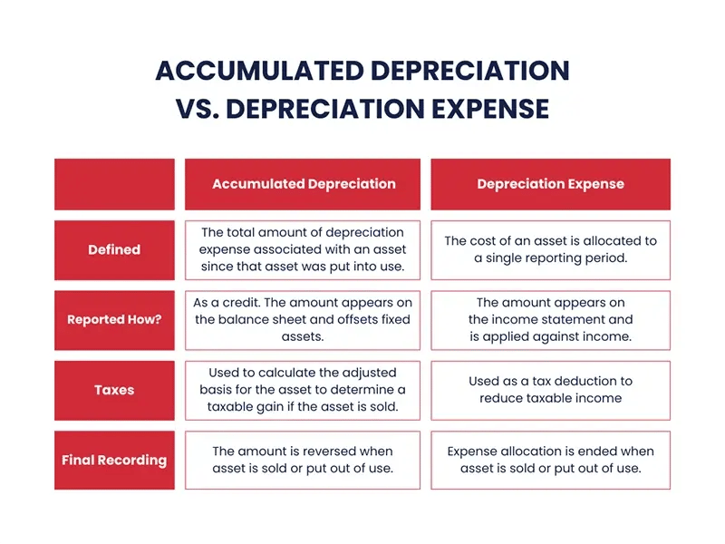

## Table of Contents

## What is depreciation and how is it calculated?

Depreciation is the way we account for the loss in value of an asset over time. When a business buys something big like a machine or a building, it doesn't use up all its value right away. Instead, the cost of that asset is spread out over the years it's expected to be useful. This helps businesses match the expense of the asset with the income it helps to generate, which is important for accurate financial reporting.

There are different methods to calculate depreciation, but one of the simplest is the straight-line method. With this method, you take the cost of the asset, subtract its expected value at the end of its useful life (called salvage value), and then divide that number by the number of years the asset is expected to last. For example, if a machine costs $10,000 and is expected to last 5 years with a salvage value of $2,000, you would subtract $2,000 from $10,000 to get $8,000, and then divide $8,000 by 5 years to get an annual depreciation expense of $1,600.

## What is accumulated depreciation?

Accumulated depreciation is the total amount of depreciation expense that has been recorded for an asset since it was bought. It's like a running total of how much value the asset has lost over time. This number is important because it helps businesses keep track of how much their assets are worth now, compared to when they first bought them.

When a company reports its financials, accumulated depreciation is shown on the balance sheet as a negative number, reducing the value of the asset it's related to. For example, if a company bought a machine for $10,000 and it has accumulated depreciation of $4,000, the machine would be shown on the balance sheet as being worth $6,000. This helps give a clearer picture of the company's current financial health.

## How does depreciation affect the income statement?

Depreciation affects the income statement by showing up as an expense. When a business calculates its profit, it subtracts all its expenses from its revenue. Depreciation is one of those expenses. So, every year, the amount of depreciation calculated for an asset is taken away from the revenue, which lowers the profit shown on the income statement.

This is important because it helps match the cost of using an asset with the income it helps to generate. For example, if a delivery truck helps a business earn money over several years, the cost of the truck should be spread out over those years too. By including depreciation as an expense, the income statement gives a more accurate picture of the business's financial performance over time.

## What is net income and how is it calculated?

Net income is the amount of money a business has left after it pays all its expenses. It's like the profit that the business makes. To find net income, you start with the total revenue, which is all the money the business earns from selling its products or services. Then, you subtract all the costs and expenses the business has, like the cost of goods sold, salaries, rent, and other operating expenses. You also subtract any taxes the business has to pay. What's left after subtracting all these things is the net income.

Depreciation, which we talked about before, is one of those expenses that gets subtracted when calculating net income. It's important because it spreads out the cost of big purchases like machines or buildings over the time they're used. So, even though depreciation doesn't involve spending actual cash each year, it still reduces the net income shown on the income statement. This gives a more accurate picture of how much money the business is really making after accounting for all its costs.

## How does accumulated depreciation impact the balance sheet?

Accumulated depreciation shows up on the balance sheet as a negative number. It's like a running total of how much value an asset has lost over time. When a company buys something big like a machine or a building, it doesn't lose all its value right away. Instead, the cost of that asset is spread out over the years it's expected to be useful. The total amount of this spread-out cost is the accumulated depreciation, and it reduces the value of the asset on the balance sheet.

For example, if a company bought a machine for $10,000 and the accumulated depreciation on it is $4,000, the machine would be shown on the balance sheet as being worth $6,000. This helps give a clearer picture of what the company's assets are really worth now, not just what they cost when they were new. By showing accumulated depreciation, the balance sheet gives a more accurate view of the company's current financial health.

## Can you explain the relationship between depreciation expense and net income?

Depreciation expense is a cost that businesses record on their income statement. It represents the amount of value an asset loses each year. When a business calculates its net income, it starts with all the money it earns, called revenue. Then, it subtracts all the costs and expenses, including depreciation expense. So, depreciation expense reduces the net income shown on the income statement.

This is important because it helps match the cost of using an asset with the income it helps to generate. For example, if a delivery truck helps a business earn money over several years, the cost of the truck should be spread out over those years too. By including depreciation as an expense, the income statement gives a more accurate picture of the business's financial performance over time. Even though depreciation doesn't involve spending actual cash each year, it still lowers the net income, showing how the asset's value is used up.

## How does the choice of depreciation method affect net income?

The choice of depreciation method can affect net income because different methods spread out the cost of an asset in different ways. The straight-line method spreads the cost evenly over the asset's useful life, so the depreciation expense stays the same each year. This means net income will be reduced by the same amount each year. On the other hand, methods like the declining balance method or the sum-of-the-years'-digits method make the depreciation expense higher in the early years and lower in later years. This means net income will be lower in the early years and higher in the later years.

For example, if a business uses the declining balance method for a machine, it will have a bigger depreciation expense in the first few years. This bigger expense will make the net income lower during those years. But as the depreciation expense gets smaller over time, the net income will start to go up. So, the choice of depreciation method can make a big difference in how much profit a business shows each year, even though the total cost of the asset stays the same.

## What are the tax implications of depreciation on net income?

Depreciation affects taxes because it reduces the amount of taxable income a business has. When a business calculates its taxes, it starts with its net income. Since depreciation is an expense that gets subtracted from revenue to find net income, a higher depreciation expense means a lower net income. And a lower net income means the business has to pay less in taxes. This is why businesses often look for ways to use depreciation to lower their tax bill.

Different methods of depreciation can change how much tax a business pays each year. If a business uses a method that gives a bigger depreciation expense in the early years, like the declining balance method, it will have a lower net income and pay less in taxes during those years. But later on, when the depreciation expense is smaller, the net income will be higher, and the business will pay more in taxes. So, the choice of depreciation method can help a business manage its tax payments over time.

## How does accumulated depreciation influence a company's financial ratios?

Accumulated depreciation affects a company's financial ratios because it changes the value of the company's assets on the balance sheet. When a company calculates ratios like the return on assets (ROA), it uses the net value of its assets, which is the original cost minus the accumulated depreciation. A higher accumulated depreciation means the assets are worth less on paper, which can make the ROA look better because the profit is divided by a smaller number. But it can also make other ratios, like the asset turnover ratio, look worse because the sales are divided by a smaller asset base.

This can be important for people who want to understand how well a company is doing. For example, if a company has a lot of accumulated depreciation, it might look like it's using its assets more efficiently because the net value of the assets is lower. But it could also mean the company's equipment is getting old and might need to be replaced soon, which could affect future profits. So, when looking at financial ratios, it's good to think about how accumulated depreciation might be changing the numbers and what that means for the company's health.

## What are the long-term effects of accumulated depreciation on a company's profitability?

Accumulated depreciation can have a big impact on a company's profitability over the long term. As assets like machines or buildings get older, their value goes down because of accumulated depreciation. This means the company's net income can look higher because the assets are worth less on paper. But this can also mean the company needs to spend money to replace these old assets. If a company doesn't plan for this, it might have to spend a lot of money all at once, which can hurt its profits.

Over time, the way a company handles depreciation can also affect how it looks to investors and lenders. If a company shows a lot of accumulated depreciation, it might seem like it's doing well because its profits look good. But if the company doesn't keep up with replacing its old equipment, it could face problems later on. This is why it's important for a company to think about the long-term effects of accumulated depreciation and make sure it's ready to replace its assets when they wear out.

## How do changes in depreciation estimates impact net income?

Changes in depreciation estimates can affect a company's net income. If a company decides that an asset will last longer than it thought before, it will spread the cost of that asset over more years. This means the yearly depreciation expense will be smaller, so the net income will be higher each year. On the other hand, if the company thinks the asset won't last as long as it thought, it will spread the cost over fewer years. This makes the yearly depreciation expense bigger, which means the net income will be lower each year.

These changes in estimates can happen if a company learns new things about how long its assets will last or if it changes how it uses them. For example, if a delivery truck starts being used more often, it might wear out faster. The company would then need to change its depreciation estimate to reflect this. These changes can make a big difference in how much profit the company shows on its income statement, even though the total cost of the asset stays the same.

## What are the strategic considerations for managing accumulated depreciation to optimize net income?

Managing accumulated depreciation strategically can help a company optimize its net income. One way to do this is by choosing the right depreciation method. If a company uses a method like the declining balance method, it will have a bigger depreciation expense in the early years, which lowers net income during those years. But as the depreciation expense gets smaller over time, net income will go up. This can be useful if a company wants to show higher profits in later years, maybe to attract investors or to prepare for big expenses like replacing old equipment.

Another important thing to think about is how often to update depreciation estimates. If a company finds out that its assets will last longer or shorter than it thought, it should change its depreciation estimates. Making the right changes can help spread out the cost of the assets in a way that keeps net income steady or helps it grow over time. For example, if a company expects its machines to last longer, it can lower its yearly depreciation expense, which will make net income higher each year. This can be a smart move to make the company look more profitable and stable to people looking at its financials.

## What is Accumulated Depreciation?

Accumulated depreciation is a cornerstone of accounting, illustrating the total depreciation that has been allocated to an asset since its acquisition. This measure is critical for businesses as it enables the systematic allocation of the cost of tangible assets over their useful lives. By spreading the cost of an asset over its operational life, companies can more accurately reflect its consumption and wear, thereby aligning economic reality with accounting practice.

There are several methods to calculate accumulated depreciation, each suited to different types of assets and business philosophies. The straight-line method is the simplest and most commonly used. It divides the cost of an asset less its salvage value evenly across its useful life, providing a constant annual depreciation expense. The formula for the straight-line method is:

$$
\text{Annual Depreciation Expense} = \frac{\text{Cost of Asset} - \text{Salvage Value}}{\text{Useful Life of Asset}}
$$

The declining balance method, an accelerated depreciation technique, applies a constant rate to the reducing book value of the asset each year. This method results in higher depreciation expense in the early years of an asset's life, which can be beneficial for tax purposes. The doubling of the straight-line rate is a common variation known as the double declining balance method.

In cases where an asset's usage varies significantly from year to year, the units of production method might be used. This method allocates depreciation based on the asset's actual usage, be it hours, units produced, or any measurable activity, ensuring that the depreciation expense is tied directly to the asset's utilization.

Understanding accumulated depreciation is crucial for interpreting a company's balance sheet. The book value of an asset, a critical figure for investors and stakeholders, is calculated by subtracting accumulated depreciation from the original cost of the asset. This provides insight into the asset's current worth and the extent of wear and usage it has undergone.

Different industries apply accumulated depreciation methods based on their unique asset usage patterns. For example, manufacturing industries might prefer the units of production method for machinery heavily tied to production cycles, whereas retail industries might opt for straight-line depreciation on store fixtures that experience consistent wear. The method chosen can significantly impact financial analysis and decisions, influencing perceived company stability and investment appeal.

Overall, accumulated depreciation not only assists in accurate financial reporting but also affects strategic business decisions, tax planning, and investment evaluations. Understanding its nuances and applications across various sectors empowers investors and managers to better gauge asset performance and longevity.

## What is Net Income: The Bottom Line?

Net income is a crucial financial metric representing the remaining earnings after a company has accounted for all its expenses. Calculating net income involves subtracting total expenses from total revenue, providing a clear measure of a company’s profitability. It is often referred to as the 'bottom line' due to its position on the income statement, making it an essential indicator of a company's financial health.

Several components influence net income, including operating expenses, interest expenses, taxes, and non-operating items. A critical element in this calculation is depreciation, particularly accumulated depreciation, which impacts net income. Accumulated depreciation reflects the total depreciation expense charged against an asset over its useful life. It reduces the book value of assets, impacting the overall expenses that will ultimately affect net income.

$$
\text{Net Income} = \text{Total Revenue} - (\text{Cost of Goods Sold} + \text{Operating Expenses} + \text{Depreciation} + \text{Interest Expense} + \text{Taxes})
$$

Understanding how accumulated depreciation affects net income is vital. Depreciation is a non-cash accounting entry that reduces taxable income and, therefore, taxes payable. By accurately accounting for depreciation, companies can manage their expenses and optimize net income. This can be particularly useful in industries with heavy capital investments, where significant depreciation expenses are expected.

For investors, net income serves as a key metric in evaluating a company’s profitability and growth potential. Investors analyze net income trends over time to assess financial performance. A consistent increase in net income can indicate strong business operations and effective cost management, suggesting a potential for growth. Conversely, declining net income might signal underlying operational issues or market challenges.

Consider the case of a manufacturing company that undertakes a major capital project. If the project requires substantial investment in new machinery, the accumulated depreciation on these assets will affect the company’s net income figures. In the initial years, the depreciation expense might be high, potentially reducing net income. However, as this expense decreases over time, the company might experience an increase in net income, reflecting improved profitability.

Fluctuations in net income can influence financial decision-making. For instance, if a firm experiences a decline in net income, management might decide to implement cost-cutting measures, reassess pricing strategies, or delay capital expenditures. On the other hand, an increase in net income might enable a company to consider expansion opportunities, share buybacks, or increased dividends to shareholders.

In summary, net income is not only a measure of past performance but also a predictor of future financial health, influencing strategic decisions for businesses and providing crucial insights for investors. Understanding the factors affecting net income, including accumulated depreciation, is essential for making informed investment and operation decisions.

## References & Further Reading

[1]: Damodaran, A. ["Investment Valuation: Tools and Techniques for Determining the Value of Any Asset."](https://archive.org/details/investmentvaluat0000damo_n6k9) Wiley Finance.

[2]: ["Advanced Financial Accounting"](https://www.mheducation.com/highered/product/Advanced-Financial-Accounting-Christensen.html) by Baker, Christensen, & Cottrell

[3]: ["Financial Statement Analysis and Security Valuation"](https://www.amazon.com/Financial-Statement-Analysis-Security-Valuation/dp/0073379662) by Stephen Penman

[4]: ["Algorithmic Trading: Winning Strategies and Their Rationale"](https://www.wiley.com/en-us/Algorithmic+Trading%3A+Winning+Strategies+and+Their+Rationale-p-9781118460146) by Ernest Chan

[5]: ["The Intelligent Investor: The Definitive Book on Value Investing"](https://www.amazon.com/Intelligent-Investor-Definitive-Investing-Essentials/dp/0060555661) by Benjamin Graham