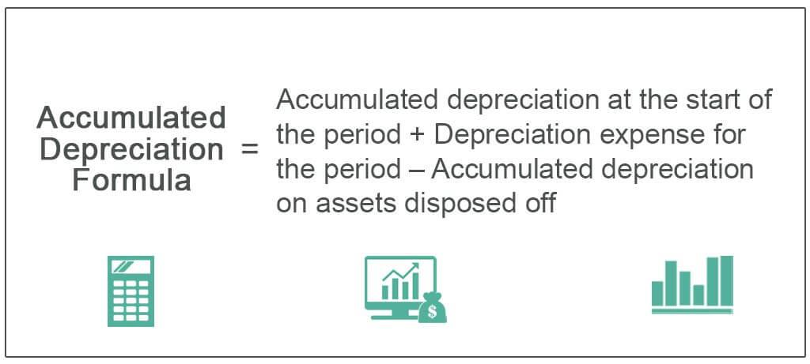

In the intricate world of financial accounting, understanding key concepts such as accumulated depreciation and net income is crucial for investors and business managers alike. These concepts form the foundation of interpreting a company’s financial health and operational efficiency. This article aims to bridge the gap between traditional financial accounting principles and modern algorithmic trading strategies, providing insights into how these two domains interact to influence business operations and investment decisions.

Accumulated depreciation and net income are more than mere entries on a financial statement; they offer profound insights into a company's asset management and profitability. Accumulated depreciation affects the reported value of assets on the balance sheet, thereby influencing investment decisions and financial ratios used by analysts and investors. Understanding its calculation methods, such as straight-line or declining balance, is essential for a nuanced view of a company's financial obligations and asset lifespan.



Net income, often referred to as the "bottom line," is a pivotal figure that reflects a company's earnings after all expenses have been deducted. It holds significant weight in assessing a firm’s financial health and its ability to generate profits. Investors and stakeholders frequently analyze net income to gauge a company's growth prospects and operational success. By scrutinizing these financial metrics, stakeholders can make informed decisions regarding investments, expansions, or cost-cutting measures.

Furthermore, in the era of rapid technological advancement, algorithmic trading has emerged as a formidable force in the financial markets. It leverages financial data, including figures like accumulated depreciation and net income, to execute trades with high speed and precision. By integrating accounting insights into trading algorithms, investors can enhance their strategies to optimize financial returns. For instance, trading models can incorporate knowledge of a company’s depreciation policies to predict cash flow impacts and adjust market positions accordingly.

This article will explore the intricate relationship between these core accounting metrics and algorithmic trading, offering a comprehensive understanding of how traditional accounting principles can be aligned with modern trading strategies for competitive advantage. By the end of this discussion, readers will appreciate the critical role these concepts play in shaping a data-driven investment landscape.

## Table of Contents

## Accumulated Depreciation: What Is It?

Accumulated depreciation is a cornerstone of accounting, illustrating the total depreciation that has been allocated to an asset since its acquisition. This measure is critical for businesses as it enables the systematic allocation of the cost of tangible assets over their useful lives. By spreading the cost of an asset over its operational life, companies can more accurately reflect its consumption and wear, thereby aligning economic reality with accounting practice.

There are several methods to calculate accumulated depreciation, each suited to different types of assets and business philosophies. The straight-line method is the simplest and most commonly used. It divides the cost of an asset less its salvage value evenly across its useful life, providing a constant annual depreciation expense. The formula for the straight-line method is:

$$
\text{Annual Depreciation Expense} = \frac{\text{Cost of Asset} - \text{Salvage Value}}{\text{Useful Life of Asset}}
$$

The declining balance method, an accelerated depreciation technique, applies a constant rate to the reducing book value of the asset each year. This method results in higher depreciation expense in the early years of an asset's life, which can be beneficial for tax purposes. The doubling of the straight-line rate is a common variation known as the double declining balance method.

In cases where an asset's usage varies significantly from year to year, the units of production method might be used. This method allocates depreciation based on the asset's actual usage, be it hours, units produced, or any measurable activity, ensuring that the depreciation expense is tied directly to the asset's utilization.

Understanding accumulated depreciation is crucial for interpreting a company's balance sheet. The book value of an asset, a critical figure for investors and stakeholders, is calculated by subtracting accumulated depreciation from the original cost of the asset. This provides insight into the asset's current worth and the extent of wear and usage it has undergone.

Different industries apply accumulated depreciation methods based on their unique asset usage patterns. For example, manufacturing industries might prefer the units of production method for machinery heavily tied to production cycles, whereas retail industries might opt for straight-line depreciation on store fixtures that experience consistent wear. The method chosen can significantly impact financial analysis and decisions, influencing perceived company stability and investment appeal.

Overall, accumulated depreciation not only assists in accurate financial reporting but also affects strategic business decisions, tax planning, and investment evaluations. Understanding its nuances and applications across various sectors empowers investors and managers to better gauge asset performance and longevity.

## Net Income: The Bottom Line

Net income is a crucial financial metric representing the remaining earnings after a company has accounted for all its expenses. Calculating net income involves subtracting total expenses from total revenue, providing a clear measure of a company’s profitability. It is often referred to as the 'bottom line' due to its position on the income statement, making it an essential indicator of a company's financial health.

Several components influence net income, including operating expenses, interest expenses, taxes, and non-operating items. A critical element in this calculation is depreciation, particularly accumulated depreciation, which impacts net income. Accumulated depreciation reflects the total depreciation expense charged against an asset over its useful life. It reduces the book value of assets, impacting the overall expenses that will ultimately affect net income.

$$
\text{Net Income} = \text{Total Revenue} - (\text{Cost of Goods Sold} + \text{Operating Expenses} + \text{Depreciation} + \text{Interest Expense} + \text{Taxes})
$$

Understanding how accumulated depreciation affects net income is vital. Depreciation is a non-cash accounting entry that reduces taxable income and, therefore, taxes payable. By accurately accounting for depreciation, companies can manage their expenses and optimize net income. This can be particularly useful in industries with heavy capital investments, where significant depreciation expenses are expected.

For investors, net income serves as a key metric in evaluating a company’s profitability and growth potential. Investors analyze net income trends over time to assess financial performance. A consistent increase in net income can indicate strong business operations and effective cost management, suggesting a potential for growth. Conversely, declining net income might signal underlying operational issues or market challenges.

Consider the case of a manufacturing company that undertakes a major capital project. If the project requires substantial investment in new machinery, the accumulated depreciation on these assets will affect the company’s net income figures. In the initial years, the depreciation expense might be high, potentially reducing net income. However, as this expense decreases over time, the company might experience an increase in net income, reflecting improved profitability.

Fluctuations in net income can influence financial decision-making. For instance, if a firm experiences a decline in net income, management might decide to implement cost-cutting measures, reassess pricing strategies, or delay capital expenditures. On the other hand, an increase in net income might enable a company to consider expansion opportunities, share buybacks, or increased dividends to shareholders.

In summary, net income is not only a measure of past performance but also a predictor of future financial health, influencing strategic decisions for businesses and providing crucial insights for investors. Understanding the factors affecting net income, including accumulated depreciation, is essential for making informed investment and operation decisions.

## Financial Accounting: Balancing the Books

Financial accounting involves the systematic process of recording, summarizing, and reporting a company's financial transactions to provide stakeholders with a clear and accurate picture of its financial health. This practice not only enhances a company's transparency and accountability but also aids in compliance with international and national accounting standards such as the International Financial Reporting Standards (IFRS) or Generally Accepted Accounting Principles (GAAP).

### Overview of Financial Statements

Financial statements are crucial documents that offer insights into a company’s financial position and performance. The three primary financial statements are the balance sheet, the income statement, and the cash flow statement. 

- **Balance Sheet**: This statement provides a snapshot of a company’s assets, liabilities, and equity at a specific point in time. Accumulated depreciation is featured in the balance sheet as a contra asset account, reducing the gross amount of fixed assets. This reflects the wear and tear of assets over their useful life, offering a more realistic view of a company's asset value.

- **Income Statement**: Also known as the profit and loss statement, it records a company’s revenues and expenses over a particular period. Net income, which is the bottom line of the income statement, indicates the company’s profitability after all operating expenses, including depreciation, interest, taxes, and other costs, are deducted from total revenue.

- **Cash Flow Statement**: This statement outlines the inflows and outflows of cash within a business during a specific period. While depreciation is a non-cash expense and does not appear directly in the cash flow statement, it is adjusted for when converting net income from accrual accounting to cash flows in the operating activities section.

### Role of Financial Accounting

Financial accounting plays a pivotal role in ensuring that a company presents an accurate and honest portrait of its financial status. By adhering to standardized accounting practices and methods for calculating depreciation and net income, firms can produce reliable financial reports that stakeholders trust. This transparency is essential for attracting investors, acquiring loans, and evaluating business success.

### Best Practices and Common Challenges

Some of the best practices in financial accounting include maintaining robust internal controls, conducting regular audits, and staying updated with changes in accounting standards. However, challenges persist, particularly in areas such as asset management and income reporting. 

For asset management, accurately estimating the useful life and salvage value of assets can be difficult, leading to potential misstatements in accumulated depreciation. In income reporting, distinguishing between different types of income and expenses requires precision to ensure accurate net income calculation. Companies must be vigilant about these challenges to uphold financial reporting integrity.

In summary, mastering financial accounting practices like accumulated depreciation and accurate income reporting is essential for businesses to maintain a clear and precise financial narrative. This not only facilitates better internal decision-making but also enhances trust among external stakeholders, laying a strong foundation for future growth and stability.

## Algorithmic Trading: Leverage Through Technology

Algorithmic trading, often abbreviated as algo trading, refers to the use of computer algorithms to execute trading decisions with minimal human intervention. These algorithms rely on pre-defined rules and quantitative analysis to make decisions on trading financial securities. The automation of trade executions allows for rapid transactions that leverage even minute market movements, thus optimizing potential returns.

**Basics of Algorithmic Trading**

Algo trading is rooted in advanced mathematical models and data analytics. At its core, the process involves the use of algorithms that are capable of analyzing vast streams of financial data in real-time. These algorithms can incorporate multiple variables and execute trades based on complex strategies which may include statistical [arbitrage](/wiki/arbitrage), [market making](/wiki/market-making), [trend following](/wiki/trend-following), and mean reversion strategies, among others. The growth in computational power and data availability has contributed significantly to its rising popularity in financial markets globally.

**Leveraging Financial Data**

While financial data, such as accumulated depreciation and net income, are traditionally used in [fundamental analysis](/wiki/fundamental-analysis), their application in [algorithmic trading](/wiki/algorithmic-trading) presents a unique advantage. Algorithms can integrate these financial metrics to assess a company's valuation and financial health, impacting the buy or sell decisions. For instance, an algorithm may be programmed to purchase stocks when a company's net income positivity trends align with other favorable market conditions.

```python
# Example of a simple algorithmic trading strategy using basic financial data in Python:
import pandas as pd

# Sample data for net income and stock prices
data = {'Net Income': [200, 150, 300, 400, 500],
        'Stock Price': [50, 52, 55, 58, 60]}
df = pd.DataFrame(data)

# Example trading signal: buy if net income growth rate exceeds certain threshold
def trading_signal(df, threshold=0.2):
    trades = []
    for i in range(1, len(df)):
        if (df['Net Income'][i] - df['Net Income'][i-1]) / df['Net Income'][i-1] > threshold:
            trades.append('Buy')
        else:
            trades.append('Hold')
    return trades

signals = trading_signal(df)
print(signals)
```

**Quantitative Analysis in Trading Strategies**

Quantitative analysis involves statistical and mathematical modelling to analyze financial instruments. In algorithmic trading, quantitative methods are used to back-test strategies using historical data to ensure their validity. This allows traders to model potential returns and risks, thus optimizing strategy parameters. By employing quantitative analysis, algo trading systems can continuously improve by learning from past trades.

**Case Studies and Competitive Edge**

Various case studies highlight the competitive edge achieved through algorithmic trading. High-frequency trading firms, for example, use speed to their advantage, executing thousands of transactions per second to capitalize on even the smallest price discrepancies. Another example includes the use of [statistical arbitrage](/wiki/statistical-arbitrage), where traders profit from pricing inefficiencies between correlated securities. These strategies are often driven by algorithms trained to spot and exploit market inefficiencies quickly before they are normalized by market forces.

Algorithmic trading continues to evolve, incorporating more comprehensive datasets and sophisticated analytical tools. It represents a significant shift from traditional trading methods, combining the precision of technology with the depth of financial accounting. As markets become increasingly data-driven, mastering the integration of financial metrics into algorithmic trading models is becoming essential for investors seeking to optimize their trading strategies and maximize returns.

## The Interplay: Accounting Metrics and Algo Trading

Understanding the interplay between financial accounting metrics and algorithmic trading is essential for optimizing investment strategies in modern financial markets. Accumulated depreciation and net income data, traditionally used for assessing a firm's financial performance, are becoming increasingly relevant for algorithmic trading models. These accounting metrics offer fundamental insights that, when integrated into trading algorithms, can enhance prediction accuracy and inform more nuanced trading strategies.

Accumulated depreciation provides a comprehensive understanding of an asset's value over time. By incorporating this data into trading algorithms, investors can better assess a company's long-term asset management and financial health. For instance, higher accumulated depreciation may indicate an aging asset base, potentially impacting future earnings projections. Trading models that [factor](/wiki/factor-investing) in this information can be fine-tuned to adjust investment positions based on expected infrastructure rejuvenation or asset write-offs that could affect market valuations.

Net income, representing a company’s profitability, holds significant predictive power for algorithmic models aiming to forecast market trends. A consistent upward trend in net income might signal robust company performance, attracting more investor interest and potentially driving stock prices higher. Conversely, fluctuations in net income could indicate [volatility](/wiki/volatility-trading-strategies) in earnings quality, alerting traders to potential risks. Algorithmic systems can incorporate these variations to dynamically adjust portfolios, thereby mitigating risk exposure and exploiting short-term market dislocations.

The integration of financial accounting insights into automated trading systems signifies a strategic advancement for investors. Quantitative models can utilize these metrics to develop strategies that adapt to emerging patterns in financial data. Machine learning frameworks, for instance, can be employed to identify correlations between accounting figures and stock price movements, thus aiding in predicting future financial outcomes. In Python, a basic implementation might involve training a [machine learning](/wiki/machine-learning) model like a Random Forest or Gradient Boosting algorithm on historical accounting metrics and market data:

```python
from sklearn.ensemble import RandomForestRegressor
from sklearn.model_selection import train_test_split
import pandas as pd

# Sample dataset with financial metrics and market data
data = pd.read_csv('financial_data.csv')
X = data[['accumulated_depreciation', 'net_income']]
y = data['stock_price']

# Train-test split
X_train, X_test, y_train, y_test = train_test_split(X, y, test_size=0.2, random_state=42)

# Train Random Forest model
model = RandomForestRegressor(n_estimators=100, random_state=42)
model.fit(X_train, y_train)

# Predict stock prices
predictions = model.predict(X_test)
```

Such models can leverage large datasets to detect subtle shifts in financial performance and market dynamics, enhancing decision-making processes.

However, incorporating accounting metrics into algorithmic trading is not without challenges. Data accuracy and consistency remain critical, as errors or mismatches in financial reporting can lead to misguided predictions and trading decisions. Furthermore, market volatility introduces external variables that might not be captured by historical financial data, necessitating robust model adjustment methodologies to account for unexpected market shifts.

Looking ahead, the fusion of financial accounting with algorithmic trading is likely to deepen, driven by advancements in [artificial intelligence](/wiki/ai-artificial-intelligence) and data analytics. As computational resources expand and predictive algorithms become more sophisticated, the capacity to integrate complex datasets, including detailed accounting metrics, will become more feasible and effective. This evolution promises to refine investment strategies, offering investors enhanced tools for navigating increasingly complex financial landscapes.

## Conclusion

Accumulated depreciation and net income serve as more than mere accounting entries; they are fundamental elements in financial evaluation with extensive implications. Grasping these concepts allows businesses and investors to make informed choices that can optimize operational efficiency and increase returns. When layered with algorithmic trading, these financial metrics reveal opportunities for advanced, data-driven investment strategies.

Algorithmic trading presents a robust mechanism for exploiting financial insights derived from accumulated depreciation and net income. By leveraging these figures, trading algorithms can identify patterns and predict trends, setting the stage for sophisticated investment techniques that minimize risks and capitalize on market fluctuations.

A thorough understanding of how traditional accounting practices integrate with contemporary trading strategies offers a distinct edge. This integration enables investors and organizations to stay competitive, adapt to shifts rapidly, and maximize financial outcomes by aligning historical data with predictive analytics.

The continuous fusion of financial accounting data with algorithmic trading not only represents a modern progression in investment methodologies but also signals a transformative shift in how financial markets operate. As technology advances, the symbiosis between these domains will likely become increasingly essential, redefining the investment landscape and the way financial decisions are made. This evolution underscores the importance of maintaining accuracy in financial records, enabling algorithms to use precise data for optimal results.

## References & Further Reading

[1]: Damodaran, A. ["Investment Valuation: Tools and Techniques for Determining the Value of Any Asset."](https://archive.org/details/investmentvaluat0000damo_n6k9) Wiley Finance.

[2]: ["Advanced Financial Accounting"](https://www.mheducation.com/highered/product/Advanced-Financial-Accounting-Christensen.html) by Baker, Christensen, & Cottrell

[3]: ["Financial Statement Analysis and Security Valuation"](https://www.amazon.com/Financial-Statement-Analysis-Security-Valuation/dp/0073379662) by Stephen Penman

[4]: ["Algorithmic Trading: Winning Strategies and Their Rationale"](https://www.wiley.com/en-us/Algorithmic+Trading%3A+Winning+Strategies+and+Their+Rationale-p-9781118460146) by Ernest Chan

[5]: ["The Intelligent Investor: The Definitive Book on Value Investing"](https://www.amazon.com/Intelligent-Investor-Definitive-Investing-Essentials/dp/0060555661) by Benjamin Graham