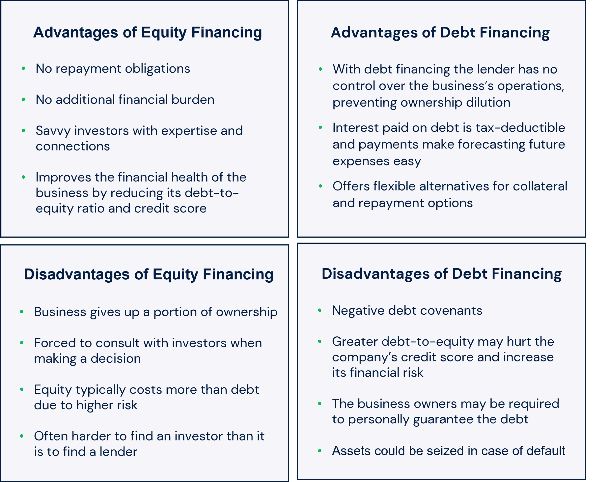

## Table of Contents

## What is equity financing?

Equity financing is when a company raises money by selling shares of its business to investors. Instead of borrowing money that needs to be paid back, the company gives up a part of its ownership in exchange for the funds. This type of financing is common for startups and growing businesses that need capital to expand but don't want to take on debt.

Investors who buy these shares become part-owners of the company and may receive dividends if the company makes a profit. They also hope that the value of their shares will increase over time, allowing them to sell their shares for a profit later. However, if the company does not do well, the value of the shares can go down, and the investors could lose money.

## How does issuing new equity affect a company's capital structure?

When a company issues new equity, it changes its capital structure by increasing the amount of equity and reducing the proportion of debt. This happens because the company is selling new shares to investors, which brings in more money without adding to the company's debt. As a result, the company's total equity goes up, and the overall mix of financing shifts towards more ownership by shareholders and less borrowing from lenders.

This shift can make the company's financial position safer because it has less debt to pay back. With more equity, the company might find it easier to borrow money in the future if needed, since lenders often see companies with less debt as less risky. However, issuing new equity also means that the existing shareholders will own a smaller piece of the company because their ownership is diluted by the new shares. This can affect the value of their shares and their voting power in company decisions.

## What is dilution and how does it impact existing shareholders?

Dilution happens when a company issues new shares. This means the total number of shares goes up, so each existing share now represents a smaller piece of the company. Imagine you own a pizza and it's cut into 8 slices. If the pizza gets cut into 10 slices, each slice is smaller even though the pizza is the same size. That's what happens to shareholders when new shares are issued.

This can affect existing shareholders in a few ways. First, their ownership percentage goes down because they now own a smaller part of the company. This can make each of their shares worth less if the company's total value stays the same. Also, if the company does well and makes more money, the profits have to be shared among more shareholders, so each shareholder might get less. But if the new money from the shares helps the company grow and become more valuable, it could make the value of all shares go up, which could be good for existing shareholders too.

## Can you explain the concept of ownership percentage in the context of new equity issuance?

When a company issues new equity, it means they are selling new shares. If you already own shares in the company, the total number of shares goes up. This means your ownership percentage goes down. Think of it like this: if you own 10 out of 100 shares, you own 10% of the company. But if the company issues 50 more shares, now there are 150 shares total, and your 10 shares are now only about 6.7% of the company.

This change in ownership percentage is important because it affects how much of the company you own. If the company makes money, the profits are divided among all the shareholders. So, with more shares out there, each shareholder gets a smaller piece of the pie. But if the new money from the shares helps the company grow and become more valuable, the value of all shares could go up, which might be good for you even if your percentage of ownership is smaller.

## How does the issuance of new shares affect the earnings per share (EPS)?

When a company issues new shares, it can change the earnings per share (EPS). EPS is the amount of money a company makes divided by the number of shares. If the company issues more shares, the total number of shares goes up. If the company's total earnings stay the same, then the EPS goes down because the same amount of money is now split among more shares.

But if the new money from the shares helps the company make more money, then the total earnings could go up. If the earnings go up enough, the EPS might not go down, or it might even go up, even though there are more shares. So, it depends on whether the new shares help the company earn more or not.

## What are the potential benefits of additional equity financing for existing shareholders?

When a company gets more money from selling new shares, it can use that money to grow bigger or start new projects. If these projects do well, the company can make more money. If the company's value goes up because of this, the price of each share might go up too. This means that even though existing shareholders own a smaller piece of the company, the value of their shares could be worth more than before.

Also, having more money can help the company pay its bills more easily and not have to borrow as much. This can make the company less risky, which can be good for shareholders. If the company is doing better and is less risky, it might attract more investors, which can also help push the share price up. So, while existing shareholders might own less of the company, the overall value of what they own could still go up if the company uses the new money well.

## What are the risks associated with equity dilution for existing shareholders?

When a company issues new shares, it can make existing shareholders own a smaller piece of the company. This is called dilution. If the total value of the company stays the same, the value of each share goes down because there are more shares to divide the company's value among. This means that even though you still own the same number of shares, each share is worth less than before. This can be bad for shareholders because their investment is now worth less.

Another risk is that with more shares, the profits of the company have to be shared among more people. So, if the company makes money, each shareholder gets a smaller piece of the profit. This can affect how much money shareholders get back from their investment. If the new money from the shares doesn't help the company grow and make more money, then the shareholders might not see any benefit from the new shares being issued, and they could end up with less value and less profit than before.

## How can a company minimize the negative impact of dilution on existing shareholders?

A company can minimize the negative impact of dilution by being careful about how and when it issues new shares. One way is to only issue new shares when it's really necessary and when the money from those shares will be used to grow the business in a big way. For example, if the new money can be used to start a new project or expand into new markets that will make the company more valuable, then the value of the existing shares might go up even though there are more shares. This can help balance out the dilution effect.

Another way is to communicate clearly with existing shareholders about why new shares are being issued and how it will benefit the company. If shareholders understand that the new shares are part of a plan to make the company more successful, they might be more supportive. The company can also try to keep the number of new shares as small as possible to reduce the dilution effect. By doing these things, a company can help make sure that existing shareholders are not too negatively affected by the issuance of new shares.

## What role does the price at which new shares are issued play in the impact on existing shareholders?

The price at which new shares are issued is really important for existing shareholders. If the new shares are sold at a high price, it means the company gets more money for each share. This can be good because the company can use that money to grow and maybe make the whole company worth more. But if the new shares are sold at a low price, it can make the value of the existing shares go down. This is because the new shares are worth less, and when you mix them with the old shares, it can pull down the value of all the shares.

When new shares are issued at a price that's lower than the current share price, it's called a discount. This can make existing shareholders unhappy because their shares are now worth less compared to the new shares. But if the new shares are sold at a price that's the same or higher than the current share price, it might not hurt the value of the existing shares as much. So, the price at which new shares are issued can make a big difference in how much the existing shareholders are affected by dilution.

## How do pre-emptive rights protect existing shareholders during new equity issuance?

Pre-emptive rights give existing shareholders the first chance to buy new shares before the company sells them to anyone else. This helps protect shareholders from dilution because they can buy enough new shares to keep their ownership percentage the same. If a shareholder owns 10% of the company and new shares are issued, they can buy enough of the new shares to still own 10% after the new shares are sold.

These rights are important because they let shareholders decide if they want to keep their ownership the same or let it go down. If they choose to buy the new shares, they might have to spend more money, but it keeps their piece of the company the same size. If they don't buy the new shares, their ownership will go down, but at least they had the chance to keep it the same. This way, shareholders have more control over how much of the company they own.

## What are some advanced strategies companies use to manage the impact of equity financing on existing shareholders?

One advanced strategy companies use to manage the impact of equity financing on existing shareholders is called a rights offering. In a rights offering, the company gives existing shareholders the right to buy new shares at a discount before they are offered to the public. This helps shareholders keep their ownership percentage the same if they want to, by buying more shares at a lower price. It also makes the new shares more attractive to existing shareholders, which can make them feel better about the new equity issuance.

Another strategy is to use stock buybacks. After issuing new shares, a company might buy back some of its own shares from the market. This reduces the total number of shares, which can help increase the value of the remaining shares. It also helps to reduce the dilution effect because there are fewer shares to divide the company's value among. By carefully timing these buybacks, the company can manage the impact on existing shareholders and possibly even increase the value of their shares.

A third strategy involves using convertible securities, like convertible bonds or preferred shares. These securities can be turned into regular shares at a later date. This gives the company flexibility because it can raise money without immediately diluting the existing shares. If the company does well, the securities might be converted into shares, but if not, the company might not have to issue new shares at all. This can help manage the impact of equity financing on existing shareholders by giving the company more options for how and when to issue new shares.

## How can existing shareholders evaluate the long-term impact of additional equity financing on their investment?

Existing shareholders can evaluate the long-term impact of additional equity financing by looking at how the new money will be used. If the company plans to use the money to grow the business, like starting new projects or expanding into new markets, it could make the company more valuable over time. This means that even though shareholders own a smaller piece of the company because of dilution, the value of their shares might go up if the company does well. Shareholders should look at the company's plans and see if they think the new money will help the company grow and make more money in the future.

Another way to evaluate the impact is to think about the company's financial health. If the new shares help the company pay its bills more easily and reduce its debt, it can make the company less risky. A less risky company might attract more investors, which can push the share price up. Shareholders should also consider the price at which the new shares are issued. If the new shares are sold at a high price, it might not hurt the value of the existing shares as much. By looking at these factors, shareholders can get a better idea of how additional equity financing might affect their investment in the long run.

## References & Further Reading

[1]: Damodaran, A. (2002). ["Investment Valuation: Tools and Techniques for Determining the Value of Any Asset."](https://archive.org/details/investmentvaluat0000damo_n6k9) John Wiley & Sons.

[2]: Graham, B. (2006). ["The Intelligent Investor: The Definitive Book on Value Investing."](https://www.amazon.com/Intelligent-Investor-Definitive-Investing-Essentials/dp/0060555661) Harper Business.

[3]: Hendershott, T., & Riordan, R. (2013). ["Algorithmic Trading and the Market for Liquidity."](https://www.cambridge.org/core/journals/journal-of-financial-and-quantitative-analysis/article/abs/algorithmic-trading-and-the-market-for-liquidity/C1A34D3767436529EA4F23DB1780273C) The Review of Financial Studies, 27(3), 712-741.

[4]: Chan, E. P. (2008). ["Quantitative Trading: How to Build Your Own Algorithmic Trading Business."](https://github.com/ftvision/quant_trading_echan_book) John Wiley & Sons.

[5]: Jansen, S. (2018). ["Machine Learning for Algorithmic Trading: Predictive models to extract signals from market and alternative data for systematic trading strategies with Python."](https://www.amazon.com/Machine-Learning-Algorithmic-Trading-alternative/dp/1839217715) Packt Publishing. 

[6]: Lopez de Prado, M. (2018). ["Advances in Financial Machine Learning."](https://www.amazon.com/Advances-Financial-Machine-Learning-Marcos/dp/1119482089) Wiley.

[7]: Lorie, J. H., & Hamilton, M. T. (1973). ["The Stock Market: Theories and Evidence."](https://archive.org/details/stockmarkettheor0000lori_n8i8) Richard D. Irwin, Inc.