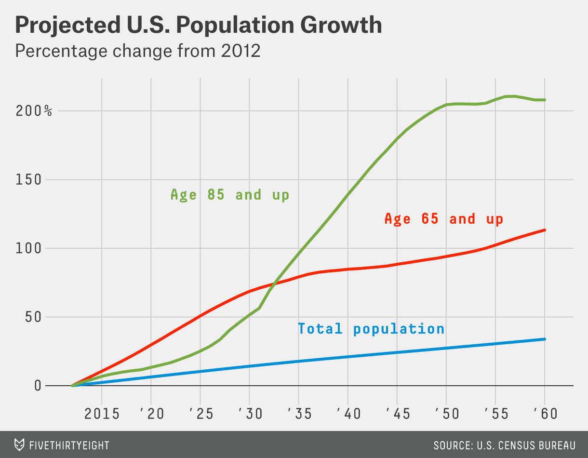

## Table of Contents

## What is the baby boomer generation?

The baby boomer generation, often called baby boomers, are people born between 1946 and 1964. This time is called the "baby boom" because a lot of babies were born then, more than usual. After World War II ended, many soldiers came back home and started families. This led to a big increase in the number of babies born each year.

Baby boomers grew up during a time of big changes in the world. They saw the start of the civil rights movement, the space race, and big changes in technology. As they got older, baby boomers had a big impact on society. They changed how people work, what they buy, and even how they think about getting older. Today, baby boomers are often grandparents and are still a big part of society.

## How many baby boomers are there and what is their age range?

There are about 76 million baby boomers in the United States. This number is big because a lot of babies were born during those years.

Baby boomers are people born between 1946 and 1964. This means the youngest baby boomers are now around 60 years old, and the oldest are around 78 years old. So, their age range is from 60 to 78 years old.

## What are the key economic trends influenced by aging populations?

As people get older, they often stop working and start to use more health care services. This means there are fewer people paying taxes and more people needing help from the government. This can cause problems for the economy because there is less money coming in and more money going out. Countries have to find ways to take care of older people while still keeping the economy strong. This can mean raising taxes, cutting other services, or finding new ways to help older people stay healthy and active.

Another big change is that older people spend money differently than younger people. They might not buy as many new things, like cars or houses, but they spend more on health care and things that help them live comfortably. This shift can slow down the economy because it depends a lot on people buying new things. Companies might need to change what they sell to match what older people want. Also, if there are not enough younger people to buy homes, the housing market can change a lot. This can affect how much homes cost and how easy it is for people to move or buy a new place to live.

## How does the retirement of baby boomers affect the labor market?

When baby boomers retire, there are fewer people working. This is a big problem because baby boomers are a large group. With fewer workers, businesses might have trouble finding people to do the jobs that need to be done. This can slow down the economy because there are not enough people to keep everything running smoothly. Some jobs might even disappear if there are not enough people to fill them.

On the other hand, when baby boomers retire, it can open up job opportunities for younger people. As older workers leave their jobs, it creates space for others to move up or start new careers. This can be good for the economy if younger workers can fill these roles quickly and well. However, if there are not enough skilled younger workers ready to take over, it can still cause problems for businesses and the economy.

## What impact do baby boomers have on healthcare spending?

Baby boomers have a big impact on healthcare spending because they are a large group of people, and as they get older, they need more medical care. When people get older, they often have more health problems like heart disease, diabetes, and cancer. These health problems need a lot of medical attention, like doctor visits, medicines, and sometimes hospital stays. Because there are so many baby boomers, the total cost of their healthcare adds up to a lot of money.

Governments and insurance companies have to spend more money to take care of all these older people. This can make healthcare costs go up for everyone. It can also mean that the government might have to spend less money on other things, like schools or roads, to pay for healthcare. So, the aging of baby boomers is making healthcare more expensive and changing how money is spent in the country.

## How does the aging of baby boomers influence housing markets?

As baby boomers get older, they often want to move to smaller homes or places that are easier to live in. This can mean moving from a big house to a smaller one, or to a place like a retirement community. When a lot of baby boomers do this at the same time, it can change the housing market. There might be more big houses for sale, which can make their prices go down. At the same time, the demand for smaller homes or places in retirement communities can go up, which can make those prices go up.

Another way baby boomers affect the housing market is by staying in their homes longer. Many baby boomers want to "age in place," which means they want to keep living in their current homes as they get older. When they do this, it can mean fewer homes are available for younger people to buy. This can make it harder for younger people to find a place to live and can push up the prices of the homes that are available. So, the choices baby boomers make about where to live can have a big impact on the housing market.

## What are the effects of baby boomers' retirement on Social Security and pension systems?

When baby boomers retire, it puts a lot of pressure on Social Security and pension systems. Social Security is a program that gives money to people when they retire. Because there are so many baby boomers, a lot of them are now taking money out of Social Security at the same time. But there are not as many younger people working and paying into the system. This means there is less money coming in to pay for all the retirees. If this keeps happening, Social Security might not have enough money to give everyone what they expect.

Pension systems, which are like retirement plans set up by companies or governments, are also affected. When baby boomers retire, they start getting money from their pensions. Just like with Social Security, there are a lot of baby boomers wanting money from their pensions at the same time. Some pensions might not have enough money saved up to pay everyone. This can make it hard for companies and governments to keep their promises to retirees. They might have to change the rules or find new ways to get money to keep the pensions going.

## How do baby boomers' saving and spending habits change as they age?

As baby boomers get older, their saving habits change a lot. When they were younger, many baby boomers saved money for things like buying a house, sending their kids to college, or saving for retirement. Now that they are older, they might not need to save as much for those things. Instead, they might focus on making sure they have enough money to live on during retirement. Some baby boomers might save less and start using the money they saved up over the years. Others might keep saving, but for different reasons, like leaving money to their kids or for unexpected costs.

Baby boomers' spending habits also change as they age. When they were younger, they spent money on things like new cars, big houses, and raising a family. As they get older, they might spend less on those things and more on healthcare, travel, and things that make life easier and more comfortable. They might also spend more time and money helping their kids or grandkids. Overall, baby boomers tend to spend less on buying new things and more on services and experiences that help them enjoy their retirement years.

## What role do baby boomers play in the growth of the senior care industry?

Baby boomers are a big reason why the senior care industry is growing. There are a lot of baby boomers, and as they get older, they need more help with things like healthcare and daily living. This means there are more people looking for places like nursing homes, assisted living facilities, and home care services. Because there are so many baby boomers, businesses that offer these services are getting busier and need to grow to keep up with the demand.

The needs of baby boomers are also changing the types of senior care that are available. Many baby boomers want to stay in their own homes as they get older, so there is a bigger need for home care services. They also want places that offer fun activities and social events, not just medical care. This has led to new kinds of senior living places that focus on helping people stay active and connected with others. So, baby boomers are not just making the senior care industry bigger, they are also changing what it looks like.

## How does the generational shift due to aging baby boomers affect consumer markets?

As baby boomers get older, they change what they buy and how they spend their money. When they were younger, baby boomers bought a lot of new things like cars and houses. Now, they are more likely to spend money on healthcare, things that make their lives easier, and experiences like travel. This shift means that companies need to change what they sell to match what older people want. If businesses don't do this, they might lose customers because baby boomers are a big group and they have a lot of money to spend.

The change in what baby boomers buy also affects other generations. Younger people might find it easier to buy big things like houses because baby boomers are selling theirs. But it can also make it harder for younger people to find jobs in some industries if companies focus too much on selling to older people. Overall, the way baby boomers spend their money as they age is changing what is popular in stores and what businesses need to do to stay successful.

## What policy measures are being considered to address the economic impacts of an aging baby boomer population?

Governments are thinking of different ways to deal with the money problems caused by baby boomers getting older. One idea is to raise the age when people can start getting money from Social Security or their pensions. This means people would have to work longer before they can retire. Another idea is to make it easier for older people to keep working if they want to. This can help because if more older people are working, they are still paying taxes and not taking as much money out of Social Security and pensions.

Another thing governments are thinking about is how to make healthcare cheaper. They might try to find new ways to help people stay healthy so they don't need as much medical care. They could also change how much people have to pay for healthcare so it doesn't cost as much. Governments might also spend more money on things that help older people live on their own longer, like home care services. This can save money because it costs less than having someone live in a nursing home.

These ideas are important because they can help make sure there is enough money to take care of everyone as baby boomers get older. If governments can find good ways to do this, it can help keep the economy strong and make sure older people have what they need.

## How might the economic trends driven by baby boomers evolve over the next two decades?

Over the next two decades, the economic trends driven by baby boomers will continue to shape many parts of the economy, especially healthcare and housing. As baby boomers get even older, they will need more medical care. This will make healthcare spending go up even more. Hospitals, doctors, and companies that make medicines will need to grow to take care of all these older people. At the same time, baby boomers might want to move into smaller homes or places like retirement communities. This could change the housing market a lot. There might be more big houses for sale, which could make their prices go down. But the places where older people want to live might become more expensive because a lot of baby boomers will want to move there.

The way baby boomers spend their money will also keep changing the economy. They might spend less on buying new things and more on experiences like travel or things that help them live comfortably. This means businesses will need to change what they sell to match what older people want. If they don't, they might lose customers. Also, as baby boomers retire, there might be fewer people working and paying taxes. This could put more pressure on Social Security and pension systems. Governments might need to find new ways to get money or change the rules about when people can retire to keep these systems working.

## What is the impact of an aging population on the economy?

The aging population exerts considerable influence on labor markets and economic growth. As the Baby Boomer generation—individuals born between 1946 and 1964—begins to retire, societies face increasing dependency ratios. Dependency ratio is defined as:

$$
\text{Dependency Ratio} = \frac{\text{Number of Dependents (aged 0-14 and over 65)}}{\text{Number of Working-Age Population (aged 15-64)}} \times 100
$$

An elevated dependency ratio indicates a larger portion of non-working individuals relying on a smaller labor force. This transition places additional stress on social security systems, with fewer workers contributing to these programs while demand for benefits continues to rise. Consequently, governments may face fiscal pressures, necessitating reforms to sustain social welfare systems.

The shrinking labor force can potentially slow down economic growth. Labor shortages might result in decreased productivity and innovation, as fewer workers are available to drive business and technological advancement. A diminished labor pool could also lead to increased wages to attract and retain workers, which might contribute to inflationary pressures.

Healthcare and pension plan expenditures are expected to surge as the proportion of elderly individuals rises. Governments are likely to allocate more funds to address the healthcare needs of an aging population, which may involve increased investment in medical facilities, personnel, and technology tailored to geriatric care. Additionally, maintaining pension systems that can support a growing number of retirees will demand strategic planning and potentially higher taxes or reallocated budgetary resources.

These economic shifts necessitate adaptive strategies. Policymakers might consider encouraging delayed retirement, promoting lifelong learning to keep older workers engaged longer, and supporting automation and technology to offset labor shortages. Furthermore, exploring avenues for immigration could also contribute to stabilizing workforce numbers and alleviating fiscal pressures. Ultimately, the socioeconomic dynamics introduced by an aging population require innovative and responsive economic policies that ensure sustainable growth and social welfare.

## References & Further Reading

[1]: Munnell, A. H., & Chen, A. (2016). ["The Economic Impact of the Baby Boomers Leaving the Workplace"](https://crr.bc.edu/wp-content/uploads/2016/11/slp_53.pdf). Brookings Institution.

[2]: Chatterjee, S., & Scheuren, F. (2003). ["Aging Issues in the United States Census 2000"](https://www.scirp.org/reference/ReferencesPapers?ReferenceID=2085667). Real Estate Economics, 31(1), 164-186.

[3]: Aldridge, I., & Krawciw, S. (2017). ["Real-Time Risk: What Investors Should Know About FinTech, High-Frequency Trading, and Flash Crashes"](https://www.amazon.com/High-Frequency-Trading-Practical-Algorithmic-Strategies/dp/0470563761) by Wiley.

[4]: Boumphrey, S., & Bohl, D. (2020). ["Understanding the Impact of Generation Gap in Economics"](https://www.researchgate.net/publication/334789883_Understanding_the_psychology_of_youths_Generation_gap). Euromonitor International.

[5]: Hasbrouck, J., & Saar, G. (2013). ["Low-latency Trading"](https://www.sciencedirect.com/science/article/abs/pii/S1386418113000165). The Review of Financial Studies, 26(9), 2615-2653.

[6]: Gomber, P., Arndt, B., Lutat, M., & Uhle, T. (2011). ["High-Frequency Trading"](https://papers.ssrn.com/sol3/papers.cfm?abstract_id=1858626) in Handbook of Financial Markets: Dynamics and Evolution. Springer.

[7]: Walker, R. (2007). ["Baby Boomers: Reinventing Retirement"](https://www.kiplinger.com/slideshow/retirement/t037-s000-8-ways-baby-boomers-are-reinventing-retirement/index.html). AARP Public Policy Institute.

[8]: Barro, R. J., & Mankiw, N. G. (1995). ["Capital Mobility in Neoclassical Models of Growth"](https://www.nber.org/papers/w4206). The American Economic Review, 85(1), 103-115.