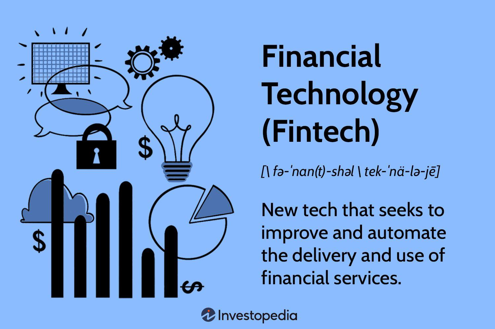

Financial technology, commonly referred to as fintech, has been a game-changer in the financial industry, ushering in a digital transformation that has significantly altered financial markets and the trading landscape. At its core, fintech encompasses a wide range of technological innovations aimed at improving and automating the delivery and use of financial services. This innovation has led to increased efficiency, reduced costs, and enhanced accessibility in various financial sectors, including banking, investment, and insurance. Algorithmic trading, a key component of fintech, exemplifies these changes by utilizing computer algorithms to automate trading decisions, thereby increasing the speed and accuracy of trades.

Fintech has facilitated the integration of advanced technologies like machine learning and high-frequency trading into the financial markets. Machine learning algorithms provide sophisticated tools for data analysis, enabling more accurate predictive modelling and pattern recognition, essential for modern trading strategies. High-frequency trading further exemplifies fintech's impact by allowing traders to execute large volumes of trades at extremely high speeds, capitalizing on small price discrepancies in the market.



The transformation brought by fintech is notable for promoting financial inclusion by extending services to previously underserved populations. It reduces operational costs through automated processes, thus enabling smaller players to participate in the market. These technological advancements have democratized the trading landscape, allowing even individual traders to leverage complex algorithms and high-speed trading strategies that were once the exclusive domain of large financial institutions.

In summary, the profound impact of fintech, particularly through algorithmic trading, has reshaped how financial markets operate. By integrating complex technologies like machine learning and high-frequency trading, fintech continues to drive innovation, enhance market efficiency, and contribute to the evolution of global financial markets.

## Table of Contents

## Understanding Fintech

Financial technology, commonly referred to as fintech, encompasses technological innovations that aim to refine and enhance financial services. Fintech is reshaping the financial landscape by integrating advanced technological solutions into traditional financial systems, consequently transforming the ways these services are delivered and consumed.

Fintech's role in the transformation of financial services is multi-faceted. At its core, fintech seeks to streamline and improve the efficiency, accessibility, and speed of financial services, which traditionally have been constrained by legacy systems and processes. This transformation is achieved through various technologies such as mobile banking, blockchain, artificial intelligence, and cloud computing. The infusion of these technologies into financial services facilitates a more customer-centric approach, offering personalized solutions that meet the dynamic needs of consumers.

In the banking sector, fintech tools have revolutionized the way transactions are processed and how financial services are accessed. Mobile banking applications allow customers to manage their finances seamlessly from their smartphones, eliminating the need to visit physical bank branches. Digital wallets and payment platforms enable instant money transfers and payments, supporting both domestic and international transactions with ease.

In the domain of investments, fintech has ushered in a new era of accessibility and strategy implementation. Robo-advisors use algorithms to provide automated, personalized investment advice, making investment services available to a broader audience and reducing the reliance on traditional financial advisors. Additionally, platforms offering micro-investing have lowered the barriers to entry for new investors by allowing fractional share purchases.

The insurance sector is also benefiting from fintech innovations. Insurtech, a subset of fintech, employs technology to improve the efficiency and accuracy of insurance services. This includes the use of big data analytics to assess risk more precisely, thereby refining premium pricing and underwriting processes. Furthermore, fintech solutions facilitate the swift processing of claims, enhancing customer satisfaction and reducing operational costs.

One of the most significant impacts of fintech is its ability to promote financial inclusion. By leveraging technology, fintech makes financial services more accessible to underbanked and unbanked populations. Mobile banking, for instance, enables individuals in remote areas to access banking services without the need for physical bank infrastructure. Similarly, peer-to-peer lending platforms provide an alternative source of credit for those underserved by traditional banking systems.

Moreover, fintech reduces operational costs for financial institutions by automating routine tasks, which in turn can lead to cost savings for consumers. The use of [artificial intelligence](/wiki/ai-artificial-intelligence) and [machine learning](/wiki/machine-learning) facilitates real-time data processing and analysis, enabling more efficient decision-making and resource allocation.

In summary, fintech plays a pivotal role in the evolution of financial services by enhancing efficiency, accessibility, and inclusivity. Through its integration across banking, investment, and insurance sectors, fintech not only transforms service delivery but also promotes profound economic and social benefits.

## Role of Algorithmic Trading in Fintech

Algorithmic trading refers to the use of computer algorithms to automate and execute trading strategies in financial markets. These algorithms are programmed to follow a set of predefined rules or models to determine the timing, price, and quantity of trades. This method dramatically reduces human intervention and enhances the speed and efficiency of trades, enabling traders to capitalize on market opportunities in milliseconds.

Financial technology, or fintech, plays a significant role in advancing [algorithmic trading](/wiki/algorithmic-trading) by providing innovative tools and platforms that enhance trading capabilities. Fintech innovations have been instrumental in the proliferation of algorithmic trading by delivering the technology required for data analysis, real-time market monitoring, and automated trade execution. The integration of artificial intelligence, machine learning, and cloud computing has propelled algorithmic trading to new heights, offering sophisticated data processing and predictive analytics that improve trading performance and decision-making accuracy.

One of the notable impacts of fintech is making algorithmic trading accessible to a broader range of market participants, including smaller traders and retail investors. Previously, algorithmic trading was dominated by large financial institutions with substantial resources and technology infrastructure. However, the rise of fintech has democratized access, empowering smaller traders with affordable and user-friendly trading platforms, APIs, and software solutions. These platforms often come equipped with [backtesting](/wiki/backtesting) capabilities and historical data analysis, allowing users to develop, test, and optimize their trading algorithms without the need for substantial financial investment.

Fintech companies offer accessible coding environments and algorithm libraries that simplify the development of trading strategies. For instance, using Python, traders can take advantage of libraries such as NumPy and pandas for data manipulation and analysis, and libraries like PyAlgoTrade for backtesting and implementing trading strategies. A basic example of a trading algorithm in Python could be:

```python
import pandas as pd

# Load historical market data
data = pd.read_csv('market_data.csv')

# Define a simple moving average strategy
short_window = 40
long_window = 100

# Calculate moving averages
data['short_mavg'] = data['Close'].rolling(window=short_window, min_periods=1, center=False).mean()
data['long_mavg'] = data['Close'].rolling(window=long_window, min_periods=1, center=False).mean()

# Generate signals
data['signal'] = 0.0
data['signal'][short_window:] = np.where(data['short_mavg'][short_window:] > data['long_mavg'][short_window:], 1.0, 0.0)
data['positions'] = data['signal'].diff()

# Display positions
print(data['positions'])
```

This Python code snippet demonstrates a straightforward moving average crossover strategy, where buy signals are generated when the short-term moving average crosses above the long-term moving average.

By lowering the barriers to entry, fintech has expanded the reach of algorithmic trading to include a diverse set of market participants, fostering competition and innovation across the financial industry. As algorithms continue to evolve with advancements in technology, fintech will remain an essential driver of innovation and accessibility in algorithmic trading.

## Machine Learning in Algorithmic Trading

Machine learning has become an integral component in the realm of algorithmic trading, enhancing trading strategies through advanced data analysis techniques. Machine learning algorithms have proven capable of handling vast datasets, enabling traders to extract actionable insights for decision-making. By employing machine learning, traders can design algorithms that predict future market movements, identify patterns, and optimize trading strategies.

Predictive modeling and pattern recognition form the core capabilities of machine learning in market analysis. The algorithms utilize historical data to learn relationships between various financial metrics and predict future values. Commonly used models include linear regression, decision trees, and neural networks. For instance, neural networks, through layers of interconnected nodes, can approximate complex functions, allowing traders to model non-linear market behaviors effectively. Such models are advantageous in scenarios involving multifactorial decision-making processes where traditional statistical methods may fall short.

Consider a typical use case where a Python machine learning model predicts stock prices:

```python
import numpy as np
from sklearn.model_selection import train_test_split
from sklearn.linear_model import LinearRegression
from sklearn.metrics import mean_squared_error

# Sample data (features: previous day's price and trading volume; target: today's price)
X = np.array([[220, 2.5], [225, 2.7], [230, 2.8], [229, 2.6]])
y = np.array([225, 230, 229, 228])

# Splitting the dataset into training and testing sets
X_train, X_test, y_train, y_test = train_test_split(X, y, test_size=0.2, random_state=0)

# Fitting a linear regression model
model = LinearRegression()
model.fit(X_train, y_train)

# Predicting and evaluating the model
predictions = model.predict(X_test)
error = mean_squared_error(y_test, predictions)
print(f'Mean Squared Error: {error}')
```

Machine learning enhances trading efficiency and accuracy by minimizing human biases, enabling continuous market monitoring, and adapting to new data promptly. In high-frequency trading environments, where decisions must be made in milliseconds, machine learning algorithms process information faster and more consistently than human traders.

Moreover, machine learning aids in developing robust risk management protocols within trading systems. By examining historical market downturns, algorithms can identify precursors to crashes or anomalies, enabling traders to mitigate potential losses. Reinforcement learning, a subset of machine learning, empowers trading algorithms to learn optimal trading policies through simulations, improving predictive accuracy over time.

Overall, the integration of machine learning into algorithmic trading revolutionizes traditional trading paradigms, driving higher profitability and more resilient trading systems. This technological advancement enables a more precise interpretation of complex and dynamic market conditions, ultimately contributing to informed and strategic trading decisions.

## High-Frequency Trading: A Fintech Innovation

High-frequency trading ([HFT](/wiki/high-frequency-trading-strategies)) is a specialized form of algorithmic trading characterized by rapid execution of large volumes of transactions. It leverages sophisticated algorithms and advanced technology infrastructure to capitalize on minuscule price discrepancies across markets. HFT has become an integral component of global financial markets, as it significantly optimizes trading processes and enhances market participant efficiency.

The enabling technologies for HFT are crucial to its operation. One essential element is the use of co-located servers, where trading firms place their servers as close as possible to a market's data center. This proximity reduces latency, or the time it takes to transmit data to and from the exchange, giving traders a critical speed advantage. Additionally, specialized hardware such as Field-Programmable Gate Arrays (FPGAs) and Application-Specific Integrated Circuits (ASICs) are employed to execute complex computations at unprecedented speeds, further minimizing the delay in transaction execution.

High-frequency trading contributes to market [liquidity](/wiki/liquidity-risk-premium) by increasing the [volume](/wiki/volume-trading-strategy) of trades and narrowing bid-ask spreads. This activity helps markets function more smoothly by ensuring that buy and sell orders can be matched readily, thus enhancing market efficiency. However, HFT is not without its criticisms and associated risks. Its rapid nature makes markets susceptible to heightened [volatility](/wiki/volatility-trading-strategies) during periods of instability. These systems, operating automatically at high speeds, [carry](/wiki/carry-trading) systemic risks, as technical glitches or erroneous algorithms can trigger drastic market movements, evidenced by events such as the 2010 Flash Crash.

Furthermore, critics of HFT argue that it contributes to an uneven playing field, where firms with superior technological resources gain disproportionate advantages. The potential for market manipulation through practices like quote stuffing—flooding the market with fake orders to create congestion and confuse competitors—raises ethical concerns and underscores the importance of robust regulatory oversight.

In summary, high-frequency trading represents a fintech innovation that reshapes trading dynamics by leveraging cutting-edge technology. While it enhances liquidity and operational efficiency, it also poses challenges and risks that necessitate careful consideration and regulatory intervention.

## Challenges and Risks in Algorithmic Trading

Algorithmic trading, while offering numerous efficiencies and advancements in financial markets, presents several challenges and risks that must be carefully managed. Among the foremost concerns is market volatility. Algorithmic systems, reacting to market data and events in fractions of a second, can inadvertently exacerbate volatile conditions. Rapid, automated trades might create price swings that, although momentary, can lead to significant financial consequences for traders and the markets at large. A well-known example is the "Flash Crash" of May 6, 2010, where the Dow Jones Industrial Average plunged nearly 1,000 points within minutes before a swift recovery. This incident underscored how algorithms can contribute to hyper-volatility when acting in concert without human intervention.

System failures represent another significant risk in algorithmic trading. These failures can arise from software bugs, unexpected market conditions, or infrastructure breakdowns. Unlike human traders, algorithms lack the capacity for discretionary judgment or error correction. A misconfigured algorithm or a connectivity issue could lead to unintended trades or financial losses. For example, a minor coding error could result in a feedback loop, where buy or sell orders are executed out of control.

Market manipulation and ethical concerns also loom large over algorithmic trading. The capacity for high-speed, large-volume trades can be exploited for manipulative strategies like spoofing—placing bids or offers with the intent to cancel before execution to influence market prices—or layering, which involves entering multiple layered orders to create a false impression of supply or demand. Such tactics disrupt market integrity and pose ethical dilemmas. Regulators have imposed fines and sanctions on firms found to employ these unethical algorithms.

Regulatory challenges in algorithmic trading are manifold. With the rapid pace of technological advances, regulatory bodies face difficulties in crafting regulations that effectively monitor and control algorithmic practices without stifling innovation. Agencies like the U.S. Securities and Exchange Commission (SEC) and the European Securities and Markets Authority (ESMA) have implemented measures to mitigate these risks, such as stringent reporting requirements and the imposition of circuit breakers to halt trading during extreme volatility.

Algorithmic trading firms are subject to comprehensive compliance obligations, which necessitate robust internal controls and rigorous testing of trading algorithms. These firms must implement adequate risk management frameworks to ensure the proper functioning of their systems and compliance with regulatory standards. Furthermore, algorithms need to be regularly audited and tested under various market conditions to ensure they operate as intended without contributing to market disruptions.

To summarize, algorithmic trading is accompanied by a unique set of challenges and risks including heightened volatility, potential system failures, and manipulation tactics. Effective regulatory oversight and the ethical deployment of trading algorithms are critical to maintaining market stability and integrity. Ongoing dialogue between regulators, market participants, and technologists is essential in addressing these challenges while fostering innovation in financial markets.

## The Regulatory Landscape of Algorithmic Trading

Algorithmic trading has become a central component of modern financial markets, necessitating a comprehensive regulatory framework to ensure market fairness and stability. Various regulatory measures aim to oversee and curtail the risks associated with the automated trading environment.

One of the principal bodies involved in the regulation of algorithmic trading in the United States is the Securities and Exchange Commission (SEC). The SEC's mandate includes the protection of investors, maintaining fair, orderly, and efficient markets, and facilitating capital formation. To address the risks of algorithmic trading, the SEC requires firms to maintain robust systems and controls that manage the risks of algorithmic trading. Regulation Systems Compliance and Integrity (Reg SCI) is a notable regulation that requires essential market participants to implement policies and procedures to ensure operational and system integrity [1].

Similarly, in the European Union, the Markets in Financial Instruments Directive II (MiFID II) lays out extensive requirements for algorithmic trading. It mandates firms to have effective systems and risk controls in place, ensuring trading systems' resilience to stress and avoiding contributing to disorderly markets [2]. These controls are especially significant given the high-speed nature and potential market impact of algorithmic trading technologies.

Ongoing regulatory challenges include keeping up with the rapid pace of technological advancements and the ever-evolving strategies employed in algorithmic trading. Algorithmic systems' opaqueness — often referred to as the "black box" nature — complicates regulatory oversight. Ensuring transparency and preventing market manipulation through these algorithms are primary concerns. Regulatory bodies are expected to enhance supervisory technologies, also known as RegTech, to analyze vast amounts of data generated by algorithmic trading systems effectively.

Compliance is a continuous necessity for algorithmic trading firms, requiring adherence to both existing regulations and readiness for forthcoming changes. Firms need to ensure that their algorithms abide by market and data protection laws to prevent manipulative practices, such as spoofing or layering. They also have to be prepared for stringent testing and validation processes enforced by regulators to ensure that their algorithms cannot be used to manipulate markets.

In conclusion, algorithmic trading's complex regulatory landscape demands thorough oversight and ongoing adaptation from both market regulators and participants. Regulatory bodies like the SEC and the European Union have set foundational measures to govern algorithmic trading, but evolving technological capabilities will necessitate continuous updates and enhancements in regulatory standards to maintain market integrity and investor protection.

**References**:
1. U.S. Securities and Exchange Commission (SEC). Regulation Systems Compliance and Integrity (Reg SCI). 
2. European Securities and Markets Authority (ESMA). Markets in Financial Instruments Directive II (MiFID II).

## Future Trends in Fintech and Algorithmic Trading

As fintech continues to evolve, emerging technologies such as [reinforcement learning](/wiki/reinforcement-learning), natural language processing (NLP), and quantum computing are poised to create new paradigms in algorithmic trading. Each of these technologies offers specific capabilities that could significantly alter trading strategies and market dynamics.

Reinforcement learning, a subset of machine learning, is increasingly being utilized to develop adaptive trading algorithms. Unlike traditional algorithms that are predefined, reinforcement learning-based algorithms can evolve by learning from their own actions and outcomes in the market. For instance, an algorithm can be designed to optimize a trading strategy by maximizing its cumulative rewards over time, akin to a game-theoretic approach. This dynamic learning capability allows for more resilient strategies in volatile markets. The exploitation of these techniques suggests that traders could more efficiently navigate complex market conditions, potentially enhancing returns and reducing risks.

Natural Language Processing (NLP) is transforming how market data and news are analyzed. By processing and interpreting large volumes of textual information, NLP systems can discern market sentiment and detect nuances such as regulatory changes, providing traders with strategic insights that are not apparent from quantitative data alone. For example, sentiment analysis from social media can inform volatility predictions, while machine-readable news can trigger algorithmic trades based on new information.

Quantum computing, though still in its nascent stages, promises exponential computational power that could solve complex optimization problems far more efficiently than classical computers. Quantum algorithms have the potential to review multiple market scenarios concurrently, offering unprecedented speed and depth in market analysis. Though practical applications in trading are yet to be fully realized, the theoretical potential of quantum computing to handle large-scale data processes could revolutionize predictive modeling and risk assessment.

The integration of these technologies could lead to more sophisticated and nuanced trading strategies. For example, a future algorithmic trading system might simultaneously utilize reinforcement learning to adapt strategy, NLP to interpret real-time news sentiment, and quantum computing to compute optimal trades, leading to enhanced decision-making processes across the board.

Looking forward, algorithmic trading's role in the global financial markets is expected to expand. As these technologies mature, they could usher in a more interconnected and efficient trading ecosystem, where the traditional barriers between human insight and machine efficiency continue to dissolve. However, the adoption of these technologies will require careful consideration of potential ethical and regulatory implications to ensure fair and stable market practices continue to be upheld. 

Ongoing research and development will likely see the financial industry striving to harness emerging technologies to achieve competitive advantage, while regulatory frameworks evolve to address the challenges and risks associated with these innovations. As a result, the fusion of fintech and novel computational techniques is poised to redefine the boundaries of algorithmic trading, amplifying its impact on financial markets globally.

## Case Studies: Success Stories in Algorithmic Trading

Algorithmic trading has become a critical component of modern financial markets, with numerous firms leveraging advanced technologies to achieve significant success. One notable example is Renaissance Technologies, a highly regarded quantitative [hedge fund](/wiki/hedge-fund-trading-strategies), known for its Medallion Fund. Renaissance Technologies employs sophisticated mathematical models and algorithms to identify and exploit trading opportunities. The Medallion Fund has delivered over 30% annualized returns after fees, largely due to its robust statistical [arbitrage](/wiki/arbitrage) models and the effective use of machine learning techniques.

Another successful firm in the algorithmic trading space is Two Sigma, which applies data science and technology to its trading strategies. Two Sigma relies heavily on machine learning models to analyze vast amounts of market data, allowing it to predict price movements and optimize its trading strategies. The firm also leverages cloud computing and distributed systems to ensure quick data processing and real-time trading decisions, contributing to its high profitability.

Citadel LLC, a prominent global financial institution, also exemplifies success in algorithmic trading. Citadel uses high-frequency trading strategies, enabled by cutting-edge technologies such as co-located servers and customized hardware, to execute a large volume of trades at lightning-fast speeds. This approach allows Citadel to capture tiny price discrepancies across different marketplaces, significantly boosting its earnings.

The success of these firms can be attributed to several key strategies and technologies:

1. **Data Analysis and Predictive Modeling**: Advanced machine learning algorithms are employed to analyze historical and real-time data, identifying patterns that inform trading decisions. Predictive modeling aids in forecasting future market movements, providing a competitive edge.

2. **Automated Execution Systems**: High-frequency trading and automated execution systems ensure trades are conducted at optimal times and prices. These systems reduce latency, allowing firms to capitalize on fleeting market inefficiencies.

3. **Robust Risk Management**: Effective risk management practices, including diversification and sophisticated hedging strategies, protect against potential losses and enhance returns.

4. **Scalable Infrastructure**: Leveraging cloud computing and scalable infrastructure enables firms to process large datasets and execute complex algorithms efficiently, ensuring timely decision-making and execution.

These firms illustrate how the integration of technology in trading strategies can lead to substantial financial gains, underscoring the importance of continuous innovation and adaptation in the competitive world of algorithmic trading.

## Conclusion

Financial technology and algorithmic trading have profoundly reshaped global financial markets, ushering in an era of increased efficiency, precision, and accessibility. Fintech innovations continue to democratize financial services, reducing barriers to entry for both individual investors and small firms. With algorithmic trading, markets have experienced increased liquidity and transaction volumes, often executed with unprecedented speed and accuracy.

The transformation brought about by these technologies is substantial, enabling the automation of complex trading strategies and enhancing predictive market analysis through machine learning and data analytics. Algorithmic trading has allowed market participants to process vast amounts of data in real-time, leading to more informed decision-making and the potential for higher returns.

Despite these advancements, the importance of maintaining a balance between innovation and regulatory oversight cannot be overstated. Regulatory frameworks are essential to mitigate risks such as market volatility, system failures, and potential manipulation, safeguarding the integrity of financial markets. Bodies like the Securities and Exchange Commission (SEC) and European regulatory authorities continuously adapt their policies to address the rapid evolution of these technologies.

As we look to the future, the continued adaptation and integration of emerging technologies such as reinforcement learning, natural language processing, and quantum computing promise to further evolve the trading landscape. For stakeholders within the financial industry, staying abreast of these advancements and ensuring compliance with emerging regulations will be critical to leveraging the full potential of fintech and algorithmic trading.

In conclusion, the transformative impact of these technologies on financial markets is undeniable. By embracing innovation while adhering to stringent regulatory frameworks, the financial industry can continue to harness the many benefits fintech and algorithmic trading offer, paving the way for a more inclusive and efficient financial system.

## References & Further Reading

[1]: Bergstra, J., Bardenet, R., Bengio, Y., & Kégl, B. (2011). ["Algorithms for Hyper-Parameter Optimization."](https://papers.nips.cc/paper/4443-algorithms-for-hyper-parameter-optimization) Advances in Neural Information Processing Systems 24.

[2]: ["Advances in Financial Machine Learning"](https://www.amazon.com/Advances-Financial-Machine-Learning-Marcos/dp/1119482089) by Marcos Lopez de Prado

[3]: ["Evidence-Based Technical Analysis: Applying the Scientific Method and Statistical Inference to Trading Signals"](https://www.amazon.com/Evidence-Based-Technical-Analysis-Scientific-Statistical/dp/0470008741) by David Aronson

[4]: ["Machine Learning for Algorithmic Trading"](https://github.com/stefan-jansen/machine-learning-for-trading) by Stefan Jansen

[5]: ["Quantitative Trading: How to Build Your Own Algorithmic Trading Business"](https://www.amazon.com/Quantitative-Trading-Build-Algorithmic-Business/dp/1119800064) by Ernest P. Chan