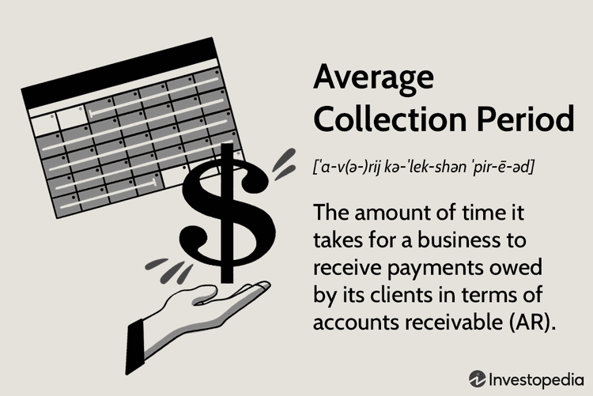

In today's competitive financial landscape, maintaining a strategic edge necessitates a thorough understanding and effective management of financial elements such as cash flows, the average collection period, and algorithmic trading. These components are crucial for guiding businesses toward operational efficiency and sustainability. Effective cash flow management ensures that companies have the necessary liquidity to meet operational expenditures and invest in growth opportunities, which is vital for maintaining business stability. Understanding the average collection period assists in evaluating a company's efficiency in managing its receivables, directly impacting cash flow and liquidity. A shorter collection period typically indicates more timely recovery of outstanding debts, enhancing liquidity and operational flexibility.

Meanwhile, algorithmic trading offers financial markets enhanced speed and precision in executing trading decisions, optimizing order execution by leveraging data-driven algorithms. This technological advancement not only reduces transaction costs but also improves market liquidity and ensures consistent and objective decision-making processes.



This article presents an exploration of the interconnectedness of these financial strategies, illustrating how they form a comprehensive financial management approach. By examining methods of cash flow management, evaluating credit practices, and integrating algorithmic trading technologies, organizations can better optimize their operations and ensure sustainable growth. By mastering these strategies, businesses can improve their financial health and maintain a competitive advantage in the ever-evolving economic environment.

## Table of Contents

## Understanding Financial Management in Cash Flow

Cash flow management is one of the integral components of a company's financial strategy, acting as the lifeline that sustains its day-to-day operations and long-term investments. Effective management of cash flows allows businesses to meet their immediate financial obligations, such as payroll and supplier payments, while also positioning themselves to capitalize on growth opportunities, such as reinvestment or expansion.

Accrual accounting is pivotal in cash flow management. This accounting method records revenues and expenses when they are earned or incurred, rather than when the cash is actually exchanged. While accrual accounting provides a more accurate picture of a company’s financial position and performance over time, it also introduces certain complexities. One significant challenge is the discrepancy that can arise between reported profits and actual cash available. For example, a company may report high earnings but struggle with cash shortages if its receivables are delayed or if it has liabilities due before cash inflows are received.

This time lag between earning revenue and collecting cash can impact a company's liquidity—a measure of its ability to meet short-term obligations. Managing this effectively requires careful monitoring of the cash conversion cycle, which encompasses the processes of inventory management, accounts receivable, and accounts payable. Businesses often use tools like cash flow forecasts and budget variance reports to anticipate cash shortages or surpluses and make informed decisions.

For firms utilizing accrual accounting, understanding and managing these timing differences is crucial. One approach is to regularly review accounts receivable and payable, ensuring that sales terms and credit policies align with cash flow needs. Furthermore, businesses may adopt practices such as offering early payment discounts to encourage quicker receipt of cash from customers, or negotiating extended payment terms with suppliers to retain cash longer.

In summary, cash flow management facilitated by accrual accounting is essential for the financial sustainability of a business. It requires a strategic approach to balance the timing of cash inflows and outflows, thus ensuring that a business can fulfill its operational duties and uphold its financial responsibilities. By optimizing cash flow, businesses are better equipped to support ongoing operations and leverage opportunities for growth.

## The Role of Average Collection Period

The average collection period is a vital financial metric that determines the efficiency with which a company collects its accounts receivable. It reflects the average number of days that a company takes to collect payment after a credit sale has been made. By providing insights into a company’s [liquidity](/wiki/liquidity-risk-premium) status and its effectiveness in managing its receivables, this metric serves as an essential tool in financial analysis and strategic planning.

Companies strive to maintain a shorter average collection period as it signifies efficient credit management and quicker conversion of sales into cash. A shorter period indicates that a company is able to quickly collect cash from customers, which can then be reinvested into the operations or used to pay off liabilities. Conversely, a longer average collection period suggests that a company is inefficient in collection efforts, which can lead to cash flow problems and increased financial risk.

The average collection period is closely linked to a company’s credit policies and procedures. It reflects not only the terms extended to customers but also the effectiveness of the company's credit and collection processes. For example, a company with lenient credit terms may experience a longer collection period, impacting its cash flow negatively. On the other hand, stricter credit terms can reduce the collection period but may also limit sales [volume](/wiki/volume-trading-strategy) due to reduced customer flexibility.

Evaluating the average collection period thus helps organizations assess their credit policies and their impact on cash flow. By monitoring this metric, companies can make informed decisions regarding changes to credit terms, the need for more rigorous credit assessments, or the potential adoption of automated collection systems to enhance efficiency.

Ultimately, a shorter average collection period is favorable for maintaining liquidity and ensuring a steady stream of cash, which is crucial for sustaining operations and financing growth initiatives.

## Calculating the Average Collection Period

The average collection period is an essential financial metric that businesses use to evaluate how efficiently they manage their accounts receivable. It represents the average number of days it takes for a company to collect payments from its credit sales. The shorter this period, the faster a company receives cash, improving its liquidity and cash flow.

To calculate the average collection period, the following formula is used:

$$
\text{Average Collection Period} = \left( \frac{\text{Average Accounts Receivable}}{\text{Net Credit Sales}} \right) \times \text{Number of Days}
$$

Where:
- **Average Accounts Receivable** is the average of the beginning and ending accounts receivable for a specific period. It can be calculated as:
$$
  \text{Average Accounts Receivable} = \frac{\text{Beginning Accounts Receivable} + \text{Ending Accounts Receivable}}{2}

$$

- **Net Credit Sales** are the revenue generated from sales where payment is agreed to be received at a future date, excluding any cash sales.
- **Number of Days** typically represents the number of days in the period being analyzed (e.g., 365 days for a year or 90 days for a quarter).

By calculating the average collection period, businesses can gain insights into their cash conversion cycle, which is pivotal for maintaining liquidity. A shorter average collection period indicates that a company is collecting its receivables quickly, thereby reducing the time cash is tied up in unpaid debts. This improved cash flow allows businesses to meet their operational expenses more effectively and to reinvest in growth opportunities promptly. On the other hand, a prolonged average collection period might signal inefficiencies in the billing process or issues with credit policies, potentially putting the company's financial stability at risk. 

By analyzing this metric, businesses can identify trends, make informed decisions about credit terms, and implement strategies to decrease the collection period, thus bolstering their financial health.

## Improving Cash Flow through Collection Practices

Improving cash flow is crucial for maintaining the financial stability of a business. One effective method to achieve this is by reducing the average collection period, which directly impacts the liquidity and availability of funds. Several strategies can be implemented to optimize this process:

1. **Thorough Credit Assessments**: Conducting comprehensive assessments of a customer's creditworthiness before extending credit can help mitigate the risk of delayed payments. By evaluating the customer's credit history, financial status, and payment behavior, businesses can set appropriate credit limits and terms. This proactive approach reduces the likelihood of non-payment and improves the speed of collections.

2. **Clear Invoicing**: The clarity and accuracy of invoices play a pivotal role in ensuring timely payments. Detailed invoices that include itemized charges, due dates, and payment instructions minimize confusion and disputes, leading to faster payment processing. Automating invoice generation and delivery can further streamline this process, reducing administrative workloads and enhancing efficiency.

3. **Incentive Programs for Early Payments**: Offering discounts or other incentives for early payments motivates customers to pay ahead of the due date. Incentives must be structured carefully to benefit both the business and the customer. For example, offering a 2% discount for payments made within ten days on a 30-day invoice can significantly accelerate cash inflow without substantially impacting profit margins.

4. **Automated Payment Reminders**: Implementing automatic reminders can effectively prompt customers to make timely payments. Software solutions can be configured to send reminders at predetermined intervals, such as shortly before and after the due date. These reminders help avoid late payments by keeping the invoices fresh in the customer's mind.

The implementation of these strategies not only reduces the average collection period but also enhances cash flow, providing businesses with the necessary liquidity to fund operations, reinvest in growth opportunities, and reduce reliance on external financing. Reduced financial risk is an additional benefit, as predictable cash flows reduce the [volatility](/wiki/volatility-trading-strategies) associated with delayed payments. By utilizing these practices consistently, businesses can achieve more stable and efficient financial management.

## Algorithmic Trading: A Financial Innovation

Algorithmic trading is a transformative advancement in the financial markets, allowing for the execution of trading decisions through the use of pre-set mathematical models. This technology leverages the power of computers to perform trades with a level of speed and precision unattainable by human traders. It involves the implementation of complex algorithms that analyze market data, identify trading opportunities, execute orders, and manage risk automatically.

The primary advantage of [algorithmic trading](/wiki/algorithmic-trading) is its ability to process vast amounts of data quickly, enabling traders to execute transactions in fractions of a second. This capability is crucial in today’s fast-paced markets, where delays of even a millisecond can impact profitability. Algorithms can be designed to follow specific trading strategies, such as statistical [arbitrage](/wiki/arbitrage) or [trend following](/wiki/trend-following), enabling them to make decisions based on real-time market conditions.

Furthermore, algorithmic trading enhances market liquidity by increasing the number of participants who can trade simultaneously, thus fostering a more efficient market environment. This increase in liquidity generally leads to tighter bid-ask spreads and reduced transaction costs, allowing all market participants to benefit from more favorable trading conditions. The ability to execute trades at optimal prices is a key [factor](/wiki/factor-investing) in maximizing trading efficiency and profitability.

Another significant benefit of algorithmic trading is its contribution to consistent decision-making. Human traders are prone to emotional biases and fatigue, which can lead to inconsistent trading outcomes. Algorithms, in contrast, operate based on predefined parameters and are devoid of emotional influences, ensuring a systematic and disciplined approach to trading. This consistency is crucial for maintaining long-term performance and adhering to risk management guidelines.

Incorporating algorithmic trading into financial strategies allows firms to employ sophisticated models that can adapt to varying market conditions. For instance, algorithms can be adjusted to consider factors such as volatility, liquidity, and price movements, providing a dynamic approach to managing trades. Consequently, traders and financial institutions can achieve a competitive edge by optimizing their trading tactics through the continuous refinement of their algorithmic models.

In conclusion, algorithmic trading represents a significant innovation in financial markets, providing unparalleled processing speed, enhanced liquidity, reduced costs, and disciplined trading execution. As technology continues to evolve, the role of algorithmic trading is expected to expand, offering ongoing improvements in market efficiency and trading strategies.

## Integration of Financial Metrics and Trading Tools

The integration of traditional financial metrics with advanced trading technologies has become increasingly significant in optimizing business financial strategies. By leveraging both the average collection period and algorithmic trading, companies are able to achieve superior cash flow management and make informed strategic investment decisions.

The average collection period is pivotal in understanding the efficiency with which a company collects its receivables. It informs the liquidity health and cash conversion cycle, which are crucial for sustaining daily operations and funding growth initiatives. When combined with algorithmic trading, which automates and enhances trading decisions through mathematical models, businesses can significantly improve their financial outcomes.

Algorithmic trading platforms can process large datasets quickly, providing insights into market trends and enabling timely decision-making. Integrating these insights with receivables data allows businesses to align their cash flow strategies with market conditions. This synergy ensures that companies can maintain liquidity while capitalizing on market opportunities.

For instance, with predictive analytics embedded in algorithmic platforms, a business can foresee market downturns and adjust its credit policies accordingly. Shortening the average collection period during potential downturns ensures that more cash is available to invest or manage during volatile times. This proactive approach minimizes financial risks and leverages market movements to the company's advantage.

Furthermore, algorithms can optimize investment strategies by utilizing financial metrics such as return on investment (ROI) and internal rate of return (IRR), alongside transaction cost analysis. By doing so, businesses can refine their strategic investment decisions, ensuring alignment with both liquidity positions and market opportunities.

Here's a simple Python snippet demonstrating how businesses might simulate cash flow conditions based on receivables and trading data:

```python
import numpy as np

def simulate_cash_flow(average_receivables, credit_sales, days, market_trend_factor):
    collection_period = (average_receivables / credit_sales) * days
    cash_flow_adjustment = market_trend_factor * np.random.normal(loc=0.0, scale=1.0, size=days)
    return average_receivables - (collection_period * credit_sales / days) + cash_flow_adjustment.sum()

# Example usage
average_receivables = 150000  # Example value in monetary units
credit_sales = 600000  # Example value in monetary units
days = 365
market_trend_factor = 0.02  # Simulating a 2% market trend influence

estimated_cash_flow = simulate_cash_flow(average_receivables, credit_sales, days, market_trend_factor)
print(f"Estimated adjusted cash flow: {estimated_cash_flow}")
```

This example evaluates the effect of market trends on cash flow, highlighting the benefits of integrating financial metrics and algorithmic insights. By effectively merging traditional methods with new-age technology, organizations can create robust financial strategies that respond dynamically to evolving business environments.

## Industry Applications and Examples

Different sectors utilize specific financial metrics and trading techniques to enhance their operations and maintain a competitive edge. In banking, precise management of cash flows is crucial due to the high volume of transactions and regulatory requirements. Banks often employ the net interest margin (NIM) metric, which calculates the difference between interest income generated and interest paid, relative to their interest-[earning](/wiki/earning-announcement) assets. This metric helps banks assess profitability and optimize their lending practices.

Algorithmic trading plays a significant role in banking. Banks use algorithms to execute trades efficiently, reducing manual intervention and increasing the speed and accuracy of transactions. This speed is essential in foreign exchange and securities markets, where market conditions can shift rapidly. The introduction of [machine learning](/wiki/machine-learning) into algorithmic trading further enhances predictive models, allowing banks to anticipate market movements and optimize their trading strategies.

In real estate, cash flow management is integral for ensuring that properties remain profitable. Real estate companies carefully analyze occupancy rates, rental income, and maintenance costs to optimize their cash flows. The internal rate of return (IRR) is one common financial metric, used to evaluate the profitability of potential real estate investments. A positive IRR indicates that a project's return exceeds the cost of capital, making it an attractive investment.

Algorithmic trading in real estate often involves automating the buying and selling decisions of real estate investment trusts (REITs). These algorithms can analyze vast amounts of market data to make informed decisions, such as when to increase or decrease exposure to certain types of properties. The use of blockchain technology is also gaining traction, providing transparency and efficiency in transactions, which is vital for real estate deals that typically involve significant capital.

In the energy sector, effective cash flow management is critical due to fluctuating commodity prices and regulatory considerations. Companies use financial metrics like cash flow from operations (CFO) to measure the cash generated by core business activities. This helps energy firms maintain liquidity and make informed investment decisions.

Algorithmic trading is also applied in energy markets, where algorithms optimize the trading of energy commodities. These algorithms analyze historical data, weather patterns, and geopolitical events to predict price movements, enabling companies to hedge against price volatility and optimize trading strategies.

Overall, by leveraging industry-specific financial metrics and integrating advanced trading technologies, businesses can optimize their operations, achieve financial stability, and ensure long-term success. These strategies are critical for adapting to industry-specific challenges and capitalizing on opportunities within their respective markets.

## Conclusion

Effective financial management requires a comprehensive approach that incorporates the management of cash flow, the assessment and optimization of the average collection period, and the integration of advanced trading practices such as algorithmic trading. These elements are interconnected and vital for maintaining financial health, ensuring business stability, and sustaining a competitive advantage in a rapidly evolving business environment.

Cash flow management is pivotal for any business as it ensures that sufficient funds are available to meet immediate operational requirements and long-term investment goals. By accurately monitoring cash inflows and outflows, companies can avoid liquidity crises and maximize their investment potential. The average collection period, a critical financial metric, serves as an indicator of a company's efficiency in managing its receivables. A shorter collection period is generally preferred as it suggests that the company is quickly converting its accounts receivable into cash, thereby improving liquidity and reducing credit risk.

Incorporating algorithmic trading into financial management strategies represents a significant innovation, allowing businesses to automate trading decisions through pre-set algorithms. This not only enhances market liquidity but also reduces transaction costs and facilitates consistent decision-making. Such technological advancements empower businesses to respond swiftly to market changes, optimizing their financial operations and strategies.

By harmonizing these strategies, businesses can not only boost their financial stability but also achieve a sustainable edge over competitors. The effectiveness of financial management is thus dependent on a holistic strategy that leverages both traditional financial metrics and modern technology-driven solutions.

## References & Further Reading

1. **"Financial Management for Decision Makers" by Peter Atrill**  
   This book provides comprehensive insights into financial strategies, including cash flow management and investment appraisal, tailored for effective decision-making in businesses.

2. **"Principles of Corporate Finance" by Richard A. Brealey, Stewart C. Myers, and Franklin Allen**  
   A classic resource outlining key financial concepts and practices, from corporate capital structure to the intricacies of financial performance, essential for understanding credit management and cash flow efficiencies.

3. **"Algorithmic Trading: Winning Strategies and Their Rationale" by Ernest P. Chan**  
   This work investigates into the design, testing, and implementation of automated trading systems, offering practical strategies that align with modern financial technologies.

4. **"The Mathematics of Financial Modeling and Investment Management" by Sergio M. Focardi and Frank J. Fabozzi**  
   An essential resource for understanding the quantitative frameworks behind financial modeling, risk management, and the integration of trading and investment strategies.

5. **"Python for Finance: Analyze Big Financial Data" by Yves Hilpisch**  
   This book serves as a guide to using Python for developing financial analytics applications, with practical examples related to algorithmic trading and data-driven financial strategies.

6. **"International Financial Management" by Jeff Madura**  
   Offering a global perspective, this text explores financial management practices across diverse markets, addressing cash flow management and credit policies in multinational corporations.

7. **Research Papers in Economics (RePEc)**  
   Access to a vast database of working papers, journal articles, and other resources pertinent to economic and financial research, useful for exploring contemporary studies and data on financial management.

8. **"The Impact of Algorithmic Trading on Market Liquidity" - Journal Article**  
   An academic paper that assesses how algorithmic trading technologies enhance market liquidity and influence trading dynamics, relevant for understanding the role of technology in financial markets.

These resources provide both foundational knowledge and advanced strategies for effective financial management and the use of trading technologies, supporting businesses in optimizing their financial practices.

