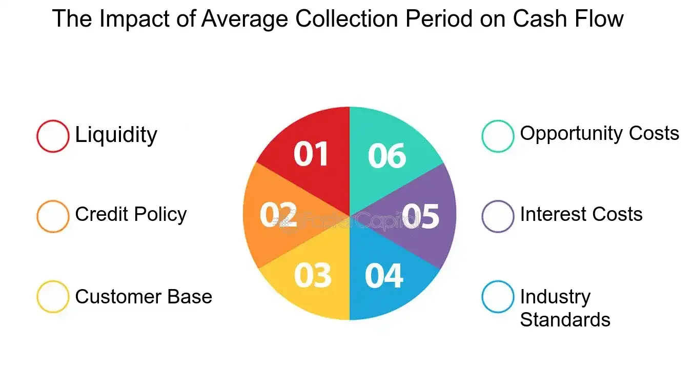

## Table of Contents

## What is the average collection period?

The average collection period is the average number of days it takes for a company to get paid for what it sells. It's important because it shows how quickly a company can turn its sales into cash. To find it, you divide the average accounts receivable by the total credit sales, then multiply by the number of days in the period, usually a year.

This number can tell a lot about a company's financial health. A shorter average collection period means the company is good at collecting money quickly, which is good for cash flow. A longer period might mean the company needs to work on its credit policies or collection methods. Comparing this number with other companies in the same industry can help see if a company is doing well or if it needs to make changes.

## How is the average collection period calculated?

The average collection period is calculated by dividing the average accounts receivable by the total credit sales, then multiplying the result by the number of days in the period, usually a year. To find the average accounts receivable, you add the accounts receivable at the start of the period to the accounts receivable at the end of the period, then divide by two. This gives you a good idea of the average amount of money owed to the company over that time.

For example, if a company's average accounts receivable is $50,000 and its total credit sales for the year are $200,000, you would divide $50,000 by $200,000 to get 0.25. Then, you multiply 0.25 by 365 days to find the average collection period, which comes out to 91.25 days. This means it takes the company about 91 days on average to collect payment from its customers.

## What does the average collection period indicate about a company's cash flow?

The average collection period tells us how fast a company gets paid for what it sells. If the number of days is low, it means the company gets its money back quickly. This is good for the company's cash flow because it means they have more money to use for other things, like paying bills or investing in new projects.

On the other hand, if the average collection period is high, it means the company has to wait longer to get paid. This can be bad for cash flow because the company might struggle to pay its own bills on time. It's important for a company to keep an eye on this number and try to keep it as low as possible to make sure they have enough money coming in to keep the business running smoothly.

## How does a shorter average collection period affect cash flow?

A shorter average collection period means a company gets paid faster for what it sells. This is good for cash flow because the company has more money coming in quickly. When money comes in fast, the company can use it to pay its bills, buy new things, or invest in growing the business. It's like having more money in your pocket sooner, which makes it easier to manage your finances.

Having a shorter average collection period also helps a company avoid cash flow problems. If a company has to wait a long time to get paid, it might run out of money before the payments come in. But with a shorter collection period, the company is less likely to face this problem. It can keep the business running smoothly without worrying about not having enough cash on hand.

## How does a longer average collection period impact cash flow?

A longer average collection period means a company has to wait longer to get paid for what it sells. This can be bad for cash flow because the company doesn't have as much money coming in right away. When money comes in slowly, it can be hard for the company to pay its own bills on time. It's like waiting a long time to get your allowance; you might run out of money before you get paid.

If a company has a longer average collection period, it might struggle to keep enough cash on hand. This can lead to problems like not being able to buy new things or invest in the business. It can also make it hard to pay employees or suppliers on time, which can cause more problems. So, a longer average collection period can make it tougher for a company to manage its money well.

## What are the industry standards for the average collection period?

The average collection period can vary a lot depending on the type of business. For example, in the retail industry, where most sales are in cash or with credit cards, the average collection period is usually very short, often less than 30 days. This is because retailers get paid quickly, which helps them keep a good cash flow. On the other hand, industries like manufacturing or construction might have longer average collection periods, sometimes over 60 days or even more. This is because these businesses often work on credit and have to wait longer to get paid.

It's important for a company to know what the average collection period is for its industry. If a company's average collection period is much longer than the industry standard, it might mean they need to change how they handle credit and collections. For example, they might need to be stricter about when customers have to pay or offer discounts for early payments. By keeping their average collection period close to the industry standard, a company can make sure it has enough cash coming in to keep the business running smoothly.

## How can a company improve its average collection period?

A company can improve its average collection period by changing its credit policies. This means they can be stricter about who they sell to on credit and make sure these customers pay on time. For example, a company might start checking a customer's credit history before selling to them. They might also ask for a down payment or set shorter payment deadlines. By doing this, the company can make sure they get paid faster and improve their cash flow.

Another way to improve the average collection period is by offering discounts for early payments. If customers know they can save money by paying early, they are more likely to do so. This can help the company get money in quicker. Also, the company can use better collection methods, like sending reminders or following up with customers who are late on payments. By being more organized and proactive, the company can reduce the time it takes to collect payments and keep their cash flow healthy.

## What are the potential risks of focusing too much on reducing the average collection period?

Focusing too much on reducing the average collection period can make a company too strict with its credit policies. This might scare away good customers who need more time to pay. If a company is too tough on credit, they might lose business to competitors who are more flexible. This can hurt the company's sales and profits in the long run.

Also, if a company pushes too hard for quick payments, it might harm relationships with customers. Good customer relationships are important for keeping business steady. If customers feel pressured or unhappy, they might take their business elsewhere. So, while it's good to have a shorter average collection period, a company needs to balance this with keeping customers happy and loyal.

## How does the average collection period relate to other financial metrics like the cash conversion cycle?

The average collection period is a part of the cash conversion cycle, which is a way to see how long it takes for a company to turn its investments in inventory and other resources into cash. The cash conversion cycle includes three main parts: the days inventory outstanding, the average collection period, and the days payable outstanding. The average collection period shows how many days it takes for a company to get paid after making a sale. This is important because it affects how quickly the company can get cash back into its hands.

If a company can make its average collection period shorter, it can speed up its whole cash conversion cycle. This means the company can turn its sales into cash faster, which is good for its cash flow. But, the average collection period is just one piece of the puzzle. The company also needs to look at how long it takes to sell its inventory and how long it takes to pay its suppliers. By managing all these parts well, a company can keep its cash conversion cycle as short as possible and keep its finances healthy.

## Can changes in the average collection period signal broader financial health issues?

Changes in the average collection period can tell us a lot about a company's financial health. If the average collection period gets longer, it might mean the company is having trouble getting paid by its customers. This can be a sign that the company's credit policies are too loose or that it's not doing a good job of collecting payments. It could also mean that the company is facing economic problems, like a slowdown in the industry or a tough economy, which makes it harder for customers to pay on time.

On the other hand, if the average collection period gets shorter, it might mean the company is doing a better job of managing its cash flow. This can be a good sign that the company is tightening up its credit policies or improving its collection methods. But, if the average collection period gets too short too quickly, it might mean the company is being too strict with its customers, which could hurt sales and relationships. So, changes in the average collection period can give us clues about whether a company is facing financial challenges or doing well.

## How do different industries manage the average collection period differently?

Different industries manage the average collection period in ways that fit their business. In the retail industry, most sales are paid for right away with cash or credit cards. This means retailers usually have a very short average collection period, often less than 30 days. They don't have to wait long to get their money, which helps them keep a good cash flow. Retailers might offer store credit cards, but they still try to get paid quickly to keep their business running smoothly.

In industries like manufacturing or construction, things are different. These businesses often sell on credit and have to wait longer to get paid. This can mean an average collection period of over 60 days or even more. To manage this, manufacturing and construction companies might check a customer's credit before selling to them. They might also ask for a down payment or set shorter payment deadlines. By being strict about credit and collections, these companies try to keep their cash flow healthy, even though they have to wait longer to get paid.

Service industries, like consulting or healthcare, can also have different ways of managing the average collection period. In these industries, the collection period can vary a lot depending on the type of service and the payment terms. For example, a consulting firm might have a contract that requires payment within 30 days, while a healthcare provider might bill insurance companies and have to wait longer to get paid. These companies might use billing software to keep track of payments and send reminders to customers. By managing their billing and collections carefully, service industries try to keep their cash flow steady, even though they might have to wait longer for some payments.

## What advanced strategies can be implemented to optimize the average collection period for better cash flow management?

To optimize the average collection period, a company can use advanced strategies like dynamic discounting. This means offering different discounts based on how fast customers pay. For example, a company might give a bigger discount if a customer pays within 10 days instead of the usual 30 days. This can encourage customers to pay faster, which helps the company get cash quicker. Another strategy is using data analytics to predict which customers are likely to pay late. By knowing this, the company can focus on these customers and use special collection methods, like sending more reminders or offering payment plans, to get paid faster.

Another advanced strategy is to use electronic invoicing and automated payment systems. These tools make it easier for customers to pay quickly because they can do it online without having to mail a check. The company can also set up automatic payment reminders and track payments in real-time. This helps the company keep a close eye on its cash flow and make sure payments come in on time. By using these advanced strategies, a company can shorten its average collection period and improve its cash flow management.

## How do you calculate the average collection period?

The average collection period is an essential financial metric that businesses use to evaluate how efficiently they manage their accounts receivable. It represents the average number of days it takes for a company to collect payments from its credit sales. The shorter this period, the faster a company receives cash, improving its [liquidity](/wiki/liquidity-risk-premium) and cash flow.

To calculate the average collection period, the following formula is used:

$$
\text{Average Collection Period} = \left( \frac{\text{Average Accounts Receivable}}{\text{Net Credit Sales}} \right) \times \text{Number of Days}
$$

Where:
- **Average Accounts Receivable** is the average of the beginning and ending accounts receivable for a specific period. It can be calculated as:
$$
  \text{Average Accounts Receivable} = \frac{\text{Beginning Accounts Receivable} + \text{Ending Accounts Receivable}}{2}

$$

- **Net Credit Sales** are the revenue generated from sales where payment is agreed to be received at a future date, excluding any cash sales.
- **Number of Days** typically represents the number of days in the period being analyzed (e.g., 365 days for a year or 90 days for a quarter).

By calculating the average collection period, businesses can gain insights into their cash conversion cycle, which is pivotal for maintaining liquidity. A shorter average collection period indicates that a company is collecting its receivables quickly, thereby reducing the time cash is tied up in unpaid debts. This improved cash flow allows businesses to meet their operational expenses more effectively and to reinvest in growth opportunities promptly. On the other hand, a prolonged average collection period might signal inefficiencies in the billing process or issues with credit policies, potentially putting the company's financial stability at risk. 

By analyzing this metric, businesses can identify trends, make informed decisions about credit terms, and implement strategies to decrease the collection period, thus bolstering their financial health.

## References & Further Reading

1. **"Financial Management for Decision Makers" by Peter Atrill**  
   This book provides comprehensive insights into financial strategies, including cash flow management and investment appraisal, tailored for effective decision-making in businesses.

2. **"Principles of Corporate Finance" by Richard A. Brealey, Stewart C. Myers, and Franklin Allen**  
   A classic resource outlining key financial concepts and practices, from corporate capital structure to the intricacies of financial performance, essential for understanding credit management and cash flow efficiencies.

3. **"Algorithmic Trading: Winning Strategies and Their Rationale" by Ernest P. Chan**  
   This work investigates into the design, testing, and implementation of automated trading systems, offering practical strategies that align with modern financial technologies.

4. **"The Mathematics of Financial Modeling and Investment Management" by Sergio M. Focardi and Frank J. Fabozzi**  
   An essential resource for understanding the quantitative frameworks behind financial modeling, risk management, and the integration of trading and investment strategies.

5. **"Python for Finance: Analyze Big Financial Data" by Yves Hilpisch**  
   This book serves as a guide to using Python for developing financial analytics applications, with practical examples related to [algorithmic trading](/wiki/algorithmic-trading) and data-driven financial strategies.

6. **"International Financial Management" by Jeff Madura**  
   Offering a global perspective, this text explores financial management practices across diverse markets, addressing cash flow management and credit policies in multinational corporations.

7. **Research Papers in Economics (RePEc)**  
   Access to a vast database of working papers, journal articles, and other resources pertinent to economic and financial research, useful for exploring contemporary studies and data on financial management.

8. **"The Impact of Algorithmic Trading on Market Liquidity" - Journal Article**  
   An academic paper that assesses how algorithmic trading technologies enhance market liquidity and influence trading dynamics, relevant for understanding the role of technology in financial markets.

These resources provide both foundational knowledge and advanced strategies for effective financial management and the use of trading technologies, supporting businesses in optimizing their financial practices.

