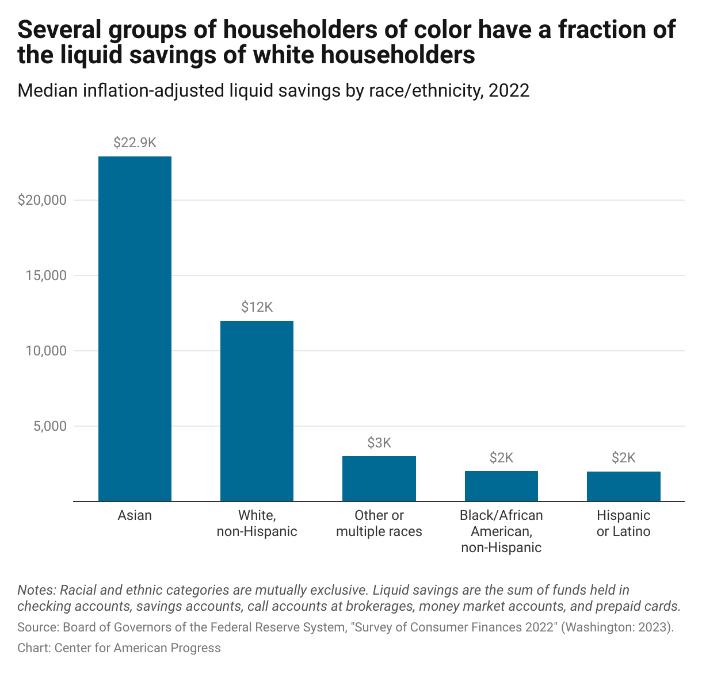

## Table of Contents

## What are baby bonds?

Baby bonds are a type of savings account that the government gives to newborn babies. The idea is to help kids start their adult life with some money saved up. The government puts money into the account when the baby is born, and it grows over time. When the child turns 18, they can use the money for things like going to college, buying a home, or starting a business.

The goal of baby bonds is to reduce inequality. Some people think that baby bonds can help everyone have a fair start in life, no matter how much money their family has. By giving every child a savings account, it can help them have more opportunities when they grow up. This idea has been talked about in different countries, but it's not used everywhere yet.

## How do baby bonds work?

Baby bonds work by giving every newborn baby a special savings account from the government. When a baby is born, the government puts some money into this account. The amount of money can depend on how much the baby's family earns. The money in the account then grows over time, kind of like how a plant grows bigger as it gets older.

When the child turns 18, they can use the money in their baby bond account. They can spend it on important things like going to college, buying their first home, or starting a small business. The idea is to give young adults a little boost to help them get started in life, no matter if their family has a lot of money or not.

## What is intergenerational wealth inequality?

Intergenerational wealth inequality means that the amount of money and things people own can be very different from one generation to the next. Some families have a lot of money and can pass it down to their kids and grandkids. Other families might not have much and struggle to give their children a good start in life. This gap can grow bigger over time, making it harder for some people to get ahead.

This kind of inequality can affect many parts of life. For example, kids from families with more money might go to better schools, get more help with college, and have an easier time buying a home. On the other hand, kids from families with less money might not have these opportunities. Over time, this can make it harder for them to build their own wealth, and the cycle of inequality can continue from one generation to the next.

## How can baby bonds help reduce intergenerational wealth inequality?

Baby bonds can help reduce intergenerational wealth inequality by giving every child a savings account at birth. This means that even if a child comes from a family with less money, they will still have some savings to help them when they grow up. The money in the baby bond account grows over time, and when the child turns 18, they can use it for important things like going to college, buying a home, or starting a business. This gives them a better chance to build their own wealth, no matter how much money their family has.

By providing this initial boost, baby bonds can help level the playing field. Kids from families with less money often face more challenges and have fewer opportunities. Baby bonds can help break this cycle by giving them a financial head start. Over time, this can lead to less inequality between generations, as more people have the chance to build their own wealth and pass it on to their children.

## What are the key features of a successful baby bond program?

A successful baby bond program starts with giving every newborn baby a savings account from the government. The money put into the account at the start should be based on the family's income, so kids from families with less money get more help. This way, the program can really make a difference for those who need it most. The money in the account should grow over time, like a savings account at a bank, so there's more money when the child turns 18.

When the child reaches 18, they should be able to use the money for big, important things like going to college, buying a home, or starting a business. The rules for how the money can be used should be clear and easy to follow. It's also important that the program is well-managed and that people know about it, so families understand how it works and how it can help their kids. By doing these things, a baby bond program can help reduce the gap between rich and poor families and give every child a fair start in life.

## What are the potential economic impacts of implementing baby bonds?

Implementing baby bonds could have big effects on the economy. If every kid gets a savings account at birth, it could help more people go to college, buy homes, and start businesses when they grow up. This could make the economy stronger because more people would have money to spend and invest. It might also help close the gap between rich and poor families, making things more equal. If more people have a chance to build their own wealth, it could lead to less poverty and more people joining the middle class.

However, starting a baby bond program would cost a lot of money at first. The government would need to find the money to put into these accounts for every newborn. This could mean higher taxes or using money from other programs. But over time, if the program works well, it might save money by reducing the need for other kinds of help, like welfare. It's a big investment, but it could pay off in the long run by making the economy healthier and more equal.

## How have baby bonds been implemented in different countries or regions?

In the United States, baby bonds have been talked about a lot but haven't been used everywhere yet. Some people in the government think it's a good idea to help kids from families with less money. A few places, like Washington, D.C., and the state of Connecticut, have started trying out baby bond programs. In these places, the government gives money to newborn babies, and the money grows until the kids turn 18. They can then use it for things like college or buying a home.

In the United Kingdom, they used to have something called the Child Trust Fund, which was a bit like baby bonds. It started in 2002 and gave every baby born in the UK a savings account with some money in it. The government put money into the account when the baby was born and again when the child turned seven. The idea was to help kids have some savings when they grew up. The program stopped in 2011, but the money in the accounts kept growing, and kids can use it when they turn 18.

Other countries, like Canada and Singapore, have programs that help families save for their kids' future, but they aren't exactly the same as baby bonds. In Canada, there's the Registered Education Savings Plan (RESP), where the government adds money to what families save for their kids' education. In Singapore, the government helps families save for their kids' future through the Child Development Account. These programs are different from baby bonds but they also aim to help kids have a better start in life.

## What are the criticisms and challenges associated with baby bonds?

Some people don't like the idea of baby bonds because they think it will cost too much money. The government would need to find a lot of money to put into these accounts for every baby born. This could mean raising taxes or taking money away from other important things like schools or hospitals. People who don't want higher taxes might not like this idea. Also, some think that baby bonds won't really help because the amount of money might not be enough to make a big difference in someone's life.

Another challenge is making sure the program works well and that people know about it. It's hard to set up a big program like this and make sure it runs smoothly. There needs to be clear rules about how the money can be used, and people need to understand these rules. If families don't know about baby bonds or how to use them, the program won't help as much as it could. It's also important to make sure the money in the accounts grows over time, so it's worth something when the kids turn 18.

## How do baby bonds compare to other wealth-building policies?

Baby bonds are different from other wealth-building policies because they give every newborn baby a savings account from the government. Other policies might give money to families to help them save for their kids' future, like education savings plans in Canada or child development accounts in Singapore. But baby bonds start helping right away, even if the family doesn't have much money to save themselves. This makes baby bonds a way to help everyone have a fair start, no matter how much money their family has.

Other wealth-building policies often need families to save money first, and then the government might add more money to what the family saves. For example, in the United States, there are programs like 529 college savings plans where families save for their kids' education, and the government might help a bit. These plans can be good, but they mostly help families who already have some money to save. Baby bonds, on the other hand, don't need families to save first, so they can help kids from poorer families more. This makes baby bonds a strong tool to fight against inequality and give more kids a chance to build their own wealth.

## What are the long-term effects of baby bonds on individual beneficiaries?

Baby bonds can have big long-term effects on the people who get them. When a kid turns 18, they can use the money from their baby bond to go to college, buy a home, or start a business. This can help them have a better start in life, no matter if their family has a lot of money or not. By giving them this money, baby bonds can help them build their own wealth and have more opportunities. This can lead to them having a better job, more money, and a more stable life as they grow up.

Over time, baby bonds can also help break the cycle of poverty. If a kid from a family with less money gets a baby bond, they might be able to go to college and get a good job. Then, when they have their own kids, they can pass on more money and help their kids have a better start too. This can keep going from one generation to the next, making things more equal. Baby bonds can help more people join the middle class and have a chance to build a better future for themselves and their families.

## How can the effectiveness of baby bonds be measured and evaluated?

To see if baby bonds are working well, we need to look at different things over time. One way is to check how many young adults are using the money from their baby bond accounts for big things like going to college, buying a home, or starting a business. If more people are doing these things, it could mean the baby bonds are helping them have a better start in life. Another way is to see if the gap between rich and poor families is getting smaller. If baby bonds are making things more equal, we should see fewer people living in poverty and more people joining the middle class.

It's also important to ask the people who get baby bonds what they think. Surveys and interviews can help us understand if they feel the money has helped them and if they would recommend the program to others. We can also look at numbers like how much the money in the accounts grows over time and how easy it is for people to use the money when they turn 18. By putting all these pieces together, we can get a good idea of how effective baby bonds are and if they are really making a difference in people's lives.

## What future research is needed to optimize the impact of baby bonds on intergenerational wealth inequality?

To make baby bonds work better at reducing the gap between rich and poor families, we need to do more research. One important thing to study is how much money should go into the baby bond accounts at the start. We need to find out if giving more money to kids from families with less money makes a bigger difference. We also need to look at how the money grows over time and if it's enough to really help when the kids turn 18. By studying these things, we can figure out the best way to set up baby bonds so they help as many people as possible.

Another thing to research is how baby bonds work with other programs that help families and kids. We need to see if baby bonds can be used along with things like education savings plans or housing help to make an even bigger impact. It's also important to keep asking people who get baby bonds what they think and how the money has helped them. By doing this research, we can keep making baby bonds better and make sure they are really helping to close the gap between generations and give everyone a fair chance to build their own wealth.

## References & Further Reading

[1]: Darity Jr., W. & Hamilton, D. (2010). ["Can 'Baby Bonds' Eliminate the Racial Wealth Gap?"](https://journals.sagepub.com/doi/abs/10.1007/s12114-010-9063-1) The Review of Black Political Economy.

[2]: Booker, C. (2019). ["Baby Bonds Proposal: Addressing Wealth Inequality from Birth."](https://www.booker.senate.gov/news/press/booker-pressley-reintroduce-bicameral-baby-bonds-legislation-to-tackle-wealth-inequality) United States Senate.

[3]: Shiller, R. J. (2019). ["Narrative Economics: How Stories Go Viral and Drive Major Economic Events"](https://www.jstor.org/stable/j.ctv10vm1xf). Princeton University Press.

[4]: Rys Farthing, A. (2019). ["Why Baby Bonds Look Increasingly Like Britain's Best Chance of Ending Wealth Disparity."](https://www.researchgate.net/publication/386504959_Digital_Food_Marketing_and_Children's_Health_and_Well-being) The Independent.

[5]: Zucman, G. (2019). ["The Hidden Wealth of Nations: The Scourge of Tax Havens"](https://archive.org/details/hiddenwealthofna0000zucm). University of Chicago Press.