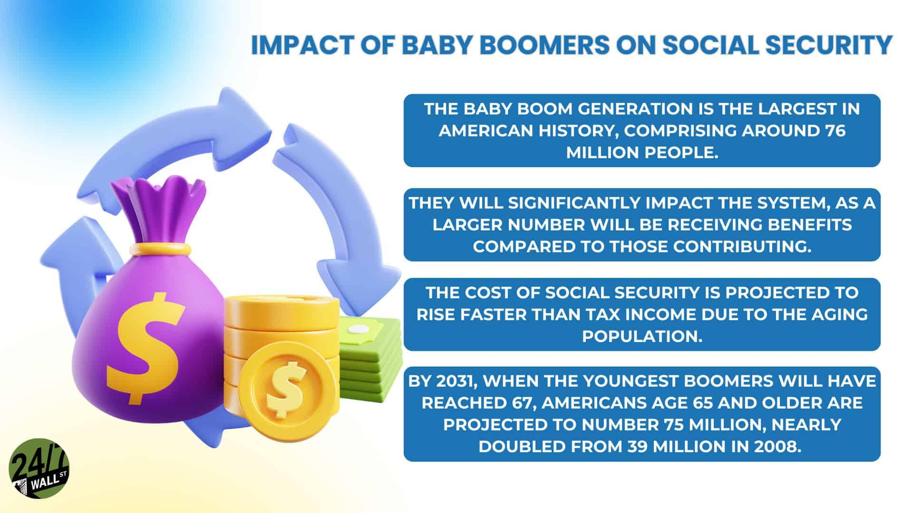

## Table of Contents

## What is Social Security and how does it work?

Social Security is a program run by the U.S. government that helps people with money when they get old or if they can't work because they're sick or disabled. It's like a safety net that makes sure people have some income when they need it most. People who work pay into Social Security through taxes on their earnings, and then they can get money back when they retire or if they become unable to work.

When you work, a part of your paycheck goes to Social Security. This money goes into a big fund that the government uses to pay benefits to people who are retired, disabled, or to families if a worker dies. The amount of money you get depends on how much you earned and how long you worked. Usually, you can start getting Social Security money when you're 62, but if you wait until you're older, like 65 or 70, you get more money each month.

## Who are the Baby Boomers and what are their demographic characteristics?

Baby Boomers are people born between 1946 and 1964. This time is called the "baby boom" because a lot more babies were born then than before or after. They are a big group of people, and they have changed a lot of things in the world because there are so many of them.

Baby Boomers are now getting older, and many are retiring. They have different experiences and views than younger people. They grew up during a time when the world was changing a lot, like with civil rights and technology. They are a big part of the population, so when they retire, it affects things like Social Security and the economy.

## How have Baby Boomers affected the workforce and economy?

Baby Boomers have had a big impact on the workforce and economy because there are so many of them. When they were young, they made the workforce grow a lot. Companies had to hire more people, and this helped the economy grow. Baby Boomers also spent a lot of money on things like houses and cars, which helped businesses and the economy even more. They worked hard and many of them got good jobs and made a lot of money, which meant they paid a lot in taxes. This helped the government have more money to spend on things like schools and roads.

Now that Baby Boomers are getting older and retiring, they are changing the workforce and economy again. As they leave their jobs, there are fewer people working, which can make it hard for companies to find workers. This is called a labor shortage. Also, when Baby Boomers retire, they start taking money out of Social Security and other retirement funds. This can put a strain on these programs because there are so many Baby Boomers. But they also have a lot of money saved up, so they keep spending on things like travel and healthcare, which helps some parts of the economy.

## What is the current state of Social Security's financial health?

Social Security's financial health is a big worry right now. The money that comes in from taxes is not enough to pay for all the benefits that people are getting. This is because there are a lot of Baby Boomers retiring and they are taking money out of Social Security. At the same time, there are fewer young people working and paying into the system. This means that the Social Security trust fund, which is like a savings account for the program, is getting smaller every year.

If things keep going the way they are, experts say that by around 2034, the trust fund might run out of money. After that, Social Security would only be able to pay about 77% of the benefits that people are supposed to get. This means that people might get less money than they were expecting when they retire. To fix this problem, the government might need to raise taxes, cut benefits, or find other ways to make sure Social Security has enough money to keep helping people.

## How does the retirement of Baby Boomers impact Social Security's funding?

The retirement of Baby Boomers is putting a big strain on Social Security's funding. When Baby Boomers were working, they paid taxes into Social Security. Now that they are retiring, they are taking money out of the system. There are a lot of Baby Boomers, so this means a lot of money is being taken out all at once. At the same time, there are fewer young people working and paying into Social Security because the birth rate has gone down. This means less money is coming in, but more money is going out.

Because of this, the Social Security trust fund, which is like a savings account for the program, is getting smaller every year. Experts think that if things keep going the way they are, the trust fund might run out of money around 2034. After that, Social Security might only be able to pay about 77% of the benefits that people are supposed to get. This could mean that people get less money than they were expecting when they retire. The government might need to find ways to fix this problem, like raising taxes or cutting benefits, to make sure Social Security can keep helping people.

## What are the projected changes in the ratio of workers to retirees due to Baby Boomers?

The ratio of workers to retirees is changing a lot because of the Baby Boomers. When the Baby Boomers were young, there were a lot more workers than retirees. This meant that there was a lot of money coming into Social Security from taxes, and not as much money going out for benefits. But now, as the Baby Boomers are getting older and retiring, the number of retirees is going up a lot. At the same time, there are fewer young people starting to work and pay into Social Security. This means the ratio of workers to retirees is getting smaller.

In the past, there were about 5 workers for every retiree. But now, because so many Baby Boomers are retiring, this ratio is going down. Experts think that by around 2035, there might be only about 2.3 workers for every retiree. This big change in the ratio means that there will be less money coming into Social Security from taxes, but more money going out for benefits. This makes it harder for Social Security to have enough money to pay everyone what they are supposed to get.

## How do Baby Boomers' retirement patterns differ from previous generations?

Baby Boomers are retiring differently than the generations before them. One big difference is that they are living longer. This means they might need their retirement savings to last longer than people did in the past. Also, many Baby Boomers are choosing to work longer than their parents did. They might keep working part-time or even full-time after they reach the usual retirement age because they want to stay active, or because they need the money.

Another difference is that Baby Boomers have different ideas about retirement. Many of them don't want to just stop working and relax. Instead, they want to keep doing things they enjoy, like traveling or volunteering. They also have more money saved up than past generations, so they can spend more on things they want to do. But, even with more savings, some Baby Boomers are worried about having enough money because they might live longer and healthcare costs can be high.

## What legislative changes have been proposed to address Social Security solvency in relation to Baby Boomers?

To help fix Social Security's money problems because of Baby Boomers retiring, lawmakers have come up with different ideas. One idea is to raise the age when people can start getting Social Security money. Right now, you can start getting it at 62, but if they make it older, like 67 or 70, it would mean people get money for fewer years. This could help the program have more money. Another idea is to make people pay more taxes into Social Security. If workers pay more, there would be more money coming in to help pay for the benefits.

Another suggestion is to change how much money people get from Social Security. They might lower the benefits a little bit so that the money lasts longer. Some people also talk about making more money from investments or finding other ways to get money for Social Security. All these ideas are being talked about because they want to make sure Social Security can keep helping people, especially with so many Baby Boomers retiring and taking money out of the system.

## How do Baby Boomers' life expectancy and health affect Social Security's long-term sustainability?

Baby Boomers are living longer than the generations before them. This is good news for them, but it makes it harder for Social Security to keep going strong. When people live longer, they get Social Security money for more years. This means the money in the Social Security fund has to last longer, but there isn't more money coming in to cover this. So, the longer Baby Boomers live, the more strain it puts on Social Security because it has to pay out benefits for a longer time.

Also, Baby Boomers might need more healthcare as they get older. Healthcare can be expensive, and if they need to use more of their Social Security money for medical bills, it can affect how much money they have left. This can make it harder for them to live comfortably in retirement. At the same time, if they need more healthcare, it might mean they can't work as long as they planned, which means they stop paying into Social Security sooner. All these things together make it tough for Social Security to stay strong in the long run.

## What are the economic implications of adjusting Social Security benefits for Baby Boomers?

If the government decides to change Social Security benefits for Baby Boomers, it could have big effects on the economy. If they lower the benefits, Baby Boomers might not have as much money to spend on things like travel, healthcare, and other stuff they enjoy in retirement. This could mean less money going into the economy because people are spending less. Businesses that count on Baby Boomers spending money might have a hard time, and this could slow down the economy. On the other hand, if the government raises taxes to pay for Social Security, workers might have less money to spend too, which could also slow down the economy.

But there are also some good things that could happen. If the government makes changes to keep Social Security strong, it might make people feel more sure about their future. This could make them spend more money now because they know they will have enough when they retire. Also, if the changes help Social Security last longer, it could mean that the economy stays stable because people keep getting their benefits and spending money. So, while changing Social Security benefits for Baby Boomers could be tricky, it's important to find a balance that helps both the economy and the people who depend on Social Security.

## How do different economic models predict the impact of Baby Boomers on Social Security solvency?

Different economic models have different ideas about how Baby Boomers will affect Social Security's money. Some models think that because there are so many Baby Boomers retiring, they will take a lot of money out of Social Security. These models say that if not enough young people are working and paying into the system, Social Security might run out of money sooner than expected. They predict that the trust fund could be empty by around 2034, and after that, Social Security might only be able to pay about 77% of what people are supposed to get.

Other models look at how long Baby Boomers will live and how much they will spend on healthcare. They say that if Baby Boomers live longer and need more healthcare, it could make things even harder for Social Security. These models think that if Baby Boomers keep getting money for more years, and if they use a lot of that money for medical bills, the Social Security fund might not last as long. They suggest that the government might need to find new ways to get money for Social Security, like raising taxes or changing how much people get in benefits, to make sure it stays strong.

## What are the international comparisons of similar demographic impacts on pension systems?

Many countries around the world are facing similar problems with their pension systems because of their aging populations, just like the U.S. with Baby Boomers. In Japan, for example, people are living longer and having fewer babies. This means there are a lot more older people who need pensions, but fewer young people working and paying into the system. Japan has had to make changes like raising the age when people can start getting their pension money and making people pay more taxes to help keep the pension system going.

In Europe, countries like Germany and Italy are also dealing with these issues. Germany has been trying to fix its pension system by making people work longer before they can retire. They also encourage people to save more money for their own retirement. Italy has a big problem because a lot of young people are leaving the country to find work elsewhere, which means even fewer people are paying into the pension system. Both countries are looking at ways to make their pension systems last longer, like changing how much money people get or finding new ways to get money for pensions.

## References & Further Reading

[1]: ["Baby Boomer Retirement: The Economic Impact and Policy Implications"](https://www.pewresearch.org/short-reads/2020/11/09/the-pace-of-boomer-retirements-has-accelerated-in-the-past-year/) by Alicia H. Munnell, Center for Retirement Research at Boston College.

[2]: CBO. (2020). ["The 2020 Long-Term Budget Outlook"](https://www.cbo.gov/publication/56516), Congressional Budget Office.

[3]: ["The Future of Social Security: Trust Fund Projections and Reform Options"](https://www.cbo.gov/publication/60679) by Elliot Schreur and Chris Chaplain, Social Security Bulletin, Vol. 75 No. 1.

[4]: Kearney, M.S., & Hershbein, B. (2015). ["The Distributional and Fiscal Consequences of Raising the Social Security Retirement Age"](https://www.brookings.edu/wp-content/uploads/2016/06/Work_in_Machine_Age_February_2015_FINAL.pdf) National Bureau of Economic Research Working Paper No. 21594.

[5]: Feltenstein, A., & Lambert, S. (2015). ["The Role of Baby Boomers in the Macroeconomy"](https://scholar.google.com/citations?user=-_K96yoAAAAJ) International Monetary Fund Working Paper.

[6]: Hasbrouck, J., & Saar, G. (2013). ["Low-latency trading"](https://papers.ssrn.com/sol3/papers.cfm?abstract_id=1695460) Journal of Financial Markets, 16(4), 646-679.

[7]: Menkveld, A.J. (2013). ["High Frequency Trading and the New-Market Makers"](https://www.sciencedirect.com/science/article/pii/S1386418113000281) The Review of Financial Studies, 26(3), 713-750.