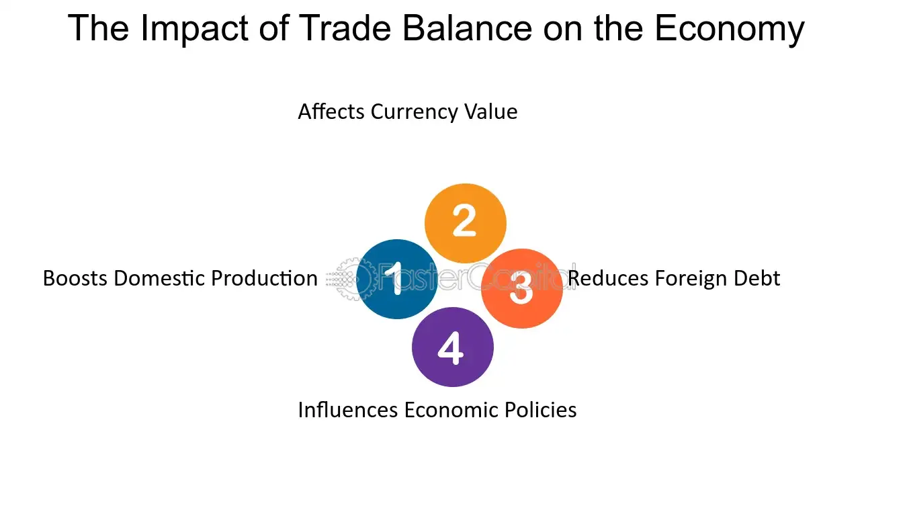

## Table of Contents

## What is the balance of trade?

The balance of trade is the difference between the value of a country's exports and imports over a certain period, usually a year. If a country exports more than it imports, it has a trade surplus. This means the country is selling more goods and services to other countries than it is buying from them. On the other hand, if a country imports more than it exports, it has a trade deficit. This means the country is buying more from other countries than it is selling to them.

The balance of trade is important because it can affect a country's economy. A trade surplus can lead to a stronger currency because there is more demand for the country's goods and services. This can make the country's products more expensive for other countries to buy, which might affect future trade. A trade deficit can weaken a country's currency because there is less demand for its goods and services. This can make imports more expensive and can lead to borrowing from other countries to pay for the deficit. Understanding the balance of trade helps countries make decisions about their economic policies.

## What is GDP and how is it calculated?

GDP stands for Gross Domestic Product. It is the total value of all goods and services produced within a country's borders in a specific time period, usually a year. GDP helps us understand how well a country's economy is doing. If the GDP is growing, it means the economy is getting bigger and people are producing more. If the GDP is shrinking, it means the economy is getting smaller and people are producing less.

There are three main ways to calculate GDP. The first way is by adding up the total value of all goods and services produced, which is called the production approach. The second way is by adding up all the money spent on goods and services, which is called the expenditure approach. This includes spending by consumers, businesses, the government, and foreigners. The third way is by adding up all the income earned by everyone in the country, which is called the income approach. This includes wages, profits, and taxes minus subsidies. All three methods should give the same result, but they can be used to look at the economy from different angles.

## How does a trade surplus affect GDP?

A trade surplus means a country sells more stuff to other countries than it buys from them. This can make the country's GDP go up. When a country has a trade surplus, it means more money is coming into the country from selling things than is going out from buying things. This extra money can be spent inside the country, which makes the economy grow. So, a trade surplus can help increase the GDP because it adds to the total amount of money being spent and produced in the country.

However, a trade surplus doesn't always mean the GDP will go up a lot. It depends on what the country does with the extra money. If the country saves the money or uses it to buy things from other countries later, it might not help the GDP grow right away. Also, if the trade surplus makes the country's money (currency) stronger, it could make their products more expensive for other countries to buy. This might lead to fewer sales in the future, which could slow down the growth of GDP. So, while a trade surplus can help boost GDP, other things can affect how much it actually helps.

## How does a trade deficit affect GDP?

A trade deficit means a country buys more stuff from other countries than it sells to them. This can make the country's GDP go down because more money is going out of the country than coming in. When a country spends more on imports than it earns from exports, it means less money is being spent inside the country. This can slow down the economy and make the GDP smaller.

However, a trade deficit doesn't always mean the GDP will go down a lot. It depends on what the country does with the money it spends on imports. If the imports help businesses in the country make more stuff or if they help people spend more money inside the country, it might not hurt the GDP as much. Also, if the trade deficit makes the country's money (currency) weaker, it could make their products cheaper for other countries to buy. This might lead to more sales in the future, which could help the GDP grow. So, while a trade deficit can make GDP go down, other things can affect how much it actually hurts.

## What are the components of GDP and how does trade fit into them?

GDP is made up of four main parts: what people spend, what businesses invest, what the government spends, and the difference between what a country sells to other countries and what it buys from them. This last part is called net exports. If a country sells more stuff to other countries than it buys, it has a trade surplus. If it buys more than it sells, it has a trade deficit. The trade part of GDP is important because it shows how much money is coming into or going out of the country from buying and selling things with other countries.

Trade fits into GDP through the net exports part. When a country has a trade surplus, it means more money is coming into the country from selling things than is going out from buying things. This extra money can be spent inside the country, which can make the GDP bigger. On the other hand, when a country has a trade deficit, it means more money is going out of the country to buy things than is coming in from selling things. This can make the GDP smaller because less money is being spent inside the country. So, trade can affect how big or small a country's GDP is, depending on whether it has a surplus or a deficit.

## Can you explain the relationship between net exports and GDP?

Net exports are a part of GDP. They are the difference between what a country sells to other countries (exports) and what it buys from other countries (imports). If a country sells more than it buys, it has a trade surplus. This means more money is coming into the country than going out, which can make the GDP bigger. If a country buys more than it sells, it has a trade deficit. This means more money is going out of the country than coming in, which can make the GDP smaller.

The relationship between net exports and GDP is important because it shows how trade affects the economy. When a country has a trade surplus, the extra money from selling more than it buys can be spent inside the country. This extra spending can help grow the economy and increase GDP. On the other hand, a trade deficit means the country is spending more money on imports than it is [earning](/wiki/earning-announcement) from exports. This can lead to less money being spent inside the country, which might slow down the economy and decrease GDP. So, net exports can have a big impact on how big or small a country's GDP is.

## How do changes in the balance of trade influence economic growth?

Changes in the balance of trade can affect how fast a country's economy grows. When a country sells more stuff to other countries than it buys, it has a trade surplus. This means more money is coming into the country than going out. This extra money can be spent inside the country, which can help businesses grow and create more jobs. More jobs mean more people have money to spend, which can make the economy grow faster. So, a trade surplus can help boost economic growth by increasing the amount of money being spent and produced in the country.

On the other hand, when a country buys more stuff from other countries than it sells, it has a trade deficit. This means more money is going out of the country than coming in. This can lead to less money being spent inside the country, which might slow down businesses and make it harder for them to create jobs. Fewer jobs can mean less money for people to spend, which can slow down the economy. However, a trade deficit isn't always bad for economic growth. If the things a country buys from other countries help businesses make more stuff or help people spend more money inside the country, it might not hurt the economy as much. So, the impact of a trade deficit on economic growth depends on what the country does with the money it spends on imports.

## What are the long-term effects of a persistent trade surplus or deficit on GDP?

A country with a persistent trade surplus over the long term can see its GDP grow because it keeps selling more stuff to other countries than it buys. This extra money coming in can help businesses grow and create more jobs, which means more people have money to spend inside the country. This can make the economy stronger and the GDP bigger over time. However, if the country's money (currency) gets too strong because of the trade surplus, it might make their products more expensive for other countries to buy. This could lead to fewer sales in the future, which might slow down the growth of GDP. So, while a trade surplus can help GDP grow, it needs to be managed carefully to keep the economy growing in the long run.

A country with a persistent trade deficit over the long term might see its GDP shrink because it keeps buying more stuff from other countries than it sells. This means more money is going out of the country than coming in, which can lead to less money being spent inside the country. This can make businesses struggle and create fewer jobs, which means less money for people to spend. This can make the economy weaker and the GDP smaller over time. However, if the things the country buys from other countries help businesses make more stuff or help people spend more money inside the country, it might not hurt the GDP as much. So, while a trade deficit can make GDP shrink, it depends on how the country uses the money it spends on imports.

## How do exchange rates impact the balance of trade and subsequently GDP?

Exchange rates can change how much stuff a country buys and sells with other countries, which affects the balance of trade. If a country's money gets stronger, it means their stuff costs more for other countries to buy. This can make other countries buy less from them, which might lead to a trade deficit. On the other hand, if a country's money gets weaker, their stuff costs less for other countries to buy. This can make other countries buy more from them, which might lead to a trade surplus. So, exchange rates can make a big difference in whether a country has a trade surplus or a deficit.

The balance of trade can then affect a country's GDP. If a country has a trade surplus because its money is weak, more money comes into the country from selling stuff. This extra money can be spent inside the country, which can help the economy grow and make the GDP bigger. But if a country has a trade deficit because its money is strong, more money goes out of the country to buy stuff. This can lead to less money being spent inside the country, which might make the economy weaker and the GDP smaller. So, exchange rates can impact GDP by changing the balance of trade.

## What role do government policies play in managing the balance of trade to influence GDP?

Government policies can help a country manage its balance of trade, which can affect how big its GDP is. Governments can use things like tariffs, which are taxes on stuff coming into the country, to make imports more expensive. This can make people buy more things made inside the country instead of from other countries, which can help create a trade surplus. Governments can also give money to businesses that sell stuff to other countries, which can help them sell more and bring more money into the country. These policies can help the economy grow by making sure more money stays inside the country.

On the other hand, governments can also use policies to make their money (currency) weaker or stronger, which can change how much stuff they sell and buy with other countries. If the government makes the money weaker, their stuff costs less for other countries to buy, which can lead to a trade surplus. If they make the money stronger, their stuff costs more, which might lead to a trade deficit. By choosing the right policies, governments can try to keep the balance of trade in a way that helps the economy grow and makes the GDP bigger over time.

## How do international trade agreements affect the balance of trade and GDP?

International trade agreements are deals between countries that can change how much they buy and sell with each other. These agreements can lower taxes on things that move between countries, making it easier and cheaper to trade. When countries can trade more easily, they might sell more stuff to other countries and buy more from them too. If a country sells more than it buys because of the agreement, it can have a trade surplus. This means more money comes into the country, which can help the economy grow and make the GDP bigger. But if a country buys more than it sells, it might have a trade deficit. This means more money goes out of the country, which can make the economy weaker and the GDP smaller.

Trade agreements can also help countries make things that they are good at and trade them for things they are not as good at making. This can make businesses grow and create more jobs, which means more people have money to spend inside the country. More spending can help the economy grow and increase GDP. But sometimes, trade agreements can make it hard for some businesses inside the country to compete with cheaper stuff from other countries. This can hurt those businesses and lead to fewer jobs, which might slow down the economy and decrease GDP. So, international trade agreements can have a big impact on the balance of trade and GDP, but it depends on how they affect what countries buy and sell.

## What economic theories explain the impact of the balance of trade on GDP?

One economic theory that explains how the balance of trade affects GDP is the Keynesian theory. This theory says that if a country sells more stuff to other countries than it buys, it has a trade surplus. This means more money comes into the country, which can be spent inside the country. More spending can help businesses grow and create more jobs, which means more people have money to spend. This can make the economy grow and the GDP bigger. On the other hand, if a country buys more than it sells, it has a trade deficit. This means more money goes out of the country, which can lead to less spending inside the country. Less spending can make businesses struggle and create fewer jobs, which can make the economy weaker and the GDP smaller.

Another theory is the classical economic theory, which focuses on how trade can help countries use what they are good at. If a country can sell things it is good at making to other countries, it can have a trade surplus. This extra money can help the economy grow by making more stuff inside the country and creating more jobs. More jobs mean more people have money to spend, which can make the GDP bigger. But if a country buys more than it sells, it might have a trade deficit. This can mean the country is spending money on things it could make itself, which might not help the economy grow as much. So, according to classical theory, having a trade surplus can help the GDP grow by letting the country focus on what it does best.

Both theories show that the balance of trade can have a big impact on GDP. Whether a country has a trade surplus or a deficit can change how much money is spent inside the country, which can make the economy grow or shrink. So, understanding these theories can help countries make good choices about how to trade with other countries to help their GDP grow.

## What are the basic concepts of GDP and Trade Balance?

Gross Domestic Product (GDP) is a key economic indicator that measures the market value of all finished goods and services produced within the borders of a nation over a specified period. This metric serves as a comprehensive measure of a nation’s economic activity and health. Real GDP, which accounts for inflation, is often used to provide a more accurate depiction of an economy's size and how it is performing over time. Calculating GDP involves aggregating total production output, investment, government spending, and net exports, using the formula:

$$
\text{GDP} = C + I + G + (X - M)
$$

where $C$ stands for consumption, $I$ is investment, $G$ is government spending, and $(X - M)$ represents net exports, which is the difference between exports $X$ and imports $M$.

The balance of trade is a critical component of GDP, representing the difference between a nation's exports and imports. It is a significant indicator of a country's international economic position. A positive trade balance, known as a trade surplus, occurs when exports exceed imports, potentially increasing the GDP. Conversely, a trade deficit, where imports surpass exports, can lower GDP, indicating that more goods and services are being purchased from abroad than are being sold internationally.

Understanding the fundamentals of GDP and trade balance is essential as they have significant implications for national and global economic policies. Changes in either can influence monetary policy, exchange rates, and economic strategy. For instance, countries with sustained trade deficits might experience currency devaluation, which could make exports cheaper and more competitive globally but also increase the cost of imports, impacting domestic consumers and industries relying on foreign goods.

These economic indicators are vital for policymakers and economists to assess economic health, inform fiscal and monetary policy decisions, and evaluate overall performance within the global economic framework. As these components interact, they not only reflect the current state of the economy but also its trajectory and potential for growth.

## What are the interdependencies between GDP and Trade Balance?

The interdependencies between Gross Domestic Product (GDP) and the balance of trade are both reciprocal and multifaceted, influencing each other in various ways. GDP, which is a measure of the total economic output of a country, often rises due to a combination of factors, including increased consumer spending, government expenditure, and notably, net exports (exports minus imports). A simple formula to express this relationship in the context of a closed economy is:

$$
\text{GDP} = C + I + G + (X - M)
$$

where $C$ is consumer spending, $I$ is investment by businesses, $G$ is government spending, $X$ represents exports, and $M$ denotes imports. 

In an economic environment where GDP is on the rise, there is often an increase in consumer purchasing power, leading to higher demand for both domestic and foreign goods. This heightened demand can subsequently result in increased imports, potentially leading to a trade deficit if the value of imports outweighs exports. A persistent trade deficit can exert a negative pressure on GDP, as it implies that more money is leaving the economy than is coming in through trade.

Conversely, a trade surplus, which occurs when a country's exports exceed its imports, can have a positive impact on GDP. A trade surplus contributes to GDP growth by providing an influx of foreign currency, strengthening domestic industries, and improving the overall financial health of a nation. Countries with robust trade surpluses often experience enhanced economic stability and a higher capacity for investment in infrastructure and social programs.

These interdependencies suggest that the relationship between GDP and trade balance is intricate. For instance, while a growing GDP can lead to increased imports, thereby affecting the trade balance, strong export performance can reinforce GDP growth. Policymakers must therefore consider these interactions when developing strategies to foster economic resilience.

Analyzing these relationships offers insights into a nation's broader economic status. An improved understanding can aid in crafting economic policies that balance the act of sustaining GDP growth while maintaining a healthy trade balance. As such, adjusting economic policies to optimize both GDP and trade balance is central to promoting long-term economic prosperity.

## References & Further Reading

[1]: Krugman, P., & Obstfeld, M. (2008). ["International Economics: Theory and Policy."](https://books.google.com/books/about/International_Economics.html?id=NZnk5C2r8qEC) Pearson Education.

[2]: ["Advances in Financial Machine Learning"](https://www.amazon.com/Advances-Financial-Machine-Learning-Marcos/dp/1119482089) by Marcos Lopez de Prado.

[3]: Dornbusch, R., Fischer, S., & Startz, R. (2013). ["Macroeconomics."](https://books.google.com/books/about/EBOOK_Macroeconomics.html?id=KoZvEAAAQBAJ) McGraw-Hill Education.

[4]: ["Quantitative Trading: How to Build Your Own Algorithmic Trading Business"](https://www.amazon.com/Quantitative-Trading-Build-Algorithmic-Business/dp/1119800064) by Ernest P. Chan.

[5]: Sacchi, D. (2019). ["The Balance of Trade and Economic Growth: From the Mercantilists to Friedman."](https://quizlet.com/206336499/chapter-6-international-trade-theory-flash-cards/) In: C. Ciccarone, D. Dal Degan (eds), Government Factor, Palgrave Macmillan.

[6]: Salvatore, D. (2019). ["International Economics"](https://books.google.com/books/about/International_Economics.html?id=H-CzDwAAQBAJ) by Dominick Salvatore.

[7]: Jansen, S. (2020). ["Machine Learning for Algorithmic Trading."](https://github.com/stefan-jansen/machine-learning-for-trading) Packt Publishing.