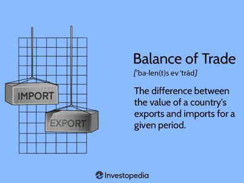

The intricate relationship between a nation's economic performance and its trading activities is crucial in shaping global economics. This relationship is underscored by indices such as Gross Domestic Product (GDP) and the balance of trade, both of which serve as key indicators in assessing a country's economic health and its position in the global market. Understanding these economic parameters is essential not only for policymakers and economists but also for investors engaged in algorithmic trading, where rapid analysis of economic data can offer competitive advantages.

GDP, which represents the total market value of all finished goods and services produced within a country, provides a broad measure of a nation's economic activity. However, its calculation often involves complex methodologies, including the incorporation of factors such as consumption, investment, government spending, and net exports. The latter component, net exports, underscores the connection between GDP and the balance of trade, highlighting how a country's trade activities can markedly influence its economic performance.



The balance of trade, which is the difference between a country’s exports and imports, directly impacts GDP calculations by affecting the net exports metric. A trade surplus, where exports exceed imports, adds positively to a country's GDP, whereas a trade deficit can have a dampening effect on economic growth. These dynamics not only impact national economic policies but also play a significant role in international economic strategies and alliances.

For algorithmic trading, the real-time processing of economic indicators, including GDP and trade balances, is vital. Traders employ algorithms to predict market movements based on economic reports and historical trends. Such strategies depend on an in-depth understanding of how countries manage their economic policies to foster sustainability and growth. By leveraging the insights derived from these economic indicators, traders can make informed decisions, aligning their trading strategies with the prevailing economic environment.

In conclusion, grasping the nuances of GDP calculations and trade balance is critical for comprehending and predicting economic trends, enabling countries and investors to navigate the complexities of global economics with greater precision.

## Table of Contents

## GDP and Trade Balance: Basic Concepts

Gross Domestic Product (GDP) is a key economic indicator that measures the market value of all finished goods and services produced within the borders of a nation over a specified period. This metric serves as a comprehensive measure of a nation’s economic activity and health. Real GDP, which accounts for inflation, is often used to provide a more accurate depiction of an economy's size and how it is performing over time. Calculating GDP involves aggregating total production output, investment, government spending, and net exports, using the formula:

$$
\text{GDP} = C + I + G + (X - M)
$$

where $C$ stands for consumption, $I$ is investment, $G$ is government spending, and $(X - M)$ represents net exports, which is the difference between exports $X$ and imports $M$.

The balance of trade is a critical component of GDP, representing the difference between a nation's exports and imports. It is a significant indicator of a country's international economic position. A positive trade balance, known as a trade surplus, occurs when exports exceed imports, potentially increasing the GDP. Conversely, a trade deficit, where imports surpass exports, can lower GDP, indicating that more goods and services are being purchased from abroad than are being sold internationally.

Understanding the fundamentals of GDP and trade balance is essential as they have significant implications for national and global economic policies. Changes in either can influence monetary policy, exchange rates, and economic strategy. For instance, countries with sustained trade deficits might experience currency devaluation, which could make exports cheaper and more competitive globally but also increase the cost of imports, impacting domestic consumers and industries relying on foreign goods.

These economic indicators are vital for policymakers and economists to assess economic health, inform fiscal and monetary policy decisions, and evaluate overall performance within the global economic framework. As these components interact, they not only reflect the current state of the economy but also its trajectory and potential for growth.

## The Impact of Trade Balance on GDP

A trade balance significantly impacts a nation's Gross Domestic Product (GDP) by either contributing to or detracting from economic growth. When a country experiences a trade surplus, where the value of its exports surpasses that of its imports, this generally results in a positive contribution to GDP. This favorable condition stems from the infusion of foreign capital into the domestic economy, which can stimulate production, enhance domestic job creation, and support investments in various sectors.

Conversely, a trade deficit, characterized by imports exceeding exports, can impose constraints on economic growth. This situation may lead to a higher level of borrowing from foreign entities to finance the deficit, consequently increasing the nation's foreign debt load. Moreover, persistent trade deficits can lead to devaluation of the national currency, thereby potentially increasing the cost of imported goods and causing inflationary pressures. These financial strains necessitate careful economic policy management to mitigate negative impacts.

National debates on trade strategies often revolve around these dynamics. Policymakers focus on balancing import-export flows to maintain economic stability. For instance, countries may implement protectionist policies, such as tariffs and import quotas, to reduce trade deficits or encourage domestic production. Alternatively, they might engage in free trade agreements aimed at enhancing export opportunities, thus moving toward a trade surplus.

Overall, the impact of the trade balance on GDP is profound, influencing economic policies and strategic decision-making at the national level. Recognizing the significance of maintaining a favorable trade balance is crucial for sustainable economic growth and financial health of a nation.

## Algorithmic Trading and Economic Indicators

Algorithmic trading, which automates trading decisions through the use of computer algorithms, relies extensively on economic indicators such as GDP and trade balances. These indicators serve as crucial inputs for the algorithms that predict market movements, enabling traders to make informed investment decisions. Key economic reports and trends influence algorithmic strategies by providing a quantitative basis for anticipating future market dynamics.

Economic indicators like GDP and trade balances provide data that algorithms analyze to assess macroeconomic health and forecast potential market developments. For instance, GDP growth can signify a robust economy, potentially driving stock prices upward. Alternatively, a declining GDP might signal economic slowdown, influencing bearish market outlooks. Likewise, a positive trade balance, or trade surplus, can elevate a country's currency value, affecting [forex](/wiki/forex-system) markets heavily traded through algorithmic platforms.

Traders operationalize this data by employing complex, often proprietary algorithms. These algorithms analyze large datasets to detect patterns and generate buy or sell signals. For example, a commonly used approach involves correlational analysis of GDP growth rates with stock market performance. Python libraries such as pandas and NumPy are frequently used to manipulate and explore this data, while [machine learning](/wiki/machine-learning) libraries like scikit-learn can advance predictive accuracy.

```python
import pandas as pd
import numpy as np
from sklearn.linear_model import LinearRegression

# Example: Predicting stock index movement based on GDP data
def predict_market_movement(gdp_data, market_index_data):
    # Prepare data
    X = np.array(gdp_data).reshape(-1, 1)
    y = np.array(market_index_data)

    # Create and train the model
    model = LinearRegression()
    model.fit(X, y)

    # Output the predictions
    predictions = model.predict(X)
    return predictions

gdp_data = [2.3, 2.6, 3.0, 2.8, 3.1]  # Example GDP growth rates
market_index_data = [1500, 1520, 1545, 1530, 1560]  # Example market index values

predicted_market = predict_market_movement(gdp_data, market_index_data)
print(predicted_market)
```

Moreover, understanding the nuances of GDP and trade balance is essential for optimizing trading strategies. For example, unexpected changes in these indicators can trigger [algorithmic trading](/wiki/algorithmic-trading) systems to adjust their positions instantaneously, capitalizing on market opportunities or mitigating potential losses. As such, a comprehensive grasp of these economic indicators not only aids in refining algorithmic strategies but also enhances the robustness of forecasting models.

In sum, GDP and trade balance are invaluable components in the toolkit of algorithmic traders. Their effective integration into algorithmic models empowers traders to navigate the nuances of complex economic landscapes, ultimately striving for profitable and efficient market participation.

## Interdependencies between GDP and Trade Balance

The interdependencies between Gross Domestic Product (GDP) and the balance of trade are both reciprocal and multifaceted, influencing each other in various ways. GDP, which is a measure of the total economic output of a country, often rises due to a combination of factors, including increased consumer spending, government expenditure, and notably, net exports (exports minus imports). A simple formula to express this relationship in the context of a closed economy is:

$$
\text{GDP} = C + I + G + (X - M)
$$

where $C$ is consumer spending, $I$ is investment by businesses, $G$ is government spending, $X$ represents exports, and $M$ denotes imports. 

In an economic environment where GDP is on the rise, there is often an increase in consumer purchasing power, leading to higher demand for both domestic and foreign goods. This heightened demand can subsequently result in increased imports, potentially leading to a trade deficit if the value of imports outweighs exports. A persistent trade deficit can exert a negative pressure on GDP, as it implies that more money is leaving the economy than is coming in through trade.

Conversely, a trade surplus, which occurs when a country's exports exceed its imports, can have a positive impact on GDP. A trade surplus contributes to GDP growth by providing an influx of foreign currency, strengthening domestic industries, and improving the overall financial health of a nation. Countries with robust trade surpluses often experience enhanced economic stability and a higher capacity for investment in infrastructure and social programs.

These interdependencies suggest that the relationship between GDP and trade balance is intricate. For instance, while a growing GDP can lead to increased imports, thereby affecting the trade balance, strong export performance can reinforce GDP growth. Policymakers must therefore consider these interactions when developing strategies to foster economic resilience.

Analyzing these relationships offers insights into a nation's broader economic status. An improved understanding can aid in crafting economic policies that balance the act of sustaining GDP growth while maintaining a healthy trade balance. As such, adjusting economic policies to optimize both GDP and trade balance is central to promoting long-term economic prosperity.

## Countries with Notable Trade Balances

China and Germany are exemplary case studies of nations with significant trade surpluses, highlighting strategies that bolster GDP growth. Both countries have leveraged export-oriented economic models, focusing on high-quality manufacturing and innovation, which contribute positively to their GDP. The trade surpluses experienced by these nations not only elevate their economic standing globally but also provide insights into successful economic management practices.

China has ascended to the position of the world's largest exporter by capitalizing on its vast labor force, which enables competitive pricing in the global market. A pivotal aspect of China's approach is its investment in technology and infrastructure, enhancing the production capacity and quality of goods. Furthermore, the Belt and Road Initiative has expanded its trade network, further reinforcing its trade surplus. This surplus enriches the national treasury, which can be reinvested into the economy, promoting sustained GDP growth.

Germany's trade surplus, largely attributed to its export of high-quality machinery, vehicles, and chemical products, demonstrates the benefits of specialization and innovation. The country's strong industrial base, coupled with a focus on engineering and precision manufacturing, has positioned it as a leader in global trade. Additionally, Germany's commitment to renewable energy and environmental sustainability increases its competitiveness in emerging markets, supporting both GDP growth and trade balance positively.

Conversely, countries with trade deficits like the United States face distinct economic challenges. The U.S. trade deficit, characterized by higher imports than exports, impacts its GDP and necessitates borrowing from foreign entities to finance this imbalance. While a strong dollar and consumer-driven economy facilitate the import of diverse goods, the trade deficit can strain economic growth and lead to discussions on trade protectionism and tariffs as potential solutions.

These case studies underscore the importance of strategic economic planning and the need for a balanced approach to trade. A trade surplus can significantly contribute to a nation's GDP, but it requires a foundation of strong production capabilities, innovation, and global market integration. Conversely, managing a trade deficit involves navigating complex economic terrain and potential policy adjustments to mitigate its impact on growth. The experiences of these countries provide valuable lessons in achieving sustainable economic development and navigating the global economic landscape.

## The Future of Global Trade and Economic Growth

Technological innovation, policy changes, and shifts in consumer behavior significantly influence the future landscape of global trade and economic growth. As the digital era advances, technology plays an increasingly pivotal role in streamlining trade processes, enhancing supply chain efficiency, and reducing barriers to entry for businesses. Automation and [artificial intelligence](/wiki/ai-artificial-intelligence) are transforming manufacturing and logistics, allowing for faster, more efficient operations. The adoption of blockchain technology provides transparency and security in trade transactions, reducing fraud and increasing trust among trading partners.

Policy changes also shape the future of global trade. Governments worldwide are reevaluating trade agreements and imposing regulations that reflect new economic realities and geopolitical considerations. Protectionist policies may alter traditional trade routes and partnerships; however, they also open opportunities for regional trade agreements where neighboring countries collaborate to create mutually beneficial markets. These agreements often encourage economic integration and facilitate smoother cross-border trades.

Shifts in consumer behavior are equally impactful. As consumers become more aware of environmental issues, there is a growing demand for sustainable trade practices. This trend prompts businesses to adopt greener methods and focus on reducing their carbon footprints, influencing global supply chains. Furthermore, e-commerce continues to rise, reshaping retail trade and pushing companies to innovate in logistics and last-mile delivery to cater to consumer preferences for speed and convenience.

Understanding these trends is essential for stakeholders—governments, businesses, and investors—to adapt and thrive in a dynamic economic landscape. By recognizing the importance of sustainable practices and leveraging technological advancements, stakeholders can position themselves strategically in the global market. The ability to predict and respond to these evolving trends will determine which players successfully navigate future global trade challenges and opportunities. Overall, embracing innovation, aligning policies with new realities, and addressing consumer demands are critical to achieving sustainable economic growth in the interconnected world economy.

## Conclusion

The interplay between GDP, trade balance, and algorithmic trading underscores the complexity inherent in global economics. At the core of this complexity is the understanding that each of these elements—Gross Domestic Product (GDP), trade balance, and algorithmic trading—significantly influences economic stability and growth. GDP, as a measure of economic output, provides insights into a country's economic activity, whereas the trade balance indicates the health of a nation's foreign trade relationships. Algorithmic trading leverages these economic indicators to enhance investment strategies, reflecting their integrative role in modern market operations.

Stakeholders, including policymakers, investors, and enterprises, must consider these factors in crafting policies and strategies aimed at achieving sustainable economic growth. For policymakers, this involves fostering an environment where GDP growth is balanced with a favorable trade position. This requires strategic decisions on tariffs, subsidies, and trade agreements that either stimulate exports or control imports in alignment with national economic objectives. From the perspective of investors and businesses, understanding the implications of GDP fluctuations and trade balances can significantly impact investment decisions and risk assessments.

By effectively navigating these dynamics, countries can position themselves advantageously for future challenges and opportunities. Economic policies that emphasize sustainable trade practices and encourage high-value exports may contribute to a positive trade balance, thereby supporting GDP growth. Simultaneously, embracing technological advances in algorithmic trading can optimize capital allocation and market predictions, granting stakeholders a competitive edge in an ever-evolving global economy.

Ultimately, the integration of GDP, trade balance, and algorithmic trading considerations empowers nations to craft comprehensive economic strategies that not only address current economic challenges but also anticipate and adapt to future global economic shifts. This proactive approach ensures that nations remain resilient and competitive in a rapidly changing economic landscape.

## References & Further Reading

[1]: Krugman, P., & Obstfeld, M. (2008). ["International Economics: Theory and Policy."](https://books.google.com/books/about/International_Economics.html?id=NZnk5C2r8qEC) Pearson Education.

[2]: ["Advances in Financial Machine Learning"](https://www.amazon.com/Advances-Financial-Machine-Learning-Marcos/dp/1119482089) by Marcos Lopez de Prado.

[3]: Dornbusch, R., Fischer, S., & Startz, R. (2013). ["Macroeconomics."](https://books.google.com/books/about/EBOOK_Macroeconomics.html?id=KoZvEAAAQBAJ) McGraw-Hill Education.

[4]: ["Quantitative Trading: How to Build Your Own Algorithmic Trading Business"](https://www.amazon.com/Quantitative-Trading-Build-Algorithmic-Business/dp/1119800064) by Ernest P. Chan.

[5]: Sacchi, D. (2019). ["The Balance of Trade and Economic Growth: From the Mercantilists to Friedman."](https://quizlet.com/206336499/chapter-6-international-trade-theory-flash-cards/) In: C. Ciccarone, D. Dal Degan (eds), Government Factor, Palgrave Macmillan.

[6]: Salvatore, D. (2019). ["International Economics"](https://books.google.com/books/about/International_Economics.html?id=H-CzDwAAQBAJ) by Dominick Salvatore.

[7]: Jansen, S. (2020). ["Machine Learning for Algorithmic Trading."](https://github.com/stefan-jansen/machine-learning-for-trading) Packt Publishing.