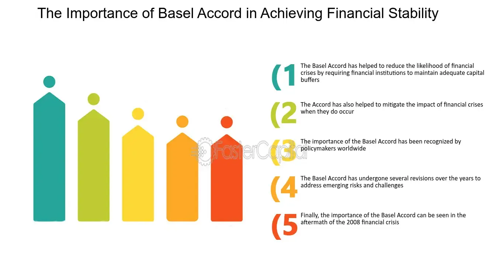

## Table of Contents

## What are the Basel Accords?

The Basel Accords are a set of international banking regulations developed by the Basel Committee on Banking Supervision (BCBS). The main goal of these accords is to make sure banks have enough money set aside to cover potential losses and to keep the global financial system stable. The first Basel Accord, known as Basel I, was introduced in 1988. It focused on the capital adequacy of banks, requiring them to hold a certain amount of capital based on the riskiness of their assets.

Over time, the Basel Accords have evolved to address more complex financial risks. Basel II, introduced in 2004, expanded on Basel I by including more detailed risk assessments and allowing banks to use their own internal models to calculate risk. This was intended to make the regulations more flexible and better suited to individual banks. However, the 2008 financial crisis showed that more improvements were needed, leading to Basel III in 2010. Basel III added stricter capital requirements, introduced new liquidity standards, and aimed to reduce the risk of bank failures by ensuring banks could withstand economic stress.

## What is the primary goal of the Basel Accords?

The main goal of the Basel Accords is to make sure banks have enough money to cover potential losses and to keep the global financial system stable. These rules help prevent banks from failing by requiring them to keep a certain amount of money, called capital, based on how risky their activities are. This way, if something goes wrong, banks can use this money to fix the problem without causing bigger issues in the economy.

The Basel Accords started with Basel I in 1988, which focused on making sure banks had enough capital. Over time, as the financial world got more complex, the rules were updated. Basel II in 2004 added more detailed ways to measure risk, and Basel III in 2010 made the rules even stricter after the 2008 financial crisis. These updates were meant to make the banking system safer and more able to handle tough economic times.

## How have the Basel Accords evolved over time?

The Basel Accords started with Basel I in 1988. This was the first set of rules to make sure banks had enough money, called capital, to cover losses. Basel I was simple and focused on the riskiness of a bank's assets. It said banks needed to keep a certain amount of capital based on how risky their loans and investments were. This was a big step to make the banking system safer around the world.

As time went on, the financial world got more complicated, so the rules needed to change. In 2004, Basel II came along. It added more detailed ways to measure risk and let banks use their own methods to figure out how much capital they needed. This made the rules more flexible but also more complex. However, the 2008 financial crisis showed that even these rules weren't enough. So, in 2010, Basel III was introduced. It made the rules stricter, added new requirements for liquidity, and aimed to make sure banks could handle tough economic times better. Each update tried to keep up with the changing world of finance and make the banking system safer.

## What are the key components of Basel I, II, and III?

Basel I, introduced in 1988, was the first set of rules to make sure banks had enough money to cover losses. It focused on the idea of "capital adequacy," which means banks needed to keep a certain amount of money based on how risky their loans and investments were. The rules were simple and said that banks should have at least 8% capital for their riskiest assets. This was a big step to make the banking system safer around the world by making sure banks had enough money to handle problems if they came up.

As the financial world got more complicated, Basel II came along in 2004. It added more detailed ways to measure risk and let banks use their own methods to figure out how much capital they needed. This made the rules more flexible but also more complex. Basel II had three main parts: minimum capital requirements, supervisory review, and market discipline. These parts worked together to make sure banks had enough money and were being watched closely to make sure they were following the rules.

After the 2008 financial crisis showed that even these rules weren't enough, Basel III was introduced in 2010. It made the rules stricter and added new requirements for liquidity, which means banks needed to have enough cash or assets that could be quickly turned into cash. Basel III aimed to make sure banks could handle tough economic times better. It increased the amount of capital banks needed to hold, introduced new ways to measure risk, and added rules to make sure banks had enough money to keep going even during a crisis. Each update tried to keep up with the changing world of finance and make the banking system safer.

## How do the Basel Accords aim to enhance financial stability?

The Basel Accords aim to enhance financial stability by making sure banks have enough money to cover losses. They do this by setting rules that tell banks how much money, called capital, they need to keep based on how risky their loans and investments are. This is important because if a bank loses money, it can use this capital to fix the problem without causing bigger issues in the economy. The first set of rules, Basel I, started this by saying banks needed at least 8% capital for their riskiest assets. This was a big step to make the banking system safer around the world.

As the financial world got more complicated, the rules were updated to keep up. Basel II added more detailed ways to measure risk and let banks use their own methods to figure out how much capital they needed. This made the rules more flexible but also more complex. After the 2008 financial crisis, Basel III made the rules even stricter. It added new requirements for liquidity, which means banks needed to have enough cash or assets that could be quickly turned into cash. This was to make sure banks could handle tough economic times better. Each update tried to keep the banking system safer by making sure banks had enough money to deal with problems if they came up.

## What specific measures in the Basel Accords address bank capital requirements?

The Basel Accords set rules to make sure banks have enough money, called capital, to cover losses. Basel I, which started in 1988, said banks need at least 8% capital for their riskiest assets. This was a simple rule to make the banking system safer. It looked at how risky a bank's loans and investments were and made sure they had enough money to handle problems if they came up.

As the financial world got more complicated, the rules were updated. Basel II, introduced in 2004, added more detailed ways to measure risk. It let banks use their own methods to figure out how much capital they needed, which made the rules more flexible but also more complex. After the 2008 financial crisis, Basel III made the rules even stricter. It increased the amount of capital banks needed to hold and introduced new ways to measure risk, aiming to make sure banks could handle tough economic times better.

## How do the Basel Accords impact risk management practices in banks?

The Basel Accords have a big impact on how banks manage risk. They make banks think carefully about how risky their loans and investments are. By making banks keep a certain amount of money, called capital, based on these risks, the Basel Accords push banks to be more careful. Banks have to look closely at their activities and make sure they're not taking too many risks. This helps them avoid big losses and keeps the whole financial system safer.

Over time, the Basel Accords have gotten more detailed and strict. Basel II let banks use their own ways to figure out how much capital they need, which made them think even more about risk. After the 2008 financial crisis, Basel III made the rules even tougher. It added new rules about having enough cash, called liquidity, to make sure banks can handle tough times. All these changes make banks focus more on managing risk well, so they can keep going even if things go wrong.

## What are the criticisms of the Basel Accords in terms of their effectiveness on financial stability?

Some people think the Basel Accords don't work as well as they should to keep the financial system safe. One big criticism is that the rules are too complicated. Banks have to use a lot of math and special models to figure out how much money they need to keep. This can make it hard for everyone to understand what's going on, and it might let banks hide risks in ways that the rules don't catch. Also, some say the rules focus too much on how much money banks have, called capital, but not enough on other important things, like how banks behave and the risks they take.

Another problem is that the Basel Accords might make banks take similar risks, which can be dangerous for the whole financial system. If all banks follow the same rules and do the same things, a problem in one bank can quickly spread to others. This is called "herding behavior." Critics also say that the rules might not be strict enough for the biggest banks, which can cause big problems if they fail. Even though the Basel Accords try to make banks safer, some people think they need to be simpler and cover more types of risks to really work well.

## How have different countries implemented the Basel Accords, and what variations exist?

Different countries have implemented the Basel Accords in their own way, which can lead to some differences. Some countries follow the rules very closely, while others might change them a bit to fit their own banking systems. For example, the United States has its own set of rules called the Dodd-Frank Act, which adds extra rules on top of the Basel Accords. In Europe, the European Union has its own version of the rules, called the Capital Requirements Regulation (CRR) and the Capital Requirements Directive (CRD), which also follow the Basel Accords but with some changes to fit the European banking system.

These variations can happen because each country has its own way of doing things and might want to add extra rules or take away some parts of the Basel Accords. For instance, some countries might have stricter rules about how much money banks need to keep, while others might focus more on how banks behave and the risks they take. Even though the goal of the Basel Accords is to make the global financial system safer, these differences mean that banks in different countries might have to follow slightly different rules. This can make it harder to compare banks from different places and can affect how well the rules work to keep the whole financial system stable.

## What are the economic impacts of the Basel Accords on global financial markets?

The Basel Accords have a big impact on global financial markets by making banks safer and more stable. They do this by making sure banks have enough money to cover losses, which helps prevent banks from failing. When banks are safer, people and businesses feel more confident about putting their money in banks. This can help the economy grow because banks can lend more money to people and businesses, which can lead to more spending and investment. But, the rules can also make it harder for banks to lend money because they have to keep more money as a safety net. This might slow down the economy a bit if banks are too careful and don't lend as much.

On the other hand, the Basel Accords can make the global financial markets more stable. By setting rules that all countries follow, they help make sure that problems in one country's banks don't spread to others. This is good for the whole world because it reduces the chance of a big financial crisis. But, because different countries might change the rules a bit to fit their own needs, there can be some differences in how banks in different places work. This can make it harder for people to compare banks from different countries and might affect how well the rules work to keep the whole financial system stable.

## How do the Basel Accords influence the behavior of financial institutions during economic downturns?

The Basel Accords make banks more careful during economic downturns. They have to keep a certain amount of money, called capital, to cover losses. This means banks might lend less money when times are tough because they need to make sure they have enough money to stay safe. If banks are too careful and don't lend much, it can slow down the economy because businesses and people might not get the money they need to keep going.

On the other hand, the Basel Accords can help keep the financial system stable during downturns. By making sure banks have enough money, they can handle problems better and are less likely to fail. This makes people and businesses feel more confident about putting their money in banks, which can help the economy recover faster. But, because different countries might change the rules a bit, banks in different places might act a little differently during tough times.

## What future developments or amendments are expected for the Basel Accords to further enhance financial stability?

The Basel Accords will likely keep changing to make the financial system even safer. One big thing that might happen is making the rules simpler. Right now, the rules are very complicated, which can make it hard for everyone to understand them. If the rules were simpler, it might be easier to make sure banks are following them and to see if they're really making the system safer. Another change could be focusing more on different types of risks, like how banks behave and the risks they take, not just how much money they have.

Also, the Basel Accords might need to think more about new kinds of risks, like those from technology and climate change. As the world changes, new problems can come up that the old rules might not cover. For example, more banks are using technology, which can bring new risks. And climate change can cause big problems for banks, too. So, the rules might need to change to make sure banks can handle these new risks. By keeping up with these changes, the Basel Accords can help keep the financial system stable for the future.

## What is Basel I: The Foundation of Risk-Based Capital Requirements?

The Basel I Accord, introduced in 1988 by the Basel Committee on Banking Supervision, established a foundational framework for risk-based capital requirements for international banks. Central to Basel I was the requirement that banks maintain a minimum capital ratio of 8% of their risk-weighted assets. This was a critical step in ensuring that banks held sufficient capital reserves to guard against financial distress and promote stability within the global financial system.

The focal point of Basel I was capital adequacy, which refers to a bank's capacity to absorb losses given its risk exposure. By introducing risk-weighted assets, Basel I sought to account for the varying risk levels associated with different types of bank assets. Under this system, assets are classified into broad categories based on risk, with risk weights assigned to each category. For instance, government bonds typically receive a lower risk weight compared to unsecured consumer loans.

This framework can be mathematically expressed by the formula:

$$
\text{Capital Ratio} = \frac{\text{Capital}}{\text{Risk-Weighted Assets}}
$$

Where:

- Capital includes Tier 1 (core) and Tier 2 (supplementary) capital.
- Risk-Weighted Assets are determined by multiplying the value of each asset by its risk weight and summing them.

Despite its pioneering approach, Basel I faced criticism for its simplified risk differentiation. The accord primarily concentrated on credit risk but did not adequately account for other types of risks, such as operational or market risk. As a result, the framework became less effective over time as financial instruments and markets became more complex.

Nevertheless, Basel I marked the advent of a standardized regulatory protocol for international banks, shaping subsequent reforms such as Basel II and III. Its introduction was instrumental in harmonizing banking regulations across countries and served as the first step towards a more resilient financial system globally.

## What is Basel III: Addressing Shortcomings and Introducing New Safeguards?

In the wake of the 2008 financial crisis, the Basel III framework was established to address the deficiencies observed in the global banking sector and strengthen financial stability. One of the significant changes introduced by Basel III is the enhancement of capital requirements, aiming to ensure that banks hold more robust capital reserves to withstand financial distress.

The elimination of Tier 3 capital, which was previously used to cover market risks, marked a shift towards a more stringent capital base. Basel III introduced a capital conservation buffer, set at 2.5% of risk-weighted assets, to complement the existing minimum capital requirements. This buffer is intended to ensure that banks build up capital surpluses during prosperous economic periods, which can be drawn upon during times of financial stress.

Moreover, Basel III established the introduction of a leverage ratio to prevent excessive on and off-balance-sheet leverage. This non-risk-based measure acts as a safeguard against model risk and measurement error, supplementing the risk-weighted capital ratios.

Liquidity risk management was another critical focus area. Basel III introduced two pivotal [liquidity](/wiki/liquidity-risk-premium) standards:

1. **Liquidity Coverage Ratio (LCR):** This requires banks to hold a sufficient reserve of high-quality liquid assets (HQLA) to cover net cash outflows over a 30-day stress period.
$$
   \text{LCR} = \frac{\text{Stock of HQLA}}{\text{Total net cash outflows over a 30-day period}} \geq 100\%

$$

2. **Net Stable Funding Ratio (NSFR):** This ratio aims to promote longer-term funding of assets and activities over a one-year time horizon, thereby promoting a more stable balance sheet structure.
$$
   \text{NSFR} = \frac{\text{Available stable funding (ASF)}}{\text{Required stable funding (RSF)}} \geq 100\%

$$

By addressing the necessity for higher capital, efficient leverage control, and superior liquidity management, Basel III aims to mitigate the risk of systemic crises and reduce the likelihood of requiring government-funded bailouts. These comprehensive reforms ensure that banks are more resilient to economic shocks, thereby contributing to the stability and integrity of the global financial system.

## References & Further Reading

[1]: Basel Committee on Banking Supervision. (2011). ["Basel III: A global regulatory framework for more resilient banks and banking systems."](https://www.bis.org/publ/bcbs189.htm) Bank for International Settlements.

[2]: Basel Committee on Banking Supervision. (2006). ["International Convergence of Capital Measurement and Capital Standards: A Revised Framework (Comprehensive Version)."](https://www.bis.org/publ/bcbs128.htm) Bank for International Settlements.

[3]: Goodhart, C. A. E. (2011). ["The Basel Committee on Banking Supervision: A History of the Early Years 1974-1997."](https://centerforfinancialstability.org/research/Goodhart_front_matter.pdf) Cambridge University Press.

[4]: Hellwig, M. (2010). ["Capital Regulation after the Crisis: Business as Usual?"](https://papers.ssrn.com/sol3/papers.cfm?abstract_id=1645224) Journal of Financial Stability, 123-129.

[5]: Tarullo, D. K. (2008). ["Banking on Basel: The Future of International Financial Regulation."](https://archive.org/details/bankingonbaselfu0000taru) Peterson Institute for International Economics.

[6]: Lopez de Prado, M. (2018). ["Advances in Financial Machine Learning."](https://www.amazon.com/Advances-Financial-Machine-Learning-Marcos/dp/1119482089) Wiley.

[7]: Acharya, V. V., & Richardson, M. (2009). ["Restoring Financial Stability: How to Repair a Failed System."](https://onlinelibrary.wiley.com/doi/book/10.1002/9781118258163) Wiley.

[8]: Hull, J. (2015). ["Risk Management and Financial Institutions."](https://books.google.com/books/about/Risk_Management_and_Financial_Institutio.html?id=1J1QDwAAQBAJ) Wiley.