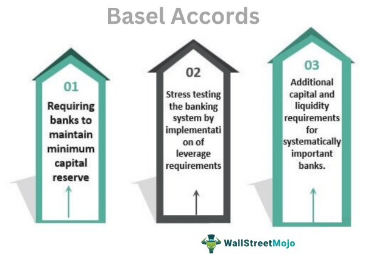

The global financial market functions as a complex ecosystem, encompassing a myriad of players such as local banks, central banks, investors, and regulatory bodies. This intricate network is vital for economic growth and stability in daily life. Financial markets facilitate capital flow, investment opportunities, and risk distribution, which stimulate economic development. The stability of these markets is paramount, as financial turmoil can lead to widespread economic disruptions, affecting both developed and developing nations.

Financial stability is maintained through a web of regulatory frameworks, among which the Basel Accords stand out. These are international banking regulatory agreements formulated by the Basel Committee on Banking Supervision (BCBS) to bolster global financial security. The Basel Accords, including Basel I, II, and III, establish standardized guidelines for risk management, capital adequacy, and banking regulation. This, in turn, helps mitigate financial shocks that threaten the health of the global finance system.



The Basel Accords have become an essential component of international finance, promoting a balanced approach to banking regulation through mechanisms designed to preclude systemic collapses. Their influence is far-reaching, affecting not just traditional banking practices, but also newer areas such as algorithmic trading—a domain increasingly significant in high-frequency financial environments.

This article intends to examine the role of the Basel Accords in preventing financial disruptions and analyze their implications on banking regulations and the evolving landscape of algorithmic trading. Through this exploration, we aim to highlight how these accords contribute to a more robust and stable financial infrastructure, thereby enabling sustained economic growth and minimizing the risk of financial crises.

## Table of Contents

## Understanding the Basel Accords

The Basel Accords, formulated by the Basel Committee on Banking Supervision, represent a series of international regulatory measures designed to solidify the stability of the global financial system. Comprised of three primary frameworks—Basel I, Basel II, and Basel III—these accords establish guidelines aimed at bolstering capital adequacy and enhancing risk management practices among banks worldwide.

The principal goal of the Basel Accords is to ensure that banks maintain a solid financial foundation to withstand periods of economic distress. This is primarily achieved through the imposition of minimum capital requirements. Essentially, banks are required to retain a certain percentage of their risk-weighted assets as capital. This concept ensures that banks have enough available capital to sustain potential losses, thereby promoting overall financial stability.

Another crucial element of the Basel Accords is the supervisory review process. This involves continuous monitoring and evaluation of banks by regulatory bodies to assess their adherence to the stipulated capital requirements and to ensure sound risk management practices. This process not only provides an additional layer of oversight but also allows for timely intervention by authorities, should any irregularities or weaknesses be identified within a bank's financial health.

Market discipline forms the third core component of the Basel Accords. This principle emphasizes the importance of transparency in a bank's operations and financial disclosures. By mandating that banks release pertinent information to the public, the accords facilitate a higher level of accountability. Market participants, in turn, can make informed decisions based on the disclosed information, thereby exerting pressure on banks to operate prudently.

In summary, the Basel Accords offer a comprehensive framework that seeks to enhance the resilience of the banking sector. Through stringent capital requirements, systematic supervisory reviews, and the promotion of transparency, the accords establish a structured approach to managing risk and ensuring the ongoing health of the global financial system.

## Basel I: The Foundation of Risk-Based Capital Requirements

The Basel I Accord, introduced in 1988 by the Basel Committee on Banking Supervision, established a foundational framework for risk-based capital requirements for international banks. Central to Basel I was the requirement that banks maintain a minimum capital ratio of 8% of their risk-weighted assets. This was a critical step in ensuring that banks held sufficient capital reserves to guard against financial distress and promote stability within the global financial system.

The focal point of Basel I was capital adequacy, which refers to a bank's capacity to absorb losses given its risk exposure. By introducing risk-weighted assets, Basel I sought to account for the varying risk levels associated with different types of bank assets. Under this system, assets are classified into broad categories based on risk, with risk weights assigned to each category. For instance, government bonds typically receive a lower risk weight compared to unsecured consumer loans.

This framework can be mathematically expressed by the formula:

$$
\text{Capital Ratio} = \frac{\text{Capital}}{\text{Risk-Weighted Assets}}
$$

Where:

- Capital includes Tier 1 (core) and Tier 2 (supplementary) capital.
- Risk-Weighted Assets are determined by multiplying the value of each asset by its risk weight and summing them.

Despite its pioneering approach, Basel I faced criticism for its simplified risk differentiation. The accord primarily concentrated on credit risk but did not adequately account for other types of risks, such as operational or market risk. As a result, the framework became less effective over time as financial instruments and markets became more complex.

Nevertheless, Basel I marked the advent of a standardized regulatory protocol for international banks, shaping subsequent reforms such as Basel II and III. Its introduction was instrumental in harmonizing banking regulations across countries and served as the first step towards a more resilient financial system globally.

## Basel II: Enhancing the Regulatory Framework

Basel II, introduced in 2004 by the Basel Committee on Banking Supervision, sought to refine the regulatory landscape for international banking by utilizing a comprehensive three-pillar approach. This framework focused on enhancing banks' capacity to manage risk effectively, particularly with respect to credit and operational risks.

### Three-Pillar Approach

1. **Minimum Capital Requirements**: Basel II refined the capital adequacy requirements that were initially established under Basel I. It introduced more sophisticated mechanisms for measuring risk and determining the necessary capital reserves that banks must hold. The accord aimed to align the capital requirements more closely with the actual risk levels, thereby ensuring that banks maintained sufficient capital to cover potential losses. Notably, Basel II offered several approaches to calculate credit risk, including the Standardized Approach, the Foundation Internal Ratings-Based (F-IRB) Approach, and the Advanced Internal Ratings-Based (A-IRB) Approach. Each of these methods provided varying levels of complexity and risk sensitivity.

2. **Supervisory Review Process**: The second pillar emphasized the need for regulatory bodies to engage in a thorough assessment of banks’ internal risk management strategies. This pillar was intended to provide a regulatory framework within which national supervisors could evaluate whether banks were adequately capitalized vis-à-vis their risk profiles. Supervisors were granted the authority to encourage banks to engage in steps beyond minimum capital requirements if deemed necessary, fostering an environment where banks could operate cautiously and ensure robust risk management practices.

3. **Market Discipline**: The third pillar aimed to complement the minimum capital requirements and supervisory reviews by leveraging market discipline as a regulatory tool. It required banks to disclose meaningful and transparent data about their risk exposures, capital, and risk assessment processes. Such disclosures were intended to empower the market participants, enabling them to make well-informed decisions and exert pressure on banks to maintain sound risk management practices.

### Challenges and Interruption Due to the Financial Crisis

Basel II's implementation was significantly disrupted by the financial crisis of 2007-2008. The crisis exposed vulnerabilities in the global banking system, leading to criticisms that Basel II underestimated the severity of systemic risks and relied too heavily on banks' internal risk assessments. The procyclicality of Basel II's capital requirements was also a concern, as it led to decreased lending during economic downturns, exacerbating financial instability.

Despite these challenges, Basel II marked a critical evolution in banking regulations, laying the foundation for more rigorous frameworks such as Basel III. The experience gained during its implementation underscored the need for continuous adaptation of regulatory mechanisms to better address emergent financial risks.

## Basel III: Addressing Shortcomings and Introducing New Safeguards

In the wake of the 2008 financial crisis, the Basel III framework was established to address the deficiencies observed in the global banking sector and strengthen financial stability. One of the significant changes introduced by Basel III is the enhancement of capital requirements, aiming to ensure that banks hold more robust capital reserves to withstand financial distress.

The elimination of Tier 3 capital, which was previously used to cover market risks, marked a shift towards a more stringent capital base. Basel III introduced a capital conservation buffer, set at 2.5% of risk-weighted assets, to complement the existing minimum capital requirements. This buffer is intended to ensure that banks build up capital surpluses during prosperous economic periods, which can be drawn upon during times of financial stress.

Moreover, Basel III established the introduction of a leverage ratio to prevent excessive on and off-balance-sheet leverage. This non-risk-based measure acts as a safeguard against model risk and measurement error, supplementing the risk-weighted capital ratios.

Liquidity risk management was another critical focus area. Basel III introduced two pivotal [liquidity](/wiki/liquidity-risk-premium) standards:

1. **Liquidity Coverage Ratio (LCR):** This requires banks to hold a sufficient reserve of high-quality liquid assets (HQLA) to cover net cash outflows over a 30-day stress period.
$$
   \text{LCR} = \frac{\text{Stock of HQLA}}{\text{Total net cash outflows over a 30-day period}} \geq 100\%

$$

2. **Net Stable Funding Ratio (NSFR):** This ratio aims to promote longer-term funding of assets and activities over a one-year time horizon, thereby promoting a more stable balance sheet structure.
$$
   \text{NSFR} = \frac{\text{Available stable funding (ASF)}}{\text{Required stable funding (RSF)}} \geq 100\%

$$

By addressing the necessity for higher capital, efficient leverage control, and superior liquidity management, Basel III aims to mitigate the risk of systemic crises and reduce the likelihood of requiring government-funded bailouts. These comprehensive reforms ensure that banks are more resilient to economic shocks, thereby contributing to the stability and integrity of the global financial system.

## The Role of Basel Accords in Mitigating Financial Shocks

The Basel Accords, established as a set of international banking regulations, are pivotal in mitigating financial shocks by mandating that banks maintain adequate capital buffers. These regulations require banks to hold a certain percentage of their assets as capital to absorb potential losses and reduce the risk of insolvency. Specifically, the accords establish minimum capital requirements that are risk-sensitive, meaning that banks must hold more capital against riskier assets. This approach ensures that banks are better equipped to handle unexpected losses, thereby enhancing the stability of the financial system.

The central objective of these capital requirements is not only to preserve individual bank solvency but also to promote systemic stability by reducing the likelihood of bank failures, which can have cascading effects on the broader economy. By strengthening the capital base, the accords aim to create a more resilient banking environment that can endure economic downturns and external shocks.

Despite their complexity and the significant compliance burden they place on financial institutions, the Basel Accords have laid the foundation for more robust banking regulations worldwide. They provide a global framework that harmonizes banking standards, enabling banks from different countries to operate under similar risk management principles. This uniformity fosters a level playing field in international banking and minimizes competitive disparities that could arise from inconsistent regulation.

Moreover, by mandating transparency and promoting market discipline, the Basel Accords encourage banks to maintain prudent risk management practices, which indirectly supports the stability of financial markets. The increased regulation and oversight have also led to the development of more sophisticated risk assessment models and stress testing methodologies, which help banks and regulators identify and mitigate potential vulnerabilities in the financial system.

In summary, through comprehensive capital adequacy standards and rigorous regulatory oversight, the Basel Accords play an essential role in safeguarding the global financial system against unforeseen shocks, promoting financial stability, and setting the stage for future enhancements in banking regulation.

## Impact of Basel Regulations on Algorithmic Trading

Algorithmic trading utilizes complex algorithms and computer systems to execute trading orders at high speeds, often within microseconds. The Basel regulations, especially Basel III, impact how banks structure their trading operations and manage risks associated with [algorithmic trading](/wiki/algorithmic-trading).

Basel III places a strong emphasis on liquidity and risk management, which is crucial for banks involved in algorithmic trading. These trading strategies depend on precise and rapid execution, increasing the potential for large-scale trades and substantial market impact. Basel III's Liquidity Coverage Ratio (LCR) and Net Stable Funding Ratio (NSFR) ensure that banks maintain sufficient liquid assets to cover their liabilities. This focus on liquidity requires banks to carefully assess their available liquid resources and adapt their algorithmic trading strategies to fit within regulatory constraints. It potentially limits excessive risk-taking by enforcing caps on leverage ratios, impacting the [volume](/wiki/volume-trading-strategy) of trades that can be executed algorithmically.

Moreover, Basel III encourages transparency and risk awareness. By requiring banks to hold increased capital buffers against possible trading losses, the regulations aim to reduce systemic risks and the likelihood of market destabilization due to algorithmic strategies. Banks need to enhance their risk management frameworks to comply with the capital adequacy standards, resulting in more cautious and well-supervised algorithmic trading operations.

The regulations also indirectly affect the design of trading algorithms. Developers of these algorithms must take into account transaction costs, order types, and the liquidity impact to align with the Basel principles. Risk assessment models must be refined to provide robust compliance and profitability assurances.

Algorithmic trading strategies may need to incorporate risk-adjusted performance metrics, such as the Sharpe Ratio, which evaluates returns relative to risks taken. Python code can be employed to calculate this metric, ensuring the trading strategy aligns with Basel requirements.

```python
import numpy as np

# Sample return data
returns = np.array([0.01, 0.02, -0.015, 0.007, -0.002])

# Risk-free rate
risk_free_rate = 0.005

# Calculate Sharpe Ratio
def sharpe_ratio(returns, risk_free_rate):
    excess_returns = returns - risk_free_rate
    return np.mean(excess_returns) / np.std(excess_returns)

sharpe_ratio_value = sharpe_ratio(returns, risk_free_rate)
print(f"Sharpe Ratio: {sharpe_ratio_value}")
```

This example highlights the need to evaluate profitability in relation to risk exposure, a consideration imposed by Basel's regulatory backdrop. While Basel III fortifies the banking landscape by curtailing excessive risk-taking and bolstering financial stability, it encourages algorithmic traders and banks to innovate within a framework designed to safeguard against systemic shocks.

## Challenges and Future of Basel Accords

The Basel Accords have played a critical role in shaping global banking regulations. However, as Basel III reforms progress, the financial landscape is rapidly evolving with the advent of fintech innovations and digital currencies. These developments present unique challenges and opportunities for implementing and updating Basel principles.

Fintech firms utilize advanced technologies, including [artificial intelligence](/wiki/ai-artificial-intelligence), blockchain, and big data analytics, to enhance financial services. This technology-driven environment requires regulators to update Basel frameworks to manage new risk profiles effectively. The fast-paced innovation in fintech results in a diverse set of financial products that often do not fall neatly into existing regulatory categories. For instance, decentralized finance (DeFi) platforms operate without traditional intermediaries, posing challenges for traditional risk assessment models embedded within current Basel standards. Therefore, regulators must establish a balance between encouraging innovation and maintaining effective oversight to prevent systemic risks.

Digital currencies, particularly cryptocurrencies, introduce additional complexities. Unlike fiat currencies regulated by central banks, cryptocurrencies operate on decentralized networks, making them harder to regulate within current Basel frameworks. Volatility and issues related to custody and valuation present new challenges in calculating risk-weighted assets and capital requirements. Central Bank Digital Currencies (CBDCs) offer a potential remedy by providing digital alternatives to cash underpinned by the central authority, but integrating these into the economy involves significant regulatory considerations.

The adaptability of Basel frameworks will significantly determine their future effectiveness. To address the challenges posed by digital currencies and fintech, Basel regulations must incorporate a dynamic approach that anticipates technological advances in the financial sector. This could involve employing advanced data analytics to model risks associated with digital assets or modifying capital adequacy requirements to account for the unique features of these technologies.

One potential step forward could be developing a regulatory sandbox approach. This involves allowing financial institutions to experiment with innovative financial products under a controlled regulatory environment. Such a strategy allows regulators to understand potential risks and benefits and adapt Basel principles accordingly. Furthermore, international cooperation and standard-setting will be crucial in ensuring consistent regulations across borders given fintech's inherently global nature.

Balancing these innovative financial technologies with the Basel Accords' regulatory safeguards demands vigilance and flexibility. Ultimately, the goal is to sustain the global financial system's integrity while fostering innovation that can lead to economic growth. By leveraging technological advancements and promoting a culture of continuous improvement in banking regulations, Basel frameworks can address current challenges and remain relevant in the future.

## Conclusion

The Basel Accords have played a crucial role in strengthening the global banking system's defenses against financial shocks. By establishing a standardized regulatory framework, these accords have significantly contributed to maintaining financial stability and reducing the likelihood of bank failures, thereby safeguarding the global economy. The effectiveness of the Basel Accords—Basel I, II, and III—lies in their rigorous approach to risk management, capital adequacy, and liquidity, which are essential elements for a resilient banking sector.

As financial markets continue to evolve, the Basel Accords must undergo continuous refinement to remain effective. The rise of fintech innovations, [cryptocurrency](/wiki/cryptocurrency), and other digital financial technologies present new challenges that existing regulations must address. Incorporating these emerging elements requires a proactive approach, ensuring the Basel frameworks adapt to changes while maintaining their core principles of safeguarding financial stability.

Balancing regulatory safeguards with innovation is critical for the future of global financial systems. Overregulation can stifle innovation, while insufficient regulation can lead to systemic risks and financial instability. Therefore, an adaptive regulatory environment that fosters innovation without compromising stability is vital. This involves a collaborative effort among regulators, financial institutions, and innovators to ensure that the evolving financial landscape is not only efficient but also secure.

In conclusion, while the Basel Accords have been instrumental in fortifying the banking system, their future success will depend on their ability to anticipate and incorporate technological advancements and new financial models. This balance between strict regulatory measures and the encouragement of innovative growth will be pivotal in sustaining global financial stability in the years to come.

## References & Further Reading

[1]: Basel Committee on Banking Supervision. (2011). ["Basel III: A global regulatory framework for more resilient banks and banking systems."](https://www.bis.org/publ/bcbs189.htm) Bank for International Settlements.

[2]: Basel Committee on Banking Supervision. (2006). ["International Convergence of Capital Measurement and Capital Standards: A Revised Framework (Comprehensive Version)."](https://www.bis.org/publ/bcbs128.htm) Bank for International Settlements.

[3]: Goodhart, C. A. E. (2011). ["The Basel Committee on Banking Supervision: A History of the Early Years 1974-1997."](https://centerforfinancialstability.org/research/Goodhart_front_matter.pdf) Cambridge University Press.

[4]: Hellwig, M. (2010). ["Capital Regulation after the Crisis: Business as Usual?"](https://papers.ssrn.com/sol3/papers.cfm?abstract_id=1645224) Journal of Financial Stability, 123-129.

[5]: Tarullo, D. K. (2008). ["Banking on Basel: The Future of International Financial Regulation."](https://archive.org/details/bankingonbaselfu0000taru) Peterson Institute for International Economics.

[6]: Lopez de Prado, M. (2018). ["Advances in Financial Machine Learning."](https://www.amazon.com/Advances-Financial-Machine-Learning-Marcos/dp/1119482089) Wiley.

[7]: Acharya, V. V., & Richardson, M. (2009). ["Restoring Financial Stability: How to Repair a Failed System."](https://onlinelibrary.wiley.com/doi/book/10.1002/9781118258163) Wiley.

[8]: Hull, J. (2015). ["Risk Management and Financial Institutions."](https://books.google.com/books/about/Risk_Management_and_Financial_Institutio.html?id=1J1QDwAAQBAJ) Wiley.