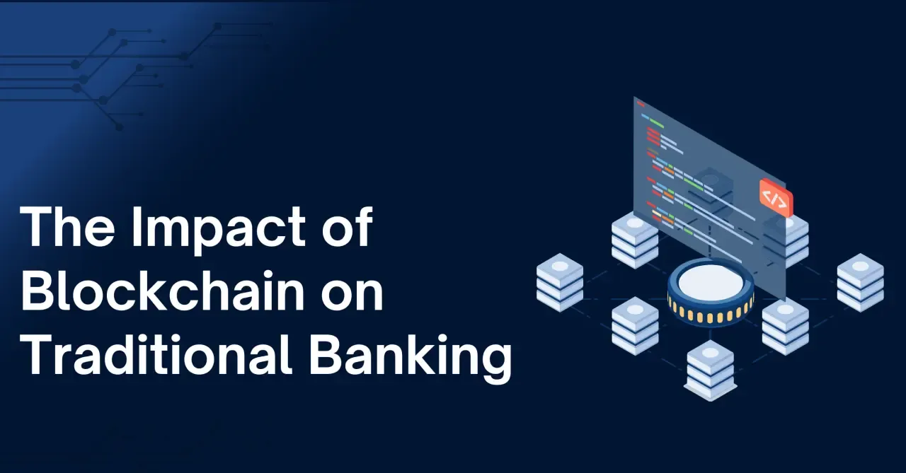

## Table of Contents

## What is blockchain technology and how does it work?

Blockchain technology is a way to store information securely and transparently. It's like a digital ledger or record book that keeps track of transactions or data. Instead of being controlled by one person or company, it's managed by a network of computers. Each piece of information, or "block," is linked to the next, forming a chain. This makes it very hard to change or cheat the system because any change would need to be approved by everyone on the network.

When someone wants to add a new piece of information to the blockchain, it goes through a process called "mining." During mining, special computers solve complex math problems to verify the new information. Once it's verified, the new block is added to the chain. Everyone on the network can see the new block, but the information inside can be kept private if needed. This makes blockchain useful for things like money transfers, tracking goods, or even voting, because it's secure and everyone can trust the information is correct.

## How does blockchain differ from traditional banking systems?

Blockchain and traditional banking systems handle money and data in different ways. In traditional banking, a bank acts like a middleman. When you send money, the bank checks if you have enough money, then moves it to the other person's account. The bank keeps all the records and has control over the money. If something goes wrong, you have to trust the bank to fix it. 

In contrast, blockchain doesn't need a middleman like a bank. Instead, it uses a network of computers to keep track of transactions. When you send money using blockchain, the network checks if you have enough money and then records the transaction on the blockchain. Everyone on the network can see the transaction, but personal details can be kept private. Because the records are spread out and everyone can see them, it's harder for anyone to cheat or change the records without being noticed.

## What are the basic principles of traditional banking?

Traditional banking works on the principle of being a trusted middleman. When you put your money in a bank, they keep it safe and let you take it out when you need it. They also help you move your money to other people or places. The bank keeps a record of all these transactions and makes sure everything is correct. If there's a problem, you go to the bank and they try to fix it.

Another important principle is that banks lend out the money you deposit. They use your money to give loans to other people or businesses. This helps the economy grow because it lets people buy homes, start businesses, or go to school. In return, the bank charges interest on these loans, which is how they make money. So, while your money is safe in the bank, it's also being used to help others.

## In what ways can blockchain impact the efficiency of banking operations?

Blockchain can make banking faster and cheaper. In traditional banking, moving money from one place to another can take days because banks have to check and double-check everything. With blockchain, transactions can be verified and completed much quicker because the network of computers works together to confirm them. This means you can send money anywhere in the world almost instantly. Also, because there's no middleman like a bank taking a fee, the cost of sending money goes down.

Another way blockchain helps is by reducing mistakes and fraud. In traditional banking, if someone makes a mistake or tries to cheat, it can be hard to fix because all the records are kept in one place. With blockchain, the records are spread out across many computers, making it harder to change or cheat the system. If there's a mistake, it's easier to spot and fix because everyone can see the transactions. This makes the whole banking process more reliable and trustworthy.

## How does blockchain enhance security and reduce fraud in banking?

Blockchain makes banking safer by using a network of computers to keep track of transactions instead of just one bank. Each transaction is recorded on many computers, so if someone tries to change it, they would need to change it on every computer at the same time, which is almost impossible. This makes it very hard for anyone to cheat or steal money because everyone can see what's happening.

Blockchain also helps to stop fraud because it uses special math problems to check if a transaction is real. Only when these problems are solved correctly can a transaction be added to the blockchain. This means fake transactions can't get through easily. Plus, because everyone can see the transactions, it's easier to spot and stop any strange or bad activity quickly, making the whole system more secure.

## What are smart contracts and how might they affect banking services?

Smart contracts are like automatic agreements that work on the blockchain. They are special pieces of code that can do things like move money or keep records without needing a person to make it happen. When certain things happen, like someone paying for something, the smart contract automatically does what it's supposed to do. This makes everything faster and means you don't have to trust a middleman to follow the rules.

In banking, smart contracts can change how things work. They can make loans, payments, and other services happen automatically and with less chance of mistakes or cheating. For example, if you take out a loan, a smart contract can automatically take payments from your account on time. This saves banks time and money, and it makes things easier and safer for customers too.

## Can blockchain technology reduce the cost of banking transactions?

Blockchain technology can make banking transactions cheaper. In traditional banking, moving money from one place to another often involves multiple banks and middlemen, each taking a fee. This adds up and can make sending money expensive. With blockchain, there's no need for these middlemen because the network of computers does the work. This means fewer fees, so sending money can cost less.

Also, blockchain can save banks money by making their work easier and faster. When a transaction happens, it's checked and recorded quickly by the network. This cuts down on the time and effort banks need to spend on each transaction. With less work to do, banks can save money on staff and other costs, which can help lower the overall cost of banking services.

## How might blockchain influence the regulatory environment of banking?

Blockchain can change how banks are watched and controlled by rules. Right now, banks have to follow a lot of rules to make sure they are safe and honest. With blockchain, everything is more open because all transactions are recorded on a shared network. This makes it easier for people who make the rules to see what's happening in banks. They can check the records anytime to make sure banks are doing things right, without having to ask the banks for special reports.

But, blockchain also brings new challenges for rule makers. Since blockchain works across many countries, it can be hard to decide which country's rules should apply. Also, because blockchain can be used for things like secret money transfers, rule makers need to find ways to stop it from being used for bad things like crime. They might need to make new rules that fit with how blockchain works, so banks can use it safely and fairly.

## What challenges do banks face when integrating blockchain technology?

Banks face several challenges when they try to use blockchain technology. One big challenge is that blockchain is new and different from what banks are used to. Banks have been doing things the same way for a long time, and changing to a new system can be hard. They need to train their workers to understand and use blockchain, and they also need to update their computer systems. This can take a lot of time and money.

Another challenge is about rules and laws. Since blockchain works all over the world, it can be tricky to figure out which country's rules to follow. Banks have to make sure they are doing everything by the book, but with blockchain, it's not always clear what the rules are. They might need to work with people who make the rules to create new ones that fit with blockchain. This can slow down the process of using blockchain in banking.

Also, keeping things safe is a big worry. Even though blockchain is seen as very secure, it's still new, and there could be problems that we don't know about yet. Banks have to be very careful because they are responsible for keeping people's money safe. They need to make sure that using blockchain won't put their customers' money at risk. This means they have to do a lot of testing and planning before they can start using blockchain for real.

## How are major banks currently using blockchain, and what are the results?

Major banks are trying out blockchain in different ways. Some banks, like JPMorgan Chase, have made their own blockchain systems to move money faster and cheaper. They use it to send payments between countries without needing lots of middlemen. Other banks, like Goldman Sachs, are using blockchain to keep track of things like stocks and bonds, making it easier to see who owns what and making trading faster. Banks are also working together in groups, like the R3 consortium, to build blockchain systems that many banks can use together.

The results so far are mixed. Some projects have worked well, showing that blockchain can make things faster and cheaper. For example, banks that use blockchain for international payments have seen that money can be sent in seconds instead of days. But there are also challenges. Some banks have found that setting up blockchain systems is hard and expensive. They also worry about keeping things safe and making sure they follow all the rules. Overall, banks are still figuring out the best ways to use blockchain, and it will take more time to see how it changes banking for good.

## What future developments in blockchain could further disrupt traditional banking?

In the future, blockchain could change banking even more by making things like smart contracts even better. Smart contracts are like automatic agreements that can do things like move money or keep records without needing people to make it happen. If these smart contracts get easier to use and more powerful, banks might use them for almost everything, from loans to payments. This could make banking faster and cheaper because there would be less need for people to check and do things by hand. Also, if more people start using digital money, like cryptocurrencies, that works on blockchain, banks might need to change how they handle money to keep up.

Another big change could come from something called decentralized finance, or DeFi. This is when people use blockchain to do things like borrowing money or investing without needing a bank. If more people start using DeFi, it could take away some of the business that banks usually do. Banks would then need to find new ways to offer services that people want, or they might start using blockchain themselves to offer DeFi services. Either way, these changes could make banking very different from how it is now, with more choices for people and maybe even less need for big banks.

## How can blockchain technology promote financial inclusion in underbanked regions?

Blockchain technology can help people in underbanked areas by making it easier for them to use financial services. In many poor or remote places, there are not many banks, and it can be hard for people to open bank accounts or send money. Blockchain can change this because it lets people do banking on their phones without needing a traditional bank. They can use apps to save money, send it to others, or even borrow money. This means that people who live far from a bank can still use financial services and join the global economy.

Also, blockchain can make financial services cheaper and faster. In underbanked areas, sending money to family in another country can be expensive and take a long time. With blockchain, people can send money quickly and for less money because there are no middlemen taking big fees. This helps families stay connected and support each other, even if they live far apart. By making banking easier, cheaper, and more accessible, blockchain can help more people in underbanked regions improve their lives and take part in the financial world.

## References & Further Reading

[1]: Mougayar, W. (2016). ["The Business Blockchain: Promise, Practice, and Application of the Next Internet Technology"](https://books.google.com/books/about/The_Business_Blockchain.html?id=CEsPDAAAQBAJ). Wiley.

[2]: Narayanan, A., Bonneau, J., Felten, E., Miller, A., & Goldfeder, S. (2016). ["Bitcoin and Cryptocurrency Technologies: A Comprehensive Introduction"](https://press.princeton.edu/books/hardcover/9780691171692/bitcoin-and-cryptocurrency-technologies). Princeton University Press.

[3]: Iansiti, M., & Lakhani, K. R. (2017). ["The Truth About Blockchain"](https://hbr.org/2017/01/the-truth-about-blockchain). Harvard Business Review.

[4]: De Filippi, P., & Wright, A. (2018). ["Blockchain and the Law: The Rule of Code"](https://www.jstor.org/stable/j.ctv2867sp). Harvard University Press.

[5]: Arner, D. W., Barberis, J., & Buckley, R. P. (2015). ["The Evolution of Fintech: A New Post-Crisis Paradigm?"](https://papers.ssrn.com/sol3/papers.cfm?abstract_id=2676553). Journal of Financial Perspectives.

[6]: Tapscott, D., & Tapscott, A. (2016). ["Blockchain Revolution: How the Technology Behind Bitcoin Is Changing Money, Business, and the World"](https://dl.acm.org/doi/10.5555/3051781). Penguin.