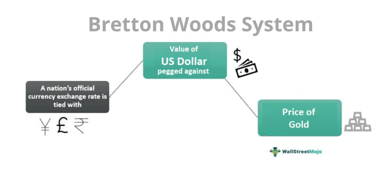

The world of finance is in a constant state of evolution, shaped by a myriad of factors including historical agreements, technological advancements, and global economic policies. This article will explore the intersection of several critical components that have significantly influenced modern financial markets: the Bretton Woods System and algorithmic trading. Understanding these elements provides insights into past economic strategies and how they continue to mold the financial landscape.

The Bretton Woods System, established in the mid-20th century, set the stage for contemporary financial systems by introducing a framework for international monetary cooperation. This historic agreement pegged global currencies to the US dollar and, in turn, linked the dollar to gold, striving for global economic stability and predictability. Key institutions like the International Monetary Fund (IMF) and the World Bank emerged from this system, aimed at fostering economic growth and overseeing international monetary policies.



On the other hand, the rapid advancements in technology over recent decades have introduced unprecedented changes in the finance industry, particularly through the advent of algorithmic trading. This modern tool utilizes sophisticated computer algorithms to execute trades at remarkable speeds while analyzing vast datasets. This technological evolution has redefined trading strategies by reducing transaction costs, enhancing market efficiency, and enabling real-time analysis.

These two elements, one historical and one modern, illustrate a significant evolution in global finance. The foundations laid by the Bretton Woods System provided the groundwork for regulated and cooperative international finance, while algorithmic trading represents the cutting edge of financial innovation, continuously transforming how markets operate today.

As globalization and technology persist in driving changes in finance, understanding the interplay between these historical and technological milestones will be essential for developing future economic strategies. This article promises an exploratory journey through the past, present, and future of finance, offering a comprehensive understanding of the forces that continue to shape global economic policies and markets.

## Table of Contents

## The Bretton Woods System: A Historical Overview

Established in July 1944 during a conference held in Bretton Woods, New Hampshire, the Bretton Woods System marked a seminal moment in the history of international finance. Conceived in the aftermath of World War II, the system aimed to foster a stable, cooperative international monetary environment, pivotal for post-war reconstruction and economic stability. At the core of the Bretton Woods System was a fixed exchange rate regime, with the United States dollar (USD) designated as the principal global reserve currency. The US dollar was uniquely pegged to gold at a rate of $35 per ounce, making gold the ultimate monetary anchor and imparting a sense of security and predictability to international transactions.

The establishment of the Bretton Woods System also led to the creation of key international financial institutions designed to oversee the global monetary order and foster international collaboration. Notably, the International Monetary Fund (IMF) was established to provide temporary financial assistance to countries facing balance of payments deficits, ensuring stability and preventing competitive devaluations. Concurrently, the World Bank was created to aid in the reconstruction and economic development of war-torn and developing nations by providing long-term loans and financial assistance.

Initially, the Bretton Woods System facilitated significant economic recovery and growth by providing a framework for stable currency exchange and international trade. The fixed exchange rate regime encouraged countries to maintain disciplined fiscal policies, reducing the risk of runaway inflation and fostering investor confidence. This stability was critical in the early post-war period, helping rebuild war-devastated economies, particularly in Western Europe and Japan, and leading to what is often referred to as the "Golden Age" of economic growth during the 1950s and 1960s.

However, the Bretton Woods System was not without its challenges. The rigid nature of fixed exchange rates made adjusting to new economic circumstances difficult. As global economic power dynamics shifted, imbalances began to emerge. The system's reliance on the US dollar and gold reserves became increasingly problematic. By the late 1960s, the US was running persistent balance of payments deficits, causing other countries to lose confidence in the dollar's convertibility to gold.

The mounting pressure culminated in the early 1970s, when President Richard Nixon decided to suspend the dollar's convertibility into gold, effectively dismantling the Bretton Woods System. This abandonment marked the transition to a new era of floating exchange rates and different monetary practices. Despite its eventual collapse, the Bretton Woods System left a lasting legacy, influencing the design and function of contemporary international monetary policies and institutions.

## The Role of the Bretton Woods System in Global Trade and Finance

The Bretton Woods System played a pivotal role in shaping the international monetary landscape following World War II, particularly through its facilitation of post-war economic recovery and support for international trade. By instituting a fixed exchange rate regime and establishing the US dollar as the global reserve currency, pegged to gold, the system engendered a period of unprecedented monetary stability. This stability was crucial for rebuilding economies shattered by the war, as consistent exchange rates reduced the risk and uncertainty associated with cross-border transactions, thereby promoting trade and investment on a global scale.

One of the core elements of the Bretton Woods System was its emphasis on stable exchange rates, which were maintained with narrow margins of fluctuation against the dollar. This approach created an environment where countries could trade confidently without fearing significant currency fluctuations that could undermine economic planning and performance. The structure lent credibility to international financial transactions and fostered an era of economic cooperation between nations, setting a precedent for the integrated global financial markets we see today.

The establishment of international institutions like the International Monetary Fund (IMF) and the World Bank was another significant achievement of the system. These institutions were tasked with overseeing monetary cooperation and providing resources to stabilize economies, thus ensuring the smooth functioning of the global economic system. Encouraging economic cooperation and stability, the IMF facilitated mechanisms that allowed countries to adjust their currency values in cases of fundamental disequilibrium, thus contributing to global financial stability.

The principles underlying the Bretton Woods System laid the groundwork for contemporary economic policies and remain relevant in today's financial architecture. The IMF continues to play an essential role in providing policy advice, financial assistance, and technical assistance to its member countries. Similarly, the World Bank's focus on reconstruction and development has evolved but persists in aiming to reduce poverty and support sustainable development worldwide.

Modern economic institutions, policies, and trade agreements reflect the legacy of Bretton Woods through continued emphasis on economic cooperation, stability, and growth. Despite the system's eventual collapse in the early 1970s, the conceptual foundation it provided endures. Current exchange rate policies, international monetary cooperation frameworks, and financial stability measures all trace their origins back to the Bretton Woods era, underpinning the interconnected global economy's functioning today.

## From Bretton Woods to Algorithmic Trading: An Era of Transformation

The evolution of global finance from the Bretton Woods System to the era of [algorithmic trading](/wiki/algorithmic-trading) marks a significant transformation driven largely by technological advancements. Initially, the Bretton Woods System, with its fixed exchange rates, provided a stable monetary environment. However, as global economic dynamics evolved, the system's rigidity became apparent, leading to its eventual collapse in the early 1970s. This facilitated the shift towards more flexible, floating exchange rates, which introduced a new wave of [volatility](/wiki/volatility-trading-strategies) into currency markets.

The emergence of floating exchange rates required innovative methods to manage market unpredictability. This challenge propelled the development of algorithmic trading, a method that leverages technology to execute trades at unprecedented speed and precision. Algorithmic trading employs computer algorithms to process and analyze large volumes of market data, identifying optimal trading opportunities across different asset classes. This technique allows for high-frequency trading ([HFT](/wiki/high-frequency-trading-strategies)), where thousands of orders can be executed within microseconds, thus enhancing market efficiency and [liquidity](/wiki/liquidity-risk-premium).

Algorithmic trading improves market conditions by reducing transaction costs and narrowing bid-ask spreads, resulting in more competitive pricing for traders and investors. The depth and breadth of market data analyzed in real-time enable participants to react swiftly to market movements and economic announcements, leading to more informed and rational trading decisions. The adoption of algorithms has been crucial in processing complex datasets, such as historical price patterns and trading volumes, to predict future market trends.

The computational aspect of algorithmic trading can be illustrated through a basic Python algorithm for a moving average crossover strategy, a common technique where trading signals are generated based on the crossover of short-term and long-term moving averages:
```python
import numpy as np
import pandas as pd

# Sample dataset of stock prices
data = {'Date': ['2023-01-01', '2023-01-02', '2023-01-03'], 'Price': [100, 102, 101]}
df = pd.DataFrame(data)

# Calculate moving averages
short_window = 1
long_window = 2
df['Short_MA'] = df['Price'].rolling(window=short_window, min_periods=1).mean()
df['Long_MA'] = df['Price'].rolling(window=long_window, min_periods=1).mean()

# Generate signals
df['Signal'] = 0.0
df['Signal'][short_window:] = np.where(df['Short_MA'][short_window:] > df['Long_MA'][short_window:], 1.0, 0.0)

# Positions
df['Position'] = df['Signal'].diff()

print(df)
```

This example demonstrates how traders can utilize algorithmic strategies to make data-driven trading decisions. Yet, as technology continues to advance, the landscape of financial markets will inevitably evolve. Algorithmic trading has reshaped market dynamics, emphasizing the need for robust regulatory frameworks to mitigate risks associated with automated trading, such as market manipulation and flash crashes.

Thus, the transition from the structured environment of Bretton Woods to the algorithm-driven sphere of modern finance reflects the broader trends of globalization and technological progression, setting the stage for future financial innovations.

## Algorithmic Trading: A Modern Financial Tool

Algorithmic trading utilizes complex computer algorithms to execute trades at high speeds and volumes. By leveraging advanced computational techniques, traders can process vast amounts of market data almost instantaneously. This capability allows for the identification of trading opportunities that may not be visible to human traders, hence revolutionizing the trading landscape.

One of the primary advantages of algorithmic trading is the reduction of transaction costs. Algorithms can execute trades efficiently by optimizing order timing and size, thus minimizing the market impact. Additionally, they facilitate increased liquidity in the market by ensuring that trades occur swiftly and at competitive prices. This enhancement in liquidity can lower bid-ask spreads, ultimately benefiting all market participants.

Market efficiency has also improved through algorithmic trading. Automated trading systems can quickly adapt to news and market developments, thereby incorporating new information into asset prices in real-time. This process aligns with the Efficient Market Hypothesis, which suggests that financial markets reflect all available information.

Understanding the mechanics of algorithmic trading is essential for navigating contemporary and future financial markets. At their core, algorithmic trading strategies can be categorized into multiple types, such as [trend following](/wiki/trend-following), [arbitrage](/wiki/arbitrage), and market-making. For instance, a simple trend-following strategy might involve moving average crossovers, where a short-term moving average crossing above a long-term moving average signals a buy, and a crossover below signals a sell. 

Moreover, the implementation of algorithmic trading often involves programming in languages like Python due to its simplicity and the vast array of available libraries for data analysis and algorithm development. A basic Python example for a moving average strategy would be:

```python
import pandas as pd

# Load historical price data
data = pd.read_csv('historical_prices.csv')
data['Short_MA'] = data['Close'].rolling(window=40).mean()
data['Long_MA'] = data['Close'].rolling(window=100).mean()

# Generate trading signals
data['Signal'] = 0
data['Signal'][40:] = np.where(data['Short_MA'][40:] > data['Long_MA'][40:], 1, -1)

# Calculate daily returns
data['Returns'] = data['Close'].pct_change()

# Strategy returns
data['Strategy_Returns'] = data['Signal'].shift(1) * data['Returns']
```

This code snippet illustrates a simplistic approach where trading signals are generated based on the crossover of short-term and long-term moving averages. The strategy's returns are then computed by applying these signals to the daily percentage changes in the asset's price.

As global finance continues to evolve, the reliance on technology, including algorithmic trading, is expected to increase. Understanding these systems and their underpinnings will be pivotal for participants aiming to thrive in the modern financial landscape.

## Challenges and Future Outlook

Algorithmic trading, while advantageous in enhancing market efficiency and reducing transaction costs, poses several challenges primarily related to market manipulation and systemic risk. Instances of market manipulation, such as spoofing—where traders place large orders they do not intend to execute to deceive other market participants—highlight the need for strict regulatory oversight. Furthermore, the high-speed nature of algorithmic trading can amplify systemic risks, leading to market disruptions like the 2010 Flash Crash. These events emphasize the importance of addressing vulnerabilities to ensure market integrity and stability.

Moving forward, the landscape of global finance is expected to further embrace technological advancements. This shift will likely necessitate the development of robust regulatory frameworks that can effectively govern the complexities introduced by sophisticated trading algorithms. Regulators are tasked with the challenge of balancing innovation with the protection of market participants, ensuring transparency and fairness, and preventing systemic failures.

At the same time, the legacy of the Bretton Woods System, which laid the groundwork for current economic cooperation and stability, serves as a reminder of the importance of maintaining a stable monetary environment. The principles established during the Bretton Woods era—such as fixed exchange rates and cooperative economic policies—continue to influence today's regulatory approaches and could offer insights into the development of new frameworks that accommodate modern technological innovations.

In contemplating future developments, one must recognize the potential for [artificial intelligence](/wiki/ai-artificial-intelligence) (AI) and [machine learning](/wiki/machine-learning) to play significant roles in shaping the evolution of financial markets. These technologies offer the promise of more sophisticated analysis tools and predictive models, which could lead to more efficient decision-making processes. However, their integration into financial systems requires careful regulation to prevent misuse and ensure that the benefits are widely distributed across the financial ecosystem.

In summary, while technological innovations like algorithmic trading present opportunities for enhancing financial market operations, they also underscore the need for regulatory systems capable of mitigating associated risks. As global finance continues to evolve, integrating the historical lessons of the Bretton Woods System with modern technological advancements will be crucial for developing strategies that ensure sustainable economic growth.

## Conclusion

The journey from the Bretton Woods System to algorithmic trading underscores a significant evolution in global finance shaped by historical events and technological advancements. The Bretton Woods System established in the mid-20th century created a framework for international economic cooperation. By introducing a fixed exchange rate regime and institutions like the International Monetary Fund (IMF) and the World Bank, it provided stability that was crucial for the post-war recovery and laid the groundwork for modern financial systems.

On the other hand, algorithmic trading represents the forefront of financial innovation, leveraging technology to execute trades at unprecedented speeds and volumes. This method has vastly improved market efficiency and liquidity, reducing transaction costs and enabling real-time market analysis. The technological advancements inherent in algorithmic trading illustrate a progression from static economic structures to dynamic, rapidly evolving financial markets.

In the context of ongoing globalization and technological change, understanding the interaction between historical financial frameworks and modern innovations like algorithmic trading is essential. As global finance continues to evolve, recognizing the legacy of initiatives like Bretton Woods alongside the opportunities and challenges presented by technology-driven trading will be crucial for developing future economic strategies. This interplay will determine how financial markets adapt to new trends and maintain stability amidst continual change.

## References & Further Reading

[1]: Bordo, M. D., & Eichengreen, B. (Eds.). (1993). ["A Retrospective on the Bretton Woods System: Lessons for International Monetary Reform."](https://www.nber.org/books-and-chapters/retrospective-bretton-woods-system-lessons-international-monetary-reform) University of Chicago Press.

[2]: ["The Bretton Woods Transcripts"](https://centerforfinancialstability.org/brettonwoods_docs.php) edited by Kurt Schuler and Andrew Rosenberg

[3]: Yao, B., Petkevich, A., & Liu, J. (2020). ["Algorithmic Trading: Winning Strategies and Their Rationale."](https://www.wiley.com/en-us/Algorithmic+Trading%3A+Winning+Strategies+and+Their+Rationale-p-9781118460146) Wiley.

[4]: ["The International Monetary Fund 1945-1965: Twenty Years of International Monetary Cooperation"](https://www.elibrary.imf.org/view/book/9781451955255/9781451955255.xml) by J. Keith Horsefield

[5]: Mahajan, M. (2017). ["Algorithmic and High-Frequency Trading: Mathematics, Finance, and Risk Management."](https://www.cambridge.org/wf/universitypress/subjects/mathematics/mathematical-finance/algorithmic-and-high-frequency-trading) Oxford University Press.