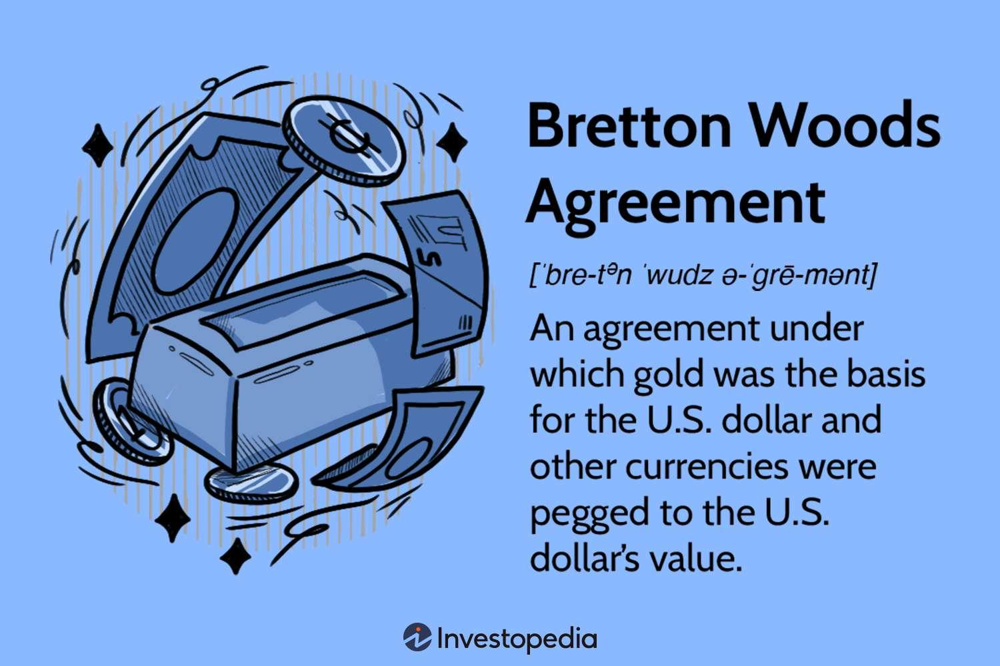

## Table of Contents

## What was the Bretton Woods System?

The Bretton Woods System was a way countries agreed to work together on money matters after World War II. It started in 1944 when leaders from many countries met in Bretton Woods, New Hampshire. They wanted to make sure that countries could trade with each other easily and that their economies would grow. The main idea was to fix the value of their money to the US dollar, and the US dollar was fixed to gold. This meant that if a country's money got too weak or too strong, they could use US dollars or gold to make it stable again.

This system helped countries feel more secure about trading with each other because they knew how much their money was worth compared to other countries' money. It also led to the creation of two important organizations: the International Monetary Fund (IMF) and the World Bank. The IMF helped countries that were having money problems, and the World Bank gave loans to help countries rebuild and grow their economies. The Bretton Woods System lasted until the early 1970s when the US could no longer keep its promise to change dollars into gold, and countries started to let their money's value change more freely.

## When and where was the Bretton Woods Conference held?

The Bretton Woods Conference happened in 1944. It took place in a place called Bretton Woods, which is in the state of New Hampshire in the United States. Leaders from 44 different countries came together at this conference.

They met to talk about how to make the world's economy better after World War II. They wanted to make sure countries could trade with each other easily and that their economies would grow. This meeting led to the creation of the Bretton Woods System, which was a big plan for how countries would work together on money matters.

## What were the main goals of the Bretton Woods System?

The main goals of the Bretton Woods System were to help countries work together on money matters and to make the world's economy stronger after World War II. The leaders who met at the Bretton Woods Conference wanted to create a system where countries could trade with each other easily. They thought that if countries could trust each other's money, it would be easier to buy and sell things across borders. This would help everyone's economy grow and recover from the war.

Another big goal was to keep the value of money stable. The Bretton Woods System did this by fixing the value of each country's money to the US dollar, and the US dollar was fixed to gold. This meant that if a country's money started to get too weak or too strong, they could use US dollars or gold to make it stable again. This stability was important because it made people feel more secure about trading with other countries. The system also led to the creation of the International Monetary Fund (IMF) and the World Bank, which helped countries that were having money problems and gave loans to help countries rebuild and grow their economies.

## How did the Bretton Woods System affect global trade?

The Bretton Woods System helped make global trade easier and more reliable. Before this system, countries often changed the value of their money, which made it hard for other countries to know how much things would cost when trading. By fixing the value of money to the US dollar, and the US dollar to gold, the Bretton Woods System made it so countries could trust that the value of money would stay the same. This stability meant that businesses could plan better when buying and selling things across borders. It encouraged more trade because people felt safer about dealing with money from other countries.

The system also helped countries work together better. The International Monetary Fund (IMF) and the World Bank were created to help countries that were having money problems. The IMF could give loans to countries to help them keep their money stable, which was important for trade. The World Bank gave loans to help countries rebuild and grow their economies after the war. This support made it easier for countries to trade because they could fix money problems quickly and keep their economies strong. Overall, the Bretton Woods System made global trade more predictable and helped the world's economy grow after World War II.

## What institutions were created under the Bretton Woods System?

The Bretton Woods System led to the creation of two important organizations: the International Monetary Fund (IMF) and the World Bank. These institutions were set up to help countries work together on money matters and to make the world's economy stronger after World War II. The IMF was created to help countries that were having money problems. If a country's money started to get too weak or too strong, the IMF could give them loans to help keep it stable. This was important because it made people feel more secure about trading with other countries.

The World Bank was set up to give loans to help countries rebuild and grow their economies. After the war, many countries needed help to fix their buildings, roads, and other things that were damaged. The World Bank's loans helped them do this. Both the IMF and the World Bank played big roles in making global trade easier and more reliable. They helped countries work together better and made it easier for businesses to buy and sell things across borders.

## How did the Bretton Woods System influence currency exchange rates?

The Bretton Woods System made currency exchange rates more stable. Before this system, countries often changed the value of their money, which made it hard for other countries to know how much things would cost when trading. The Bretton Woods System fixed the value of each country's money to the US dollar, and the US dollar was fixed to gold. This meant that if a country's money started to get too weak or too strong, they could use US dollars or gold to make it stable again. This stability made people feel more secure about trading with other countries because they knew how much their money was worth compared to other countries' money.

This system also helped countries work together better on money matters. The International Monetary Fund (IMF) was created to help countries that were having money problems. If a country's money got too weak, the IMF could give them loans to help keep it stable. This support was important because it made it easier for countries to fix money problems quickly and keep their economies strong. Overall, the Bretton Woods System made global trade more predictable and helped the world's economy grow after World War II.

## What was the role of the US dollar in the Bretton Woods System?

The US dollar played a big part in the Bretton Woods System. It was the main money that all other countries' money was compared to. This meant that every country agreed to set the value of their money to the US dollar. The US dollar itself was fixed to gold, which meant that the US promised to change dollars into gold if other countries asked for it. This made the US dollar very important because it was like the center of the whole system.

Because the US dollar was so important, it helped keep the value of all money stable. If a country's money got too weak or too strong, they could use US dollars or gold to fix it. This made people feel more secure about trading with other countries because they knew how much their money was worth compared to the US dollar. The Bretton Woods System lasted until the early 1970s when the US could not keep its promise to change dollars into gold anymore. After that, countries started to let their money's value change more freely.

## How did the Bretton Woods System impact developing countries?

The Bretton Woods System helped developing countries by giving them a way to make their money more stable. Before this system, it was hard for these countries to trade with other countries because their money's value could change a lot. With the Bretton Woods System, they could fix their money's value to the US dollar, which was fixed to gold. This made it easier for them to plan and trade because they knew how much their money was worth compared to other countries' money. The International Monetary Fund (IMF) also helped by giving loans to countries that were having money problems. This support was important because it helped developing countries keep their money stable and trade more easily.

The World Bank was another big help for developing countries under the Bretton Woods System. It gave loans to help these countries rebuild and grow their economies after World War II. Many developing countries needed money to fix things like roads, buildings, and other things that were damaged during the war. The World Bank's loans helped them do this. By helping these countries grow their economies, the World Bank made it easier for them to trade with other countries. Overall, the Bretton Woods System made a big difference for developing countries by helping them keep their money stable and grow their economies.

## What were the key factors that led to the collapse of the Bretton Woods System?

The Bretton Woods System started to fall apart because of problems with the US dollar. The system worked because other countries' money was fixed to the US dollar, and the US dollar was fixed to gold. But by the late 1960s, the US had a lot of money problems. They were spending more money than they were making, especially because of the Vietnam War and other big projects. This made people worry that the US might not be able to keep its promise to change dollars into gold. As more people started to ask for gold instead of dollars, it put a lot of pressure on the US.

In 1971, President Richard Nixon decided to stop changing dollars into gold. This was a big change because it meant the US dollar was no longer fixed to gold. Without this link, the whole Bretton Woods System started to fall apart. Countries could no longer trust that their money's value would stay the same compared to the US dollar. So, they started to let their money's value change more freely. By 1973, the Bretton Woods System was over, and the world moved to a new way of handling money where exchange rates could change every day.

## How did the end of the Bretton Woods System affect the global economy?

When the Bretton Woods System ended, it changed how countries handled their money. Before, all countries fixed their money's value to the US dollar, which was fixed to gold. This made trading easier because everyone knew how much their money was worth compared to other countries' money. But when the US stopped changing dollars into gold in 1971, countries could no longer trust the US dollar in the same way. They started letting their money's value change every day, which made trading more unpredictable. This new way of handling money is called a floating exchange rate system.

The end of the Bretton Woods System also made the world's economy more unsure. Without the stability of fixed exchange rates, countries had to be more careful about how they traded with each other. It was harder to plan because the value of money could go up or down quickly. But it also gave countries more freedom to make their own money policies. They could change the value of their money to help their economies grow or to fight problems like inflation. Overall, the end of the Bretton Woods System made the world's economy more flexible but also more unpredictable.

## What are the long-term economic impacts of the Bretton Woods System?

The Bretton Woods System had a big impact on the world's economy in the long run. It helped make global trade easier and more reliable by fixing the value of money to the US dollar, which was fixed to gold. This stability made it easier for countries to trade with each other because they knew how much their money was worth compared to other countries' money. The system also led to the creation of the International Monetary Fund (IMF) and the World Bank, which helped countries that were having money problems and gave loans to help countries rebuild and grow their economies. These organizations are still important today and help countries work together on money matters.

When the Bretton Woods System ended in the early 1970s, it changed how countries handled their money. Instead of fixing their money's value to the US dollar, countries started letting their money's value change every day. This made trading more unpredictable but also gave countries more freedom to make their own money policies. The end of the Bretton Woods System made the world's economy more flexible but also more unsure. Countries had to be more careful about how they traded with each other, but they could also change the value of their money to help their economies grow or to fight problems like inflation. Overall, the Bretton Woods System set the stage for how countries work together on money matters today.

## How has the international monetary system evolved since the collapse of the Bretton Woods System?

Since the Bretton Woods System ended in the early 1970s, the international monetary system has changed a lot. Instead of fixing their money's value to the US dollar, which was fixed to gold, countries started letting their money's value change every day. This new way of handling money is called a floating exchange rate system. It made trading more unpredictable because the value of money could go up or down quickly. But it also gave countries more freedom to make their own money policies. They could change the value of their money to help their economies grow or to fight problems like inflation.

Over time, the role of the US dollar has stayed important in the world's economy. Even though it's no longer fixed to gold, many countries still use the US dollar for trading and as a way to keep their money stable. The International Monetary Fund (IMF) and the World Bank, which were created under the Bretton Woods System, have also stayed important. They help countries work together on money matters and give loans to countries that need help. The world's economy has become more connected, with countries working together more and using new technology to trade. But it's also more unpredictable because of the floating exchange rates and other big changes in the world.

## References & Further Reading

[1]: Bordo, M. D., & Eichengreen, B. (Eds.). (1993). ["A Retrospective on the Bretton Woods System: Lessons for International Monetary Reform."](https://www.nber.org/books-and-chapters/retrospective-bretton-woods-system-lessons-international-monetary-reform) University of Chicago Press.

[2]: ["The Bretton Woods Transcripts"](https://centerforfinancialstability.org/brettonwoods_docs.php) edited by Kurt Schuler and Andrew Rosenberg

[3]: Yao, B., Petkevich, A., & Liu, J. (2020). ["Algorithmic Trading: Winning Strategies and Their Rationale."](https://www.wiley.com/en-us/Algorithmic+Trading%3A+Winning+Strategies+and+Their+Rationale-p-9781118460146) Wiley.

[4]: ["The International Monetary Fund 1945-1965: Twenty Years of International Monetary Cooperation"](https://www.elibrary.imf.org/view/book/9781451955255/9781451955255.xml) by J. Keith Horsefield

[5]: Mahajan, M. (2017). ["Algorithmic and High-Frequency Trading: Mathematics, Finance, and Risk Management."](https://www.cambridge.org/wf/universitypress/subjects/mathematics/mathematical-finance/algorithmic-and-high-frequency-trading) Oxford University Press.