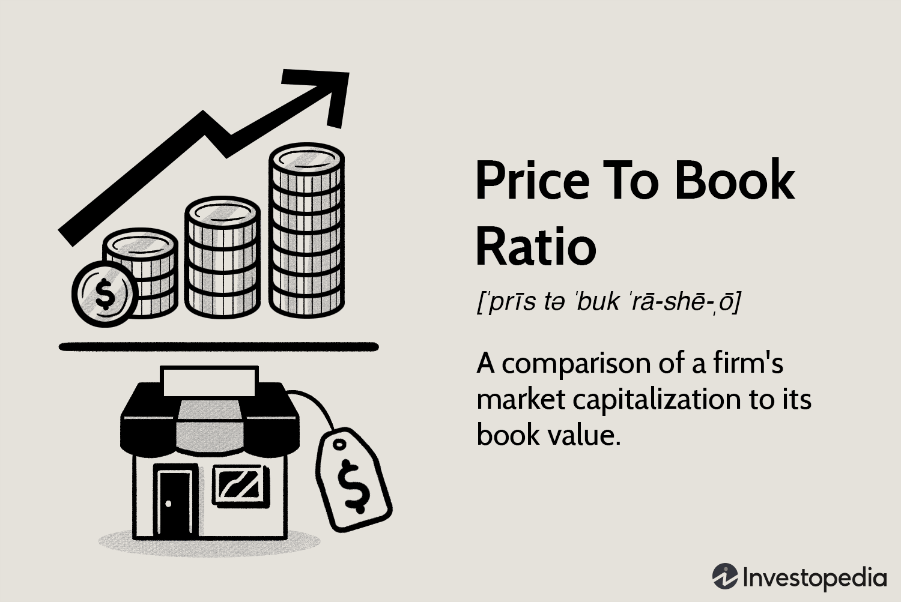

## Table of Contents

## What is a stock buyback?

A stock buyback, also known as a share repurchase, is when a company buys its own shares from the stock market. Companies do this for different reasons. One main reason is to reduce the number of shares available, which can make each share worth more. When there are fewer shares, the earnings of the company are spread over a smaller number of shares, increasing earnings per share. This can make the stock more attractive to investors.

Another reason companies might buy back their stock is because they think their shares are undervalued. By buying back their own shares, they are showing confidence in their own business. This can also be a way to use extra cash the company has, rather than spending it on other things like new projects or paying dividends. Stock buybacks can be good for shareholders because they can increase the value of their shares, but they can also be controversial if people think the money could be better spent elsewhere.

## What is the price-to-book ratio?

The price-to-book ratio, often called P/B ratio, is a way to figure out if a stock is a good buy. It compares the price of a stock to the book value of the company. The book value is what the company would be worth if it sold all its assets and paid off all its debts. To find the P/B ratio, you divide the stock's current market price by the book value per share. A lower P/B ratio might mean the stock is undervalued, while a higher P/B ratio could mean it's overvalued.

Investors use the P/B ratio to see if a stock is priced right compared to its actual worth. It's especially useful for companies that have a lot of physical stuff, like factories or machines, because these things are easier to value. But, the P/B ratio isn't perfect. It doesn't tell you about the company's future growth or how well it's run. So, it's best to use the P/B ratio along with other measures to get a full picture of whether a stock is a good investment.

## How does a stock buyback affect the number of outstanding shares?

When a company does a stock buyback, it buys its own shares from the market. This means the number of shares that are out there, called outstanding shares, goes down. If a company buys back a lot of its shares, the total number of outstanding shares can drop by a big amount.

Fewer outstanding shares can be good for the people who own the stock. This is because the company's earnings are now spread over fewer shares. So, each share can get a bigger piece of the earnings, which might make the stock price go up. But, the exact effect on the stock price can depend on many things, like how the market sees the buyback and what the company does with the money it spends on buying back shares.

## Can you explain how a reduction in outstanding shares impacts the price-to-book ratio?

When a company buys back its own shares and reduces the number of outstanding shares, it can change the price-to-book ratio. The price-to-book ratio is found by dividing the stock's market price by the book value per share. The book value per share goes up when there are fewer shares because the same total book value is now spread over fewer shares. So, if the market price of the stock stays the same, the price-to-book ratio will go down because the book value per share has increased.

But, stock buybacks can also affect the stock's market price. If investors think the buyback is a good sign and they start buying more of the stock, the market price might go up. If the market price goes up more than the book value per share goes up, then the price-to-book ratio could actually increase. So, the final impact on the price-to-book ratio depends on how much the market price changes compared to how much the book value per share changes.

## What are the immediate financial effects of a buyback on a company's balance sheet?

When a company does a buyback, it uses its cash to buy its own shares. This means the cash on the company's balance sheet goes down. The cash is moved from the cash account to the treasury stock account, which is a part of shareholders' equity. So, the total amount of shareholders' equity stays the same, but the cash part goes down and the treasury stock part goes up.

The buyback also changes the number of shares that are out there. When the company buys back shares, the number of outstanding shares goes down. This can make the earnings per share go up because the same amount of earnings is now spread over fewer shares. But, the company's total assets go down because it used cash to buy the shares. So, the balance sheet shows less cash and fewer shares, but the same total equity, just in a different form.

## How might a buyback influence a company's earnings per share (EPS)?

When a company does a buyback, it uses its money to buy its own shares from the market. This means there are fewer shares out there. When there are fewer shares, the company's earnings are divided by a smaller number of shares. This makes the earnings per share (EPS) go up. So, if a company makes $100 million in a year and has 100 million shares before the buyback, the EPS would be $1. If it buys back 20 million shares, leaving 80 million shares, the EPS would go up to $1.25.

But, the effect on EPS isn't just about the math. If the market thinks the buyback is a good sign, the stock price might go up. This can make investors feel more confident about the company. But, if the company spends a lot of money on the buyback and doesn't have enough left for other important things, like growing the business or paying off debts, it might not be good in the long run. So, while a buyback can make EPS go up right away, it's important to look at the bigger picture to see if it's really good for the company and its shareholders.

## What role does investor perception play in the impact of buybacks on the price-to-book ratio?

Investor perception plays a big role in how buybacks affect the price-to-book ratio. When a company buys back its own shares, it can make the stock price go up if investors think it's a good sign. If the stock price goes up a lot, the price-to-book ratio might go up too. This is because the price-to-book ratio is the stock price divided by the book value per share. So, if the stock price goes up more than the book value per share goes up, the ratio will increase.

On the other hand, if investors don't like the buyback, the stock price might not go up as much or might even go down. If the stock price stays the same or goes down, but the book value per share goes up because there are fewer shares, the price-to-book ratio will go down. So, how investors feel about the buyback can make a big difference in whether the price-to-book ratio goes up or down after a buyback.

## How do buybacks affect a company's return on equity (ROE) and subsequently the price-to-book ratio?

When a company does a buyback, it can make the return on equity (ROE) go up. ROE is found by dividing the company's net income by its shareholders' equity. When a company buys back its shares, it uses its cash to do so, which means the cash on the balance sheet goes down. But the net income stays the same. So, the same amount of net income is now divided by a smaller equity number because the cash part of equity is gone. This makes ROE go up. Also, with fewer shares out there, the earnings per share go up, which can make the stock look more attractive to investors.

The change in ROE from a buyback can also affect the price-to-book ratio. The price-to-book ratio is the stock's market price divided by the book value per share. When ROE goes up, it can make investors think the company is doing better, which might make them want to buy more of the stock. If more people want to buy the stock, the price can go up. If the stock price goes up more than the book value per share goes up, the price-to-book ratio will go up too. But if the stock price doesn't go up much or goes down, the price-to-book ratio might go down because the book value per share goes up when there are fewer shares. So, how the price-to-book ratio changes after a buyback depends a lot on how investors feel about the company's future and the buyback itself.

## Can you discuss the long-term effects of buybacks on a company's valuation metrics, including the price-to-book ratio?

When a company does buybacks over a long time, it can change how the company is valued in the market. Buybacks can make the price-to-book ratio go up or down, depending on how investors see the buyback and how it affects the company's finances. If the buybacks make the company's earnings per share go up and investors think this is good, they might buy more of the stock. This can make the stock price go up. If the stock price goes up a lot, the price-to-book ratio might go up too, because the price-to-book ratio is the stock price divided by the book value per share. But if the buybacks use up a lot of the company's cash and the company can't grow or pay off its debts, investors might not like it. This can make the stock price go down or not go up as much, which could make the price-to-book ratio go down.

In the long run, buybacks can also affect other valuation metrics like return on equity (ROE). When a company buys back its shares, it uses its cash to do so, which makes the cash on the balance sheet go down. This can make the ROE go up because the same amount of net income is now divided by a smaller equity number. A higher ROE can make investors think the company is doing better, which might make them want to buy more of the stock. This can help keep the stock price high or make it go up, which can affect the price-to-book ratio. But, if the company keeps doing buybacks and doesn't invest in growing the business, it might not be able to keep up its earnings in the future. This can make investors worried and might make the stock price go down, which could lower the price-to-book ratio in the long run.

## How do different buyback methods (e.g., open market, tender offer) potentially alter the price-to-book ratio?

When a company does a buyback through the open market, it buys its own shares little by little over time. This can slowly make the stock price go up if investors think it's a good sign. If the stock price goes up, the price-to-book ratio might go up too because the price-to-book ratio is the stock price divided by the book value per share. But, if the buyback happens slowly and doesn't make a big change in the number of shares, the book value per share might not go up much. This means the price-to-book ratio might not change a lot.

A tender offer buyback is when a company asks its shareholders to sell their shares back to the company at a set price. This can make the stock price go up right away because the company is offering to buy shares at a higher price than the market. If the stock price goes up a lot, the price-to-book ratio can go up too. But, a tender offer can also make the number of shares go down a lot, which makes the book value per share go up. If the stock price doesn't go up as much as the book value per share, the price-to-book ratio might actually go down. So, the way a company does its buyback can change how the price-to-book ratio is affected.

## What are the tax implications of buybacks and how might they indirectly influence the price-to-book ratio?

When a company does a buyback, it can affect how much tax people have to pay. If you own shares in a company and it does a buyback, you might have to pay capital gains tax if you sell your shares back to the company. The tax you pay depends on how long you owned the shares and how much money you made from selling them. If the buyback makes the stock price go up, people might sell their shares to take advantage of the higher price, which means they might have to pay more tax. This can make investors think twice before buying more shares, which could affect how much the stock price goes up.

The tax implications of buybacks can also indirectly affect the price-to-book ratio. If investors think they might have to pay more taxes because of the buyback, they might not be as excited about the stock. This can make the stock price not go up as much as it could. If the stock price doesn't go up much, but the book value per share goes up because there are fewer shares, the price-to-book ratio might go down. So, the taxes people might have to pay because of a buyback can change how investors feel about the stock, which can change the price-to-book ratio.

## How do regulatory environments and corporate governance policies impact the effectiveness of buybacks in altering the price-to-book ratio?

Regulatory environments and corporate governance policies can really change how well buybacks work in changing the price-to-book ratio. If the rules are strict about how companies can do buybacks, it might be harder for them to buy back a lot of shares. This can make the buyback not as effective in making the stock price go up. Also, if the rules say that companies have to tell everyone about their buybacks before they happen, it might not surprise investors as much. This can make the stock price not go up as much as it could, which can affect the price-to-book ratio.

Corporate governance policies are also important. If a company has good rules about how it makes decisions, it might do buybacks in a way that makes investors trust it more. This can make the stock price go up more, which can make the price-to-book ratio go up too. But, if the company's rules are not clear or if people think the company is doing buybacks for the wrong reasons, like to make the stock price go up just for a short time, investors might not like it. This can make the stock price not go up as much, or even go down, which can make the price-to-book ratio go down.

## What is the Price-to-Book (P/B) Ratio and how can it be understood?

The Price-to-Book (P/B) Ratio is a critical valuation metric in financial analysis, providing insights into how the market values a company relative to its book value. It is computed by dividing a company's current market price per share by its book value per share. The formula for the P/B Ratio is expressed as:

$$
\text{P/B Ratio} = \frac{\text{Market Price per Share}}{\text{Book Value per Share}}
$$

Here, the market price per share is the current stock price, whereas the book value per share represents the company's net asset value divided by the number of outstanding shares. The book value is derived from the company's balance sheet, subtracting liabilities and preferred stock from total assets.

The P/B Ratio assists investors in evaluating whether a stock is undervalued or overvalued by comparing the market's valuation to the company's intrinsic asset value. A lower P/B ratio can signal potential undervaluation, suggesting that the market might be undervaluing the company's net assets. Conversely, a higher P/B ratio may imply overvaluation, indicating that the stock might be priced above its inherent asset value.

However, interpreting the P/B Ratio requires contextual understanding. Different industries have varying asset-heavy or asset-light characteristics which affect the P/B ratio. For example, traditional manufacturing companies might have substantial tangible assets leading to a lower P/B ratio. In contrast, technology firms with extensive intellectual property and intangible assets might naturally exhibit a higher P/B ratio.

Economic conditions also play a vital role in the interpretation of the P/B ratio. During economic downturns, asset-heavy companies might experience depreciations in asset values, adversely affecting the book value and consequently increasing the P/B ratio. Nonetheless, during economic booms, the book value might understate the growth in intrinsic value, leading to discrepancies between P/B ratios and actual valuation. Therefore, while the P/B Ratio is a useful tool, it should be assessed in conjunction with industry norms and macroeconomic indicators to provide a holistic view of a company's financial standing.

## How do buybacks impact the P/B ratio?

Share buybacks, also known as share repurchase programs, can have a profound impact on the Price-to-Book (P/B) ratio. This impact primarily arises from changes in the number of shares outstanding and their effect on the company's book value per share. 

When a company repurchases its shares, the immediate effect is a reduction in the number of shares outstanding. The formula for the P/B ratio is given by:

$$
\text{P/B Ratio} = \frac{\text{Market Price Per Share}}{\text{Book Value Per Share}}
$$

As the number of shares decreases, the book value per share can be affected significantly, especially if the repurchase price is above or below the current book value. If a company buys back its shares at a price higher than the book value per share, it can lead to a decrease in the book value per share. This is because the company is using more equity to purchase each share than what is currently represented on the [books](/wiki/algo-trading-books). Consequently, this situation can lead to an inflated P/B ratio, potentially signaling an overvaluation to prospective investors.

Investors need to be cautious about buybacks as they may present an overstated view of value, often boosting the earnings per share (EPS) without necessarily reflecting an improvement in the company's operational efficiency or actual market performance. A buyback might give the illusion of value creation if not assessed carefully within the broader financial strategy and health of the company.

It is critical to analyze the underlying motivations for buybacks. Companies may undertake buybacks due to perceived undervaluation in the market or as a way to return surplus cash to shareholders, lacking better investment opportunities. Both reasons have different implications for future valuation and company strategy. A buyback undertaken in response to undervaluation might suggest the management believes in the intrinsic value of the company, while repurchasing due to excess cash without strategic reinvestment could indicate limited growth avenues.

To fully appreciate the impact of buybacks, investors should consider changes not only in the P/B ratio but also in other key metrics such as growth in Earnings Per Share (EPS) and Return on Equity (ROE). Analyzing these metrics in conjunction can provide a more rounded understanding of how buybacks are influencing a company’s financial outlook and value proposition. 

In summary, while buybacks can be a strategic tool for companies, their effect on the P/B ratio and investor perception necessitates a comprehensive analysis that looks beyond superficial gains in per-share metrics to the overall financial health and growth potential of the company.

## References & Further Reading

[1]: ["The Price-to-Book Ratio: The Benjamin Graham Formula for Value Investors"](https://www.oldschoolvalue.com/stock-valuation/benjamin-graham-formula/) - The New York Times

[2]: ["Buyback Waves: Causes and Consequences"](https://hbr.org/2020/01/why-stock-buybacks-are-dangerous-for-the-economy) by Anat R. Admati, Paul Pfleiderer - The Journal of Banking & Finance

[3]: ["The (Mis)Use of Buyback Metrics in Capital Markets"](https://hbr.org/2017/09/the-case-for-stock-buybacks) - Harvard Business Review

[4]: ["Algorithmic Trading and DMA: An introduction to direct access trading strategies"](https://archive.org/details/algorithmictradi0000john) by Barry Johnson

[5]: ["Investment Valuation: Tools and Techniques for Determining the Value of Any Asset"](https://archive.org/details/investmentvaluat0000damo_n6k9) by Aswath Damodaran