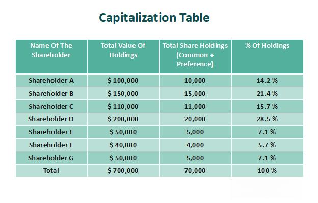

## Table of Contents

## What is capital structure?

Capital structure refers to the way a company finances its operations and growth by using different sources of funds. These sources can include debt, like loans and bonds, and equity, like stocks and retained earnings. The mix of debt and equity a company uses is important because it affects the risk and value of the company. A company with a lot of debt might have higher risk because it has to pay back the money it borrowed, but it might also have a chance to make more profit if it uses the borrowed money well.

Choosing the right capital structure is a big decision for a company. If a company uses more debt, it might have to pay more interest, which can be risky if the company doesn't make enough money to cover these payments. On the other hand, using more equity means sharing ownership with more people, which can dilute the control of existing shareholders. The goal is to find a balance that minimizes the cost of capital and maximizes the value of the company, while also considering the company's ability to handle risk and its long-term plans.

## How does capital structure affect a company's profitability?

Capital structure can affect a company's profitability by changing how much it has to pay in interest and how much money it can keep for itself. When a company uses more debt, it has to pay interest on that debt. This interest is a cost that comes out of the company's profits. If the company can use the borrowed money to make more money than it pays in interest, then using debt can help increase profitability. But if the company can't make enough extra money, the interest payments can eat into the profits and lower profitability.

On the other hand, using more equity means the company doesn't have to pay interest, but it does have to share its profits with more shareholders. This can mean less profit for each shareholder, but it also means the company doesn't have the risk of not being able to pay back debt. The right mix of debt and equity can help a company keep more of its profits by lowering its overall cost of capital. A good capital structure can help a company be more profitable by balancing the costs and benefits of debt and equity.

## What are the main components of capital structure?

The main components of capital structure are debt and equity. Debt is money that a company borrows and has to pay back with interest. This can include loans from banks or bonds that the company sells to investors. Equity is money that comes from the owners of the company, like when they sell shares of stock or use their own profits to grow the business. Both debt and equity help a company get the money it needs to operate and grow.

The balance between debt and equity is important. If a company uses a lot of debt, it has to pay a lot of interest, which can be risky if the company doesn't make enough money to cover these payments. But if the company can use the borrowed money to make more money than it pays in interest, then using debt can be good. On the other hand, using more equity means the company doesn't have to pay interest, but it does have to share its profits with more people. The right mix of debt and equity can help a company keep more of its profits and grow in a healthy way.

## Can you explain the difference between debt and equity financing?

Debt financing means a company borrows money and has to pay it back with interest. This can be from a bank loan or by selling bonds to investors. When a company uses debt, it has to make regular payments, no matter how well it's doing. This can be risky because if the company doesn't make enough money, it might not be able to pay back the debt. But if the company can use the borrowed money to make more money than it pays in interest, debt can help the company grow.

Equity financing is when a company gets money from its owners or by selling shares of stock to investors. When a company uses equity, it doesn't have to pay back the money like with debt. Instead, it shares its profits with the people who own the shares. This can be less risky because there's no pressure to make regular payments. But it also means the company has to share its success with more people, which can mean less profit for each owner.

The choice between debt and equity depends on what the company needs and how much risk it's willing to take. Debt can help a company grow quickly if it uses the money well, but it comes with the risk of not being able to pay it back. Equity is safer because there's no debt to repay, but it means sharing the company's success with more people. A good mix of both can help a company grow while managing its risks.

## How does the cost of capital influence profitability?

The cost of capital is how much it costs a company to get the money it needs to operate and grow. This cost comes from the money the company borrows (debt) and the money it gets from selling shares (equity). If the cost of capital is high, it means the company has to pay more to use that money, which can eat into its profits. For example, if a company borrows money at a high [interest rate](/wiki/interest-rate-trading-strategies), it has to pay a lot of interest, leaving less money as profit.

On the other hand, if the cost of capital is low, the company can keep more of its profits. This is because it doesn't have to pay as much to use the money. A lower cost of capital can help a company be more profitable because it can use the money it saves to invest in new projects or improve its business. So, managing the cost of capital well is important for a company to stay profitable and grow.

## What is the optimal capital structure and how does it vary by industry?

The optimal capital structure is the mix of debt and equity that helps a company reach its highest value while keeping its costs low. It's about finding the right balance that lets the company use money to grow and make more profit without taking on too much risk. For example, if a company uses a lot of debt, it might have to pay a lot of interest, which can be risky if it doesn't make enough money. But if it can use the borrowed money to make more money than it pays in interest, then using debt can help the company grow and be more profitable.

The optimal capital structure can be different for each industry because the risks and needs of companies in different industries are not the same. For example, companies in stable industries like utilities might use more debt because they have steady income and can handle the regular payments. On the other hand, companies in industries like technology, where things can change quickly, might use more equity to avoid the risk of not being able to pay back debt. So, what works for one industry might not work for another, and companies need to think about their own situation and the industry they are in when deciding on their capital structure.

## How do interest rates impact the choice of capital structure?

Interest rates can have a big effect on the choice of capital structure for a company. When interest rates are low, it can be a good time for a company to borrow money because the cost of borrowing is cheaper. This means the company can use debt to grow and maybe make more profit without paying a lot of interest. On the other hand, when interest rates are high, borrowing money costs more, and the company might decide to use less debt. High interest rates can make debt more risky because the company has to pay back more money, which can eat into its profits.

The choice between debt and equity can also change with interest rates. When interest rates are low, companies might use more debt because it's cheaper. But if rates go up, the company might switch to using more equity to avoid the higher cost of debt. This means they might sell more shares to get the money they need instead of borrowing. So, companies need to keep an eye on interest rates and adjust their capital structure to find the best mix of debt and equity that helps them grow and stay profitable.

## What are the risks associated with high levels of debt in a company's capital structure?

When a company has a lot of debt, it can be risky. One big risk is that the company has to pay back the money it borrowed, plus interest. If the company doesn't make enough money to cover these payments, it can get into trouble. This is called financial risk. If the company can't pay its debts, it might have to sell things or even go bankrupt. That's why having too much debt can make it hard for a company to handle problems like a drop in sales or a bad economy.

Another risk is that high debt can limit what a company can do. If a company is spending a lot of money on interest payments, it might not have enough left over to invest in new projects or grow the business. This can slow down the company's growth and make it harder to compete with other companies. Also, if lenders and investors see that a company has a lot of debt, they might think it's risky and be less willing to lend more money or buy its stocks. This can make it harder for the company to get the money it needs to keep going and grow.

## How does tax policy affect decisions on capital structure?

Tax policy can change how a company decides to use debt or equity in its capital structure. When a company borrows money, it has to pay interest on that debt. But in many places, the government lets companies subtract this interest from their income before they pay taxes. This means the company can pay less in taxes if it uses more debt. So, if the tax benefits of debt are big, a company might choose to use more debt to lower its tax bill and keep more of its profits.

But tax policy can also make using equity more attractive. Sometimes, the government gives special tax breaks for using equity, like lower taxes on dividends or capital gains. If these tax breaks are good, a company might decide to use more equity instead of debt. The choice depends on what the tax laws are and how they affect the cost of using debt or equity. Companies need to look at all these things to decide the best way to structure their capital to save on taxes and still grow their business.

## What role does financial leverage play in enhancing or diminishing profitability?

Financial leverage is when a company uses borrowed money to try to make more profit. When a company uses debt, it can invest in things that might help it grow and make more money. If the company can make more money from its investments than it pays in interest on the debt, then using financial leverage can help increase its profits. This is because the company is using other people's money to make a bigger return for its own owners.

But financial leverage can also make things worse if it doesn't work out. If the company can't make enough money to pay back the debt and the interest, then it might lose money instead of making more. This can be risky because the company has to keep paying the interest no matter what. If things go bad, the company might have to sell things or even go bankrupt. So, while financial leverage can help a company be more profitable if things go well, it can also make things worse if the company can't handle the debt.

## How can changes in capital structure be used as a strategic tool to improve profitability?

A company can use changes in its capital structure to improve profitability by finding the right mix of debt and equity. If a company uses more debt when interest rates are low, it can borrow money cheaply and use it to grow the business. This can help the company make more money than it pays in interest, which can increase its profits. On the other hand, if the company uses more equity, it doesn't have to pay interest, but it does have to share its profits with more people. The key is to find a balance that keeps the cost of capital low and lets the company keep more of its profits.

Another way to use capital structure strategically is to take advantage of tax benefits. When a company uses debt, it can often deduct the interest it pays from its income before paying taxes. This can lower the company's tax bill and help it keep more of its profits. But if the tax laws change and make equity more attractive, the company might switch to using more equity to save on taxes. By carefully managing its capital structure, a company can lower its costs, save on taxes, and improve its profitability over time.

## What advanced metrics can be used to assess the impact of capital structure on profitability?

One advanced metric to assess how capital structure affects profitability is the Return on Equity (ROE). ROE shows how much profit a company makes with the money its shareholders have invested. When a company uses debt, it can increase its ROE if it uses the borrowed money to make more profit than it pays in interest. But if the company can't make enough money to cover the interest, the ROE might go down. So, ROE helps show if using debt is helping the company make more money for its shareholders.

Another useful metric is the Debt-to-Equity Ratio (D/E Ratio). This ratio tells us how much debt a company has compared to its equity. A high D/E Ratio means the company is using a lot of debt, which can be risky but might help increase profits if the company uses the money well. A low D/E Ratio means the company is using less debt, which can be safer but might mean less profit if the company could have used more debt to grow. By looking at the D/E Ratio, we can see if the company's capital structure is helping it be more profitable or if it's taking on too much risk.

## What is the Traditional Theory of Capital Structure?

The traditional theory of capital structure posits that a firm can optimize its value by achieving an ideal mix of debt and equity, thereby minimizing its Weighted Average Cost of Capital (WACC). This is based on the premise that financial leverage, or the use of borrowed funds, can enhance returns by allowing a firm to utilize additional resources without requiring proportional additional equity. The formula for WACC is as follows:

$$

WACC = \frac{E}{V} \cdot Re + \frac{D}{V} \cdot Rd \cdot (1 - Tc) 
$$

Where:
- $E$ is the market value of the equity
- $D$ is the market value of the debt
- $V = E + D$ is the total market value of the firm’s financing (equity and debt)
- $Re$ is the cost of equity
- $Rd$ is the cost of debt
- $Tc$ is the corporate tax rate

The traditional view emphasizes the benefits of debt up to a certain point. Interest on debt is tax-deductible, which effectively reduces the cost of debt and can lead to higher returns on equity. However, this leverage also brings the risk of financial distress. As debt levels increase, so do interest obligations, potentially leading to difficulties in meeting financial commitments, particularly during economic downturns. This heightened risk can erode firm value, a concept illustrated in the trade-off theory which suggests there is a balance between the tax advantages of debt and the costs of potential financial distress.

Critics of the traditional theory argue that its assumptions, such as perfect market conditions and rational investor behavior, do not always reflect reality. Markets are often imperfect, impacted by information asymmetries, taxes, and transaction costs. Furthermore, human behavior can be irrational, as posited by behavioral finance. It suggests that management’s perceptions of risk and strategic motivations can significantly influence capital structure decisions, often deviating from traditional economic predictions.

For example, managers may opt for conservative financing structures in pursuit of stability or due to a preference for internal funding, even when external debt financing might lower their WACC. Alternatively, agency theory highlights that conflicts between management and shareholders can lead to suboptimal capital structures if not properly aligned with shareholder interests.

In contemporary finance, traditional theories must adapt to consider these complexities. Factors such as global market interdependencies, technological advancements, and stricter regulatory environments are reshaping capital structure dynamics. The focus is shifting towards flexibility and resilience, allowing firms to withstand financial perturbations while still leveraging debt to capitalize on growth opportunities. 

Overall, while the traditional theory provides a foundational understanding of capital structures, adapting its principles to modern economic contexts enables more robust financial strategies.

## References & Further Reading

[1]: Kirilenko, A. A., Kyle, A. S., Samadi, M., & Tuzun, T. (2011). ["The Flash Crash: The Impact of High-Frequency Trading on an Electronic Market."](https://papers.ssrn.com/sol3/papers.cfm?abstract_id=1686004) Commodity Futures Trading Commission.

[2]: ["The Theory of Corporate Finance"](https://press.princeton.edu/books/hardcover/9780691125565/the-theory-of-corporate-finance) by Jean Tirole.

[3]: ["Advances in Financial Machine Learning"](https://www.amazon.com/Advances-Financial-Machine-Learning-Marcos/dp/1119482089) by Marcos Lopez de Prado.

[4]: Modigliani, F., & Miller, M. H. (1958). ["The Cost of Capital, Corporation Finance and the Theory of Investment."](https://www.aeaweb.org/aer/top20/48.3.261-297.pdf) The American Economic Review, 48(3), 261-297.

[5]: ["Quantitative Trading: How to Build Your Own Algorithmic Trading Business"](https://www.amazon.com/Quantitative-Trading-Build-Algorithmic-Business/dp/1119800064) by Ernest P. Chan.