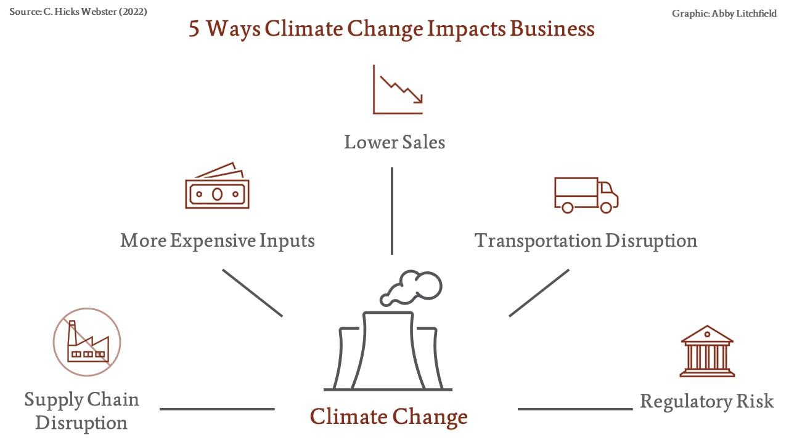

Climate change is an undeniable reality that has begun to profoundly affect multiple aspects of life, significantly altering how businesses conduct their operations. As extreme weather events become more frequent and climate patterns evolve, businesses are forced to reconsider their strategies to remain resilient and competitive. One of the primary ways businesses are responding to these challenges is through corporate sustainability initiatives. These initiatives are designed to reduce the environmental footprint of business activities while simultaneously seeking to enhance operational efficiency and profitability.

Corporate sustainability has emerged as a pivotal element of modern business strategies. Companies are increasingly prioritizing sustainable practices not only to comply with regulatory mandates but also to meet the growing consumer demand for environmentally responsible products and services. By reducing emissions, transitioning to renewable energy sources, and adopting sustainable supply chain practices, businesses aim to mitigate their impact on the environment. These efforts are often driven by a combination of governmental policies, consumer expectations, and the intrinsic desire of corporations to contribute to a more sustainable future.



This article examines the converging factors of climate change and corporate sustainability within the business landscape while highlighting the potential role of algorithmic trading in climate finance. As climate-related financial risks become more apparent, there is an increasing recognition of the need for innovative financial tools to address these challenges. Algorithmic trading, with its ability to process large volumes of data and execute trades with precision, presents promising opportunities for the efficient management of investments in sustainable projects. By integrating Environmental, Social, and Governance (ESG) criteria into trading algorithms, investors can optimize their portfolios to support environmentally friendly initiatives. Consequently, algorithmic trading could become a critical mechanism for advancing climate finance, facilitating the flow of capital towards sustainable development and aligning investment strategies with broader environmental objectives.

## Table of Contents

## Climate Change and Corporate Sustainability

Climate change presents multifaceted challenges to companies globally, disrupting traditional business models and driving the shift toward corporate sustainability. One of the most significant challenges is the alteration of weather patterns, which can affect supply chains, increase costs, and create unpredictable risks for businesses. For example, extreme weather events such as hurricanes and droughts can disrupt logistics and production schedules, compromising the ability of firms to meet market demand.

Additionally, climate change influences consumer preferences, with a growing number of environmentally conscious consumers demanding sustainable and eco-friendly products. This shift places pressure on businesses to adopt sustainable practices, not only to meet demand but also to maintain brand reputation and competitiveness in the marketplace.

In response to these challenges, companies are increasingly integrating corporate sustainability strategies into their core business plans. Key strategies include reducing carbon emissions and transitioning to renewable energy sources. By minimizing reliance on fossil fuels and investing in sustainable energy solutions, companies can mitigate their environmental impact and reduce operational costs in the long term. The implementation of energy-efficient technologies and processes also plays an essential role in achieving these objectives.

Regulatory frameworks further compel businesses to enhance their sustainability efforts. The U.S. Securities and Exchange Commission (SEC), for instance, has introduced requirements for climate risk disclosures, pushing companies toward greater transparency regarding their environmental impact. These disclosures enable investors, regulators, and other stakeholders to assess a company’s exposure to climate-related risks, thus encouraging businesses to adopt sustainable practices to meet regulatory compliance and investor expectations.

Overall, the interplay between climate change and corporate sustainability is reshaping business landscapes. Companies that proactively address climate risks and integrate sustainability into their strategies are better positioned to navigate the evolving regulatory and consumer environments, ensuring long-term viability and success.

## Business Impact of Climate Change

Climate change is reshaping business landscapes globally, primarily through increased operational costs driven by changing weather patterns and evolving regulatory frameworks. Companies across various sectors face heightened expenses as they adapt to these dynamic conditions. Natural disasters, such as hurricanes, floods, and wildfires, have intensified in frequency and severity, leading to disruptions in supply chains and increased insurance costs. The unpredictability of extreme weather events also affects production schedules, impacting the overall efficiency and profitability of businesses.

Regulatory pressures are another significant [factor](/wiki/factor-investing) contributing to rising costs. Cap-and-trade systems and other emission control measures have been implemented globally to curtail greenhouse gas emissions. These mechanisms place a financial burden on companies that exceed their emission allowances, as they must purchase additional credits or invest in emissions reduction technologies. The financial liabilities associated with non-compliance can be substantial, prompting businesses to adopt more sustainable practices.

Additionally, consumer preferences are shifting toward more environmentally friendly products, influencing market demand. As awareness of climate change grows, consumers are increasingly opting for sustainable goods and services, thereby affecting traditional non-green products. Companies that do not adapt to this changing demand may face reduced market share and sales. This shift necessitates a reevaluation of product lines and marketing strategies to align with consumer expectations.

In summary, climate change imposes notable financial and strategic challenges on businesses. Increased operational costs due to weather-related disruptions and compliance with regulatory measures, coupled with evolving consumer preferences, compel companies to innovate and prioritize sustainability. These adaptations are essential for maintaining competitiveness and ensuring long-term success in an ever-changing environmental and economic landscape.

## Algorithmic Trading and Climate Finance

Algorithmic trading, a method of executing orders using automated and pre-programmed trading instructions accounting for variables such as time, price, and [volume](/wiki/volume-trading-strategy), is increasingly being utilized as a tool in climate finance. This sophisticated trading approach offers the capability to manage financial strategies efficiently, with particular alignment to climate-related considerations.

Incorporating Environmental, Social, and Governance ([ESG](/wiki/esg-investing)) criteria into trading algorithms has emerged as a pivotal development for investors aiming to streamline their investments in sustainable projects. The integration of ESG factors into trading models enables investors to evaluate and select securities based on sustainability metrics, bringing environmental and social considerations to the forefront of financial decision-making. For instance, a simple model may include assigning scores to potential investments based on their carbon footprint or renewable energy involvement, allowing algorithms to prioritize low-emission enterprises.

```python
def esg_score(company):
    # Hypothetical function to compute ESG score
    carbon_footprint = company['carbon_footprint']
    renewable_energy_use = company['renewable_energy_use']
    governance_score = company['governance_score']
    # ESG score calculation with fabricated weights for illustration
    return 100 - (carbon_footprint * 0.5) + (renewable_energy_use * 0.3) + (governance_score * 0.2)

# Example of using the function
companies = [
    {'name': 'Company A', 'carbon_footprint': 50, 'renewable_energy_use': 40, 'governance_score': 70},
    {'name': 'Company B', 'carbon_footprint': 30, 'renewable_energy_use': 60, 'governance_score': 80}
]

sorted_companies = sorted(companies, key=lambda x: esg_score(x), reverse=True)
```

Algorithmic trading not only facilitates efficient investment processes but also enhances transparency in climate finance. Through automation and the use of algorithms, all trading activities are meticulously documented, allowing for greater accountability and insight into investment decisions. This transparency is instrumental in building investor trust and ensuring that funds are genuinely directed towards sustainable initiatives.

Moreover, [algorithmic trading](/wiki/algorithmic-trading) significantly reduces transaction costs, a crucial advantage in climate finance where maximizing the impact of every invested dollar is essential. By minimizing the human intervention required in trading operations, these algorithms can operate at high frequencies and optimize the timing of trades, thereby reducing the bid-ask spread and ensuring optimal pricing for transactions. As a result, capital can be reallocated more efficiently towards projects that support environmentally sustainable growth.

The efficiency, transparency, and cost-effectiveness of algorithmic trading make it an invaluable resource in the pursuit of climate finance objectives, setting the stage for integrating financial success with ecological responsibility. By harnessing these capabilities, investors and corporations can align their financial strategies with broader sustainability goals.

## Synergies between Corporate Sustainability and Algorithmic Trading

Corporations can leverage algorithmic trading to better align their financial strategies with sustainability goals. This synergy allows companies to seamlessly integrate environmental, social, and governance (ESG) criteria into their investment processes, fostering a more sustainable business model. Algorithmic trading, characterized by its speed and efficiency, enables corporations to adapt swiftly to market changes and identify sustainable investment opportunities.

Capital raised via algorithmic trading is increasingly being directed toward green projects, thereby enhancing corporate sustainability. By utilizing data-driven strategies, corporations can optimize their portfolios to include assets that contribute to environmental preservation and resource efficiency. For instance, algorithms can be programmed to prioritize investments in companies that focus on renewable energy, waste reduction, or sustainable manufacturing processes.

Innovation in financial products through algorithms plays a critical role in achieving sustainability. Products such as green bonds and carbon credits can be efficiently managed and traded using algorithmic systems. These algorithms are designed to assess the environmental impact of various projects, enabling investors to channel funds towards initiatives that offer positive ecological benefits. As a result, algorithmic trading facilitates the growth of financial instruments that support sustainable development goals.

The integration of algorithmic trading into corporate sustainability strategies is not without its complexities, as it often requires a coherent alignment of financial and environmental objectives. However, the potential benefits, such as reduced transaction costs and improved allocation of capital to green projects, make it a valuable tool for modern corporations looking to balance profitability with environmental stewardship. Through these synergies, companies can not only enhance their sustainability performance but also gain a competitive advantage in an increasingly eco-conscious market.

## Regulatory and Ethical Considerations

The integration of algorithmic trading within climate finance has introduced both opportunities and challenges, particularly in terms of regulatory and ethical considerations. As algorithmic trading becomes more prevalent, it is crucial to establish robust regulatory frameworks aimed at preventing market manipulation and ensuring the integrity of financial markets. Algorithmic trading systems, if unchecked, can exacerbate market [volatility](/wiki/volatility-trading-strategies) or be exploited for manipulative practices. Regulatory authorities, like the United States Securities and Exchange Commission (SEC) and the Commodity Futures Trading Commission (CFTC), have increasingly focused on developing policies that detect and curtail such potential abuses by instituting stringent surveillance and compliance mechanisms.

To prevent market manipulation, regulators are adopting advanced monitoring tools that analyze trading patterns in real-time. These systems are designed to flag unusual activities, such as spoofing or layering, practices that involve placing orders without the intention of executing them, to artificially influence prices. Investing in [machine learning](/wiki/machine-learning) models can enhance the detection capabilities of these tools. For instance, anomaly detection algorithms can be applied to historical trading data to identify irregular patterns that deviate from normal behavior, thus preemptively addressing potential manipulations.

Moreover, the ethical use of algorithmic trading in climate finance goes beyond regulatory measures. Ensuring high data quality is a foundational concern, as financial decisions based on poor or biased datasets can lead not only to suboptimal investment outcomes but also to broader ethical dilemmas. Therefore, firms must prioritize data accuracy and transparency. In practice, this means implementing rigorous data validation processes and utilizing diverse datasets to avoid bias.

Integrating ethical principles in decision-making processes is essential. One approach is to employ ESG (Environmental, Social, and Governance) criteria, which provide a framework for responsible investing. Algorithmic systems can be programmed to prioritize investments in projects that adhere to these principles. A Python-based framework could, for instance, filter investment opportunities by assessing ESG scores:

```python
def filter_esg_investments(investments, min_score):
    """Filter investments based on a minimum ESG score."""
    return [inv for inv in investments if inv['esg_score'] >= min_score]

# Sample investment data
investments = [
    {'name': 'Project A', 'esg_score': 85},
    {'name': 'Project B', 'esg_score': 72},
    {'name': 'Project C', 'esg_score': 91}
]

# Filter investments with an ESG score of 80 or higher
filtered_investments = filter_esg_investments(investments, 80)
```

Regulators must rapidly adapt to keep pace with technological advancements. The evolution of algorithmic trading systems is swift, driven by innovations like high-frequency trading and [artificial intelligence](/wiki/ai-artificial-intelligence). To avoid being outpaced, regulatory bodies should invest in continuous education, understanding the implications of new technologies on market dynamics. Collaboration with academia and industry experts can facilitate the development of forward-thinking policies that not only address current challenges but also anticipate future trends.

In conclusion, as algorithmic trading continues to play an integral role in climate finance, it is imperative for regulatory bodies to enhance their frameworks and ethical guidelines. This will ensure that the integration of advanced trading systems contributes positively to sustainable finance and aligns with broader environmental objectives.

## Conclusion

The intersection of climate change, corporate sustainability, and advanced trading technologies is profoundly reshaping how businesses operate. The convergence of these elements offers a transformative avenue for businesses to not only adapt to but also thrive amidst the challenges posed by a rapidly changing environment. It is evident that collaboration among stakeholders is vital to successfully navigating these shifts. Public and private sectors, investors, policymakers, and technology developers must work together to identify and leverage opportunities inherent in climate-driven market changes.

Algorithmic trading is a key enabler in this transforming landscape. By integrating Environmental, Social, and Governance (ESG) criteria into trading strategies, businesses can facilitate more sustainable investment flows. This supports corporate sustainability objectives while aligning with broader global environmental goals. Algorithmic trading also enhances market efficiency through increased transparency and reduced transaction costs, which are crucial for channeling investments into green initiatives.

The role of algorithmic trading extends beyond merely supporting existing sustainability efforts; it actively promotes innovation in financial products, such as green bonds and carbon credits. These innovations not only provide capital for sustainable projects but also offer businesses new avenues for achieving their sustainability targets. Furthermore, through advanced data analysis, algorithmic trading can offer insights into market trends and consumer preferences, helping companies to anticipate and adapt to changes in demand for sustainable products.

Overall, the integration of advanced trading technologies with corporate sustainability strategies presents a promising path forward. This synergy not only mitigates environmental risks but also offers competitive advantages in a market increasingly driven by sustainability considerations. As businesses continue to harness these technologies, they can contribute significantly to global efforts to combat climate change while maintaining economic viability and growth.

## References & Further Reading

[1]: Daskin, M.S. (2011). ["Corporate sustainability: integrating performance and reporting."](https://www.wiley.com/en-us/Corporate+Sustainability%3A+Integrating+Performance+and+Reporting-p-9781118122365) Wiley.

[2]: Pindyck, R. S. (2013). ["Climate Change Policy: What Do the Models Tell Us?"](https://www.nber.org/system/files/working_papers/w19244/w19244.pdf) Journal of Economic Literature.

[3]: Henderson, R. M., & Newell, R. G. (2011). ["Accelerating Energy Innovation: Insights from Multiple Sectors."](https://www.hbs.edu/ris/Publication%20Files/10-067_0fa0986a-b35f-498d-9c14-e1ba96498eb9.pdf) University of Chicago Press.

[4]: Lopez de Prado, M. (2018). ["Advances in Financial Machine Learning."](https://www.amazon.com/Advances-Financial-Machine-Learning-Marcos/dp/1119482089) Wiley.

[5]: Friedman, B. B., & Prendergast, J. R. (2022). ["Sustainable Investing: Revolutions in Theory and Practice."](https://www.semanticscholar.org/paper/Sustainable-Investing-%3A-Revolutions-in-theory-and/3a73c5c6fee43a0ea3853e97443d0b65242af314) Columbia University Press.

[6]: Tietenberg, T., & Lewis, L. (2018). ["Environmental & Natural Resource Economics."](https://www.taylorfrancis.com/books/mono/10.4324/9781315208343/environmental-natural-resource-economics-tom-tietenberg-lynne-lewis) Pearson.