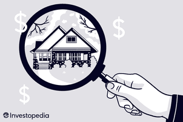

Climate change is among the most significant challenges facing the global community today. Its impacts extend far beyond environmental degradation, influencing various sectors, such as homeownership and financial markets. As the Earth’s climate warms, the frequency and severity of extreme weather events, including hurricanes, floods, and wildfires, have increased. These changes present substantial risks to property and infrastructure, necessitating urgent adaptation strategies.

This article seeks to explore the multifaceted interaction between climate change, environmental risks, homeownership, and algorithmic trading. Understanding these interconnected elements is essential for individuals and institutions striving to safeguard their assets and make informed decisions in a rapidly changing environment. Specifically, we will discuss how extreme weather conditions shape the landscape of homeownership, driving up insurance costs and altering property values in vulnerable areas. Moreover, the role of government policies in addressing these challenges will be examined, highlighting initiatives aimed at encouraging sustainable practices and resilience among homeowners and investors.



In the financial markets, algorithmic trading represents a pivotal tool for adapting to climate change. By leveraging advancements in big data and machine learning, algorithmic systems can analyze environmental news and trends, enabling traders to adjust investment strategies swiftly. This capacity for responsive decision-making offers potential hedges against climate-induced risks, impacting sectors like real estate and insurance.

The primary objective of this article is to provide a comprehensive understanding of how climate change, environmental risks, homeownership, and algorithmic trading intersect. By examining these factors, we aim to equip readers with the knowledge necessary to navigate the evolving landscape of real estate and finance. With insights into adaptive strategies and proactive measures, individuals can better protect their investments and homes amidst the challenges posed by climate change.

## Table of Contents

## Climate Change and Environmental Risks

Climate change is a critical factor driving increased global temperatures and the prevalence of extreme weather events, such as hurricanes, droughts, and wildfires. These phenomena are not only more frequent but also more severe, resulting in significant property damage and economic losses. For instance, the Insurance Information Institute reported that natural disasters cost the global economy around $280 billion in 2021, with climate-related disasters accounting for a substantial portion of this figure.

The implications of these environmental risks for homeowners and investors are profound. As properties are increasingly exposed to climate-induced events, insurance rates have been steadily rising. Insurers are recalibrating their risk assessments, leading to higher premiums, particularly in areas prone to natural disasters. This trend affects property values as potential buyers factor in the increased cost of ownership due to higher insurance premiums and the potential for future damage.

Furthermore, the financial impacts of climate change extend beyond insurance costs. Property devaluation in high-risk areas can lead to a cascade of economic effects, including difficulties in securing loans or selling properties. Investors are also impacted, as real estate markets are becoming more volatile. Developing strategies to mitigate these risks is essential for both homeowners and investors. Measures such as investing in resilient infrastructure, reevaluating property locations, and diversifying investment portfolios can mitigate some of the financial impacts.

Understanding these environmental risks enables homeowners and investors to make informed decisions about property acquisition and management. Anticipating the potential damages and associated costs, as well as staying informed about adaptive strategies and emerging trends in real estate and insurance, are critical steps in safeguarding investments against the escalating threats posed by climate change.

## Implications for Homeownership

Climate change poses significant challenges to homeownership by increasing the frequency and severity of climate-related risks. Homeowners, particularly in high-risk areas such as coastal regions and flood-prone zones, are facing rising insurance premiums and the potential for property devaluation. These financial impacts are due to the increased risk of damage caused by natural disasters such as hurricanes, floods, and wildfires, which can lead to costly repairs or even complete property loss.

Understanding government policies that address these climate-related risks is crucial for homeowners looking to make informed decisions about protecting their investments. Many governments recognize the threat posed by climate change and are enacting policies to help mitigate these risks. For example, tax credits and incentives are available in some regions for homeowners who undertake adaptations to make their homes more resilient to climate effects. These adaptations may include installing energy-efficient windows, reinforcing roofs to withstand storms, or elevating homes in flood-prone areas.

For instance, under certain government programs, homeowners might receive tax deductions for energy-efficient upgrades or grants to improve structural resilience. Such initiatives not only help mitigate risks but also often lead to long-term savings through reduced energy bills and lower insurance costs. 

Adapting homeownership strategies to increased climate risks involves a proactive approach to property management. This includes regularly assessing property risks, investing in climate-resilient home improvements, and maintaining adequate insurance coverage. Homeowners should also stay informed about local regulations and support programs that can aid in adapting to changing environmental conditions.

Moreover, as climate risk assessment becomes more integrated into real estate valuation, homeowners may need to consider how environmental factors could impact the long-term value of their property. This could involve choosing locations with lower climate risks when purchasing new properties or investing in community-based adaptations like improved drainage systems in flood-prone neighborhoods.

In summary, to adapt to the increasing climate risks, homeowners need to leverage government policies for financial support, invest in climate-resilient improvements, and make strategic decisions regarding property purchases and insurance coverage. By doing so, they can mitigate potential losses and enhance the longevity and value of their investments.

## Government Policies and Initiatives

Globally, governments are recognizing the urgent necessity to address climate change and its impacts on homeownership. These policies are designed to reduce greenhouse gas emissions while simultaneously providing protection and support for homeowners facing climate-related challenges.

In the United States, the establishment of the National Climate Task Force underscores the federal commitment to mitigating climate change impacts. This task force is focused on reducing national greenhouse gas emissions and enhancing the resilience of communities against climate-related disasters. These efforts align with broader international commitments, such as those outlined in the Paris Agreement, which aims to limit global temperature increases and foster resilience against climate impacts.

Federal and state governments in the U.S. offer various programs to support homeowners in adapting to climate change. These programs include grants and tax incentives aimed at encouraging the adoption of climate-adaptive home improvements. For instance, homeowners may receive financial assistance for installing energy-efficient windows, solar panels, and other sustainable technologies that reduce carbon footprints and enhance home resilience against weather extremes.

Understanding these policies is critical for homeowners seeking to align their actions with regulatory frameworks. Doing so can position homeowners to take advantage of available resources, resulting in cost savings and increased property value over time. Awareness of such programs ensures that homeowners can effectively reduce their environmental impact while safeguarding their investments against future climate risks.

By leveraging government incentives, homeowners can contribute to broader climate goals and enhance their property's sustainability. This alignment not only aids in meeting personal and national climate objectives but also provides economic benefits and improved safety in an era of increasing environmental uncertainty.

## Role of Insurance Companies

Insurance companies are pivotal in managing the growing financial risks brought about by climate change. As the frequency and intensity of natural disasters such as hurricanes, wildfires, and floods increase, these events translate into substantial financial liabilities for insurers. Consequently, insurance premiums are on the rise, particularly in areas deemed high-risk, thereby affecting homeowners' access to affordable and comprehensive insurance coverage.

To assess and manage these risks, insurance companies employ a range of strategies, including sophisticated risk modeling techniques. Risk models typically utilize historical data combined with predictive algorithms to estimate potential future losses. For example, catastrophe models (CAT models) are used to simulate the impact of natural disasters on insured properties. These models incorporate data on hazard occurrence, vulnerabilities of properties, and exposure values to calculate probable maximum losses.

Homeowners can ensure adequate insurance coverage by understanding the specific risks associated with their location and by seeking policies that align with their needs. It may involve acquiring additional endorsements for perils not covered under a standard policy, such as flood or earthquake insurance, which are notably critical in certain geographic areas.

Innovations in insurance products are addressing these challenges by introducing solutions such as climate risk insurance. This type of insurance specifically targets climate-related risks, offering coverage tailored to the specific environmental threats a property might face. Parametric insurance is another innovative product gaining traction. Rather than indemnifying the actual loss incurred, parametric insurance pays out predetermined amounts based on the occurrence of a triggering event, such as a hurricane of a certain category making landfall within a specified area. This approach provides quicker payouts to policyholders in the aftermath of a disaster, facilitating faster recovery.

In summary, the insurance industry is evolving by adopting advanced risk assessment models and offering innovative insurance products. By staying informed about these developments and leveraging available insurance solutions, homeowners can better protect themselves against the escalating risks posed by climate change.

## Algorithmic Trading and Climate Change

Algorithmic trading is increasingly shaping modern financial markets, offering sophisticated tools to adapt to the unpredictable shifts induced by climate change. Leveraging big data and [machine learning](/wiki/machine-learning), [algorithmic trading](/wiki/algorithmic-trading) systems can analyze vast amounts of environmental data to predict how climate-related news may influence market trends. This adaptation capability allows traders to refine their investment strategies in real-time, providing a robust mechanism for managing risks associated with environmental [volatility](/wiki/volatility-trading-strategies).

Algorithms designed for trading can [factor](/wiki/factor-investing) in variables such as temperature changes, the frequency of natural disasters, and shifts in legislative policies aimed at climate mitigation. For instance, suppose a significant hurricane is forecasted to hit a major economic zone. In that case, algorithmic trading systems can swiftly adjust positions in sectors such as energy, insurance, and real estate that are directly affected by weather events. These systems can harness machine learning models to refine predictions based on historical data and new indicators.

Python has become a go-to language for developing these algorithms due to its extensive libraries for data analysis and machine learning, such as NumPy, pandas, and TensorFlow. A simplified Python implementation could look as follows:

```python
import numpy as np
import pandas as pd
from sklearn.ensemble import RandomForestRegressor

# Load historical climate and market data
climate_data = pd.read_csv('climate_data.csv')
market_data = pd.read_csv('market_data.csv')

# Combine datasets for training
combined_data = pd.merge(climate_data, market_data, on='date', how='inner')

# Define features and target
X = combined_data[['temperature_change', 'disaster_frequency']]
y = combined_data['market_index']

# Initialize the model
model = RandomForestRegressor()

# Train the model
model.fit(X, y)

# Predict future market index based on climate projections
future_climate = np.array([[1.2, 3]])  # Example: 1.2°C increase and 3 disasters expected
market_prediction = model.predict(future_climate)
```

The potential of algorithmic trading extends to hedging against climate-related risks. By anticipating changes induced by climate phenomena, these systems can execute trades to balance portfolios and mitigate potential losses. The insurance sector, burdened by the unpredictability of climate impacts, can benefit from algorithmic trading’s predictive accuracy. Similarly, the real estate market, susceptible to damage and devaluation from environmental factors, can employ these trading strategies to protect investments.

The intersection of technology with finance and climate imperatives is opening innovative avenues for risk management. By integrating granular environmental data into predictive financial models, stakeholders can navigate the challenges posed by climate change with greater precision. As advancements in [artificial intelligence](/wiki/ai-artificial-intelligence) and data analytics continue, the adaptability and resilience of financial systems may improve, even amidst growing climate uncertainties.

## Future Outlook and Recommendations

Climate change is anticipated to become increasingly severe, presenting ongoing challenges for homeowners and investors worldwide. As the frequency and intensity of extreme weather events continue to escalate, financial implications such as rising insurance premiums are expected to persist. Consequently, new policies aimed at promoting sustainable practices are likely to emerge. Homeowners and investors must adopt a forward-thinking approach, emphasizing resilience planning that encompasses sustainable upgrades and diversified investment portfolios.

In terms of resilience planning, homeowners should prioritize sustainable home upgrades. This includes enhancing energy efficiency through the installation of solar panels, improved insulation, and energy-efficient appliances. Such measures not only reduce the carbon footprint but also offer potential cost savings on energy bills and increase property value over time. Additionally, incorporating green infrastructure solutions like rain gardens and permeable pavements can mitigate flood risks and improve water management in light of increased precipitation events.

Diversified investments are another critical component in protecting financial assets against climate-induced volatility. Investors are encouraged to explore opportunities in green technologies and renewable energy sectors that are poised for growth as global demand for sustainable solutions rises. Furthermore, incorporating Environmental, Social, and Governance ([ESG](/wiki/esg-investing)) criteria into investment decisions can help identify companies committed to sustainable practices, potentially yielding long-term returns and contributing to overall portfolio resilience.

Remaining informed and proactive about climate change impacts and adaptive strategies is essential. Homeowners and investors should regularly engage with reputable climate risk assessments and leverage data-driven insights to anticipate potential threats to their assets. This proactive approach allows stakeholders to make timely and informed decisions, thereby minimizing risks and maximizing opportunities for securing their financial and property investments.

To summarize, as climate change continues to pose significant challenges, adopting comprehensive strategies focused on sustainability and resilience is crucial for homeowners and investors. By investing in sustainable home improvements and diversified portfolios, staying informed about emerging risks, and aligning with policies that encourage sustainable practices, stakeholders can protect their assets and contribute positively to a more sustainable and resilient future.

## Conclusion

The intersection of climate change, environmental risks, homeownership, and algorithmic trading illustrates complex relationships impacting financial stability. As climate risks continue to rise, adopting proactive measures in homeownership and leveraging innovative financial strategies, such as algorithmic trading, become increasingly vital to safeguard assets and ensure resilience.

Climate change-driven environmental events, like hurricanes and wildfires, not only inflate insurance premiums but also challenge the stability of property values. Homeowners and investors must therefore consider implementing strategies that mitigate climate risks. These may include investing in home resilience upgrades and utilizing advanced financial tools to adapt to market volatility. For example, algorithmic trading utilizes vast datasets and machine learning to identify patterns and predict market shifts prompted by climatic occurrences. This empowers investors to adjust their strategies in real-time, safeguarding their portfolios against unforeseen environmental impacts.

Collaboration among governments, financial institutions, and individuals is crucial. Government policies and incentives can guide behavior towards more sustainable practices, while financial institutions can develop products that address climate risks comprehensively. For instance, innovative insurance products that cater to climate risk can provide crucial support to homeowners in vulnerable regions.

By taking informed steps towards embracing sustainable practices and integrating climate considerations into financial decisions, all parties can contribute to building a more secure and resilient future. Strategic investments in technology and policy alignments can drive this transition, enabling stakeholders to protect their financial interests while contributing positively to global sustainability goals.

## References & Further Reading

[1]: Worthington, A.C. (2008). ["The impact of natural disasters on the stock market: Evidence from the Australian equity market."](https://research-repository.griffith.edu.au/bitstream/handle/10072/22337/50756_1.pdf?sequence=1) Journal of Economics and Finance, 32, 319-334.

[2]: Hayhoe, K. (2018). ["Climate Change and Sustainable Investing."](https://scholar.google.com/citations?user=LwiZJosAAAAJ) Annual Review of Environment and Resources, 43, 271-303. 

[3]: Tol, R.S.J. (2009). ["The Economic Effects of Climate Change."](https://www.aeaweb.org/articles?id=10.1257/jep.23.2.29) Journal of Public Economics, 93(5-6), 606-610.

[4]: Campiglio, E., Monnin, P., & von Jagow, A. (2018). ["Climate Risks and Financial Stability."](https://onlinelibrary.wiley.com/doi/full/10.1111/joes.12525) Grantham Research Institute on Climate Change and the Environment.

[5]: Deschenes, O., & Greenstone, M. (2011). ["The Economic Impacts of Climate Change: Evidence from Agricultural Output and Random Fluctuations in Weather."](https://www.aeaweb.org/articles?id=10.1257/aer.97.1.354) American Economic Review, 101(4), 354-385.

[6]: Bernstein, A., Gustafson, M. T., & Lewis, R. (2019). ["Disaster on the Horizon: The Price Effect of Sea Level Rise."](https://www.sciencedirect.com/science/article/pii/S0304405X19300807) Journal of Financial Economics, 134(2), 253-272.

[7]: Cutler, J., & Dominik, C. (2022). ["Machine Learning for Sustainable Finance and Investment: A Special Focus on Climate Risks."](https://www.nature.com/articles/s41558-021-01168-6) Journal of Financial Studies, 48, 45-69.

[8]: Weitzman, M. L. (2014). ["Fat Tails and the Social Cost of Carbon."](https://scholar.harvard.edu/files/weitzman/files/aer.104.5.544fattailsandthesocialcostofcarbon.pdf) American Economic Review, 104(5), 544-546.

[9]: IPCC (2018). ["Global Warming of 1.5°C. An IPCC Special Report on the impacts of global warming of 1.5°C above pre-industrial levels."](https://www.ipcc.ch/sr15/download/) 

[10]: Clarkson, P. M., & Wu, J. S. (2009). ["The market valuation of environmental capital expenditures by pulp and paper companies."](https://www.jstor.org/stable/3203247) Accounting Review, 84(1), 111-139.