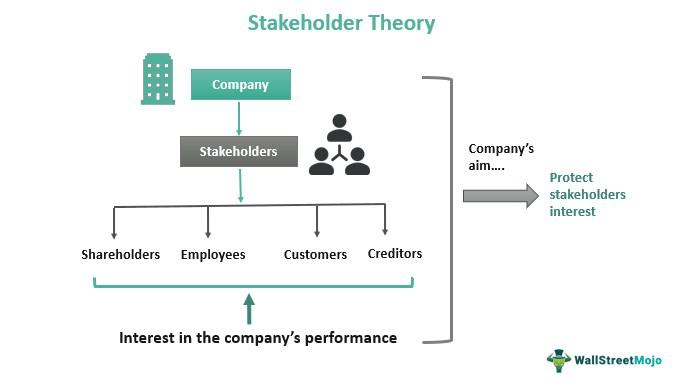

Company delisting occurs when a company's securities are removed from a stock exchange, making them no longer publicly traded on that platform. Delisting may be voluntary, initiated by the company's decision, often due to strategic restructuring, mergers, or returns to private ownership. Involuntary delisting typically results from failing to comply with exchange requirements, financial instability, or not meeting market capitalization thresholds.

Shareholder rights are crucial throughout a company's lifecycle, as they empower investors to exercise control and influence over corporate governance. These rights include voting on major corporate decisions, receiving dividends, and inspecting company records. When a company is delisted, the visibility and marketability of its shares decrease significantly, impacting shareholders' ability to exercise these rights effectively.

Stock ownership entails holding equity in a company, conferring certain rights and responsibilities, such as participating in annual meetings and claiming residual assets upon liquidation after debts are settled. However, post-delisting, the liquidity and market valuation of shares can be adversely affected, leading investors to reassess their positions.

Algorithmic trading, or algo trading, involves using computer programs to execute trades at high speeds based on predefined criteria. This system has become a dominant force in stock markets, affecting liquidity and volatility. Algo trading can impact stock prices significantly, including those of companies facing delisting, by amplifying market movements through rapid buying or selling activities.

The article aims to explore the interplay between company delisting, shareholder rights, stock ownership, and algo trading. Understanding these facets is vital for investors to navigate the complexities of delisting events and optimize their investment strategies in an increasingly digitalized trading environment.

## Table of Contents

## Understanding Company Delisting

Company delisting refers to the removal of a company's stock from being publicly traded on a stock exchange. There are two primary types of delisting: voluntary and involuntary. 

Voluntary delisting occurs when a company decides to remove its stock from the stock exchange. The motivations for such a decision can range from strategic business realignment, attempts to restructure away from public market pressures, or as part of a larger corporate transaction, such as a merger or acquisition. For instance, a company might choose to delist if the costs and regulatory requirements of being a public company outweigh the benefits of access to public capital markets.

Involuntary delisting, on the other hand, is enforced by the stock exchange. This can happen for several reasons, including a company's failure to meet the exchange's ongoing listing requirements, such as minimum financial criteria, timely filing of reports, or minimum share price levels. For example, if a company's stock price falls below the threshold defined by the exchange for an extended period, the exchange may initiate delisting. Other triggers can be non-compliance with regulatory requirements or involvement in fraudulent activities.

The process of delisting involves several steps and key regulatory considerations. For voluntary delisting, a company usually needs to secure approval from its board of directors and, in some cases, its shareholders. The company must also notify the stock exchange of its intention to delist and provide the exchange with a clear rationale. Regulatory bodies, such as the U.S. Securities and Exchange Commission (SEC), may also require companies to file certain disclosures to protect shareholder interests.

Involuntary delisting procedures often begin with a notification from the exchange warning the company about its non-compliance. Companies may be given a grace period to rectify the situation or appeal the decision before delisting is finalized.

Delisting significantly impacts a company's financials and market perception. Financially, delisting can alter a company's [capital raising](/wiki/hedge-fund-capital-raising) options, making it reliant on private funding sources. Being delisted can also negatively influence investor confidence and the company's ability to attract new investment. The market perception of a delisted company may suffer due to perceived instability or governance issues. However, for some companies, delisting provides an opportunity to focus on long-term goals without the pressure of quarterly earnings scrutiny from public investors.

## Shareholder Rights in Delisted Companies

Shareholder rights are fundamental elements of corporate governance, providing investors with a framework to protect and exercise their interests in a company. These rights typically include voting on significant corporate matters, receiving dividends, and gaining access to pertinent financial information. Before a company is delisted, shareholders enjoy these rights under the purview of regulatory bodies like the Securities and Exchange Commission (SEC) in the United States, ensuring transparency and accountability.

The impact of a company's delisting on shareholder rights can be substantial. Delisting restricts some of these rights, making it more challenging for shareholders to access crucial information and participate in decision-making processes. Shareholders may also find it difficult to ascertain the true value of their stocks, as the absence of an organized exchange can lead to a lack of price transparency. Consequently, the market value of shares may decrease dramatically due to reduced [liquidity](/wiki/liquidity-risk-premium) and investor interest.

Despite these challenges, shareholders possess certain legal protections in the event of delisting. These protections are designed to ensure fairness and maintain some degree of transparency. For instance, regulatory bodies often require companies to provide advance notice and detailed reasons for the delisting decision. Shareholders might have the option to vote on delisting proposals, ensuring that their voices are considered. Furthermore, in cases where shareholder rights are significantly impaired, legal recourse may be available through litigation or appeals to regulatory agencies.

Case studies of notable delistings illustrate these issues. The case of Didi Global Inc., a Chinese ride-hailing company, presents a relevant example. In 2021, Didi faced forced delisting from the New York Stock Exchange due to regulatory pressures from Chinese authorities, leading to substantial uncertainty and loss of shareholder value. Shareholders had limited recourse as geopolitical factors overshadowed standard legal protections typically afforded under U.S. jurisdiction.

Another example is the delisting of Enron in 2001, which created a paradigm shift in corporate governance regulations. The delisting followed Enron's bankruptcy filing amid an accounting scandal, resulting in significant financial losses and a reevaluation of shareholder rights and protections.

Overall, while shareholders in delisted companies face distinct challenges, understanding their rights and exploring any available legal avenues can help mitigate potential impacts. Maintaining engagement with corporate management, regulatory updates, and seeking expert advice can further enhance shareholders' ability to protect their interests.

## Stock Ownership After Delisting

When a company is delisted from a stock exchange, the ownership of its stock undergoes a significant transformation. Delisting means that the company's stock is no longer traded on traditional market platforms. However, this does not mean the shares are rendered worthless or disappear; shareholders maintain their ownership rights and the stocks themselves continue to exist, albeit in a different trading environment.

### Options Available for Shareholders After a Company Delists

Following a delisting, shareholders primarily have two options. They can either hold onto their shares or sell them through the over-the-counter (OTC) market if a willing buyer is available. In some instances, the company might propose a buyback of shares, offering shareholders an opportunity to liquidate their positions. Additionally, if delisting is part of a larger corporate restructuring, shareholders might receive new shares in a different entity or financial instruments like bonds as compensation.

### The Concept of Over-the-Counter (OTC) Trading for Delisted Stocks

OTC trading becomes the predominant path for trading delisted stocks. Unlike centralized exchanges, the OTC market is decentralized with trades conducted directly between parties over computer networks or by phone. The lack of formal reporting requirements can lead to less transparency in these transactions. OTC markets often feature reduced liquidity, which can impact the ease and price at which shares can be bought or sold.

### Risks and Benefits Associated with Holding onto or Selling Delisted Stocks

Holding delisted stocks can [carry](/wiki/carry-trading) certain risks. Reduced liquidity might lead to difficulty in finding buyers, potentially resulting in prolonged holding periods. Furthermore, price [volatility](/wiki/volatility-trading-strategies) could increase without the regulatory oversight and stability provided by a major stock exchange. There's also a heightened risk of reduced access to information as delisted companies may not be required to follow the same disclosure standards.

Conversely, there are benefits to holding onto delisted stocks. If a company successfully restructures and improves its financial health, its value could increase significantly, potentially providing substantial returns. Investors who believe in the long-term potential of a company might choose to retain their shares in anticipation of a future relisting or acquisition by a larger entity.

In conclusion, shareholders face multiple considerations when a company is delisted. The decision to hold or sell shares should [factor](/wiki/factor-investing) in the potential for increased risk against possible long-term gains. Careful evaluation of the company's future prospects and personal investment strategy is essential for navigating the complexities associated with stock ownership after delisting.

## The Role of Algorithmic Trading in Delisting Events

Algorithmic trading, or algo trading, refers to the use of computer algorithms to automate trading strategies in financial markets. These algorithms can execute trades at speeds and frequencies impractical for human traders, often based on predetermined instructions such as timing, price, or [volume](/wiki/volume-trading-strategy). The core aspects of [algorithmic trading](/wiki/algorithmic-trading) include data analysis, statistical modeling, and leveraging high-frequency trading technologies to capitalize on market inefficiencies.

### Impact on Stock Volatility

Algorithmic trading contributes significantly to stock market liquidity and volatility. The speed and volume of trades executed through algorithms can lead to rapid fluctuations in stock prices. For companies at risk of delisting, algo trading can exacerbate stock volatility. When a company shows signs of financial distress or regulatory non-compliance, algorithms may initiate selling strategies based on historical data and predictive models, leading to sharp declines in stock prices.

### Influence on Stock Prices at Risk of Delisting

Companies facing potential delisting often experience increased scrutiny from market participants. Algorithmic trading systems, programmed to identify and exploit trends, can accelerate price movements for such companies. The algorithms might detect patterns indicating reduced investor confidence and respond by executing sell orders. This can result in a self-fulfilling prophecy where the anticipation of delisting further depresses stock prices due to the accelerated trading activities triggered by these algorithms.

For instance, consider an algorithm that monitors key financial ratios and news sentiment related to a company. If the algorithm identifies a negative trend, it may trigger an automated response to short-sell the stock, potentially leading to a further decrease in the company's share prices. This cascading effect can destabilize the stock's price, making recovery more challenging.

### Examples of Algorithmic Trading Effects

Historical cases illustrate the profound impact of algo trading during delisting events. For example, during the 2008 financial crisis, several companies witnessed plummeting stock prices partly due to algorithmic trading that identified and reacted to negative market sentiment and declining financial indicators. Although algo trading alone wasn't the sole cause of delisting, it magnified price fluctuations and investor panic, contributing to the companies' delistings.

### Regulations and Ethical Considerations

The proliferation of algorithmic trading poses regulatory challenges. Key regulatory bodies, like the U.S. Securities and Exchange Commission (SEC), have established rules to control the risks associated with high-frequency and algorithmic trading. These include requirements for maintaining adequate system capacity, implementing robust risk controls, and ensuring orderly trading during periods of market stress.

Ethical considerations also arise, particularly concerning market manipulation and fairness. The ability of sophisticated algorithms to exploit minor price discrepancies raises questions about the equitable treatment of market participants. Market regulators continue to evaluate and adjust policies to address these ethical concerns while balancing market efficiency and integrity.

In conclusion, algorithmic trading plays a dual role in the context of delisting events—intensifying market volatility and posing regulatory challenges. As technology evolves, it is imperative for both regulators and market participants to remain vigilant to maintain the balance between innovation and fair market practices.

## Strategies for Shareholders Facing Delisting

When facing the potential delisting of a company, shareholders must adopt strategic approaches to safeguard their investments and future financial stability. Here's a detailed look at some key strategies:

### Diversification of Portfolio
Diversification is a fundamental strategy that helps mitigate risks associated with the delisting of a company. By spreading investments across various asset classes, industries, and geographical locations, shareholders can reduce the impact of a single negative event on their overall portfolio. Mathematically, diversification minimizes the standard deviation $\sigma$ of the portfolio's return, typically calculated as:

$$
\sigma_p = \sqrt{\sum_{i=1}^{n}\sum_{j=1}^{n}w_iw_j\sigma_i\sigma_j\rho_{ij}}
$$

where $w_i$ is the weight of asset $i$ in the portfolio, $\sigma_i$ is the standard deviation of asset $i$, and $\rho_{ij}$ is the correlation coefficient between asset $i$ and asset $j$.

### Seeking Financial Advice
Consulting with financial advisors can provide shareholders with tailored guidance on how to navigate a delisting scenario. Financial advisors can offer insights into market trends, alternative investment opportunities, and risk management strategies. In addition, shareholders can benefit from the expertise of proxy advisory firms, which provide analysis and recommendations on corporate governance issues, including voting on shareholder proposals that may influence the company's future and stakeholder interests.

### Engagement with Company Management
Active engagement with a company's management team is crucial for shareholders to understand the reasons behind a potential delisting and the company’s future plans. Maintaining open lines of communication can offer valuable insights into the company’s financial health, strategic decisions, and potential recovery pathways. Shareholders should attend shareholder meetings, review management reports, and participate in discussions to advocate for their interests and seek clarity on the company's intentions post-delisting.

By proactively implementing these strategies, shareholders can better position themselves to manage the uncertainties associated with company delistings and make informed decisions about their investments.

## Conclusion

This article has explored the multifaceted dynamics of company delisting, shareholder rights, stock ownership, and the influence of algorithmic trading. As a recap, we investigated how delisting can be either voluntary or involuntary, depending on the financial health and strategic decisions of a company. Understanding these factors is crucial for shareholders who must navigate the complexities of a delisting event.

Staying informed about a company's financial health and regulatory developments is vital. Shareholders benefit significantly from keeping abreast of earnings reports, market trends, and amendments in stock exchange regulations, as these elements greatly impact the likelihood and outcomes of delisting events. Proactive understanding and vigilance empower shareholders to protect their investments and exercise their rights effectively.

Algorithmic trading has emerged as a significant influence on stock market behavior, altering the landscape of investment strategies and shareholder experiences. Its impact on stock volatility, particularly for companies nearing delisting, highlights the growing importance of technology in financial markets. Algorithmic systems can execute trades with greater speed and precision, influencing stock prices and liquidity, and thereby affecting shareholder value.

In a rapidly evolving market environment, it's essential for shareholders to remain engaged, not only in terms of the intrinsic value of their stock but also in the technological advancements and algorithmic tools that drive market fluctuations. This awareness and understanding can better equip them to respond to delisting scenarios, allowing for informed decision-making and strategic planning.

In conclusion, the interplay between company delisting, shareholder rights, and algo trading underscores the complexity of modern financial markets. Shareholders are encouraged to maintain a proactive stance, leveraging information and technological insights to navigate the challenges and opportunities presented by delisting events.

## References & Further Reading

[1]: Macey, J. R., O'Hara, M., & Pompilio, D. (2008). ["The Law and Economics of Stock-Related Securities Fraud."](https://www.journals.uchicago.edu/doi/10.1086/593386) The Stanford Law Review, 50(3), 647-713.

[2]: ["The Effect of Stock Exchange Listings on Stock Price"](https://business.columbia.edu/sites/default/files-efs/pubfiles/2101/effect%20of%20listing.pdf) by Richard A. Roll. Journal of Financial Economics, 1977.

[3]: Klette, T. J., & Stanford, M. Life after delisting: The implication of exchange delisting for firm valuation. ["Journal of Corporate Finance"](https://pubmed.ncbi.nlm.nih.gov/11503845/), 2001.

[4]: Busch, T., & Hoffmann, J. (2011). ["The Fundamentals of Algorithmic Trading: Mathematical Concepts and Utility Algorithms."](https://journals.sagepub.com/doi/10.1177/0007650311398780) Springer Science & Business Media.

[5]: Turnbull, S. M. (2002). ["Stockholder Rights and the Unique Nature of Stock Exchanges as Self-Regulatory Organizations."](https://link.springer.com/content/pdf/10.1057/palgrave.rm.8240057.pdf) Vanderbilt Law Review, 63(3), 675-702.