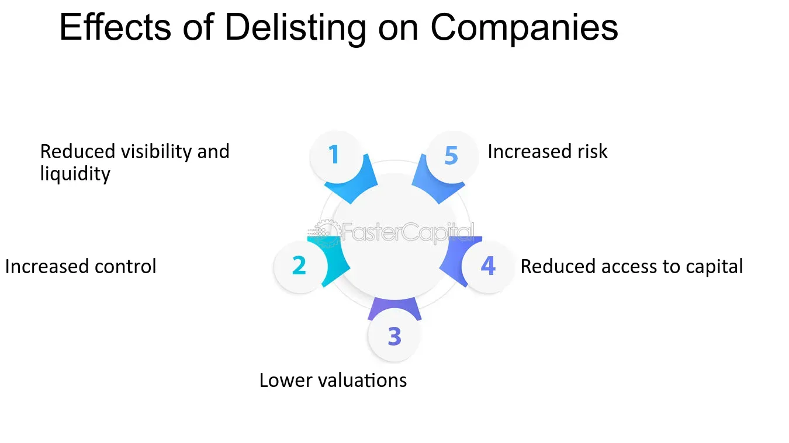

## Table of Contents

## What does it mean when a company gets delisted?

When a company gets delisted, it means that its stock is removed from a stock exchange like the New York Stock Exchange or NASDAQ. This can happen for a few reasons. Sometimes, a company might not meet the rules set by the exchange, like having a low stock price or not filing required reports on time. Other times, the company might choose to delist itself because it wants to go private or merge with another company.

Being delisted can have big effects on the company and its shareholders. For the company, it can be harder to raise money because it's not on a big exchange anymore. For shareholders, it can be tougher to sell their shares because there are fewer buyers and sellers. The stock might also be seen as riskier, which can make its price drop. In some cases, the stock might move to a smaller exchange or be traded over-the-counter, but it's not the same as being on a major exchange.

## How does delisting affect the ownership of shares?

When a company gets delisted, it doesn't change who owns the shares. If you owned shares before the delisting, you still own them after. But, it can be harder to sell your shares because they're not on a big exchange anymore. There are fewer people buying and selling, so it might take longer to find someone who wants to buy your shares.

The value of your shares might also go down when a company gets delisted. People might think the company is riskier now, so they might not want to pay as much for the shares. Sometimes, the shares might move to a smaller exchange or be traded over-the-counter, but it's not as easy to buy and sell them as it was before.

## What are the common reasons for a company to be delisted?

A company can get delisted from a stock exchange for a few main reasons. One big reason is if the company doesn't follow the rules set by the exchange. For example, the stock price might be too low for too long, or the company might not file important reports on time. Another reason is if the company is in big trouble, like going bankrupt. When this happens, the exchange might decide to remove the company's stock.

Sometimes, a company might choose to delist itself. This can happen if the company wants to go private, which means it doesn't want to be on the public stock market anymore. It might also happen if the company is merging with another company and they want to take the stock off the exchange as part of the merger. In these cases, the company itself decides to leave the exchange, instead of being forced out.

## Can shareholders still trade their shares after a company is delisted?

Yes, shareholders can still trade their shares after a company is delisted, but it's not as easy as it was before. When a company is on a big stock exchange, there are lots of people buying and selling shares every day. After delisting, the shares might move to a smaller exchange or be traded over-the-counter. This means fewer people are buying and selling, so it can take longer to find someone who wants to buy your shares.

The value of the shares might also go down after delisting. People might think the company is riskier now, so they might not want to pay as much for the shares. It's important to check where the shares are being traded after delisting and understand that it might be harder and take longer to sell them compared to when the company was on a big exchange.

## What are the immediate financial impacts on shareholders when a company is delisted?

When a company gets delisted, the immediate financial impact on shareholders is usually a drop in the value of their shares. This happens because people might think the company is riskier now that it's not on a big exchange. When something is seen as riskier, people often want to pay less for it. So, the price of the shares can go down quickly after delisting.

Another impact is that it can become harder for shareholders to sell their shares. When a company is on a big stock exchange, there are lots of buyers and sellers, so it's easy to trade shares. After delisting, the shares might move to a smaller exchange or be traded over-the-counter, where there are fewer people buying and selling. This means it might take longer to find someone who wants to buy your shares, and you might not get as good a price as you would have on a big exchange.

## How does delisting impact the long-term value of shareholder investments?

When a company gets delisted, it can hurt the long-term value of shareholder investments. This happens because the company is seen as riskier now that it's not on a big exchange. People might think the company has problems, so they don't want to pay as much for the shares. This can make the share price stay low for a long time. Also, it's harder to sell the shares because there are fewer buyers and sellers. This can make it tough for shareholders to get their money out of the investment, which can make the value of their investment go down even more over time.

In some cases, a delisted company might be able to fix its problems and get listed on a big exchange again. If this happens, the value of the shares could go back up. But this doesn't happen often, and it can take a long time. So, for most shareholders, a delisting means their investment is worth less in the long run. They might have to wait a long time to sell their shares, and even then, they might not get as much money as they hoped for when they first bought the shares.

## What are the differences between voluntary and involuntary delisting in terms of shareholder impact?

When a company chooses to delist itself voluntarily, it means the company decides to leave the big stock exchange on purpose. This can happen if the company wants to go private or if it's merging with another company. For shareholders, this can still mean the value of their shares goes down right away because the shares are now harder to sell. But, sometimes the company might offer to buy back the shares at a good price, which can help shareholders. The long-term impact depends on what the company does after delisting. If it does well as a private company, shareholders who keep their shares might see value later on.

Involuntary delisting happens when the company is forced off the big stock exchange because it doesn't follow the rules. This can be because the stock price is too low, the company didn't file reports on time, or it's in big trouble like going bankrupt. For shareholders, this is usually bad news right away. The value of their shares can drop a lot because people think the company is in trouble. It's also harder to sell the shares because there are fewer buyers. Over the long term, the value of the shares might stay low or even go to zero if the company doesn't fix its problems. Shareholders usually have a harder time with involuntary delisting because they don't get a good offer to buy back their shares like they might with voluntary delisting.

## What legal rights do shareholders have if a company is delisted?

When a company gets delisted, shareholders still have some legal rights. They can still vote on big company decisions, like choosing the board of directors or approving mergers. They also have the right to get information about the company, like financial reports. If shareholders think the company did something wrong that led to the delisting, they might be able to take legal action against the company or its leaders. This could be to get money back or to stop the company from doing something that hurts shareholders.

The rights can be different depending on if the delisting was voluntary or involuntary. If the company chose to delist itself, shareholders might have the right to get a fair price for their shares if the company offers to buy them back. If the delisting was forced because the company broke rules, shareholders might be able to sue the company for not following the rules. But taking legal action can be hard and expensive, so shareholders often need to work together or hire a lawyer to help them.

## How can shareholders mitigate the risks associated with a potential delisting?

Shareholders can take some steps to lower the risks if they think a company might get delisted. One way is to keep an eye on the company's news and financial reports. If the company is doing well and following the rules, it's less likely to get delisted. If shareholders see the company is having problems, like low stock prices or not filing reports on time, they might want to sell their shares before the company gets delisted. This way, they can avoid the big drop in share value that often happens after delisting.

Another way to lower the risk is to spread out their investments. Instead of putting all their money in one company, shareholders can invest in different companies and industries. This way, if one company gets delisted, it won't hurt all their money. Also, shareholders can talk to other shareholders and maybe work together to take action if they think the company is doing something wrong. By staying informed and being ready to act, shareholders can better handle the risks of a potential delisting.

## What role do regulatory bodies play in the delisting process and shareholder protection?

Regulatory bodies like the Securities and Exchange Commission (SEC) in the United States have a big role in the delisting process. They make the rules that companies have to follow to stay on a big stock exchange. If a company doesn't follow these rules, the regulatory body can tell the stock exchange to delist the company. They also keep an eye on the whole process to make sure it's fair and that the company is following the law. If a company is trying to delist itself on purpose, the regulatory body checks to make sure the company is doing it the right way.

Regulatory bodies also help protect shareholders during the delisting process. They make sure that companies tell shareholders about big changes, like a delisting, so shareholders can make smart choices. If shareholders think the company did something wrong that led to the delisting, they can go to the regulatory body for help. The regulatory body can look into the problem and might take action against the company if it broke the rules. This can help shareholders get some of their money back or stop the company from doing more things that hurt shareholders.

## How does the delisting process vary across different stock exchanges and what are the implications for shareholders?

The delisting process can be different depending on which stock exchange a company is on. For example, the New York Stock Exchange (NYSE) and NASDAQ have their own rules about when a company can be delisted. On the NYSE, a company might get delisted if its stock price stays below $1 for too long or if it doesn't file important reports on time. NASDAQ has similar rules, but the exact numbers and time limits can be different. If a company wants to delist itself on purpose, it has to follow the rules set by the exchange and get approval from shareholders. Each exchange has its own steps and rules for this, so the process can take different amounts of time and have different requirements.

The differences in delisting processes across exchanges can affect shareholders in different ways. If a company is delisted from a big exchange like the NYSE or NASDAQ, the value of the shares usually goes down right away because it's harder to sell them. But if the company moves to a smaller exchange or starts trading over-the-counter, the rules of that new place can change how easy it is to buy and sell shares. Shareholders might have to wait longer to sell their shares, and they might not get as good a price. Also, the rules about how shareholders are told about the delisting and what rights they have can be different on each exchange, which can affect what shareholders can do to protect their investment.

## What are some case studies of companies that have been delisted and the subsequent impact on shareholder ownership and value?

One example of a company that was delisted is Enron. Enron was a big energy company that got delisted from the New York Stock Exchange in 2001 after it was found out that the company was hiding big financial problems. When Enron got delisted, the value of its shares dropped a lot. Shareholders lost a lot of money because they couldn't sell their shares for what they were worth before. Many people who owned Enron shares ended up with almost nothing because the company went bankrupt soon after.

Another example is Dell, which chose to delist itself voluntarily in 2013. Dell wanted to go private, so it offered to buy back shares from shareholders at a certain price. This was good for shareholders because they got a fair price for their shares, even though the company was leaving the big stock exchange. After Dell went private, it worked on fixing its problems and growing its business. Later on, Dell came back to the public market in 2018, and the value of the shares went up again. Shareholders who kept their shares during this time saw their investment grow in value.

These two examples show how different delisting can be for shareholders. With Enron, the delisting was forced because of big problems, and shareholders lost a lot of money. With Dell, the delisting was voluntary, and shareholders got a good price for their shares. The long-term impact on shareholder value can also be different, depending on what the company does after it's delisted.

## What are the strategies for shareholders facing delisting?

When facing the potential delisting of a company, shareholders must adopt strategic approaches to safeguard their investments and future financial stability. Here's a detailed look at some key strategies:

### Diversification of Portfolio
Diversification is a fundamental strategy that helps mitigate risks associated with the delisting of a company. By spreading investments across various asset classes, industries, and geographical locations, shareholders can reduce the impact of a single negative event on their overall portfolio. Mathematically, diversification minimizes the standard deviation $\sigma$ of the portfolio's return, typically calculated as:

$$
\sigma_p = \sqrt{\sum_{i=1}^{n}\sum_{j=1}^{n}w_iw_j\sigma_i\sigma_j\rho_{ij}}
$$

where $w_i$ is the weight of asset $i$ in the portfolio, $\sigma_i$ is the standard deviation of asset $i$, and $\rho_{ij}$ is the correlation coefficient between asset $i$ and asset $j$.

### Seeking Financial Advice
Consulting with financial advisors can provide shareholders with tailored guidance on how to navigate a delisting scenario. Financial advisors can offer insights into market trends, alternative investment opportunities, and risk management strategies. In addition, shareholders can benefit from the expertise of proxy advisory firms, which provide analysis and recommendations on corporate governance issues, including voting on shareholder proposals that may influence the company's future and stakeholder interests.

### Engagement with Company Management
Active engagement with a company's management team is crucial for shareholders to understand the reasons behind a potential delisting and the company’s future plans. Maintaining open lines of communication can offer valuable insights into the company’s financial health, strategic decisions, and potential recovery pathways. Shareholders should attend shareholder meetings, review management reports, and participate in discussions to advocate for their interests and seek clarity on the company's intentions post-delisting.

By proactively implementing these strategies, shareholders can better position themselves to manage the uncertainties associated with company delistings and make informed decisions about their investments.

## References & Further Reading

[1]: Macey, J. R., O'Hara, M., & Pompilio, D. (2008). ["The Law and Economics of Stock-Related Securities Fraud."](https://www.journals.uchicago.edu/doi/10.1086/593386) The Stanford Law Review, 50(3), 647-713.

[2]: ["The Effect of Stock Exchange Listings on Stock Price"](https://business.columbia.edu/sites/default/files-efs/pubfiles/2101/effect%20of%20listing.pdf) by Richard A. Roll. Journal of Financial Economics, 1977.

[3]: Klette, T. J., & Stanford, M. Life after delisting: The implication of exchange delisting for firm valuation. ["Journal of Corporate Finance"](https://pubmed.ncbi.nlm.nih.gov/11503845/), 2001.

[4]: Busch, T., & Hoffmann, J. (2011). ["The Fundamentals of Algorithmic Trading: Mathematical Concepts and Utility Algorithms."](https://journals.sagepub.com/doi/10.1177/0007650311398780) Springer Science & Business Media.

[5]: Turnbull, S. M. (2002). ["Stockholder Rights and the Unique Nature of Stock Exchanges as Self-Regulatory Organizations."](https://link.springer.com/content/pdf/10.1057/palgrave.rm.8240057.pdf) Vanderbilt Law Review, 63(3), 675-702.