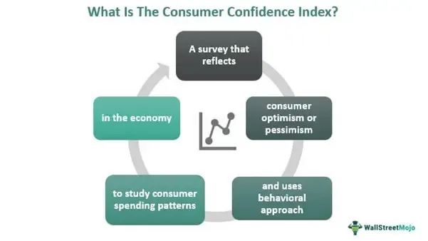

Understanding economic indicators is pivotal for evaluating the overall health and robustness of an economy. These indicators provide insights into various dimensions of economic performance, such as growth, employment, and inflation, offering stakeholders critical data to base their decisions on. Among these indicators, consumer confidence plays a unique role as it reflects the optimism or pessimism of consumers regarding their financial situation and the general economic environment. High consumer confidence usually denotes increased consumer spending, which can lead to economic expansion. Conversely, low confidence may signal cautious behavior, often resulting in reduced spending and economic slowdown.

In recent years, the interplay between consumer confidence, economic indicators, and algorithmic trading has gained prominence in predicting market trends. Algorithmic trading, which utilizes complex algorithms to carry out trades at high speed, increasingly depends on real-time data, including economic indicators and consumer sentiment data, to optimize strategies and maximize returns. This technological advancement allows traders to rapidly analyze and respond to market signals, often providing a competitive edge.



This article explores the dynamic roles these elements play within modern financial systems, focusing primarily on how consumer confidence and economic indicators drive and refine algorithmic trading strategies. By analyzing these components, we aim to understand their significance in anticipating market movements, thus providing more grounded and effective trading approaches. As markets evolve, integrating these indicators promises improved accuracy in forecasting and better-informed trading decisions.

## Table of Contents

## What Are Economic Indicators?

Economic indicators are crucial metrics that provide valuable insights into the state and direction of an economy. These indicators encompass a wide array of data types, each aimed at offering a specific view of the economic landscape. Among the most prominent indicators are Gross Domestic Product (GDP), unemployment rates, and inflation. GDP measures the total value of all goods and services produced over a specific time period, acting as a comprehensive scorecard of a country’s economic health. Unemployment rates indicate the percentage of the labor force that is currently without work but seeking employment, offering insights into labor market health and economic productivity. Inflation measures the rate at which the general level of prices for goods and services rises, eroding purchasing power.

Economic indicators are systematically categorized into three main types: leading, lagging, and coincident indicators. Leading indicators, such as stock market returns and new business startups, are predictive in nature, providing foresight into future economic activity. These indicators change before the economy starts to follow a particular pattern, thus helping policymakers and investors anticipate economic shifts. Lagging indicators, including unemployment rates and corporate earnings, confirm patterns already in progress. They typically change after the economy has begun to follow a trend, thus serving as confirmation tools. Coincident indicators, like GDP and retail sales, move in tandem with the economic cycle, offering real-time snapshots of economic conditions.

These indicators play a pivotal role in guiding fiscal policy, shaping business strategies, and informing investment decisions. Policymakers rely on these metrics to craft economic policies that promote growth and stability. For businesses, economic indicators assist in strategic planning and operational adjustments necessary to align with macroeconomic conditions. Investors use indicators to make informed decisions about asset allocation and risk management, potentially enhancing returns.

Incorporating these economic indicators into decision-making processes allows stakeholders to respond proactively to economic changes, thereby fostering more resilient economic systems and promoting long-term growth and stability.

## Understanding Consumer Confidence

Consumer confidence is an essential metric for gauging the optimism or pessimism of consumers regarding the economic environment. This sentiment is pivotal as it reflects consumers' willingness to spend money, which subsequently drives overall economic growth. Various indices, such as the Consumer Confidence Index (CCI) and the Michigan Consumer Sentiment Index, quantify this sentiment and provide valuable insights into public perception. 

The Consumer Confidence Index is based on a monthly survey that gauges consumers' evaluations of current economic conditions and their expectations for the future. It takes into account views on business conditions, employment, and income expectations. A higher CCI suggests that consumers feel confident about their financial prospects and are more likely to increase spending, which often leads to economic expansion. Conversely, a low confidence level indicates consumer caution, potentially resulting in reduced spending and slower economic growth.

Similarly, the Michigan Consumer Sentiment Index measures consumer attitudes towards current and future economic conditions. It focuses on personal finances, business conditions, and buying conditions, providing a comprehensive view of consumer sentiment. A positive sentiment in this index typically correlates with rising consumer expenditures, bolstering economic activity.

The correlation between consumer confidence and economic performance is significant. High consumer confidence tends to precede periods of substantial economic growth as it encourages increased consumer spending. This spending constitutes a considerable portion of the gross domestic product (GDP), amplifying its importance. Policymakers monitor these indices closely as they provide forward-looking indicators of economic performance, helping in the formulation of fiscal and monetary policies.

For investors, understanding consumer confidence is critical. It helps in predicting market trends as consumer sentiment can influence stock prices, especially in sectors heavily dependent on consumer spending, such as retail and services. Investors use changes in consumer confidence to make informed decisions about buying or selling securities, optimizing their investment strategies.

In summary, consumer confidence is a vital barometer of economic activity. Its measurement through indices like the CCI and Michigan Consumer Sentiment Index offers insights that are indispensable for policymakers and investors aiming to understand and anticipate economic trends.

## The Role of Economic Indicators in Algorithmic Trading

Algorithmic trading uses economic indicators to predict market movements by analyzing various types of economic data. These indicators are classified into three categories: leading, lagging, and coincident.

Leading indicators help forecast future economic activity. They include data sets like the stock market performance, manufacturing activity, and new business startups, which provide insights into upcoming economic changes. For instance, an increase in manufacturing orders might signal upcoming economic expansion. By utilizing leading indicators, [algorithmic trading](/wiki/algorithmic-trading) systems can proactively adjust strategies to capitalize on anticipated market shifts.

Lagging indicators, on the other hand, offer confirmation of existing trends. These indicators include metrics such as unemployment rates and GDP growth, which provide historical data confirming economic patterns. For example, a consistent decline in unemployment rates may validate an ongoing economic recovery. By incorporating lagging indicators, traders can affirm the accuracy of their strategies and ensure they are based on solid data.

Coincident indicators reflect the current state of the economy. These include [statistics](/wiki/bayesian-statistics) like retail sales and industrial production. They provide real-time information about the economic environment, enabling traders to make informed decisions based on current conditions. By incorporating coincident indicators into their models, traders can align their strategies with the present economic climate.

Algorithmic traders integrate these economic indicators into their models to enhance trading efficiency and manage risks effectively. A typical computational approach might involve using Python for data processing and model development. The following Python snippet demonstrates how a simple algorithmic trading strategy could be implemented using economic indicators:

```python
import pandas as pd
from sklearn.linear_model import LinearRegression

# Load economic indicators data
data = pd.read_csv('economic_indicators.csv')
X = data[['leading', 'lagging', 'coincident']]  # Features
y = data['market_movement']  # Target

# Train a linear regression model
model = LinearRegression()
model.fit(X, y)

# Predict market movement based on current indicators
current_indicators = [[1.2, 0.5, 0.8]]  # Example values
predicted_movement = model.predict(current_indicators)

print("Predicted Market Movement:", predicted_movement)
```

In this code, a linear regression model is used to predict market movements based on leading, lagging, and coincident indicators. By training the model with historical data, it can estimate future market movements, allowing traders to optimize their strategies accordingly.

Additionally, algorithmic trading systems must account for data quality and latency to ensure reliable predictions. By carefully selecting relevant indicators and integrating them into sophisticated trading algorithms, professionals in the financial industry can enhance predictive accuracy and improve trading outcomes.

## Application of Consumer Confidence in Algorithmic Trading

Consumer sentiment data serves as a pivotal [factor](/wiki/factor-investing) in refining algorithmic trading strategies, offering the potential to anticipate shifts in market dynamics. At its core, consumer sentiment reflects the prevailing optimism or pessimism about the economic environment, influencing spending behaviors and subsequent market activity. By integrating this data, algorithmic trading models can enhance their predictive accuracy regarding market fluctuations.

Sentiment analysis plays a crucial role in improving trading decisions and performances. It involves the systematic extraction and quantification of consumer attitudes from various data sources, such as surveys and social media. This analysis empowers algorithms to gauge the market mood and assess the potential impact on asset prices. Advanced algorithms can process and analyze vast amounts of unstructured text data, enabling traders to derive insights into consumer sentiment with precision. Consider the following Python code snippet that might be used to analyze consumer sentiment:

```python
from textblob import TextBlob

def analyze_sentiment(text):
    # Analyzing the sentiment of the text
    analysis = TextBlob(text)
    # Return sentiment polarity: positive (>0), negative (<0), or neutral (=0)
    return analysis.sentiment.polarity

# Example usage
text = "The economy is doing well and consumers are optimistic."
sentiment_score = analyze_sentiment(text)
print(f"Sentiment Polarity: {sentiment_score}")
```

Real-time data integration is fundamental for adapting trading strategies based on consumer confidence trends. The continuous influx of sentiment data requires dynamic algorithmic adjustments to capitalize on emerging trends. This adaptability allows traders to respond to changes in consumer confidence quickly—translating subjective sentiment shifts into quantifiable trading signals.

For example, a dip in consumer confidence might indicate a potential slowdown in consumer spending, leading to expectations of declining stock prices in consumer sectors. An algorithm could automatically adjust its position based on these insights, transitioning from bullish to bearish strategies. The key advantage lies in the ability to swiftly incorporate real-time sentiment data to harness market opportunities effectively.

In summary, by incorporating consumer sentiment data into algorithmic trading models, traders can enhance their ability to predict market shifts and adapt strategies accordingly. This integration not only improves decision-making and trading performance but also aligns trading operations closer to evolving market sentiments, offering a strategic edge in a competitive financial landscape.

## Challenges and Considerations

Data quality and real-time integration play a pivotal role in the efficiency of algorithmic trading. High-quality data ensures that trading algorithms can analyze and act upon accurate information. The reliability of these systems is heavily contingent on the precision and timeliness of data inputs, which include economic indicators and consumer sentiment data. For instance, discrepancies in GDP data or delays in unemployment rate reporting could lead to erroneous predictions and substantial financial losses. Effective data management solutions, possibly involving [machine learning](/wiki/machine-learning) techniques, could enhance the accuracy and timeliness of data processing. For example, Python's `pandas` library can be utilized to handle large datasets efficiently:

```python
import pandas as pd

# Load and preprocess economic indicators dataset
data = pd.read_csv('economic_indicators.csv')
processed_data = data.dropna().reset_index(drop=True)
```

Market reactions to economic indicators are often unpredictable, posing significant risks for algorithmic traders. This unpredictability necessitates robust risk management strategies. Algorithms must be designed to account for sudden market changes, often incorporating stop-loss orders and diversification principles to mitigate potential losses. Volatility assessment models, such as the GARCH (Generalized Autoregressive Conditional Heteroskedasticity) model, can assist in understanding and predicting market [volatility](/wiki/volatility-trading-strategies) patterns.

```python
from arch import arch_model

# Fit a GARCH model to market price returns
returns = pd.Series([0.05, -0.02, 0.03, -0.01])
garch_model = arch_model(returns, vol='Garch', p=1, q=1)
garch_results = garch_model.fit()
```

Compliance with regulatory standards is another crucial consideration in algorithmic trading. Regulatory bodies, such as the Securities and Exchange Commission (SEC) in the United States, impose stringent guidelines to ensure fair and ethical trading practices. Traders and firms must adapt their algorithms to align with these regulations, which might include maintaining transparency in trading operations and implementing safeguards against market manipulation. Adherence to these standards not only promotes ethical trading but also enhances market stability and investor trust. High-frequency trading firms must also ensure their operations comply with the latest updates in financial regulation to avert legal consequences and reputational damage.

## Conclusion

Economic indicators and consumer confidence are integral to understanding and forecasting market trends. As economic indicators, such as GDP, unemployment rates, and inflation, provide crucial insights into the health of an economy, they become indispensable for the development of effective algorithmic trading strategies. These indicators are categorized into leading, lagging, and coincident types, each offering unique insights that can enhance trading decisions and optimization.

Consumer confidence measures, including the Consumer Confidence Index and the Michigan Consumer Sentiment Index, offer valuable insights into consumer attitudes and future spending behaviors. High consumer confidence often signals increased consumption, which can lead to economic growth. This makes consumer confidence a pivotal factor for traders who seek to anticipate market movements and adjust their strategies accordingly.

The integration of economic indicators and consumer confidence data into algorithmic trading systems holds significant promise for improving forecasting and trading outcomes. By leveraging historical and real-time data, algorithms can predict market trends with greater accuracy than traditional methods. For instance, Python-based algorithmic models can be developed to analyze patterns and correlations between economic indicators and market performance. Here is a basic template for such a model:
```python
import pandas as pd
from sklearn.linear_model import LinearRegression

# Assume 'economic_data.csv' contains columns: 'gdp', 'unemployment_rate', 'consumer_confidence', 'market_index'
data = pd.read_csv('economic_data.csv')

# Define predictors and outcome variable
X = data[['gdp', 'unemployment_rate', 'consumer_confidence']]
y = data['market_index']

# Train a linear regression model
model = LinearRegression().fit(X, y)

# Predict market index based on new data
new_data = pd.DataFrame({'gdp': [3.0], 'unemployment_rate': [5.0], 'consumer_confidence': [100.0]})
predicted_market_index = model.predict(new_data)
print("Predicted Market Index:", predicted_market_index[0])
```
The continued enhancement and integration of these datasets in trading systems not only promise improved forecasting abilities but also enable more sophisticated risk management and decision-making processes. This is particularly crucial given the increasingly complex and volatile nature of global markets. Ultimately, the strategic utilization of economic indicators and consumer confidence in algorithmic trading platforms represents a forward-looking approach that supports more informed and profitable trading decisions.

## References & Further Reading

[1]: Lopez de Prado, M. (2018). ["Advances in Financial Machine Learning"](https://www.amazon.com/Advances-Financial-Machine-Learning-Marcos/dp/1119482089) John Wiley & Sons.

[2]: Aronson, D. R. (2007). ["Evidence-Based Technical Analysis: Applying the Scientific Method and Statistical Inference to Trading Signals"](https://onlinelibrary.wiley.com/doi/book/10.1002/9781118268315) John Wiley & Sons.

[3]: Jansen, S. (2020). ["Machine Learning for Algorithmic Trading: Predictive models to extract signals from market and alternative data for systematic trading strategies with Python"](https://www.amazon.com/Machine-Learning-Algorithmic-Trading-alternative/dp/1839217715) Packt Publishing.

[4]: Chan, E. P. (2009). ["Quantitative Trading: How to Build Your Own Algorithmic Trading Business"](https://github.com/egorpe/EPChan-QuantitativeTrading/blob/master/example7_6.m) John Wiley & Sons.

[5]: University of Michigan. ["Surveys of Consumers - University of Michigan"](http://www.sca.isr.umich.edu/) Providing the Michigan Consumer Sentiment Index, a key economic indicator. 

[6]: Conference Board. ["The Conference Board Consumer Confidence Index®"](https://www.conference-board.org/topics/consumer-confidence/) A widely recognized barometer of consumer sentiment in the United States. 

[7]: Harvey, C. R. (2020). ["Expectations and the Economy: Understanding Consumer Confidence."](https://people.duke.edu/~charvey/research.htm) Financial Analysts Journal, 76(2), 1-37.

[8]: Knight, J. (2021). ["Introduction to Algorithmic Trading Strategies."](https://www.academia.edu/28622780/Introduction_to_Algorithmic_Trading_Strategies_Lecture_1) Corporate Finance Institute.