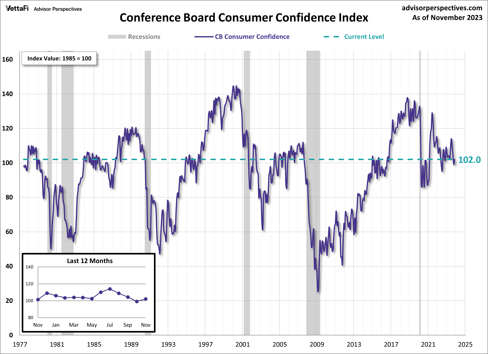

## Table of Contents

## What is consumer confidence and how is it measured?

Consumer confidence is a measure of how optimistic or pessimistic people feel about their financial situation and the economy. It shows how confident people are about their ability to spend money and make big purchases. When people feel good about their financial future, they are more likely to spend money, which can help the economy grow. On the other hand, if people are worried about their finances, they might save their money instead of spending it, which can slow down the economy.

Consumer confidence is usually measured through surveys where people are asked about their views on current and future economic conditions. One common survey is the Consumer Confidence Index, which is done by The Conference Board in the United States. They ask people questions like how they feel about their current financial situation, if they think it will get better or worse in the next six months, and if they plan to buy big things like cars or appliances. The answers to these questions are used to calculate a number that shows the overall level of consumer confidence.

## How does consumer confidence affect personal spending?

Consumer confidence has a big impact on how much people spend. When people feel confident about their financial future and the economy, they are more likely to spend money on things they want or need. This could be anything from buying a new TV to going out for dinner. They feel safe spending because they think their job is secure and their money will keep coming in. This spending helps the economy grow because businesses sell more and might hire more workers.

On the other hand, if people are not confident about the economy or their own finances, they tend to spend less. They might worry about losing their job or not having enough money in the future, so they save more and buy less. This can slow down the economy because when people spend less, businesses sell less and might have to cut jobs. So, consumer confidence is really important for deciding how much money people are willing to spend.

## Can you explain the relationship between consumer confidence and economic growth?

Consumer confidence is like a big piece of the puzzle when it comes to how the economy grows. When people feel good about their money and the economy, they spend more. This spending helps businesses because they sell more stuff. When businesses sell more, they might hire more people, which means more jobs and more money for people to spend. It's like a cycle that keeps the economy moving forward. So, when consumer confidence is high, it can really help the economy grow.

On the flip side, if people are not feeling good about their money or the economy, they tend to spend less. They might save their money instead of buying things they want or need. When people spend less, businesses sell less, and they might have to let some workers go. This can make the economy slow down because there are fewer jobs and less money moving around. So, low consumer confidence can be a problem for economic growth.

## What are some key economic indicators influenced by consumer confidence?

Consumer confidence affects a lot of important economic indicators. One big one is personal consumption, which is how much money people spend on things like food, clothes, and entertainment. When people feel good about their money, they spend more, which makes personal consumption go up. This is really important because personal consumption is a big part of the economy. If it goes up, it can help the whole economy grow.

Another important indicator is retail sales. This is how much money people spend in stores and online. When consumer confidence is high, people buy more stuff, so retail sales go up. This is good for businesses because they make more money when people are buying more. But if consumer confidence goes down, people buy less, and retail sales can drop. This can be bad for businesses and the economy.

The last key indicator is the unemployment rate. When people feel good about their money, they spend more, which can help businesses grow and hire more workers. This can lower the unemployment rate. But if consumer confidence is low, people spend less, businesses might have to cut jobs, and the unemployment rate could go up. So, consumer confidence can really affect how many people have jobs.

## How does consumer confidence impact the stock market?

Consumer confidence can have a big effect on the stock market. When people feel good about their money and the economy, they are more likely to spend and invest. This can make businesses do better because they sell more stuff. When businesses do well, their stock prices usually go up. So, when consumer confidence is high, it can help push the stock market up because more people are buying stocks and the companies are doing better.

On the other hand, if people are not feeling good about their money or the economy, they might spend less and be less likely to invest in the stock market. This can make businesses sell less and their stock prices might go down. When consumer confidence is low, it can make the stock market go down because fewer people are buying stocks and the companies are not doing as well. So, consumer confidence can really move the stock market in big ways.

## What role does consumer confidence play in business investment decisions?

Consumer confidence is really important for businesses when they are deciding where to put their money. When people feel good about their money and the economy, they spend more. This makes businesses think that it's a good time to invest in new things like machines, buildings, or even new products. They see that people are buying more, so they want to grow their business to meet that demand. This can lead to more jobs and help the economy grow even more.

But if consumer confidence is low, businesses might be more careful with their money. They see that people are not spending as much, so they might not want to invest in new things. They might wait until people start feeling better about their money before they spend on big projects. This can slow down the economy because businesses are not growing and creating new jobs. So, consumer confidence can really affect how businesses decide to use their money.

## How do changes in consumer confidence affect employment rates?

When people feel good about their money and the economy, they spend more. This makes businesses sell more stuff and they might need more workers to keep up with all the orders. So, they hire more people, which means the employment rate goes down because more people have jobs. It's like a chain reaction where high consumer confidence leads to more spending, which leads to more business, and then more jobs.

On the other hand, if people are not feeling good about their money, they spend less. This can make businesses sell less stuff, and they might not need as many workers. So, they might have to let some people go, or they might not hire new people. This can make the employment rate go up because more people are out of work. So, when consumer confidence is low, it can lead to fewer jobs and a higher employment rate.

## Can consumer confidence predict economic recessions or recoveries?

Consumer confidence can give us clues about whether an economic recession might be coming or if the economy might be getting better. When people start feeling less sure about their money and the economy, they might spend less. This can be a warning sign that a recession might be on the way because when people spend less, businesses sell less and might have to cut jobs. Economists keep an eye on consumer confidence to see if it's going down fast, which could mean tough times ahead.

On the other hand, when consumer confidence starts going up, it can be a good sign that the economy might be recovering. If people feel better about their money, they start spending more. This can help businesses grow and hire more people, which is a big part of getting out of a recession. So, watching consumer confidence can help us understand if the economy is getting ready to bounce back.

## How do different demographic groups influence overall consumer confidence?

Different groups of people can affect how confident everyone feels about the economy. For example, if young people are feeling good about their jobs and money, they might spend more on things like going out or buying new gadgets. This can make the overall consumer confidence go up because they are a big part of the economy. On the other hand, if older people are worried about their savings and retirement, they might spend less and save more. This can pull the overall consumer confidence down because they also make up a big part of the economy.

Another way different groups can influence consumer confidence is through their income levels. People with higher incomes might feel more secure and spend more on big things like houses or cars, which can boost consumer confidence. But if people with lower incomes are struggling to pay for basic things like food and rent, they might cut back on spending a lot. This can bring down the overall consumer confidence because they are a big part of the economy too. So, how different groups feel about their money can really change how confident everyone is about the economy.

## What are the global impacts of consumer confidence on international trade?

Consumer confidence doesn't just affect one country; it can have a big impact on international trade too. When people in a country feel good about their money, they spend more on things, including stuff that comes from other countries. This can make businesses in those other countries sell more and do better. For example, if people in the United States feel confident and buy more cars made in Japan, it helps the Japanese car companies and the whole Japanese economy. So, high consumer confidence in one place can help trade and economies all over the world.

On the other hand, if consumer confidence drops in a big country, it can hurt international trade. When people feel worried about their money, they spend less on everything, including things made in other countries. This can make businesses in those countries sell less and maybe even have to let workers go. For instance, if people in Europe start spending less on electronics from South Korea, it can hurt the South Korean companies and the whole South Korean economy. So, low consumer confidence in one place can slow down trade and affect economies everywhere.

## How do government policies respond to shifts in consumer confidence?

When consumer confidence goes up or down, governments often change their policies to help the economy. If consumer confidence is high, the government might not need to do much because people are spending and the economy is doing well. But if they see that people are feeling really good, they might decide to save some money for later or make sure that the economy doesn't grow too fast and cause problems. They do this by maybe raising taxes a little or making it harder for people to borrow money.

If consumer confidence drops, the government usually tries to help by making policies that encourage people to spend more. They might lower taxes so people have more money in their pockets, or they might make it easier for people to borrow money to buy things like houses or cars. The government might also spend more money on things like building roads or schools to create jobs and get the economy moving again. All these actions are meant to make people feel better about their money and start spending more.

## What advanced statistical methods are used to analyze the impact of consumer confidence on economic indicators?

To study how consumer confidence affects things like spending, jobs, and the stock market, experts use fancy math tools called advanced statistical methods. One popular method is regression analysis. This helps them see how much consumer confidence changes things like how much people spend or how many people have jobs. They can also use time series analysis to look at how consumer confidence and the economy change over time. This helps them spot patterns and predict what might happen next.

Another method they use is called panel data analysis. This lets them look at consumer confidence and economic indicators across different groups of people or different places at the same time. It's like taking a snapshot of how everyone is feeling and spending in different areas. By using these methods, experts can get a clearer picture of how consumer confidence really affects the economy and make better guesses about what might happen in the future.

## References & Further Reading

[1]: Lopez de Prado, M. (2018). ["Advances in Financial Machine Learning"](https://www.amazon.com/Advances-Financial-Machine-Learning-Marcos/dp/1119482089) John Wiley & Sons.

[2]: Aronson, D. R. (2007). ["Evidence-Based Technical Analysis: Applying the Scientific Method and Statistical Inference to Trading Signals"](https://onlinelibrary.wiley.com/doi/book/10.1002/9781118268315) John Wiley & Sons.

[3]: Jansen, S. (2020). ["Machine Learning for Algorithmic Trading: Predictive models to extract signals from market and alternative data for systematic trading strategies with Python"](https://www.amazon.com/Machine-Learning-Algorithmic-Trading-alternative/dp/1839217715) Packt Publishing.

[4]: Chan, E. P. (2009). ["Quantitative Trading: How to Build Your Own Algorithmic Trading Business"](https://github.com/egorpe/EPChan-QuantitativeTrading/blob/master/example7_6.m) John Wiley & Sons.

[5]: University of Michigan. ["Surveys of Consumers - University of Michigan"](http://www.sca.isr.umich.edu/) Providing the Michigan Consumer Sentiment Index, a key economic indicator. 

[6]: Conference Board. ["The Conference Board Consumer Confidence Index®"](https://www.conference-board.org/topics/consumer-confidence/) A widely recognized barometer of consumer sentiment in the United States. 

[7]: Harvey, C. R. (2020). ["Expectations and the Economy: Understanding Consumer Confidence."](https://people.duke.edu/~charvey/research.htm) Financial Analysts Journal, 76(2), 1-37.

[8]: Knight, J. (2021). ["Introduction to Algorithmic Trading Strategies."](https://www.academia.edu/28622780/Introduction_to_Algorithmic_Trading_Strategies_Lecture_1) Corporate Finance Institute.