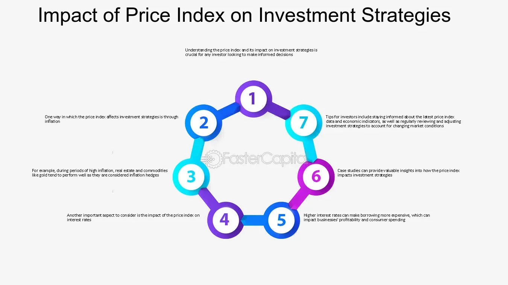

## Table of Contents

## What is the Consumer Price Index (CPI)?

The Consumer Price Index, or CPI, is a measure that shows how the prices of goods and services that people buy change over time. It's like a big shopping list that includes things like food, clothes, housing, and more. By comparing the total cost of this list from one time to another, the CPI helps us understand if things are getting more expensive or cheaper.

The CPI is important because it helps people, businesses, and the government understand the economy better. For example, if the CPI goes up a lot, it means prices are rising quickly, which is called inflation. This can affect how much money people can buy with their earnings. Governments and central banks use the CPI to make decisions about economic policies, like setting interest rates, to help keep the economy stable.

## How is the CPI calculated?

The CPI is calculated by first figuring out a typical basket of goods and services that people buy. This basket includes things like food, clothing, housing, and transportation. The government surveys people to find out what they usually buy and how much they spend on each item. Then, they track the prices of these items over time in different places to see how much they change.

Once they have the price data, they calculate the CPI by comparing the total cost of the basket at different times. They start with a base year, which they set to 100. If the total cost of the basket goes up, the CPI will be higher than 100, showing that prices have increased. If it goes down, the CPI will be lower than 100, showing that prices have decreased. This way, the CPI shows the percentage change in prices from the base year.

## What does the CPI measure?

The CPI measures how much the prices of things people buy every day change over time. It's like keeping track of how much more or less you have to pay for the same stuff, like food, clothes, and rent. The CPI looks at a big list of these items, called a basket, and sees how the total cost of this basket changes from one time to another.

This measure helps everyone understand if prices are going up, which is called inflation, or if they're going down, which is called deflation. When the CPI goes up, it means things are getting more expensive. When it goes down, things are getting cheaper. Governments and people use the CPI to make decisions, like adjusting wages or setting economic policies, to help keep the economy stable and fair for everyone.

## How does the CPI affect the economy?

The CPI affects the economy in big ways because it shows how fast prices are changing. When the CPI goes up a lot, it means prices are going up fast, which we call inflation. If inflation is too high, people might not be able to buy as much with their money. This can make them unhappy and spend less, which can slow down the economy. On the other hand, if the CPI stays the same or goes down, it might mean prices are not changing much or are getting cheaper, which can make people feel good about buying things and help the economy grow.

Governments and central banks use the CPI to make important decisions. For example, if the CPI shows high inflation, the central bank might raise interest rates to slow down spending and bring prices back down. If the CPI shows low inflation or even deflation, they might lower interest rates to encourage people to borrow and spend more. This way, the CPI helps keep the economy balanced. It also affects things like wages and social security benefits, as these are often adjusted based on the CPI to keep up with the cost of living.

## What is the relationship between CPI and inflation?

The CPI and inflation are closely related. The CPI measures how the prices of everyday things, like food and clothes, change over time. When the CPI goes up, it means these prices are going up too. This rise in prices is what we call inflation. So, the CPI is a way to track inflation by looking at how much more expensive things are getting.

When the CPI shows that prices are going up a lot, it means inflation is high. High inflation can make people feel like their money isn't worth as much because they can buy less with it. Governments and central banks watch the CPI to see if inflation is getting too high. If it is, they might do things like raise interest rates to slow down spending and help bring prices back down. This way, the CPI helps keep the economy in check by showing when inflation is a problem.

## How can changes in CPI influence investment returns?

Changes in the CPI can affect investment returns because they show how much prices are going up or down. When the CPI goes up a lot, it means there's high inflation. This can be bad for some investments like bonds because the money you get back might not be worth as much when you get it. For example, if you have a bond that pays you back $100 in the future, but prices have gone up a lot, that $100 won't buy as much as it used to. On the other hand, if you invest in things like real estate or commodities, they might do better during high inflation because their prices can go up too.

Also, when the CPI shows high inflation, central banks might raise interest rates to slow down spending and bring prices down. Higher interest rates can make borrowing more expensive, which can slow down the economy. This might make stocks go down in value because companies might make less money. But, higher interest rates can be good for some investments like savings accounts or certain bonds because they might pay you more interest. So, keeping an eye on the CPI can help you understand how your investments might do in the future.

## What investment strategies are typically used in response to rising CPI?

When the CPI goes up a lot, people often change their investment strategies to deal with the higher prices. One common strategy is to invest in things that do well when prices are rising, like real estate or commodities. These things can go up in value as prices go up, so they might help protect your money from losing value because of inflation. Another strategy is to look at stocks from companies that can raise their prices easily when costs go up, like big companies that sell things people always need, like food or medicine. These companies might keep making money even when prices are high.

Another approach is to invest in inflation-protected securities, like Treasury Inflation-Protected Securities (TIPS) in the United States. These are special bonds that change their value based on the CPI, so they can help keep your money safe from inflation. Some people also choose to keep more money in savings accounts or short-term bonds that pay higher interest rates when the central bank raises rates to fight inflation. This way, they can earn more interest and keep up with the rising costs. By using these strategies, investors can try to make sure their money keeps its value even when prices are going up.

## How does a high CPI affect different asset classes like stocks, bonds, and real estate?

When the CPI goes up a lot, it can have different effects on stocks, bonds, and real estate. For stocks, a high CPI means there's more inflation, which can make it harder for companies to make money if they can't raise their prices. If the economy slows down because of high inflation, stock prices might go down. But, some companies, like those that sell things people always need, might do okay or even better because they can raise prices without losing customers. So, a high CPI can make some stocks go down and others stay the same or go up.

For bonds, a high CPI is usually bad news. When there's a lot of inflation, the money you get back from bonds might not be worth as much. Also, when the central bank raises interest rates to fight inflation, new bonds start paying more interest, making the old bonds less valuable. So, people might sell their old bonds, which makes their prices go down. Real estate, on the other hand, can do well when the CPI is high. Houses and land often go up in price when there's inflation, so owning real estate can help protect your money from losing value. But, if interest rates go up a lot, it can make borrowing money to buy real estate more expensive, which might slow down the real estate market.

## Can CPI trends predict market movements, and if so, how?

CPI trends can help predict market movements because they show how prices are changing, which can affect how people and companies behave. When the CPI goes up a lot, it means prices are going up fast, which is called inflation. If people see that inflation is getting high, they might start worrying that their money will be worth less in the future. This can make them spend less and save more, which can slow down the economy. Companies might also have a harder time making money if they can't raise their prices to keep up with inflation. So, when the CPI is going up, the stock market might go down because people are worried about the economy.

On the other hand, if the CPI is going up slowly or staying the same, it can make people feel more confident about the economy. They might spend more and invest more in stocks, which can help the market go up. Also, when the CPI goes up a lot, central banks might raise interest rates to slow down inflation. Higher interest rates can make borrowing money more expensive, which can slow down the economy and make stocks go down. But, higher interest rates can be good for bonds and savings accounts because they might pay more interest. So, by watching the CPI, investors can get a good idea of what might happen in the market and change their investments to do better.

## What are the limitations of using CPI as a guide for investment decisions?

Using the CPI as a guide for investment decisions has some limits. The CPI only looks at a certain list of things that people buy, but it might not cover everything that matters to you. For example, if you spend a lot on healthcare but the CPI doesn't weigh healthcare as much, it might not show the real changes in your costs. Also, the CPI is based on the past, so it can't tell you exactly what will happen in the future. It's like looking in the rearview mirror while driving; it helps, but you need to look ahead too.

Another problem is that the CPI can be slow to change. It takes time to collect all the price data and figure out the new CPI number, so by the time you see the new CPI, the market might have already moved. Plus, the CPI is just one piece of the puzzle. Other things like interest rates, jobs, and world events can also affect the market a lot. So, while the CPI can give you a good idea of what's happening with prices, it's not the only thing you should look at when making investment choices.

## How do investors adjust their portfolios in anticipation of CPI changes?

Investors often adjust their portfolios when they think the CPI is going to change. If they expect the CPI to go up a lot, which means high inflation, they might move their money into things that do well when prices rise. This could mean buying more real estate or commodities like gold, because these things often go up in value when everything else gets more expensive. They might also look at stocks from big companies that can raise their prices easily, like those that sell food or medicine. These companies can keep making money even when prices are going up.

On the other hand, if investors think the CPI will stay the same or go down, they might feel more confident about the economy. They could put more money into stocks, especially if they think the market will go up because people are spending more. If they expect the CPI to go up and interest rates to rise as a result, they might move some money into bonds or savings accounts that pay higher interest. By watching the CPI and guessing what might happen next, investors can try to make sure their money keeps its value no matter what the economy does.

## What advanced statistical tools can be used to analyze the impact of CPI on investment performance?

To understand how the CPI affects investment performance, investors can use advanced statistical tools like regression analysis. This tool helps them see how changes in the CPI might lead to changes in their investments. For example, they can use regression to find out if a rise in the CPI makes stock prices go down or if it helps real estate prices go up. By looking at past data, regression analysis can show patterns and help investors guess what might happen next.

Another useful tool is time series analysis, which looks at how the CPI changes over time and how those changes affect investments. This can help investors see if there are any regular patterns or cycles in the CPI that they can use to make better investment choices. For example, if the CPI goes up every year around the same time, investors might decide to buy certain investments before that happens. By using these advanced tools, investors can make smarter decisions and try to keep their money safe from the ups and downs of inflation.

## What is the role of price indexes in measuring inflation?

Price indexes, such as the Consumer Price Index (CPI) and the Producer Price Index (PPI), serve as fundamental tools in measuring inflation within an economy. These indexes provide crucial insights that aid both policymakers and investors in understanding and responding to economic conditions.

The CPI is designed to measure the average change over time in the prices paid by urban consumers for a basket of goods and services. It reflects price changes from the consumer's perspective, offering critical insights into inflationary pressures that affect purchasing power. The CPI is a leading indicator for determining inflation rates and is often used to adjust social security payments and tax brackets for inflation. 

Mathematically, the CPI for a given period can be expressed as:

$$
\text{CPI} = \left( \frac{\text{Cost of Market Basket in Current Year}}{\text{Cost of Market Basket in Base Year}} \right) \times 100
$$

The PPI, on the other hand, tracks the average change in selling prices received by domestic producers for their output. Unlike the CPI, the PPI captures price changes at the wholesale level, making it an essential precursor for future changes in the CPI. By indicating the cost pressures faced by producers, the PPI can signal impending consumer price changes, thereby serving as an early warning system for inflationary trends.

Fluctuations in these indexes have broad implications for financial markets. For instance, rising inflation indicated by these indexes can lead to increased interest rates as central banks intervene to curb inflation. Higher interest rates can depress bond prices and alter the attractiveness of various asset classes. In currency markets, inflation differences can lead to shifts in exchange rates due to changes in purchasing power parity.

Algorithmic trading systems are particularly adept at using real-time data from these indexes to make informed trading decisions. These systems can parse the data rapidly, providing insights that might not be immediately apparent to human traders. For example, a sudden increase in the PPI could be integrated into an algorithmic model to adjust positions in anticipation of CPI-driven changes in consumer markets.

The integration of price index data into [algorithmic trading](/wiki/algorithmic-trading) strategies allows for the exploitation of temporal relationships between production costs and consumer prices, enhancing decision-making processes. Thus, understanding the role of CPI and PPI in measuring inflation is not only vital for economic analysis but also for crafting sophisticated trading strategies that capitalize on inflationary trends.

## References & Further Reading

[1]: ["Advances in Financial Machine Learning"](https://www.amazon.com/Advances-Financial-Machine-Learning-Marcos/dp/1119482089) by Marcos Lopez de Prado

[2]: ["Machine Learning for Algorithmic Trading"](https://github.com/stefan-jansen/machine-learning-for-trading) by Stefan Jansen

[3]: ["Quantitative Trading: How to Build Your Own Algorithmic Trading Business"](https://www.amazon.com/Quantitative-Trading-Build-Algorithmic-Business/dp/1119800064) by Ernest P. Chan

[4]: ["Evidence-Based Technical Analysis: Applying the Scientific Method and Statistical Inference to Trading Signals"](https://www.amazon.com/Evidence-Based-Technical-Analysis-Scientific-Statistical/dp/0470008741) by David Aronson

[5]: Federal Reserve Economic Data (FRED) - [Consumer Price Index for All Urban Consumers](https://fred.stlouisfed.org/series/CPIAUCSL) (CPI-U) data by the Federal Reserve Bank of St. Louis

[6]: Investopedia. ["Understanding Consumer Price Index (CPI)"](https://www.investopedia.com/terms/c/consumerpriceindex.asp)  

[7]: Khan, M., & Vieito, J. P. (2012). ["Financial Markets and the Economic Role of Inflation."](https://www.researchgate.net/publication/258193125_CEO_gender_and_firm_performance) Review of Derivatives Research.