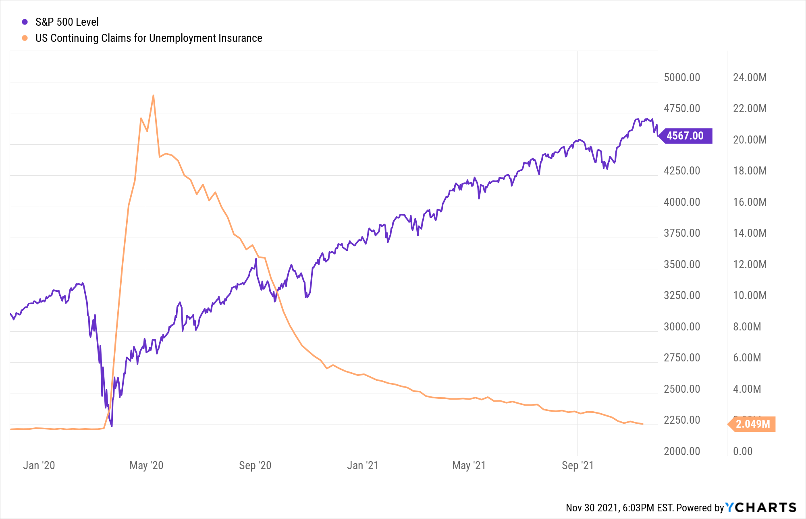

In today's rapidly evolving financial markets, the importance of understanding the complex interaction between corporate events, stock values, bond values, and algorithmic trading cannot be overstated. These elements collectively shape the landscape of strategic investment, defining both opportunities and challenges for investors. Corporate events, such as earnings announcements, mergers, and bankruptcies, hold significant sway over financial markets, often resulting in substantial shifts in asset valuations.

Earnings announcements, for example, can trigger rapid and pronounced changes in stock prices, as investors recalibrate their expectations based on a company's reported financial performance. During mergers, heightened stock volatility is commonly observed as market participants speculate on the potential synergies and future efficacy of the combined entities. Conversely, bankruptcies can drastically erode stock value, compelling investors to reassess risk exposures, although bonds associated with the defaulting entity may retain value depending on their rank and structure in the debt hierarchy.



Algorithmic trading has emerged as a key player in navigating the complexities introduced by these corporate events. By leveraging high-speed computations and vast data processing capabilities, algorithmic trading strategies—ranging from merger arbitrage to event-driven investing—can swiftly exploit short-term price inefficiencies. These algorithms apply sophisticated models, sometimes incorporating machine learning techniques, to forecast potential market reactions and optimize trading decisions based on prevailing conditions.

In an investment environment increasingly dominated by automation, gaining insights into the underlying mechanisms of market movements induced by corporate events is crucial. Investors equipped with an understanding of the synergistic dynamics between corporate activities and market responses are better positioned to make informed decisions. This knowledge not only aids in optimizing portfolio performance but also helps in mitigating associated risks and capitalizing on potential rewards.

This article aims to provide a comprehensive exploration of these intricacies, offering strategic perspectives for investors operating in an automated trading milieu. By analyzing the effects of corporate events on stock and bond valuations and examining algorithmic trading strategies, it seeks to furnish a holistic understanding of market dynamics. Additionally, the discussion will encompass the inherent risks and rewards, furnishing a thorough overview necessary for effective navigation in today's complex financial markets.

## Table of Contents

## The Impact of Corporate Events on Stock and Bond Values

Corporate events exert a profound influence on the valuation of stocks and bonds, thus shaping investor sentiment and market performance. These events, ranging from mergers and acquisitions (M&A) to bankruptcies and corporate announcements, create significant market dynamics.

Mergers and acquisitions are among the most impactful corporate events, often triggering increased stock [volatility](/wiki/volatility-trading-strategies). In a merger, the acquiring company might see its stock price fluctuate as investors speculate on the strategic benefits and potential synergies, such as cost reductions and increased market share. The target company's stock usually experiences a price surge, aligning closer to the acquisition offer. The volatility stems from the market's evaluation of the transaction's success, potential regulatory hurdles, and the strategic fit between the entities involved.

Bankruptcies represent another critical event with pronounced effects on stock and bond values. Typically, a company's announcement of bankruptcy leads to a dramatic decline in its stock value as equity holders adjust to the heightened risk or possible elimination of their investment. However, bonds may retain some value depending on their priority status in the company's capital structure. Secured bonds, which are backed by collateral, may experience less depreciation compared to unsecured bonds, which are subordinate in the hierarchy of debt recovery during liquidation.

Corporate announcements, such as stock buybacks, also have a considerable effect on market valuations. When a company announces a share repurchase program, it signals confidence in its financial health and potentially increases the stock's intrinsic value. Buybacks reduce the number of outstanding shares, potentially increasing earnings per share (EPS) and, consequently, boosting the stock price. For example, the formula for calculating EPS is:

$$
\text{EPS} = \frac{\text{Net Income}}{\text{Average Outstanding Shares}}
$$

A reduction in the denominator through stock buybacks results in a higher EPS, assuming net income remains constant, which can drive up stock prices as investors perceive greater value in each share.

For investors, understanding these corporate events and their implications is crucial for optimizing portfolio performance. This includes not just acknowledging the potential upside of stock and bond revaluation but also preparing for adverse effects. Investors should regularly analyze corporate announcements and events, assessing how these will likely influence market perceptions and valuations. This analytical approach aids in crafting a resilient, diversified portfolio capable of weathering the uncertainties and opportunities presented by corporate events.

## Algorithmic Trading Strategies for Corporate Events

Algorithmic trading plays a crucial role in leveraging short-term price inefficiencies that can arise during corporate events. Event-driven strategies, including merger [arbitrage](/wiki/arbitrage) and special situations investing, are specifically designed to capitalize on these opportunities. In the case of merger arbitrage, for instance, traders capitalize on the price discrepancies that often occur between the stock price of a target company and the purchase price offered by the acquiring firm. Similarly, special situations investing focuses on events such as spinoffs, restructurings, and asset sales, where value discrepancies can be identified and exploited.

Algorithms are essential in processing large datasets rapidly, facilitating timely trade execution in line with current market conditions and detailed event analyses. They utilize real-time data feeds and can instantly react to new information, ensuring that trades align with optimal strategies. For instance, when a corporate action is announced, algorithms can calculate the potential impact on stock prices and execute trades within milliseconds, a speed unattainable by human traders.

The use of predictive models and [machine learning](/wiki/machine-learning) further enhances these trading strategies. Machine learning techniques can be employed to detect patterns and predict the outcomes of corporate events. By training models on historical data, traders can improve their decision-making processes. For example, neural networks or decision trees can be used to estimate the likely success of a merger based on past mergers of similar nature, thereby refining trade executions.

Moreover, algorithmic models must consider both regulatory and market conditions to adapt strategies in real time for maximum profitability. Regulatory constraints, such as trading restrictions and market transparency rules, must be factored into the algorithms. Market conditions, including [liquidity](/wiki/liquidity-risk-premium) and volatility levels, also need continuous monitoring, as they directly affect trade execution and strategy effectiveness. Overall, the integration of machine learning and adaptive algorithms enables traders to navigate the complexities of modern financial markets effectively.

To highlight this with a simple Python example, consider the simulation of a merger arbitrage strategy using historical stock price data:

```python
import pandas as pd
import numpy as np
from sklearn.linear_model import LinearRegression

# Load historical stock prices
data = pd.read_csv('stock_prices.csv')

# Assume 'announcement' marks the event date
event_date = data['announcement'].iloc[0]

# Calculate price movements before and after the event
pre_event = data[data['date'] < event_date]['price']
post_event = data[data['date'] >= event_date]['price']

# Linear Regression to predict post-event price
model = LinearRegression()
model.fit(np.arange(len(pre_event)).reshape(-1, 1), pre_event.values)

# Predict price after event
predicted_post_event = model.predict(np.arange(len(post_event)).reshape(-1, 1))

# Calculate potential arbitrage opportunity
arbitrage_opportunity = post_event.values - predicted_post_event

print("Potential Arbitrage Profit:", np.sum(arbitrage_opportunity))
```

This code represents a simplified illustrative model, highlighting the concept of using historical data to predict and evaluate potential trading opportunities, aligning with the framework employed by more sophisticated [algorithmic trading](/wiki/algorithmic-trading) platforms.

## Event-Driven Trading: Tools and Technologies

Real-time data feeds and economic calendars are indispensable for event-driven traders who seek to leverage corporate events for profitable opportunities. These tools provide immediate access to critical information, enabling traders to swiftly respond to market changes driven by corporate announcements, such as earnings reports or mergers. Economic calendars, specifically, outline upcoming economic events and releases, allowing traders to anticipate market movements and strategize accordingly.

News aggregators play a crucial role by consolidating corporate announcements and other market-moving news. They filter massive amounts of information from various sources, presenting traders with relevant insights and helping them remain updated on developments that could impact their portfolios. The ability to quickly assess and react to news is a significant advantage in a market where timing can determine profitability.

Advanced trading platforms and algorithmic software are essential for enhancing the speed and accuracy of trade execution. These platforms facilitate automated trading, enabling traders to set predefined criteria for transactions and execute trades at optimal moments. Such automation is particularly beneficial during periods of high volatility, common in event-driven scenarios, as it minimizes the lag between decision-making and execution.

Backtesting tools and historical data analysis are vital for developing robust trading strategies. By analyzing past market data, traders can identify patterns and behaviors associated with specific corporate events, refining their strategies for future events. Through [backtesting](/wiki/backtesting), traders simulate their strategies against historical data to assess potential performance and risk, making adjustments as needed before real capital is deployed.

Effective risk management tools are crucial for mitigating potential losses from unexpected events. These tools assist traders in setting stop-loss limits, managing leverage, and implementing hedging strategies to protect against adverse market movements. By employing such mechanisms, traders can preserve capital and maintain a balanced risk-reward profile, even in unpredictable market conditions.

Together, these tools and technologies equip event-driven traders with the resources needed to navigate the complexities of modern financial markets. Automated systems, real-time insights, and robust strategy development enable traders to capitalize on corporate events while managing associated risks effectively.

## Challenges and Risk Management in Event-Driven Trading

The unpredictable nature of events poses a significant challenge for traders, necessitating robust risk management strategies to mitigate potential losses. Event-driven trading, characterized by reacting to corporate announcements and market news, requires traders to be agile in their decision-making processes. One of the fundamental aspects of managing risk in this volatile environment is the implementation of clear stop-loss limits. These limits serve to minimize potential losses by automatically closing positions once a predetermined price threshold is breached. This strategy allows traders to cap their downside risk, ensuring that a single adverse movement does not significantly impact their portfolio.

Diversifying across different asset classes is another critical strategy in managing risk. By spreading investments across various sectors or types of securities, traders can reduce the impact of any single event on their overall portfolio performance. Diversification helps balance potential losses in one area with gains in another, creating a more stable portfolio structure that can better withstand the unpredictable nature of financial markets.

Overreliance on specific events or data points may lead to overtrading, which can significantly increase transaction costs and erode potential profits. Traders need to be judicious in selecting the events they choose to act upon. Adopting a disciplined approach to trading, where actions are backed by thorough research and analysis, helps in avoiding unnecessary trades that do not align with the overall investment strategy.

Automated trading systems play a critical role in mitigating the emotional stress that comes with rapid market fluctuations. These systems execute trades based on pre-defined criteria, effectively removing the emotional component from trading decisions. By sticking to algorithmic rules, traders can maintain consistency in their strategies, unaffected by short-term market noise or psychological biases.

Continuous learning and adaptation are imperative for long-term success in event-driven trading. Markets are dynamic, and strategies that are effective today may not be tomorrow. Traders should remain vigilant, regularly updating their knowledge and refining their strategies to reflect new information and shifting market conditions. Engaging in ongoing education, whether through academic courses, industry seminars, or professional reading, ensures that traders keep pace with advancements in market analysis techniques and risk management tools.

In summary, effective risk management in event-driven trading encompasses a mix of strategic foresight, disciplined execution, automation, and continuous education. By incorporating these elements, traders can better navigate the complexities of financial markets and optimize their investment outcomes.

## Conclusion

Mastering the interplay between corporate events, stock and bond valuations, and algorithmic trading strategies is crucial for modern investors aiming to thrive in today's dynamic financial environment. Corporate events such as mergers, bankruptcies, and earnings announcements have profound impacts on asset prices, creating both challenges and opportunities within the market.

Leveraging technological advancements is a key [factor](/wiki/factor-investing) that enables traders to enhance their decision-making capabilities and seize emerging market opportunities. Tools like real-time data feeds, advanced algorithmic platforms, and machine learning models allow traders to process information swiftly and execute trades with increased precision.

Despite the inherent risks associated with event-driven trading, informed and strategic investors can unlock significant potential returns. The ability to anticipate and respond to market changes driven by corporate events is a competitive advantage, rewarding those who can interpret signals accurately and act decisively.

Staying agile and adaptable is vital in navigating the complexities of contemporary financial markets. With ever-evolving market conditions and regulatory environments, investors must be ready to adjust their strategies in real-time. This adaptability can mitigate risks associated with volatile market reactions to corporate events.

Ongoing education and meticulous strategy testing are indispensable for successful event-driven trading. Continual learning helps traders stay updated on industry trends and emerging technologies, while rigorous testing ensures the robustness and reliability of trading strategies. By committing to these practices, investors can maintain an edge and achieve sustainable success in the market.

## References & Further Reading

[1]: Bergstra, J., Bardenet, R., Bengio, Y., & Kégl, B. (2011). ["Algorithms for Hyper-Parameter Optimization."](https://dl.acm.org/doi/10.5555/2986459.2986743) Advances in Neural Information Processing Systems 24.

[2]: ["Advances in Financial Machine Learning"](https://www.amazon.com/Advances-Financial-Machine-Learning-Marcos/dp/1119482089) by Marcos Lopez de Prado

[3]: ["Evidence-Based Technical Analysis: Applying the Scientific Method and Statistical Inference to Trading Signals"](https://www.amazon.com/Evidence-Based-Technical-Analysis-Scientific-Statistical/dp/0470008741) by David Aronson

[4]: ["Machine Learning for Algorithmic Trading"](https://github.com/stefan-jansen/machine-learning-for-trading) by Stefan Jansen

[5]: ["Quantitative Trading: How to Build Your Own Algorithmic Trading Business"](https://www.amazon.com/Quantitative-Trading-Build-Algorithmic-Business/dp/1119800064) by Ernest P. Chan