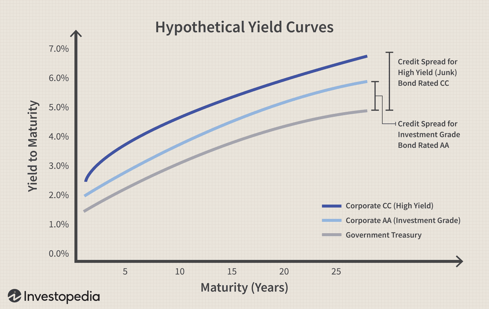

In the complex world of finance, several key factors dictate market dynamics, each playing a significant role in shaping the global economic landscape. Corporate bonds, credit ratings, and algorithmic trading stand out as pivotal components in comprehending the intricacies of financial markets. Understanding how these elements interact is essential for investors, financial analysts, and policymakers seeking to navigate this often volatile sector.

Corporate bonds are vital instruments for companies aiming to raise capital. They represent a debt obligation, where companies borrow money from investors with the promise of paying it back with interest at a future date. The importance of corporate bonds extends beyond simple fundraising; they influence the broader credit markets and reflect corporate health and economic conditions.



Accompanying corporate bonds are credit ratings, which assess the creditworthiness of these debt instruments. Provided by major credit rating agencies such as Standard & Poor’s and Moody’s, these ratings indicate the likelihood of a company defaulting on its debt. A higher credit rating often signals lower risk, thereby affecting bond prices and yields in the secondary market. Consequently, credit ratings are instrumental in shaping investor perception and influencing investment decisions.

Algorithmic trading is revolutionizing the approach to trading and risk management. Utilizing computer algorithms to execute trades automatically, it allows for rapid responses to market changes, thus enhancing market efficiency. By processing large datasets, algorithmic strategies can assess credit risks and optimize trading techniques in real time. As a result, algorithmic trading is altering the financial landscape by providing sophisticated tools for managing risks and capitalizing on market opportunities.

This article aims to provide insights into the interplay between corporate bonds, credit ratings, and algorithmic trading, focusing on their financial impacts and the emerging trends in managing these elements. By exploring credit rating risk, corporate bond dynamics, and the transformative power of algorithmic trading, we seek to offer guidance for achieving optimal financial outcomes in a continuously evolving market environment.

## Table of Contents

## Understanding Corporate Bonds and Credit Ratings

Corporate bonds are fundamental financial instruments used by companies to secure funds for various purposes, ranging from operations to expansion. These bonds are essentially a form of debt, where the issuer pledges to repay the principal amount on a specified maturity date along with periodic interest payments, known as coupon payments.

Credit ratings play a crucial role in evaluating the creditworthiness of corporate bonds. They are assessments provided by credit rating agencies, such as Standard & Poor's (S&P) and Moody's, that signify the likelihood of a bond issuer defaulting on its obligations. These agencies employ standardized metrics and methodologies to arrive at a rating, which ranges from high-grade, low-risk ratings like AAA, indicating a very low probability of default, to lower-grade, higher-risk ratings like C or D, which suggest increased default risk.

Ratings significantly influence investor perceptions and can affect bond pricing in secondary markets. A bond with a higher credit rating is often perceived as safer, which can lead to lower yields required by investors. This relationship is described by the inverse correlation between bond prices and yields; as the credit rating increases, indicating lower risk, investors are willing to accept lower yields owing to the enhanced likelihood of receiving timely payments. Conversely, a downgrade in ratings generally results in a decrease in bond prices and an increase in yields, as investors demand higher compensation for the increased risk of default.

Understanding these dynamics is vital for investors in navigating the bond markets. For instance, if an investor anticipates an upgrade in a company's credit rating due to improved financial health, they may seek to purchase bonds before the upgrade is publicly recognized, anticipating that the bond's price will increase as its yield decreases. Conversely, awareness of a potential downgrade can lead to strategic divestment to avoid capital losses.

In summary, corporate bonds serve as vital instruments for raising capital, with credit ratings acting as essential tools for assessing their default risks. Investors rely on these ratings to guide their decisions, influencing market perceptions and ultimately the pricing of bonds in secondary markets.

## Financial Impact of Credit Rating Risk on Corporate Bonds

Credit rating risk is a prominent concern in the corporate bond market due to its direct influence on bond valuation and investment strategy. When a bond's credit rating is downgraded, it typically results in increased yields and decreased bond prices. This inverse relationship is crucial as it impacts the bondholders’ profitability and the issuer's borrowing capacity.

A credit rating reflects a bond issuer's ability to meet its financial obligations. As a bond’s rating is downgraded, it signals a higher default risk. Consequently, investors demand higher yields to compensate for the elevated risk, increasing the cost of capital for the issuer. The yield spread, or the difference between the bond's yield and the risk-free rate, tends to widen, reflecting this additional perceived risk.

Credit risk migration is an important measure that assesses the probability and impact of a bond moving between different credit ratings over time. Historical data and statistical models often evaluate this metric, providing insights into potential future credit rating changes. A vital aspect of credit risk migration is estimating the default probability, calculated using several methodologies, including Merton's structural model:

$$

PD = 1 - \Phi\left(\frac{\ln(V_f / D) + (r - \sigma^2/2)T}{\sigma \sqrt{T}}\right)
\] 

Here, $PD$ is the probability of default, $V_f$ is the firm's asset value, $D$ is the total debt, $r$ is the risk-free rate, $\sigma$ is the [volatility](/wiki/volatility-trading-strategies) of the firm's assets, and $T$ is the time to maturity. This model underscores the relationship between a firm's capital structure and its default probability.

Sufficient knowledge of credit rating risk aids investors in making informed decisions. By assessing credit risk migration and default probabilities, investors can optimize their portfolios by balancing risk with potential rewards. Additionally, companies can engage in liability management strategies to maintain or improve their credit ratings, thus minimizing their borrowing costs and preserving market value.

In summary, credit rating risk significantly impacts corporate bonds by influencing yields, pricing, and investor demand. Proper understanding and management of these risks are vital for investors seeking to optimize their investment outcomes and for corporations aiming to maintain financial flexibility in fluctuating economic conditions.

## Algorithmic Trading and Credit Risk Management

Algorithmic trading utilizes computer algorithms to automate the process of executing trades, optimizing both efficiency and timing. By automating trades, these algorithms allow for rapid responses to market fluctuations, effectively managing risk. This automation can process vast amounts of financial data to evaluate credit risk, one of the critical aspects of successful trading strategies.

Credit spreads, defined as the yield difference between bonds of differing credit quality, are pivotal indicators in this domain. These spreads reflect the perceived risk of the bonds; a wider spread typically signifies higher perceived risk and thus, higher potential returns. Algorithms can monitor these spreads continuously, enabling swift adjustments to positions as market conditions evolve. Algorithms assess not just the absolute spread, but how it compares to historical averages, industry benchmarks, or predicted values from statistical models, providing a comprehensive analysis of market risk and opportunity.

The efficiency of [algorithmic trading](/wiki/algorithmic-trading) in managing credit spreads is notable. By employing complex mathematical models and data analytics, algorithms can optimize portfolio allocations to capture favorable spreads while mitigating risk. Consider Python as a tool for this purpose. Python's libraries like NumPy and pandas allow for efficient data manipulation and analysis, while libraries like scikit-learn can be employed for predictive modeling to assess future credit spread movements.

Here is a basic Python snippet illustrating how credit spread data might be analyzed:

```python
import numpy as np
import pandas as pd
from sklearn.linear_model import LinearRegression

# Sample bond data
data = pd.DataFrame({
    'bond_a_yield': np.random.rand(100),
    'bond_b_yield': np.random.rand(100)
})

# Calculate the credit spreads
data['credit_spread'] = data['bond_a_yield'] - data['bond_b_yield']

# Model the credit spread as a function of other economic indicators
X = data[['bond_a_yield']]
y = data['credit_spread']
model = LinearRegression().fit(X, y)

# Predict future credit spreads
predicted_spreads = model.predict(X)
data['predicted_spread'] = predicted_spreads

# Display the head of the DataFrame
print(data.head())
```

In this snippet, a linear regression model is applied to understand the relationship between a bond's yield and its credit spread, offering predictions on future movements. Such models allow traders to strategize optimal entry and [exit](/wiki/exit-strategy) points in dynamic markets.

Algorithmic trading is transformative for credit risk management, enabling complex, data-driven strategies that outperform traditional methods. As technology continues to evolve, these algorithms grow more sophisticated, integrating [artificial intelligence](/wiki/ai-artificial-intelligence) and [machine learning](/wiki/machine-learning) to further enhance their predictive capabilities and risk management efficiency. Such advancements are paramount for maintaining competitive advantages in the ever-changing financial landscape.

## Case Study: Credit Spread Strategies in Algo Trading

Credit spread strategies play a significant role in managing risk and exploiting market opportunities by involving the purchase and sale of bonds across different credit ratings. These strategies are based on the concept of credit spreads, which represent the yield differences between bonds of varying credit qualities. By utilizing credit spreads, investors can gain insight into the relative risk and pricing of bonds and subsequently make informed investment decisions.

Algorithmic trading has transformed the efficiency and effectiveness of credit spread strategies. By employing computer algorithms, traders can execute trades automatically, quickly responding to market changes. This technology allows for the real-time analysis of credit spreads, enabling traders to optimize their strategies and improve their financial portfolios.

The application of Python in credit spread strategies offers robust tools for simulation and analysis. Traders can use various statistical models to predict potential outcomes and assess the viability of different strategies. For example, the yield spread $Y$ between two bonds can be modeled as:

$$
Y = Y_2 - Y_1
$$

where $Y_2$ and $Y_1$ represent the yields of the two bonds. Python libraries such as NumPy and Pandas can facilitate the calculation and analysis of these spreads, providing insights into market trends and bond pricing.

Here is an example of Python code that illustrates how to calculate the yield spread:

```python
import pandas as pd

# Sample data for two bonds
bond_data = {'Bond': ['Bond A', 'Bond B'],
             'Yield': [0.045, 0.032]}

# Create a DataFrame
df = pd.DataFrame(bond_data)

# Calculate yield spread
df['Yield Spread'] = df['Yield'].diff()

# Display the DataFrame
print(df)
```

The integration of credit spread strategies with algorithmic trading further allows for the optimization of trading approaches through techniques like [backtesting](/wiki/backtesting) and continuous strategy evolution. By simulating various market conditions using statistical models, traders can identify the most effective strategies for maximizing returns while minimizing risk.

Effectively integrating credit spread strategies with algorithmic trading tools can significantly enhance the performance of financial portfolios by providing improved risk management and investment returns. Through the precise alignment of trading strategies with real-time data analysis, investors can capitalize on market movements and optimize their portfolio allocation.

## Risks and Challenges in Managing Credit and Trading

Market volatility represents one of the most significant challenges in managing credit and trading, as it directly influences bond yields and spreads. During periods of high uncertainty, price fluctuations can become unpredictable, adversely affecting the returns on corporate bonds. Volatility can lead to widened spreads, demanding higher compensation for risk from investors and consequently altering the valuation of credit instruments. This unpredictability necessitates an adaptable trading strategy that can withstand fluctuations in market conditions.

Liquidity risk is another crucial [factor](/wiki/factor-investing) that may impede the effective execution of trading strategies. It arises when there is insufficient market depth, making it difficult to enter or exit positions without impacting market prices significantly. In liquid markets, investors can transact large volumes with minimal price impact, while illiquid markets pose challenges such as extended execution times and increased transaction costs. To mitigate [liquidity](/wiki/liquidity-risk-premium) risk, traders must implement strategies that incorporate liquidity considerations and utilize advanced tools like market impact models to foresee transaction effects.

Balancing risk and reward is vital for developing effective strategies in credit and trading. This balance is achieved by carefully selecting instruments and adjusting trading positions to align with an investor's risk appetite and market expectations. The risk-reward equation can be represented quantitatively as:

$$

\text{Sharpe Ratio} = \frac{E[R_p] - R_f}{\sigma_p} 
$$

where $E[R_p]$ is the expected return of the portfolio, $R_f$ is the risk-free rate, and $\sigma_p$ is the standard deviation of the portfolio’s excess return. This formula helps in quantifying the risk-adjusted return, enabling investors to assess the efficiency of their investment strategy.

Continuous monitoring and adjustment of trading positions are imperative for effective risk mitigation. Real-time data analysis and market trend assessments allow traders to adapt to emerging risks and opportunities promptly. Tools that offer predictive analytics, such as machine learning models, can bolster this effort by providing insights based on historical data patterns.

Advanced quantitative methods are essential in navigating the complex challenges of credit and trading. Techniques like Monte Carlo simulations, value-at-risk (VaR) calculations, and scenario analysis can provide a robust framework for evaluating potential risks and outcomes. For example, a simple python-based Monte Carlo simulation might look like this:

```python
import numpy as np

# Simulate daily returns
np.random.seed(0)
returns = np.random.normal(loc=0.001, scale=0.02, size=1000)

# Initial portfolio value
initial_investment = 1_000_000

# Simulate portfolio value over time
portfolio_values = initial_investment * np.cumprod(1 + returns)

# Calculate VaR at a 95% confidence level
VaR_95 = initial_investment - np.percentile(portfolio_values, 5)
print(f"Value-at-Risk (95% confidence): ${VaR_95:.2f}")
```

This code provides a simple framework for evaluating potential losses under plausible adverse scenarios, thus equipping traders with the information needed for better decision-making processes. Overall, leveraging quantitative techniques and maintaining a robust risk management framework form the cornerstone of managing the challenges inherent in credit and trading.

## Conclusion

Credit rating risk and algorithmic trading are critical components that shape financial markets. To achieve a comprehensive understanding, one must grasp the intricacies of corporate bonds and credit ratings. These factors serve as pivotal indicators of risk and play a significant role in investment strategies. Algo trading, characterized by the use of computerized algorithms to execute trades, offers a sophisticated mechanism to manage risk and capitalize on market opportunities. By processing vast datasets and implementing rapid trade executions, algorithmic trading enhances the ability to navigate fluctuations and optimize strategies.

The integration of corporate bond analysis with algorithmic trading strategies is crucial for enhancing portfolio performance. Investors and traders who effectively combine these elements can better assess creditworthiness and pricing dynamics, leading to more informed decision-making. For instance, algorithmic trading systems can evaluate credit spreads and yield differentials, assisting in identifying undervalued or overvalued bonds. Python programming, due to its robust libraries and statistical capabilities, serves as a useful tool for back-testing and simulating market scenarios, thus aiding in strategic planning.

In a constantly evolving market landscape, staying informed and adaptable is paramount. Investors and traders must continually refine their understanding of credit risks and leverage technology-driven solutions to maintain a competitive edge. Advanced quantitative methods and ongoing market analysis enable better risk management and opportunity exploitation, ensuring long-term financial stability and success. By doing so, market participants can effectively navigate the complexities of credit rating fluctuations and enhance their trading outcomes.

## References & Further Reading

[1]: ["Credit Ratings and Bond Pricing"](https://www.bondsavvy.com/bonds/bond-ratings-scale) - CFA Institute

[2]: Huang, J., & Kong, W. (2005). ["Credit Rating and Corporate Bond Pricing: An Empirical Study in Chinese Market."](https://www.jstor.org/stable/1262707) Journal of Banking & Finance.

[3]: Lopez de Prado, M. (2018). ["Advances in Financial Machine Learning"](https://www.amazon.com/Advances-Financial-Machine-Learning-Marcos/dp/1119482089).

[4]: Bishop, C. M. (2006). ["Pattern Recognition and Machine Learning"](https://www.cs.uoi.gr/~arly/courses/ml/tmp/Bishop_book.pdf) - Springer.

[5]: Chan, E. (2008). ["Quantitative Trading: How to Build Your Own Algorithmic Trading Business"](https://github.com/ftvision/quant_trading_echan_book).

[6]: Fabozzi, F. J., & Mann, S. V. (2005). ["The Handbook of Fixed Income Securities"](https://www.mhebooklibrary.com/doi/book/10.1036/9781260473902?contentTab=true).

[7]: Alexander, C. (2008). ["Market Risk Analysis, Volume I: Quantitative Methods in Finance"](https://archive.org/details/marketriskanalys0001alex) - Wiley.