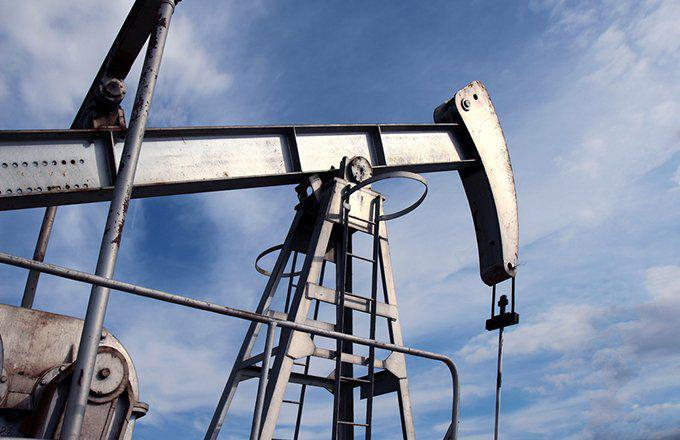

The global oil market plays a pivotal role in the world economy, influencing everything from fuel prices to geopolitical relations. As one of the most traded commodities, oil is integral to various sectors, from transportation to manufacturing, making it critical to economic stability and growth. The price and availability of oil are subject to a myriad of factors, including geopolitical tensions, production levels, and market perceptions, which together create a dynamic and often volatile market landscape.

Understanding the dynamics of the oil market requires an examination of several interconnected elements. Crude oil inventories, for instance, are a vital indicator of market equilibrium, reflecting the balance between supply and demand. Policymakers and investors closely monitor these inventories to inform their strategies and decisions. A rise in inventories might indicate oversupply, potentially leading to decreased prices, while a decline may signal rising demand or production constraints, with the opposite effect on prices.



In recent years, algorithmic trading has emerged as a prominent force in shaping oil market transactions. This method uses sophisticated computer algorithms to execute trades at high speed based on pre-set conditions. The impact of algorithmic trading is felt in its ability to influence price movements, particularly during periods of rapid change, such as unexpected geopolitical events or shifts in supply and demand dynamics. The presence of computers executing trades at lightning speeds has revolutionized trading strategies, offering both challenges and opportunities for market participants.

This article will explore the complex interplay between crude oil inventories, the petroleum market, and algorithmic trading. By analyzing these components and their interconnections, we aim to provide insights into their cumulative impact on the oil economy, thereby equipping investors and policymakers with the knowledge to navigate this intricate market effectively.

## Table of Contents

## Understanding the Petroleum Market

The petroleum market is a multifaceted ecosystem primarily shaped by the balance between supply and demand, enduring geopolitical tensions, and rapid technological advancements. Understanding these dynamics is essential for grasping the market's complexity.

Supply and demand dynamics play a foundational role in the petroleum market. Crude oil, a pivotal global commodity, experiences price shifts that are largely influenced by these dynamics. When demand outpaces supply, prices tend to increase, whereas an oversupply often leads to price decreases. This balance is nuanced further by the Organization of the Petroleum Exporting Countries (OPEC) and its allies, which manage production levels to influence global oil prices.

Geopolitical tensions significantly impact the petroleum market. Political instability in oil-rich regions, such as the Middle East, can cause supply disruptions, leading to price spikes. In contrast, diplomatic resolutions and stable political environments may assure steady supply lines, potentially stabilizing prices. Historical events, such as the Gulf War and the Arab Spring, demonstrate how geopolitical factors can swiftly reshape the market landscape.

Technological advancements are another critical [factor](/wiki/factor-investing) influencing the petroleum market. Innovations in exploration and extraction technologies, such as hydraulic fracturing and deep-water drilling, have unlocked previously inaccessible oil reserves, altering the global supply framework. Additionally, advancements in data analytics and real-time monitoring have improved market efficiency, enabling more informed decision-making by traders and policymakers.

Key players in the petroleum market include oil-producing countries, multinational oil companies, and financial institutions. Oil-producing countries, particularly those within OPEC, are crucial as they control a significant portion of global oil reserves and production. Multinational oil companies, such as ExxonMobil, BP, and Shell, operate across various stages of the oil supply chain, from exploration to retail distribution. Financial institutions also play a significant role by facilitating market transactions and offering financial instruments like futures contracts to manage price risks.

In summary, the petroleum market is shaped by the intricate interplay of supply and demand, geopolitical factors, and technological innovation. Its complexity requires constant monitoring by stakeholders to navigate the ever-changing landscape effectively.

## The Role of Crude Oil Inventories

Crude oil inventories are critical components in maintaining equilibrium between supply and demand within the oil market. These inventories act as a buffer, absorbing fluctuations resulting from variations in production and consumption rates. When inventories increase, it often signals a surplus in supply relative to demand. This, in turn, can lead to potential declines in [crude oil](/wiki/crude-oil) prices, as an excess supply tends to exert downward pressure on prices in a competitive market.

For market participants, particularly traders and policymakers, monitoring crude oil inventories is vital. Reports from credible sources, such as the U.S. Energy Information Administration (EIA), provide essential data that reflects the current status of these inventories. The EIA's weekly petroleum status report is one of the most widely followed indicators. By examining changes in inventories, stakeholders can infer demand trends and adjust their strategies accordingly.

The dynamics of crude oil inventories are influenced by multiple factors, including production rates from oil-producing nations and the global demand for petroleum products. Seasonal variations also play a role, as consumption patterns vary throughout the year, affecting inventory levels.

To quantify and predict changes in inventories, various models can be applied. For instance, a basic supply-demand model can illustrate the relationship:

$$
\text{Change in Inventories} = \text{Production} - \text{Consumption} + \text{Imports} - \text{Exports}
$$

This equation provides a simplistic view of the factors influencing inventory changes. In practice, sophisticated modeling and forecasting techniques are employed to consider additional aspects such as economic indicators, geopolitical events, and technological changes.

With the emergence of [algorithmic trading](/wiki/algorithmic-trading), real-time data analysis has become increasingly crucial. Algorithms designed to interpret inventory reports can execute trades almost instantaneously, responding to changes faster than traditional trading methods. Therefore, a deep understanding of inventory reports and their implications is indispensable for navigating the complexities of the oil market.

## Impact on the Oil Economy

Fluctuations in crude oil inventories are a pivotal factor influencing the oil economy, with direct implications for pricing and investment strategies. The intricate balance between supply and demand is often reflected in inventory levels, which serve as a barometer for market conditions. When inventories rise, it typically signals an oversupply in the market, exerting downward pressure on prices. Conversely, reducing inventories suggests a tightening of supply, often leading to price increases.

Price [volatility](/wiki/volatility-trading-strategies) in the oil market has far-reaching consequences. Industries heavily reliant on oil, such as transportation, manufacturing, and agriculture, experience direct impacts on their operating costs. This volatility can ripple through the broader economy, influencing inflation rates, consumer spending, and monetary policy decisions.

A critical aspect of managing the oil economy involves understanding the supply effect. The supply effect encapsulates changes in oil supply levels and their resultant impact on market prices. Economic theory suggests that an increase in supply, all else being equal, tends to lower prices, while a supply decrease generally results in higher prices. This relationship can be modeled using the supply and demand framework:

$$
P = f(Q_s, Q_d)
$$

where $P$ represents the price of oil, $Q_s$ stands for the quantity supplied, and $Q_d$ denotes the quantity demanded.

Investors and policymakers leverage inventory data to predict price movements and craft appropriate strategies. For example, an anticipated inventory build-up might prompt investors to short oil futures, expecting prices to decline. Conversely, signs of dwindling inventories may drive long positions in anticipation of a price increase.

Understanding these dynamics is crucial for economic planning and investment decision-making. Accurate inventory forecasts enable market participants to mitigate risks associated with price volatility, ensuring more stable investments and economic outcomes. Policymakers can also design more effective energy policies, accounting for potential impacts of inventory changes on the broader economy. By staying attuned to inventory fluctuations, stakeholders in the oil market can navigate its complexities with greater precision, making informed decisions that align with evolving market conditions.

## Algorithmic Trading in the Oil Market

Algorithmic trading in the oil market leverages advanced computer programs to execute trades at high speed and with great efficiency, based on predefined rules and algorithms. This method of trading has become particularly influential, as it allows for rapid responses to market signals, such as fluctuations in supply or geopolitical events, which are common in the oil industry.

One of the most significant aspects of algorithmic trading is its ability to amplify price movements. This is especially true during periods of unexpected changes in oil supply or shifts in geopolitical contexts. For instance, if a geopolitical event disrupts oil production in a major exporting country, algorithmic trading systems can quickly detect the impact on oil prices and execute large volumes of trades in response. This can magnify the initial price movement caused by the event, leading to increased volatility in the market.

The algorithms used in trading often incorporate a wide range of data inputs, including real-time inventory levels, historical price data, and other market signals. By analyzing these inputs, the systems can make informed predictions about future price movements. For example, if inventory reports, such as those published by the U.S. Energy Information Administration, indicate a significant rise in crude oil inventories, algorithms might anticipate a potential drop in oil prices due to an oversupply and subsequently execute sell orders.

Mathematically, algorithmic trading can be modeled using various quantitative approaches. A common method is to employ [machine learning](/wiki/machine-learning) models that can process vast amounts of data and detect patterns or trends. These models might use regression analysis to predict future prices based on historical data, or they could utilize more complex techniques such as neural networks to learn from past trading behaviors and improve decision-making processes.

Here's an example of a simple Python algorithm that might be used to make trading decisions based on inventory data:

```python
import numpy as np

# Historical inventory data and price impact model coefficients
inventory_data = np.array([100, 120, 130, 150, 140])  # Sample inventory levels
price_impacts = np.array([-0.5, -0.4, -0.3, -0.2, -0.1])  # Impact per unit inventory

def predict_price_change(current_inventory):
    # Linear regression model for price prediction
    coefficients = np.polyfit(inventory_data, price_impacts, deg=1)
    predicted_change = np.polyval(coefficients, current_inventory)
    return predicted_change

# Current inventory level
current_inventory = 160

# Predict price change
predicted_price_change = predict_price_change(current_inventory)
print(f"Predicted price change: {predicted_price_change:.4f}")
```

In this example, the algorithm predicts the impact of current inventory levels on price changes, allowing traders to make decisions about buying or selling oil futures. This predictive capability is key to algorithmic trading, as it enables market participants to act swiftly and capitalize on opportunities before others.

In conclusion, algorithmic trading increasingly defines the dynamics of the oil market, particularly in its ability to respond quickly to external shocks and inventory data. By executing trades in real time, these systems play a critical role in determining price stability and volatility, making them indispensable tools for modern traders and investors.

## Conclusion

The intricate relationship among crude oil inventories, the petroleum market, and algorithmic trading significantly influences the modern oil economy. Crude oil inventories act as a crucial balancing factor, impacting supply dynamics and price volatility. These inventories' fluctuations can lead to price adjustments, affecting investment decisions and economic activities dependent on oil. The petroleum market's complexity is further heightened by geopolitical factors and technological advancements, necessitating strategic insights from both traders and policymakers.

Algorithmic trading introduces a new dimension to this ecosystem by enhancing trading speed and efficiency. Algorithms can quickly respond to inventory data and geopolitical developments, altering market dynamics in real-time. These rapid trading activities can amplify price fluctuations, underscoring the need for careful monitoring and strategic planning.

Traders and investors are thus compelled to stay informed and adaptive as market conditions and technologies evolve. Understanding the interactions among inventories, market forces, and algorithmic trading enables participants to navigate these complexities prudently. In doing so, they can make informed decisions that align with their investment strategies amid the dynamic landscape of the global oil market. As technological innovations and market shifts continue to shape the industry, vigilance and knowledge remain critical for success in this ever-evolving sector.

## References & Further Reading

[1]: Kilian, L., & Murphy, D. P. (2014). ["The role of inventories and speculative trading in the global market for crude oil."](https://deepblue.lib.umich.edu/bitstream/handle/2027.42/106955/jae2322.pdf?sequence=1) Journal of International Economics, 94(1), 119-137.

[2]: Alquist, R., & Kilian, L. (2010). ["What do we learn from the price of crude oil futures?"](https://onlinelibrary.wiley.com/doi/abs/10.1002/jae.1159) Journal of Applied Econometrics, 25(4), 539-573.

[3]: Ready, R. C. (2018). ["Oil consumption, economic growth, and oil futures: The impact of long-run oil supply constrains."](https://www.sciencedirect.com/science/article/pii/S0304393217300995) Energy Economics, 74, 842-857.

[4]: U.S. Energy Information Administration (EIA). ["Weekly Petroleum Status Report."](https://www.eia.gov/petroleum/supply/weekly/?_hsenc=p2ANqtz-9CuCcLNPf7qENZ83rNVr_05z7sYTPwea2kC9ovlLBTcKdLH6KqkVYpeTP2CAVGw9yaLfEY)

[5]: Narayan, P. K., Narayan, S., & Prabheesh, K. P. (2014). ["The relationship between oil prices and exchange rates: Evidence from the G7 countries."](https://link.springer.com/chapter/10.1007/978-3-031-67890-5_97) Energy Economics, 45, 424-432.