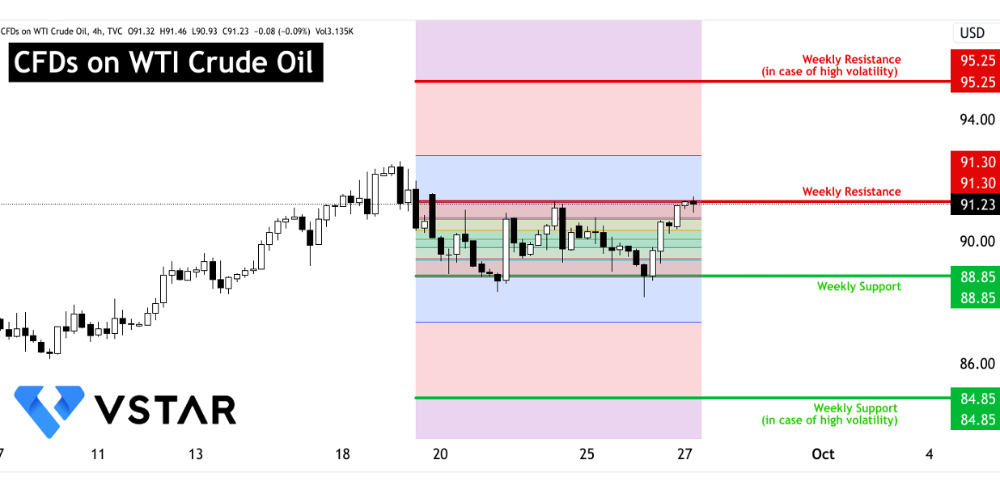

## Table of Contents

## What are crude oil inventories?

Crude oil inventories refer to the amount of crude oil that is stored and available for use. This includes oil that is kept in storage tanks, pipelines, and other facilities. Companies and governments keep track of these inventories to know how much oil is available at any given time. This information is important because it helps them plan for future needs and manage the supply of oil.

Changes in crude oil inventories can affect the price of oil. If inventories go up, it usually means there is more oil available than people need, which can cause prices to go down. On the other hand, if inventories go down, it might mean there is not enough oil to meet demand, which can cause prices to go up. People who trade oil, as well as those who use it, pay close attention to these inventory levels to make decisions about buying and selling oil.

## How are crude oil inventories measured?

Crude oil inventories are measured by keeping track of the amount of oil in storage tanks, pipelines, and other storage facilities. Companies and governments use special tools and methods to measure the oil levels accurately. They often use devices like dipsticks or electronic sensors that can tell how much oil is in a tank. They also keep records of how much oil is added to or taken out of storage, so they can calculate the total amount of oil they have at any time.

These measurements are usually reported weekly by organizations like the U.S. Energy Information Administration (EIA). The EIA collects data from oil companies and refineries across the country and puts it all together in a report. This report helps people understand how much oil is available and whether the amount of oil in storage is going up or down. By looking at these reports, people can make better decisions about buying, selling, or using oil.

## Why are crude oil inventories important to the petroleum economy?

Crude oil inventories are important to the petroleum economy because they show how much oil is available at any time. When there is a lot of oil in storage, it means there is enough to meet people's needs. This can make the price of oil go down because there is more oil than people need. On the other hand, if there is not much oil in storage, it means there might not be enough to meet everyone's needs. This can make the price of oil go up because people are worried about running out.

People who work in the petroleum industry, like oil companies and traders, watch these inventory levels very closely. They use this information to decide when to buy or sell oil. Governments also pay attention to these numbers because they need to make sure there is enough oil for their country. By keeping track of crude oil inventories, everyone in the petroleum economy can plan better and make smarter decisions about how to use and sell oil.

## How do changes in crude oil inventories affect oil prices?

Changes in crude oil inventories can have a big effect on oil prices. When the amount of oil in storage goes up, it usually means there is more oil than people need. This can make the price of oil go down because there is a lot of oil available. If people see that there is a lot of oil in storage, they might think they don't need to pay as much for it.

On the other hand, when the amount of oil in storage goes down, it can mean there might not be enough oil to meet everyone's needs. This can make the price of oil go up because people start to worry about running out of oil. If people see that there is less oil in storage, they might be willing to pay more to make sure they get the oil they need.

## What is the relationship between crude oil inventories and supply and demand?

Crude oil inventories are like a big storage of oil that can be used when people need it. They show how much oil is available at any time. When there is a lot of oil in storage, it means there is more oil than people need right now. This is called a surplus. A surplus can happen when people are not using as much oil, or when a lot of new oil is being produced. When there is a surplus, the supply of oil is higher than the demand for it.

On the other hand, when there is not much oil in storage, it means there might not be enough oil to meet everyone's needs. This is called a shortage. A shortage can happen when people are using a lot of oil, or when not enough new oil is being produced. When there is a shortage, the demand for oil is higher than the supply of it. By looking at crude oil inventories, people can see if there is a surplus or a shortage, and this helps them understand the balance between supply and demand.

## How do government reports on crude oil inventories influence market expectations?

Government reports on crude oil inventories give important information about how much oil is stored and available. When these reports show that there is a lot of oil in storage, people in the market might expect that there will be more oil than needed. This can make them think that oil prices might go down because there is plenty of oil to go around. On the other hand, if the reports show that there is not much oil in storage, people might expect that there will not be enough oil to meet everyone's needs. This can make them think that oil prices might go up because oil is scarce.

These expectations can affect what people do in the market. If people expect oil prices to go down, they might decide to sell their oil now before the price drops. If they expect oil prices to go up, they might decide to buy oil now before it gets more expensive. This buying and selling based on expectations can cause the actual price of oil to change. So, government reports on crude oil inventories are very important because they help shape what people in the market think will happen next, and this can lead to real changes in oil prices.

## What are the seasonal patterns in crude oil inventory levels?

Crude oil inventory levels often follow a pattern that changes with the seasons. During the winter months, oil inventories tend to be higher. This is because people use less oil for things like driving and heating in the colder months. Also, refineries might do maintenance work in the winter, which means they process less oil. So, more oil stays in storage.

In the summer, oil inventories usually go down. This happens because people use more oil for driving and other activities when it's warm outside. Refineries also work more in the summer to meet this higher demand. So, they take more oil out of storage to make gasoline and other products. These seasonal changes in oil use and refinery work lead to different levels of oil in storage throughout the year.

## How do global economic conditions impact crude oil inventory levels?

Global economic conditions can have a big effect on how much oil is stored in inventories. When the world's economy is doing well, people and businesses use more oil. They drive more, fly more, and use more energy for factories and machines. This means that oil companies need to take more oil out of storage to meet this higher demand. So, when the economy is strong, oil inventories usually go down because people are using more oil.

On the other hand, when the world's economy is not doing well, people and businesses use less oil. They might drive less, fly less, and use less energy for factories and machines. This means that oil companies don't need to take as much oil out of storage. So, when the economy is weak, oil inventories usually go up because people are using less oil. These changes in how much oil people use because of the economy can lead to big changes in how much oil is stored in inventories.

## What role do strategic petroleum reserves play in relation to crude oil inventories?

Strategic petroleum reserves are big storage places where countries keep extra oil for emergencies. They are different from regular crude oil inventories because they are not used every day. Instead, they are saved for times when there might not be enough oil because of a big problem, like a war or a natural disaster. These reserves help make sure that a country has enough oil even if something bad happens.

The amount of oil in strategic petroleum reserves can affect how much oil is in regular crude oil inventories. If a country decides to use oil from its strategic reserves, it can add more oil to the regular supply. This can make the amount of oil in regular inventories go up, which might make oil prices go down. On the other hand, if a country is filling up its strategic reserves, it might take oil out of the regular supply, which can make the amount of oil in regular inventories go down and oil prices go up. So, strategic petroleum reserves play an important role in managing how much oil is available and how much it costs.

## How do different types of crude oil (e.g., light, heavy) affect inventory management and economic impact?

Different types of crude oil, like light and heavy, can affect how companies manage their inventories and the economy. Light crude oil is easier to turn into gasoline and other products that people use every day. Because it's easier to refine, companies might keep more light crude oil in their inventories to meet the demand for these products. On the other hand, heavy crude oil is harder to refine and usually used to make things like diesel and heating oil. Companies might keep less heavy crude oil in storage because it takes more time and money to turn it into useful products.

The type of crude oil also affects the economy because it changes how much it costs to make and sell oil products. Light crude oil is usually more expensive because it's easier to use and more people want it. When there is a lot of light crude oil in storage, it can help keep the prices of gasoline and other products lower. Heavy crude oil is often cheaper, but it can cost more to refine. If there is a lot of heavy crude oil in storage, it might not affect the prices of everyday products as much, but it can still be important for things like diesel and heating oil. So, the mix of light and heavy crude oil in inventories can have a big impact on both the oil market and the economy.

## What are the long-term trends in crude oil inventory management and their economic implications?

Over the years, how companies manage their crude oil inventories has changed a lot. In the past, companies would keep a lot of oil in storage to make sure they always had enough. But now, with better technology and ways to move oil around the world, companies can keep less oil in storage. They use computers and other tools to watch how much oil people are using and how much oil is being made. This helps them keep just the right amount of oil in storage, which saves them money. Also, more countries are using different kinds of energy, like wind and solar power, so they don't need as much oil. This means that the total amount of oil in storage around the world is not growing as fast as it used to.

These changes in how oil inventories are managed have big effects on the economy. When companies keep less oil in storage, it can make oil prices go up and down more quickly. If something happens that makes people use more oil, like a cold winter, the price of oil can go up fast because there is not as much oil in storage. On the other hand, if people start using less oil because they are using other kinds of energy, the price of oil can go down. These ups and downs in oil prices can affect how much things cost, like gasoline and heating oil, and can even change how well the whole economy is doing. So, how companies manage their oil inventories is very important for the economy.

## How can advanced analytics and forecasting models improve the management of crude oil inventories and mitigate economic risks?

Advanced analytics and forecasting models can help companies manage their crude oil inventories better by giving them more accurate information about how much oil people will use in the future. These models use a lot of data, like how much oil people used in the past, what the weather will be like, and what is happening in the economy. By looking at all this information, the models can predict how much oil will be needed and how much should be kept in storage. This helps companies keep just the right amount of oil, so they don't have too much or too little. Having the right amount of oil in storage can save companies money and help them plan better for the future.

Using these models can also help reduce economic risks. When companies know how much oil they need to keep in storage, they can make better decisions about buying and selling oil. This can help keep oil prices more stable, which is good for the economy. If oil prices go up and down a lot, it can make things like gasoline and heating oil more expensive, and this can hurt people and businesses. By using advanced analytics and forecasting models, companies can manage their oil inventories in a way that helps keep prices steady and reduces the risk of big changes in the economy.

## What is the Role of Crude Oil Inventories?

Crude oil inventories are critical components in maintaining equilibrium between supply and demand within the oil market. These inventories act as a buffer, absorbing fluctuations resulting from variations in production and consumption rates. When inventories increase, it often signals a surplus in supply relative to demand. This, in turn, can lead to potential declines in [crude oil](/wiki/crude-oil) prices, as an excess supply tends to exert downward pressure on prices in a competitive market.

For market participants, particularly traders and policymakers, monitoring crude oil inventories is vital. Reports from credible sources, such as the U.S. Energy Information Administration (EIA), provide essential data that reflects the current status of these inventories. The EIA's weekly petroleum status report is one of the most widely followed indicators. By examining changes in inventories, stakeholders can infer demand trends and adjust their strategies accordingly.

The dynamics of crude oil inventories are influenced by multiple factors, including production rates from oil-producing nations and the global demand for petroleum products. Seasonal variations also play a role, as consumption patterns vary throughout the year, affecting inventory levels.

To quantify and predict changes in inventories, various models can be applied. For instance, a basic supply-demand model can illustrate the relationship:

$$
\text{Change in Inventories} = \text{Production} - \text{Consumption} + \text{Imports} - \text{Exports}
$$

This equation provides a simplistic view of the factors influencing inventory changes. In practice, sophisticated modeling and forecasting techniques are employed to consider additional aspects such as economic indicators, geopolitical events, and technological changes.

With the emergence of [algorithmic trading](/wiki/algorithmic-trading), real-time data analysis has become increasingly crucial. Algorithms designed to interpret inventory reports can execute trades almost instantaneously, responding to changes faster than traditional trading methods. Therefore, a deep understanding of inventory reports and their implications is indispensable for navigating the complexities of the oil market.

## What is the impact on the oil economy?

Fluctuations in crude oil inventories are a pivotal [factor](/wiki/factor-investing) influencing the oil economy, with direct implications for pricing and investment strategies. The intricate balance between supply and demand is often reflected in inventory levels, which serve as a barometer for market conditions. When inventories rise, it typically signals an oversupply in the market, exerting downward pressure on prices. Conversely, reducing inventories suggests a tightening of supply, often leading to price increases.

Price [volatility](/wiki/volatility-trading-strategies) in the oil market has far-reaching consequences. Industries heavily reliant on oil, such as transportation, manufacturing, and agriculture, experience direct impacts on their operating costs. This volatility can ripple through the broader economy, influencing inflation rates, consumer spending, and monetary policy decisions.

A critical aspect of managing the oil economy involves understanding the supply effect. The supply effect encapsulates changes in oil supply levels and their resultant impact on market prices. Economic theory suggests that an increase in supply, all else being equal, tends to lower prices, while a supply decrease generally results in higher prices. This relationship can be modeled using the supply and demand framework:

$$
P = f(Q_s, Q_d)
$$

where $P$ represents the price of oil, $Q_s$ stands for the quantity supplied, and $Q_d$ denotes the quantity demanded.

Investors and policymakers leverage inventory data to predict price movements and craft appropriate strategies. For example, an anticipated inventory build-up might prompt investors to short oil futures, expecting prices to decline. Conversely, signs of dwindling inventories may drive long positions in anticipation of a price increase.

Understanding these dynamics is crucial for economic planning and investment decision-making. Accurate inventory forecasts enable market participants to mitigate risks associated with price volatility, ensuring more stable investments and economic outcomes. Policymakers can also design more effective energy policies, accounting for potential impacts of inventory changes on the broader economy. By staying attuned to inventory fluctuations, stakeholders in the oil market can navigate its complexities with greater precision, making informed decisions that align with evolving market conditions.

## References & Further Reading

[1]: Kilian, L., & Murphy, D. P. (2014). ["The role of inventories and speculative trading in the global market for crude oil."](https://deepblue.lib.umich.edu/bitstream/handle/2027.42/106955/jae2322.pdf?sequence=1) Journal of International Economics, 94(1), 119-137.

[2]: Alquist, R., & Kilian, L. (2010). ["What do we learn from the price of crude oil futures?"](https://onlinelibrary.wiley.com/doi/abs/10.1002/jae.1159) Journal of Applied Econometrics, 25(4), 539-573.

[3]: Ready, R. C. (2018). ["Oil consumption, economic growth, and oil futures: The impact of long-run oil supply constrains."](https://www.sciencedirect.com/science/article/pii/S0304393217300995) Energy Economics, 74, 842-857.

[4]: U.S. Energy Information Administration (EIA). ["Weekly Petroleum Status Report."](https://www.eia.gov/petroleum/supply/weekly/?_hsenc=p2ANqtz-9CuCcLNPf7qENZ83rNVr_05z7sYTPwea2kC9ovlLBTcKdLH6KqkVYpeTP2CAVGw9yaLfEY)

[5]: Narayan, P. K., Narayan, S., & Prabheesh, K. P. (2014). ["The relationship between oil prices and exchange rates: Evidence from the G7 countries."](https://link.springer.com/chapter/10.1007/978-3-031-67890-5_97) Energy Economics, 45, 424-432.