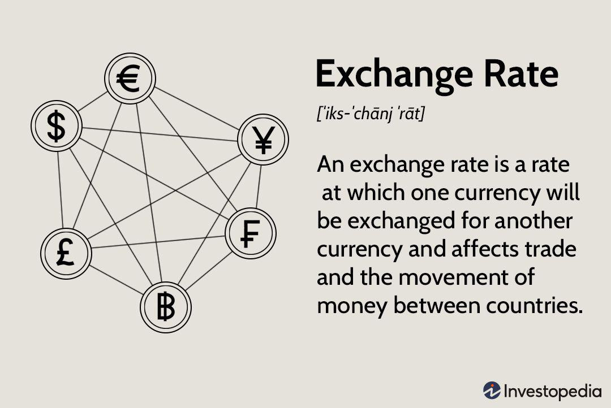

## Table of Contents

## What is a currency exchange rate?

A currency exchange rate is the value of one country's money compared to another country's money. It tells you how much of one currency you need to get one unit of another currency. For example, if you want to know how many US dollars you need to buy one Euro, you look at the exchange rate between the US dollar and the Euro.

Exchange rates change all the time because of things like how well a country's economy is doing, what people think will happen in the future, and how much people want to buy or sell that currency. If a lot of people want to buy a certain currency, its value goes up. If fewer people want it, its value goes down. This is why the exchange rate you see today might be different tomorrow.

## What is the balance of payments?

The balance of payments is like a big record that a country keeps to show all the money that comes in and goes out. It includes money from things like trading goods and services with other countries, investments, and even money sent home by people working abroad. If a country sells more stuff to other countries than it buys, it has a positive balance. If it buys more than it sells, the balance is negative.

This record is split into different parts, but the main ones are the current account and the capital account. The current account tracks the money from trading goods and services, plus other regular payments like interest and wages. The capital account looks at money moving because of investments, like when someone from another country buys a business or property in the country. Keeping the balance of payments in check helps a country understand its economic health and plan for the future.

## How do currency exchange rates affect the balance of payments?

Currency exchange rates can have a big impact on a country's balance of payments. When a country's currency gets stronger compared to other currencies, it means their money is worth more. This can make their exports, or the things they sell to other countries, more expensive. If their exports are more expensive, other countries might buy less from them. This can lead to a drop in the money coming into the country, which can make the balance of payments worse, especially if the country relies a lot on selling things to other countries.

On the other hand, if a country's currency gets weaker, their exports become cheaper for other countries to buy. This can lead to more exports and more money coming into the country, which can improve the balance of payments. But, a weaker currency also means that imports, or the things the country buys from other countries, become more expensive. If the country needs to import a lot of things, like food or oil, a weaker currency can make the balance of payments worse because they have to spend more money to buy the same amount of goods. So, the effect of exchange rates on the balance of payments depends on whether the country is more focused on exporting or importing.

## What are the components of the balance of payments?

The balance of payments is like a big financial diary for a country. It's split into two main parts: the current account and the capital account. The current account keeps track of all the everyday money flows. This includes money from selling and buying goods and services, like cars or haircuts, with other countries. It also covers other regular payments, like interest on loans or wages sent home by workers living abroad. If a country sells more stuff than it buys, its current account is positive. If it buys more than it sells, the current account is negative.

The capital account, on the other hand, looks at money moving because of investments. This includes money coming in when someone from another country buys a business or property in the country, or money going out when the country's people invest in other countries. Sometimes, there's also a financial account, which is similar to the capital account but focuses more on short-term investments and changes in currency reserves. Together, these accounts help a country understand if more money is coming in than going out, which can show how healthy its economy is.

## How does a change in currency value impact exports and imports?

When a country's currency gets stronger, it means that money from that country is worth more compared to other countries' money. This makes the things the country sells to other places, or its exports, more expensive. When exports are pricier, people from other countries might buy less of them. So, if a country depends a lot on selling things to other countries, a stronger currency can hurt its sales and make it harder to earn money from abroad.

On the other hand, if a country's currency gets weaker, its exports become cheaper for other countries to buy. This can lead to more sales abroad and more money coming into the country. But a weaker currency also makes the things the country buys from other places, or its imports, more expensive. If the country needs to buy a lot of things from other countries, like food or oil, a weaker currency can make these imports cost more, which might not be good for the country's economy.

So, whether a change in currency value helps or hurts a country depends on whether it sells more to other countries or buys more from them. If it sells more, a weaker currency can be good. If it buys more, a stronger currency might be better.

## What is the difference between a trade surplus and a trade deficit?

A trade surplus happens when a country sells more stuff to other countries than it buys from them. Imagine if you were selling lemonade and you sold more cups than you bought from the store. You'd have extra money, right? That's what a trade surplus is like for a country. It means more money is coming into the country than going out, which can be good for the economy because it shows that other countries want what the country is selling.

On the other hand, a trade deficit is when a country buys more from other countries than it sells to them. It's like if you bought more lemonade from the store than you could sell. You'd end up spending more money than you made. For a country, this means more money is going out than coming in, which can be tough on the economy. It might mean the country needs to borrow money or use its savings to pay for the extra stuff it's buying.

## How do fluctuations in exchange rates influence foreign direct investment?

When the value of a country's currency changes, it can affect how much foreign companies want to invest there. If a country's currency gets weaker, it means foreign investors can buy more with their money in that country. For example, if a company from another country wants to buy a factory, a weaker currency makes the factory cheaper for them. This can encourage more foreign direct investment because it's a good deal for the investors. But, if the currency keeps changing a lot, it can also make investors nervous because they might worry about losing money if the currency drops even more.

On the other hand, if a country's currency gets stronger, it becomes more expensive for foreign investors to buy things there. This might make them think twice about investing because their money doesn't go as far. A strong and stable currency can be good because it shows the country's economy is doing well, which can attract investors who are looking for a safe place to put their money. But, if the currency is too strong, it might scare away investors who are looking for cheaper opportunities elsewhere. So, the ups and downs of exchange rates can really change where and how much foreign companies decide to invest.

## What role do central banks play in managing exchange rates and the balance of payments?

Central banks have a big job when it comes to managing exchange rates and the balance of payments. They can step in and buy or sell their own currency to try to keep its value steady. If the currency is getting too weak and making imports too expensive, the central bank might sell some of its foreign money reserves and buy its own currency to make it stronger. On the other hand, if the currency is getting too strong and hurting exports, the central bank might buy foreign money and sell its own currency to make it weaker. This helps keep the balance of payments in check by making sure the country isn't spending too much more than it's [earning](/wiki/earning-announcement) or earning too much more than it's spending.

Central banks also use interest rates to influence exchange rates and the balance of payments. If they raise interest rates, it can make their currency more attractive to foreign investors because they can earn more from saving or investing in that country. This can help bring in more money and improve the balance of payments. But if they lower interest rates, it might make their currency less attractive, which can lead to a weaker currency and possibly more exports. By carefully adjusting these tools, central banks try to keep the economy stable and make sure the country's money coming in and going out stays balanced.

## How can a country use monetary policy to influence its balance of payments?

A country can use monetary policy, which is all about managing the money supply and interest rates, to help keep its balance of payments in check. If a country is spending more money on imports than it's making from exports, its central bank might raise interest rates. Higher interest rates can attract more foreign money because people want to save or invest where they can earn more. This can help bring more money into the country and improve the balance of payments. On the other hand, if a country is making a lot more from exports than it's spending on imports, the central bank might lower interest rates. Lower rates can make the country's currency less attractive to foreign investors, which can lead to a weaker currency and more exports.

Sometimes, the central bank might also buy or sell its own currency in the foreign exchange market to influence the exchange rate. If the currency is too weak and imports are getting too expensive, the central bank might buy its own currency using its foreign money reserves to make it stronger. A stronger currency can help reduce the cost of imports and improve the balance of payments. If the currency is too strong and hurting exports, the central bank might sell its own currency and buy foreign money to make it weaker. A weaker currency can make exports cheaper and more attractive to other countries, which can also help balance the payments. By using these tools, a country can try to keep its money coming in and going out in a healthy balance.

## What are the long-term effects of persistent exchange rate misalignments on the balance of payments?

When a country's exchange rate stays too high or too low for a long time, it can cause big problems for its balance of payments. If the currency is too strong, it makes the country's exports more expensive and less attractive to other countries. This can lead to fewer exports and less money coming into the country. At the same time, a strong currency makes imports cheaper, which might make the country buy more from other places. If the country keeps buying more than it's selling, it can end up with a big trade deficit, which means more money is going out than coming in. This can make the balance of payments worse over time and might even lead to the country needing to borrow money or use up its savings.

On the other hand, if the currency is too weak for a long time, it can also cause issues. A weak currency makes exports cheaper and can lead to more sales abroad, which might seem good at first. But it also makes imports more expensive, and if the country needs to buy a lot of things from other countries, like food or oil, this can hurt the economy. Over time, a weak currency might make people lose trust in the country's money, leading to inflation and making it harder to keep the balance of payments stable. So, keeping the exchange rate in a healthy range is important for a country's long-term economic health.

## How do exchange rate regimes (fixed vs. floating) impact the balance of payments?

A fixed exchange rate regime means a country's government or central bank sets a specific value for its currency compared to another currency, like the US dollar. They work hard to keep this value steady by buying or selling their own currency. If the country's currency is set too high, it can make their exports expensive and lead to fewer sales abroad, which might cause a trade deficit and hurt the balance of payments. But if the currency is set too low, it can make imports expensive and might lead to inflation. The government has to keep a close eye on things and use its money reserves to keep the exchange rate stable, which can be tough and might not always work well in the long run.

A floating exchange rate regime lets the value of a country's currency change based on what people think it's worth in the market. This can help the balance of payments because if the country is selling less than it's buying, the currency might get weaker on its own, making exports cheaper and imports more expensive. This can help fix the balance of payments over time. But, floating rates can also be risky because they can change a lot and make it hard for businesses to plan. If the currency swings too much, it can scare away investors and make the economy unstable. So, while floating rates can help balance payments, they need careful watching to make sure they don't cause too much trouble.

## What advanced econometric models are used to predict the impact of exchange rate changes on the balance of payments?

Economists use fancy math models called econometric models to guess how changes in exchange rates might affect a country's balance of payments. One popular model is the Vector Autoregression (VAR) model. It looks at how different parts of the economy, like trade and investment, change together over time. By studying past data, the VAR model can help predict what might happen to the balance of payments if the exchange rate goes up or down. Another useful model is the Error Correction Model (ECM), which helps understand how the balance of payments might get back to normal after a big change in the exchange rate. These models use a lot of numbers and equations to make their guesses, but they help economists see patterns and make better predictions.

Another model that economists use is the Gravity Model, which looks at how countries trade with each other based on things like how far apart they are and how big their economies are. By adding exchange rates into this model, economists can see how changes in currency values might change trade flows and affect the balance of payments. There are also more complex models like the Dynamic Stochastic General Equilibrium (DSGE) models, which try to understand how the whole economy works together. These models include lots of different parts of the economy, like how people spend money and how businesses invest, to predict how exchange rate changes might ripple through to the balance of payments. All these models help economists make better guesses about the future, but they're always working to make them even better.

## How does the Balance of Payments affect Exchange Rates?

The balance of payments (BOP) is a comprehensive record of all economic transactions between residents of a country and the rest of the world over a specific time period. It includes various accounts such as the current account, capital account, and financial account. These accounts reflect trade in goods and services, cross-border investments, and financial capital flows.

A country's balance of payments provides insight into its economic position on the global stage. A surplus in the BOP indicates that a country exports more goods, services, and capital than it imports, leading to a net inflow of foreign exchange. This situation often causes the domestic currency to appreciate, as increased demand for the country's currency in international markets pushes its value higher. Conversely, a deficit signifies a net outflow, potentially resulting in currency depreciation due to higher supply than demand for the currency in global markets.

Under a floating exchange rate system, currency fluctuations are primarily driven by market forces of supply and demand. The intrinsic link between the BOP and exchange rates arises from these dynamics. When a country experiences a BOP surplus, the increased demand for its currency from foreign buyers enhances its relative value. Conversely, a BOP deficit means the country is purchasing more from abroad than it is selling, increasing currency supply and often leading to depreciation.

The relationship between the BOP and exchange rates is further nuanced by capital flows. A capital account surplus attracts foreign investment, elevating demand for the domestic currency and potentially leading to appreciation. On the other hand, a capital account deficit might trigger capital flight, decreasing demand and leading to depreciation.

Mathematically, the balance of payments identity can be expressed as:

$$
\text{Current Account} + \text{Capital Account} + \text{Financial Account} = 0
$$

where any imbalance typically triggers adjustments in exchange rates to restore equilibrium. This equilibrium is essential to maintaining stable economic relationships internationally. 

In summary, the balance of payments significantly affects exchange rates. Whether a surplus or a deficit, these outcomes influence the currency's value, thereby affecting international trade competitiveness and capital flows. Understanding this interconnectedness is crucial for policymakers, businesses, and investors alike in navigating the complexities of global finance and trade.

## What are the economic impacts of exchange rate fluctuations?

Exchange rate fluctuations play a significant role in shaping a country's economic landscape, primarily by influencing the trade balance. The trade balance, defined as the difference between the value of a nation's exports and imports, is directly affected by changes in currency values. When a country's currency weakens, its exports become relatively cheaper for foreign buyers, thereby enhancing export competitiveness. Conversely, imports become more expensive for domestic consumers, potentially leading to a reduction in import [volume](/wiki/volume-trading-strategy). This dynamic can improve the trade balance by increasing net exports.

A stronger currency, however, has the opposite effect. It makes domestic goods more expensive for foreign buyers, reducing export competitiveness. Conversely, foreign goods become cheaper for domestic consumers, which can increase import volumes and lead to a trade deficit. The impact of exchange rate fluctuations on trade balance is illustrated by the equation:

$$
\text{Trade Balance} = \text{Value of Exports} - \text{Value of Imports}
$$

Different economic sectors are affected differently by exchange rate movements. For instance, the commodities sector is particularly sensitive due to its reliance on global market prices, which are often denominated in stable currencies like the U.S. dollar. A depreciation in the domestic currency can boost the competitiveness of commodity exports, as it leads to higher domestic currency revenues when prices are internationally determined. On the other hand, industries relying heavily on imported raw materials might suffer increased costs when the domestic currency weakens, affecting their profitability and overall economic contribution.

In summary, exchange rate changes can significantly alter the competitiveness of a country's goods and services in the international market, impacting the trade balance and economic health. Understanding these impacts is crucial for policymakers and businesses as they strategize to mitigate potential adverse effects and capitalize on favorable conditions created by currency fluctuations.

## References & Further Reading

[1]: Engel, C. (2012). ["Exchange Rates and Interest Parity."](https://www.sciencedirect.com/science/article/pii/B9780444543141000082) Handbook of International Economics.

[2]: Obstfeld, M., & Rogoff, K. (1996). ["Foundations of International Macroeconomics."](https://archive.org/details/foundationsofint0000obst) MIT Press.

[3]: Frenkel, J. A., & Johnson, H. G. (Eds.). (1976). ["The Monetary Approach to the Balance of Payments."](https://www.jstor.org/stable/2553647) Allen & Unwin.

[4]: Hull, J. (2021). ["Options, Futures, and Other Derivatives."](https://elibrary.pearson.de/book/99.150005/9781292410623) Pearson.

[5]: Lo, A. W. (2002). ["The Statistics of Sharpe Ratios."](https://www.researchgate.net/publication/228139699_The_Statistics_of_Sharpe_Ratios) Financial Analysts Journal.

[6]: Chan, E. P. (2009). ["Quantitative Trading: How to Build Your Own Algorithmic Trading Business."](https://github.com/ftvision/quant_trading_echan_book) Wiley.

[7]: Jansen, S. (2020). ["Machine Learning for Algorithmic Trading: Predictive Models to Extract Signals from Market and Alternative Data for Systematic Trading Strategies with Python."](https://www.amazon.com/Machine-Learning-Algorithmic-Trading-alternative/dp/1839217715) Packt Publishing.

[8]: Lopez de Prado, M. (2018). ["Advances in Financial Machine Learning."](https://www.amazon.com/Advances-Financial-Machine-Learning-Marcos/dp/1119482089) Wiley.

[9]: King, M. R. (2010). ["The Unofficial Guide to Using the Legal and Compliance BPMN Models"](https://www.researchgate.net/publication/11418329_King's_Conceptual_System_and_Theory_of_Goal_Attainment_Past_Present_and_Future) Journal of Banking Regulation.

[10]: "[International Monetary Fund Annual Report."](https://www.imf.org/external/pubs/ft/ar/2024/) International Monetary Fund.