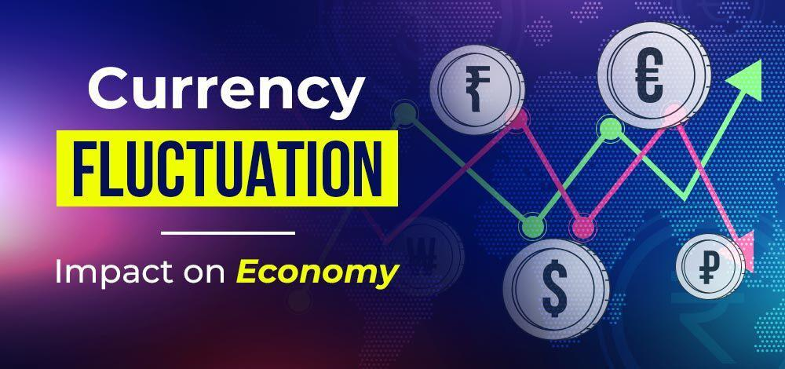

In a world with interconnected economies, currency fluctuations have become a significant phenomenon influencing international economic relations. The valuation of currencies is critical for determining the flow of goods, services, and capital across borders. Foreign exchange markets, or forex, play a central role in establishing currency values, directly impacting global trade volumes, investment flows, and economic growth. These markets facilitate the exchange of currencies and help in setting exchange rates. As the largest and most liquid financial markets globally, forex markets have become indispensable for global economic stability and efficiency.

The increasing complexity of currency fluctuations has ushered in the age of algorithmic trading, which offers enhanced precision and speed in managing financial risks associated with these fluctuations. Algorithmic trading employs sophisticated algorithms that can process large datasets to predict market movements and execute trades with minimal human intervention. This technological advancement has introduced new methods for managing currency risks, providing market participants with tools to better navigate the uncertainties of fluctuating exchange rates. 

This article discusses how currency fluctuations impact economies, the roles foreign exchange markets and algorithmic trading play, and how businesses and investors can utilize advanced trading technologies to navigate this complex landscape effectively. By exploring these aspects, we aim to provide insights into leveraging these tools and strategies for improved economic resilience and growth.

## Table of Contents

## Understanding Currency Fluctuations and Economic Impact

Currency fluctuations refer to the variations in the exchange rate of one nation's currency compared to another. These fluctuations are primarily driven by supply and demand dynamics in the foreign exchange markets, influenced by factors such as interest rates, inflation, and economic indicators.

These currency fluctuations significantly impact the economy. For example, exchange rate changes can affect a nation's trade balance, which is the difference between the value of exports and imports. When the domestic currency weakens, exports become relatively cheaper for foreign buyers, thereby potentially increasing export volumes and positively impacting economic growth. However, this also makes imports more expensive, which can contribute to higher inflation rates domestically as the cost of imported goods rises. 

Conversely, a stronger currency might lead to a trade deficit. As the domestic currency appreciates, exports become more expensive to foreign buyers, possibly reducing demand. Meanwhile, imports become cheaper, which can increase the volume of imports and harm domestic industries that compete with foreign products.

Let's consider an example involving the U.S. dollar (USD) and the euro (EUR): 

1. **Impact on Exports and Imports**: If the USD depreciates against the EUR, American goods become cheaper for European consumers, potentially boosting U.S. exports. However, European goods become more expensive in the U.S., leading to decreased imports or higher costs for U.S. consumers and businesses reliant on European products.

2. **Inflationary Effects**: A weakened domestic currency can contribute to cost-push inflation, where the overall price level rises due to increased costs of imported goods. This can force central banks to adjust monetary policies, such as raising interest rates to curb inflation.

3. **Interest Rate Implications**: Exchange rate movements can influence central banks' decisions on interest rates. If a weaker currency contributes to inflation, a central bank may increase interest rates to stabilize the currency and control inflation.

Overall, the dynamics of currency fluctuations can lead to substantial economic shifts. They affect business competitiveness, consumer purchasing power, and government policies. The interconnected nature of global economies means that understanding and managing currency risks is crucial for sound economic management and strategic decision-making by businesses and policymakers alike.

## The Role of Foreign Exchange in Currency Fluctuations

The foreign exchange ([forex](/wiki/forex-system)) market stands as the largest and most liquid financial market in the world, with a staggering daily trading [volume](/wiki/volume-trading-strategy), often exceeding $6 trillion. This vast market primarily involves the trading of currency pairs, where participants buy one currency while simultaneously selling another. Consequently, forex transactions significantly impact exchange rates by determining currency values based on supply and demand dynamics.

Central banks, pivotal players in the forex arena, exert substantial influence over exchange rates through their monetary policies. By adjusting interest rates, central banks can make their national currencies more or less attractive to investors, effectively increasing or decreasing the currency's value. For example, a hike in interest rates may strengthen a currency as higher returns attract foreign capital, while rate cuts can have the opposite effect. Additionally, central banks might intervene directly in forex markets, buying or selling currencies to stabilize or steer exchange rates towards desired levels.

Government policies and geopolitical developments also play critical roles in shaping forex market dynamics. Trade regulations, fiscal policies, and international relations can influence currency valuations by affecting economic performance expectations. For instance, political instability or significant trade agreements may trigger fluctuations in investor confidence, leading to rapid shifts in currency prices.

Economic indicators are essential tools for forecasting currency movements, providing insights into a country's economic health. Key indicators, such as GDP growth, employment data, and inflation rates, inform traders and investors about potential forex market trends. For example, strong economic performance often leads to currency appreciation as demand for the country's goods and services increases.

The interconnected nature of global markets underscores the fundamental importance of forex as a platform for managing currency fluctuations. Due to this interdependency, shifts in one economy can have cascading effects across borders, highlighting the necessity for sophisticated strategies to navigate these complexities. Understanding and participating in the forex market is thus indispensable for stakeholders aiming to effectively manage risk and capitalize on market opportunities in an increasingly globalized economy.

## Algorithmic Trading and Its Impact on Forex

Algorithmic trading has revolutionized forex markets by employing sophisticated algorithms to automate and optimize trading strategies, thereby enhancing speed and efficiency. At its core, [algorithmic trading](/wiki/algorithmic-trading) involves the use of complex mathematical models and statistical analyses to process extensive datasets, identify market patterns, and execute trades with precision. These algorithms continuously analyze variables such as price movements, trading volumes, and economic indicators, enabling traders to make informed decisions and mitigate the adverse impacts of currency fluctuations.

One of the primary advantages of algorithmic trading is its ability to manage risks effectively. By utilizing advanced models and real-time data analysis, traders can evaluate potential risks and develop strategies to minimize exposure to volatile market conditions. For instance, algorithms can be designed to trigger trades automatically when specific market conditions are met, such as when currency pairs reach predetermined thresholds. This automation reduces human error and emotional biases that can affect traditional trading methods.

Moreover, algorithmic trading has significantly increased market [liquidity](/wiki/liquidity-risk-premium). The rapid execution of trades facilitated by algorithms allows for a higher frequency of transactions, contributing to a more liquid market environment. This increased liquidity, in turn, leads to narrower bid-ask spreads, reducing transaction costs for traders and fostering more competitive pricing within the forex market.

Technology-enabled trading platforms have further democratized access to forex markets, allowing a broader range of investors to participate. These platforms provide users with sophisticated tools and resources to implement algorithmic trading strategies, thus lowering barriers to entry. As a result, both individual investors and institutional entities can engage in forex trading with greater ease and confidence.

Overall, algorithmic trading has transformed the forex landscape by introducing innovation and efficiency. As technology continues to evolve, the adoption of algorithmic trading strategies is likely to expand, providing new opportunities for traders to capitalize on market movements while effectively managing associated risks.

## Managing Risks Associated with Currency Fluctuations

Given the [volatility](/wiki/volatility-trading-strategies) of currency markets, effectively managing associated risks is crucial for both businesses and investors. Currency fluctuations can impact financial outcomes significantly, necessitating strategic approaches to mitigate risks.

One widely used strategy is hedging, which involves using financial instruments to offset potential losses from adverse currency movements. Common hedging tools include futures contracts, options, and swaps. Futures contracts allow businesses to lock in an exchange rate for a future date, providing predictability in cash flows. Options grant the right, but not the obligation, to exchange currency at a predetermined rate, offering flexibility and protection against unfavorable rate shifts. Swaps, often used in [interest rate](/wiki/interest-rate-trading-strategies) risk management, enable parties to exchange cash flows or liabilities in different currencies, reducing exposure to currency variations.

Algorithmic trading has enhanced hedging strategies by facilitating the development of sophisticated models that analyze market data to optimize trading decisions. Using algorithms, traders can quickly respond to market conditions, ensuring timely and efficient execution of hedging transactions. This technology allows for precise risk management, reducing the likelihood of suboptimal trades and improving overall portfolio stability.

Diversifying currency exposure is another critical risk management strategy. By holding assets in multiple currencies, businesses and investors can reduce the impact of adverse movements in any single currency. Aligning investments with currency trends, such as favoring currencies expected to appreciate or perform well economically, can further stabilize financial portfolios.

Comprehensive risk management also involves a thorough understanding of central bank policies and global economic indicators. Central banks influence currency values through interest rate adjustments and market interventions. Keeping abreast of these policies, along with economic indicators such as inflation rates, GDP growth, and trade balances, enables businesses and investors to anticipate changes in exchange rates and make informed decisions.

In conclusion, managing risks associated with currency fluctuations requires a multifaceted approach, combining traditional hedging techniques with advanced algorithmic tools and strategic diversification. By staying informed and adaptable, businesses and investors can navigate the complexities of currency markets and safeguard their financial interests.

## Conclusion

Currency fluctuations and foreign exchange markets have a profound impact on global economic dynamics. As currencies gain or lose value, they influence cross-border trade, capital flows, and investment strategies. The introduction of algorithmic trading has significantly transformed how currency risks are managed, offering unparalleled precision and efficiency. Advanced algorithms analyze real-time market data to execute trades swiftly and accurately, reducing the risk associated with volatile currency movements.

For businesses and investors, a deep understanding of market dynamics is essential. To navigate currency exposures successfully, they must employ advanced techniques such as algorithmic trading, which not only provides speed but also systematically handles large volumes of information. This ability to process and interpret vast datasets enables market participants to make informed decisions, thereby enhancing their capacity to manage risks effectively.

Moreover, effectively managing currency risks necessitates a comprehensive understanding of the intricate interplay between forex markets, economic policies, and technological advancements. Forex markets are influenced by a multitude of factors, including interest rates, monetary policies, and geopolitical events. Hence, staying informed about these aspects enables businesses and investors to mitigate risks and seize potential opportunities in the ever-evolving global market landscape.

As global markets continue to evolve, maintaining a competitive edge in forex and algorithmic trading becomes crucial to fostering economic resilience and growth. Continuous advancements in technology and data analytics are expected to further enhance market transparency and efficiency. Thus, staying ahead in the adoption and implementation of these advanced trading methodologies will be integral to navigating the complexities of international finance and achieving sustainable economic success.

## References & Further Reading

[1]: ["Advances in Financial Machine Learning"](https://www.amazon.com/Advances-Financial-Machine-Learning-Marcos/dp/1119482089) by Marcos Lopez de Prado

[2]: ["Machine Learning for Algorithmic Trading"](https://github.com/PacktPublishing/Machine-Learning-for-Algorithmic-Trading-Second-Edition) by Stefan Jansen

[3]: ["Quantitative Trading: How to Build Your Own Algorithmic Trading Business"](https://www.amazon.com/Quantitative-Trading-Build-Algorithmic-Business/dp/1119800064) by Ernest P. Chan

[4]: ["Evidence-Based Technical Analysis: Applying the Scientific Method and Statistical Inference to Trading Signals"](https://www.amazon.com/Evidence-Based-Technical-Analysis-Scientific-Statistical/dp/0470008741) by David Aronson

[5]: Bank for International Settlements (2019). ["Foreign Exchange Turnover in April 2019"](https://www.bis.org/statistics/rpfx19_fx.htm)

[6]: Lyons, R. K. (2001). ["The Microstructure Approach to Exchange Rates."](https://direct.mit.edu/books/monograph/2004/The-Microstructure-Approach-to-Exchange-Rates) MIT Press.