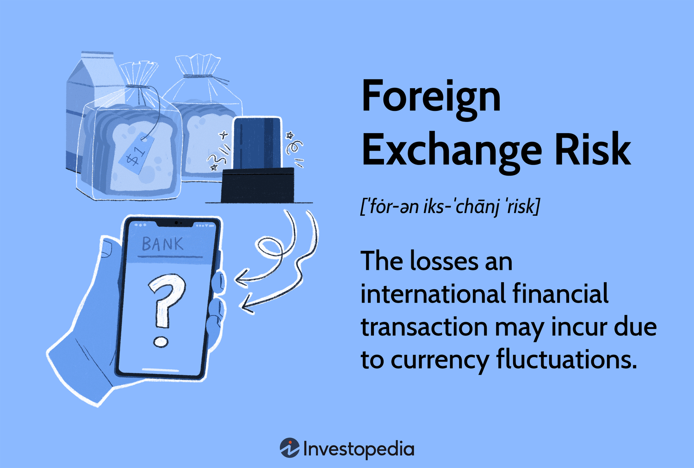

## Table of Contents

## What is currency risk?

Currency risk, also known as exchange rate risk, is the possibility that the value of your money will change when you convert it from one currency to another. This can happen because the exchange rates between different currencies are always changing. For example, if you have money in US dollars and you want to buy something in Euros, the amount of Euros you get for your dollars might be different tomorrow than it is today. This can affect how much things cost or how much money you make if you're doing business in different countries.

Managing currency risk is important for people and businesses that deal with money in different countries. They might use different strategies to protect themselves from losing money because of changes in exchange rates. For example, they might use financial tools like forward contracts, which let them agree on an exchange rate for a future date. Or they might simply keep their money in different currencies to spread out the risk. Understanding and managing currency risk can help make sure that changes in exchange rates don't hurt your finances too much.

## How does currency risk affect foreign bonds?

Currency risk can affect foreign bonds in a big way. When you buy a bond from another country, you usually have to change your money into that country's currency. If the value of that currency goes down compared to your home currency, the bond might be worth less when you want to change it back. This means you could lose money even if the bond itself is doing well.

To deal with this risk, investors might use different strategies. One way is to use financial tools like currency hedging, which can help protect against changes in exchange rates. Another way is to diversify, which means buying bonds from different countries to spread out the risk. By understanding and managing currency risk, investors can make better choices about foreign bonds and try to protect their investments.

## What are foreign bonds?

Foreign bonds are bonds that are issued in a country other than your own. When you buy a foreign bond, you are lending money to a government or a company from another country. These bonds are usually paid back in the currency of the country where they were issued. For example, if you buy a bond from Japan, you will get paid back in Japanese yen.

Foreign bonds can be a good way to diversify your investments. By investing in bonds from different countries, you can spread out your risk. But there are also some risks to think about. One big risk is currency risk, which means the value of the foreign currency might change compared to your own currency. This can affect how much money you get back when the bond is paid off.

## Can you explain the relationship between exchange rates and bond returns?

Exchange rates can have a big effect on the returns you get from foreign bonds. When you buy a bond from another country, you have to change your money into that country's currency. If the value of that currency goes up compared to your own currency, the bond will be worth more when you change it back. This means you could make more money than you expected. But if the value of the foreign currency goes down, the bond will be worth less when you change it back. This means you could lose money even if the bond itself is doing well.

To deal with this, investors might use strategies like currency hedging. This is a way to protect against changes in exchange rates. For example, they might use financial tools to lock in an exchange rate for a future date. Another way is to buy bonds from different countries to spread out the risk. By understanding how exchange rates can affect bond returns, investors can make better choices and try to protect their investments.

## What are some strategies to mitigate currency risk in foreign bonds?

One way to reduce currency risk in foreign bonds is by using currency hedging. This means using financial tools to protect against changes in exchange rates. For example, you might use a forward contract to lock in an exchange rate for a future date. This can help make sure that the value of your bond doesn't go down too much if the foreign currency loses value. It's like buying insurance for your investment.

Another strategy is to diversify your investments. This means buying bonds from different countries. If one country's currency goes down, the others might stay the same or even go up. This can help balance out the risk. By spreading your money across different currencies, you're less likely to lose a lot if one currency does badly.

You can also keep an eye on economic news and trends. Knowing what's happening in the countries where you have bonds can help you make better decisions. If you see that a country's economy is doing well, its currency might go up in value. This can help you decide when to buy or sell your bonds. Staying informed can be a simple but effective way to manage currency risk.

## How does currency hedging work with foreign bonds?

Currency hedging is like buying insurance for your foreign bonds. When you buy a bond from another country, you have to change your money into that country's currency. If the value of that currency goes down compared to your own currency, you could lose money. Currency hedging helps protect you from this risk. It uses financial tools, like forward contracts, to lock in an exchange rate for a future date. This means you know exactly how much money you'll get back when the bond is paid off, no matter what happens to the exchange rate.

For example, let's say you buy a bond from Japan. You change your dollars into yen to buy the bond. If the yen loses value compared to the dollar, you'll get fewer dollars back when you change the yen back at the end. But if you use currency hedging, you can agree to change the yen back at today's rate, even if it changes in the future. This way, you don't have to worry about the yen losing value. Currency hedging can help make your foreign bond investment safer and more predictable.

## What is the impact of currency fluctuations on the yield of foreign bonds?

Currency fluctuations can really change the yield you get from foreign bonds. When you buy a bond from another country, you change your money into that country's currency. If that currency gets stronger compared to your own currency, the bond's yield will be higher when you change it back. This means you'll get more money than you expected. But if the foreign currency gets weaker, the bond's yield will be lower when you change it back. This means you might get less money than you hoped for, even if the bond itself is doing well.

To deal with this, investors often use strategies like currency hedging. This is like buying insurance for your investment. It helps make sure that changes in the exchange rate don't hurt your bond's yield too much. By using these strategies, you can protect your investment and make sure you get a more predictable return, no matter what happens to the foreign currency.

## How do interest rate differentials between countries affect currency risk in foreign bonds?

Interest rate differentials between countries can have a big impact on currency risk in foreign bonds. When one country has higher interest rates than another, it often attracts more investors looking for better returns. This demand for the country's currency can make it stronger compared to other currencies. If you buy a bond from a country with higher interest rates, and its currency gets stronger, you might get more money back when you change it back to your own currency. But if the interest rates in the other country go down, or if the rates in your own country go up, the foreign currency might get weaker. This means you could end up with less money than you expected, even if the bond itself is doing well.

To manage this risk, investors often keep an eye on [interest rate](/wiki/interest-rate-trading-strategies) changes in different countries. They might use strategies like currency hedging to protect their investments. Currency hedging helps lock in an exchange rate for a future date, so changes in interest rates don't hurt the bond's value too much. By understanding how interest rate differentials can affect currency values, investors can make smarter choices about where to put their money and how to protect their investments from currency risk.

## What role does geopolitical stability play in currency risk associated with foreign bonds?

Geopolitical stability is really important when it comes to currency risk in foreign bonds. If a country is stable and peaceful, its currency is usually seen as safer. This means more people want to invest in that country's bonds, which can make the currency stronger. But if a country has a lot of political problems or conflicts, people might be scared to invest there. This can make the currency weaker, which is bad for anyone who has bonds in that country. When the currency gets weaker, the bond might be worth less when you change it back to your own money.

To deal with this risk, investors often look at the news and try to understand what's happening in the countries where they have bonds. If they see that a country is getting more stable, they might decide to buy more bonds there. But if they see that a country is getting less stable, they might sell their bonds or use strategies like currency hedging to protect their money. By paying attention to geopolitical stability, investors can make better choices and try to keep their investments safe from big changes in currency value.

## How can investors assess the currency risk of a specific foreign bond?

Investors can assess the currency risk of a specific foreign bond by looking at a few key things. First, they should check the exchange rate between their own currency and the currency of the bond. If the foreign currency is getting weaker, the bond might be worth less when they change it back to their own money. They should also look at the interest rates in both countries. If the country where the bond is from has higher interest rates, its currency might get stronger, which is good for the bond's value. But if interest rates are going down or if rates in their own country are going up, the foreign currency might get weaker.

Another important thing to consider is the geopolitical stability of the country where the bond is from. If the country is stable and peaceful, its currency is usually seen as safer, which can make the bond more valuable. But if the country has a lot of political problems or conflicts, the currency might get weaker, which is bad for the bond. Investors can also use tools like currency hedging to protect against big changes in the exchange rate. By understanding these factors and keeping an eye on them, investors can make better choices about which foreign bonds to buy and how to manage the risks.

## What are the historical trends in currency risk affecting foreign bond markets?

Over the years, currency risk has had a big impact on foreign bond markets. When currencies go up and down a lot, it can make it hard for investors to know how much money they'll get back from their bonds. For example, in the 1980s, the US dollar got very strong compared to other currencies. This made foreign bonds worth less for American investors because when they changed the money back to dollars, they got less than they expected. But in the 2000s, the US dollar got weaker, which made foreign bonds more valuable for American investors. These big changes in currency values show how important it is for investors to think about currency risk when they buy foreign bonds.

Another big thing that has affected currency risk in foreign bond markets is what's happening in the world. For example, during times of big political problems or wars, like the 2008 financial crisis or the recent tensions between countries, currencies can get very unstable. This makes it harder for investors to predict how their foreign bonds will do. To deal with this, many investors started using strategies like currency hedging to protect their money. By looking at these historical trends, investors can learn how to better manage currency risk and make smarter choices about where to put their money in foreign bond markets.

## How do advanced financial models predict and manage currency risk in foreign bond portfolios?

Advanced financial models help predict and manage currency risk in foreign bond portfolios by using a lot of data and math to understand how currencies might change. These models look at things like interest rates, economic news, and even past trends in currency values. By putting all this information together, the models can guess how much a currency might go up or down in the future. This helps investors know what to expect and plan their investments better. For example, if a model predicts that the euro will get weaker compared to the dollar, an investor might decide to use currency hedging to protect their money.

These models also help investors manage currency risk by suggesting different strategies. One common strategy is diversification, which means buying bonds from different countries to spread out the risk. If one country's currency goes down, the others might stay the same or even go up, which can balance things out. Another strategy is currency hedging, which is like buying insurance for your investment. It helps lock in an exchange rate for a future date, so changes in currency values don't hurt the bond's value too much. By using these advanced models and strategies, investors can make smarter choices and try to keep their foreign bond portfolios safe from big changes in currency values.

## What are foreign bonds and what risks are associated with them?

Foreign bonds are a significant subset of the global bond market, offering investors opportunities for yield enhancement and portfolio diversification. These bonds are issued by a foreign entity but under the domestic market's currency, which reduces the foreign issuer's currency exposure while transferring currency risk to the investor. Such instruments are strategic offerings by international corporations, sovereign nations, or financial institutions seeking to tap into foreign capital markets.

Investors often find foreign bonds appealing due to their potential for higher yields compared to domestic bonds. This attractiveness can be attributed to differing interest rate environments, economic conditions, and credit ratings across countries. By including foreign bonds in their portfolios, investors manage to diversify their investments, reducing the risk associated with being overly concentrated in any single market.

However, investing in foreign bonds does not come without risks. The primary and most challenging risk is the exposure to currency fluctuations. When an investor purchases a bond denominated in a foreign currency, any appreciation or depreciation of that currency relative to the investor’s home currency can significantly impact the investment's returns. For instance, if an investor from the United States purchases a bond denominated in euros, and the euro weakens against the US dollar, the investor will receive fewer dollars back when converting interest payments and the bond's principal.

The influence of currency risk can be calculated using the following formula:

$$
\text{Total Return} = (1 + r_{\text{bond}}) \times (1 + r_{\text{forex}}) - 1
$$

where:
- $r_{\text{bond}}$ is the return of the bond in its local currency,
- $r_{\text{forex}}$ is the return from currency movements, calculated as the percentage change in exchange rate.

To illustrate, consider an investor holding a foreign bond with a return of 5% in its local currency. If the local currency depreciates by 3% against the investor's home currency, the total return becomes approximately:

$$
\text{Total Return} = (1 + 0.05) \times (1 - 0.03) - 1 = 0.0165 \text{ or } 1.65\%
$$

This example demonstrates how unfavorable currency movements can erode a sizable portion of the bond’s yield, emphasizing the importance of managing currency risk in foreign bond investments effectively. 

Thus, while foreign bonds can offer attractive returns, investors must carefully consider and manage the associated currency risks to optimize their investment outcomes.

## What are some case studies and real-world applications?

Algorithmic trading has significantly impacted the management of currency risk in foreign bond investments, offering precise and rapid responses to currency fluctuations. A real-world example is the use of [algorithmic trading](/wiki/algorithmic-trading) by large institutional investors like BlackRock and Vanguard. These firms employ sophisticated algorithms to manage currency exposure effectively, ensuring that their extensive portfolios of foreign bonds remain protected against adverse currency movements. The algorithms analyze vast datasets, including economic indicators and geopolitical developments, to predict currency movements and execute trades automatically, minimizing human error and reaction time.

In addition to algorithmic trading, hedging strategies have also been successfully implemented to mitigate risks associated with foreign bonds. A prominent example includes the strategic use of currency futures and options by pension funds and insurance companies to protect their bond investments from currency devaluation. For instance, the California Public Employees' Retirement System (CalPERS) has effectively used currency forwards to hedge its substantial foreign bond holdings, which significantly reduced the negative impact of currency [volatility](/wiki/volatility-trading-strategies) during economic downturns.

The performance of currency-hedged versus unhedged bond funds further illustrates the effectiveness of these strategies. Empirical studies show that currency-hedged funds typically outperform unhedged counterparts in times of significant currency depreciation relative to the investor's home currency. For instance, during periods of U.S. dollar strength, currency-hedged Eurozone bond funds have consistently reported higher returns compared to unhedged funds, which suffered losses due to unfavorable exchange rate movements.

To evaluate the performance difference, one can consider the mathematical expectation of returns for both currency-hedged and unhedged funds. For an unhedged fund, the return $R_u$ can be expressed as:

$$
R_u = R_b + R_c
$$

where $R_b$ is the return from bonds, and $R_c$ is the currency effect based on the exchange rate movement. Conversely, for a hedged fund with effective hedging, the return $R_h$ is approximately:

$$
R_h = R_b
$$

By minimizing $R_c$ through hedging, the volatility and risk associated with currency fluctuations are reduced, thus potentially providing steadier and more predictable returns. 

In summary, through algorithmic trading and strategic hedging, investors can significantly curtail currency risks inherent in foreign bond investments, offering various case studies and empirical evidence of improved financial outcomes. These approaches demonstrate not only enhanced risk management but also an optimization of return potential in global investment strategies.

## References & Further Reading

[1]: BlackRock Investment Institute. (2019). ["Currency Hedging: The Case for and Against."](https://www.advisorperspectives.com/commentaries/2019/08/30/the-pros-and-cons-of-currency-hedging)

[2]: Mylonas, P., Yalaman, A., & Yaya, O. S. (2019). ["Currency Risk Management: Perspectives from the Field"](https://scholar.google.com/citations?user=7EzTICYAAAAJ&hl=en) OECD Working Papers on Finance, Insurance and Private Pensions.

[3]: ["Trading and Exchanges: Market Microstructure for Practitioners"](https://www.amazon.com/Trading-Exchanges-Market-Microstructure-Practitioners/dp/0195144708) by Larry Harris

[4]: ["Currency Risk Management: A Handbook for Financial Managers, Brokers, and Their Multi-Currency Clients"](https://books.google.com/books/about/Currency_Risk_Management.html?id=UMRnaCcD_QMC) by Gary Shoup

[5]: Hunter, D. M., & Simon, D. P. (2005). ["A Conditional Assessment of the Relationships between the Major World Bond Markets."](https://onlinelibrary.wiley.com/doi/10.1111/j.1354-7798.2005.00293.x) Journal of Banking & Finance, 29(12), 3395-3413.