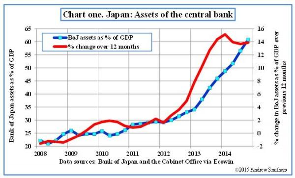

## Table of Contents

## What is quantitative easing?

Quantitative easing, often called QE, is a tool used by central banks to help boost the economy. When traditional methods like lowering interest rates aren't enough, central banks buy government bonds or other financial assets. This increases the money supply in the economy, making it easier for people and businesses to borrow and spend money.

The goal of QE is to encourage spending and investment, which can help lift the economy out of a slump. By buying these assets, the central bank puts more money into the hands of banks and investors, who can then lend or invest it. This can lead to more jobs and higher economic growth. However, QE can also have downsides, like the risk of inflation if too much money is created.

## When did Japan start using quantitative easing?

Japan started using quantitative easing in 2001. At that time, Japan's economy was struggling, and the Bank of Japan wanted to help. They decided to buy more government bonds to put more money into the economy. This was a new idea back then, and Japan was one of the first countries to try it.

The goal was to fight deflation, which means prices were going down. When prices fall, people often wait to buy things, hoping they will be even cheaper later. This can slow down the economy. By using quantitative easing, the Bank of Japan hoped to get people spending again and help the economy grow.

## What were the initial goals of Japan's quantitative easing policy?

Japan started using quantitative easing in 2001 because their economy was not doing well. The main goal was to fight deflation, which means prices were going down. When prices fall, people often wait to buy things, hoping they will be even cheaper later. This can make the economy slow down even more. The Bank of Japan wanted to stop this from happening.

By buying more government bonds, the Bank of Japan hoped to put more money into the economy. More money means people and businesses can borrow and spend more easily. This was supposed to encourage people to start spending again instead of waiting. The idea was that if people spent more, it would help the economy grow and create more jobs.

## How has Japan's quantitative easing impacted its economy?

Japan's use of quantitative easing has had both good and bad effects on its economy. On the positive side, it helped to stop deflation. Before QE, prices in Japan were falling, which made people wait to buy things. By putting more money into the economy, the Bank of Japan made it easier for people and businesses to borrow and spend. This helped to get the economy moving again and created more jobs. It also made the stock market go up, which was good for investors.

However, there were also some downsides. One big problem was that QE didn't make the economy grow as much as people hoped. Even with more money in the economy, people were still careful about spending. This meant that the economy didn't grow as fast as it could have. Another issue was that QE led to a lot of government debt. The Bank of Japan bought a lot of government bonds, and this made the government owe more money. This could be a problem in the future if the economy doesn't grow enough to pay back the debt.

## What are the signs of declining impact from Japan's quantitative easing?

Over time, people have noticed that Japan's quantitative easing isn't working as well as it used to. One big sign is that even though the Bank of Japan has been putting more money into the economy, it's not making people spend more. People are still being careful with their money, and the economy isn't growing as fast as everyone hoped. This means that the extra money from QE isn't having the same effect it did before.

Another sign is that inflation is still low. The whole point of QE was to get prices to go up a little bit, but that hasn't happened as much as expected. Prices are not rising quickly, which means people are still not spending freely. This shows that the power of QE to change how people spend and invest is getting weaker.

## How have inflation rates in Japan been affected by the decline in quantitative easing?

Japan's inflation rates have not gone up much even though the country has been using quantitative easing for a long time. The goal of QE was to make prices rise a little bit, which would encourage people to spend money instead of waiting for prices to go down. But even with all the extra money in the economy, inflation has stayed low. This means that the effect of QE on inflation is not as strong as it used to be.

People in Japan are still careful about spending their money, and this keeps inflation low. When people don't spend, businesses don't raise their prices, and this keeps the overall price level from going up. The decline in the impact of QE shows that just putting more money into the economy is not enough to make people spend more and push inflation higher.

## What are the potential reasons for the diminishing effectiveness of Japan's quantitative easing?

One reason why Japan's quantitative easing is not working as well anymore is that people have gotten used to it. When the Bank of Japan started QE, it was new and exciting. People thought it would make the economy better and started spending more. But now, after so many years, people know that QE is just a normal thing. They don't change their spending habits as much because they expect QE to keep happening. This means that the extra money from QE doesn't make people spend more like it used to.

Another reason is that there are still big problems in the economy that QE can't fix. For example, Japan has a lot of old people and not enough young workers. This makes it hard for the economy to grow because there are fewer people working and spending money. Also, many companies in Japan are not investing in new things because they are worried about the future. QE can't solve these problems by itself. So even though the Bank of Japan keeps putting more money into the economy, it's not enough to make a big difference anymore.

## How has the Bank of Japan responded to the declining impact of quantitative easing?

The Bank of Japan has tried different things to make quantitative easing work better. They have kept buying more government bonds and other assets to put more money into the economy. They've also said that they will keep interest rates very low for a long time. This is to make people and businesses feel more sure about borrowing and spending money. They hope that by doing these things, they can still help the economy grow even if QE is not as strong as before.

But the Bank of Japan knows that QE alone might not be enough. They have started talking about other ways to help the economy. For example, they want the government to spend more money on things like building roads and schools. They also want companies to invest more in new ideas and technology. By working together with the government and businesses, the Bank of Japan hopes to find new ways to make the economy stronger, even if QE is not working as well as it used to.

## What are the long-term economic consequences of prolonged quantitative easing in Japan?

The long-term use of quantitative easing in Japan has led to some big changes in the economy. One big change is that the government now has a lot more debt. The Bank of Japan bought a lot of government bonds to put more money into the economy. This helped in the short term, but now the government owes a lot of money. If the economy doesn't grow enough, it could be hard to pay back all this debt. Also, because the Bank of Japan has been buying so many bonds, it's harder for them to buy even more if they need to. This means they might not be able to help the economy as much in the future.

Another long-term effect is that people and businesses have gotten used to low interest rates and lots of money in the economy. This can make it hard to change things later. If the Bank of Japan ever wants to stop QE or raise interest rates, it could cause big problems. People might not be ready for higher borrowing costs, and this could slow down the economy even more. Also, because QE hasn't made the economy grow as much as hoped, Japan still faces big challenges like an aging population and not enough new jobs. These problems need more than just QE to fix, and the long-term use of QE might have made it harder to find other solutions.

## How do international economic conditions influence the effectiveness of Japan's quantitative easing?

International economic conditions can make Japan's quantitative easing work better or worse. If other countries are doing well, it can help Japan's economy too. For example, if the U.S. or China is growing fast, they might buy more things from Japan. This can make Japanese companies do better and create more jobs. Also, if other countries are using their own QE, it can make the world economy grow more, which helps Japan too. But if other countries are not doing well, it can make Japan's QE less effective. If other countries are in a recession, they might buy less from Japan, which can hurt Japanese companies and make it harder for QE to help the economy.

Another way international conditions affect Japan's QE is through money exchange rates. If the yen gets stronger because other countries are doing badly, it can make Japanese products more expensive for other countries to buy. This can hurt exports and make QE less effective. On the other hand, if the yen gets weaker because other countries are doing well, it can make Japanese products cheaper and easier to sell abroad. This can help QE work better. So, what happens in the rest of the world can really change how well Japan's QE works.

## What alternative monetary policies could Japan consider as the impact of quantitative easing declines?

As the impact of quantitative easing in Japan weakens, one alternative the Bank of Japan could think about is using negative interest rates more strongly. This means they would charge banks for keeping money with them, instead of paying interest. This could make banks want to lend more money to people and businesses, which could help the economy grow. But it's tricky because if rates get too low, it might make people worried about the future and save more instead of spending.

Another option is for the Bank of Japan to work more closely with the government on something called "helicopter money." This means the government would give money directly to people, like sending checks to everyone. This could make people spend more right away, which could help the economy. But it's a big step and could lead to more government debt, so it needs to be done carefully.

A third idea is to focus on changing rules and laws to make it easier for businesses to invest and grow. This could mean making it simpler to start new companies or encouraging companies to spend more on new technology. If businesses invest more, it could create more jobs and make the economy stronger, even if QE is not working as well. This would need help from the government, but it could be a good way to help the economy without relying only on the Bank of Japan.

## What are the expert opinions on the future of Japan's monetary policy in light of the declining impact of quantitative easing?

Experts have different ideas about what Japan should do with its monetary policy now that quantitative easing is not working as well. Some experts think Japan should keep using QE but try to make it work better by doing things like buying different kinds of assets or working more closely with the government. They believe that even if QE is not as strong as before, it's still important to keep the economy stable. Other experts think Japan should start moving away from QE and try new things like negative interest rates or giving money directly to people. They worry that if Japan keeps using QE too much, it could cause big problems like too much government debt or inflation.

Another group of experts believes that Japan needs to focus more on fixing bigger problems in the economy, like the aging population and not enough new jobs. They think that changing laws and rules to help businesses grow and invest could be more important than just using monetary policy. These experts say that the Bank of Japan should work with the government to make the economy stronger in the long run, instead of just trying to fix things with QE. Overall, there is no one clear answer, and Japan will need to think carefully about what to do next.

## References & Further Reading

[1]: Krugman, P. (1998). ["It's Baaack: Japan's Slump and the Return of the Liquidity Trap."](https://www.brookings.edu/wp-content/uploads/1998/06/1998b_bpea_krugman_dominquez_rogoff.pdf) Brookings Papers on Economic Activity.

[2]: Bernanke, B. S., Reinhart, V. R., & Sack, B. P. (2004). ["Monetary Policy Alternatives at the Zero Bound: An Empirical Assessment."](https://www.federalreserve.gov/pubs/feds/2004/200448/200448pap.pdf) Brookings Papers on Economic Activity.

[3]: Shirai, S. (2020). ["Japan’s Monetary Policy in a COVID-19 World."](https://en.wikipedia.org/wiki/Iyo_Sky) East-West Center.

[4]: Werner, R. A. (2003). ["Princes of the Yen: Japan's Central Bankers and the Transformation of the Economy."](https://archive.org/details/princesofyenjapa0000wern) M. E. Sharpe.

[5]: Horioka, C. Y. (2006). ["The Causes of Japan's 'Lost Decade': The Role of Household Consumption."](https://www.sciencedirect.com/science/article/pii/S0922142506000144) Economic Policy.

[6]: International Monetary Fund. (2023). ["World Economic Outlook Database."](https://www.imf.org/en/Publications/WEO/weo-database/2023/October)

[7]: Degen, K. (2018). ["The Effects of Quantitative Easing on Interest Rates: Evidence from Japan."](https://www.nber.org/papers/w17555) Journal of Money, Credit and Banking.

[8]: Ito, T., & Mishkin, F. S. (2006). ["Two Decades of Japanese Monetary Policy and the Deflation Problem."](https://www.nber.org/papers/w10878) National Bureau of Economic Research.