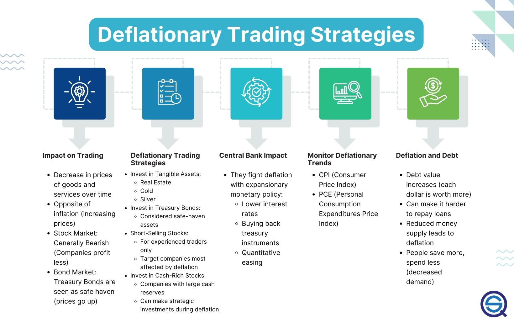

This article explores the complex relationship between deflation, economic trends, investment strategies, and algorithmic trading. Deflation, characterized by a sustained decrease in the general price level of goods and services, presents unique challenges and opportunities for investors. Unlike inflation, where rising prices erode the purchasing power of money, deflation can increase the real value of money, making it a double-edged sword for economic agents. For consumers, deflation may initially appear beneficial as it enhances purchasing power; however, for the broader economy, it can indicate underlying issues such as reduced demand and the potential risk of a recession.

Economic trends like deflation necessitate adaptive investment strategies to protect assets and capitalize on potential gains. Investors must be vigilant, adjusting their portfolios to minimize risk and take advantage of deflationary environments. Traditional investment strategies might not suffice when the economy is slipping into deflation, requiring innovative and flexible approaches to asset management.



Algorithmic trading has become an essential tool for navigating deflation-influenced market dynamics. By employing computer algorithms to optimize trading decisions based on market data, traders can quickly respond to the rapid changes caused by macroeconomic factors such as deflation. This technological advancement allows for more informed and timely investment decisions, potentially leading to greater returns or minimized losses during periods of economic volatility.

This article provides an overview of how deflation impacts investment and trading strategies, offering insights into the ways investors and traders can adapt to economic downturns. By understanding and leveraging the intricate interplay between deflation, economic trends, investment strategies, and algorithmic trading, financial agents can better position themselves to navigate the challenges and opportunities presented by deflationary periods.

## Table of Contents

## Understanding Deflation and Its Economic Implications

Deflation is characterized by a persistent decline in the prices of goods and services, leading to an increase in the purchasing power of money. Although lower prices can benefit consumers in the short term, deflation is often indicative of deeper economic challenges such as a slowing economy, diminished demand, and the looming threat of a recession. The phenomenon is typically triggered by a reduction in the money supply within the economy, a fall in aggregate demand, or advancements in technology that enhance production efficiency and reduce costs.

Several economic indicators are vital for monitoring deflationary trends. The Consumer Price Index (CPI) and the Personal Consumption Expenditures (PCE) Price Index are the primary metrics used to gauge general price level changes. The CPI measures the average change over time in the prices paid by consumers for a market basket of consumer goods and services, whereas the PCE Price Index reflects changes in the prices of goods and services consumed by individuals.

The repercussions of sustained deflation can be far-reaching and detrimental. When prices decrease consistently, the value of investments can diminish since future revenue expectations fall in nominal terms. For instance, a stock whose value is tied to future earnings may see its price fall as those earnings shrink in deflationary conditions. Additionally, the real burden of debt intensifies during deflation. As prices and incomes fall, the nominal amount of debt remains unchanged, leading to an increase in the real value of debt. This situation places additional pressure on both consumers and businesses who may already be struggling, potentially exacerbating the economic downturn.

Understanding these dynamics is critical for policymakers and investors alike, as they navigate the challenges and opportunities presented by a deflationary environment. By closely monitoring indicators and being attuned to the causes and effects of deflation, stakeholders can develop strategies to mitigate its impact and explore potential gains derived from the increased purchasing power.

## Investment Strategies During Deflationary Periods

Investors navigating deflationary periods must adopt strategies that accommodate the unique challenges and opportunities presented by declining price levels. To safeguard and potentially enhance portfolio value, the inclusion of safe-haven assets is often recommended. Assets such as gold and U.S. Treasury bonds are traditionally favored during deflation, as they retain value and provide stability amid economic uncertainty. Gold, recognized for its intrinsic worth, is less vulnerable to currency devaluation, and Treasury bonds are backed by the full faith and credit of the U.S. government, offering a secure investment choice.

Real assets, including real estate, also play a crucial role in preserving value during deflation. Although real estate markets can be prone to short-term fluctuations, properties can provide long-term value protection and appreciation, especially if located in economically resilient areas. Furthermore, rental income can offer a steady cash flow even when asset prices are stagnating or declining.

Short-selling stocks represents another strategy to capitalize on deflationary trends. By selling borrowed shares of companies perceived as financially unstable or overvalued in deflationary climates, investors can potentially profit from anticipated stock price declines. However, this approach carries significant risk, requiring careful analysis of market conditions and corporate health.

Investments in cash-rich companies become attractive during deflation, as these companies have the financial flexibility to weather economic downturns. Firms with substantial cash reserves can maintain operations without excessive borrowing, allowing them to capitalize on lower input costs and undertake opportunistic investments or acquisitions.

Diversification across multiple asset classes is critical for risk mitigation during deflationary periods. By spreading investments across assets like equities, bonds, real estate, and commodities, investors can cushion against the adverse impacts of deflation on any single asset class, optimizing potential returns and reducing portfolio [volatility](/wiki/volatility-trading-strategies).

In developing an investment strategy tailored to deflationary environments, investors should remain vigilant, continuously assessing economic indicators and adjusting their portfolios to shield against risks while pursuing growth opportunities.

## Algorithmic Trading Strategies in Deflationary Markets

Algorithmic trading employs sophisticated computer algorithms to automate trading decisions, leveraging vast amounts of market data. In deflationary markets, these trading systems can effectively capitalize on specific economic conditions to optimize returns.

One prominent strategy employed in [algorithmic trading](/wiki/algorithmic-trading) during deflation is trend-following. Trend-following algorithms identify and capitalize on persistent market movements, which may be exaggerated during periods of falling prices. These algorithms use statistical and technical indicators to ascertain trends, entering trades in the direction of the trend and exiting when the trend reverses or loses [momentum](/wiki/momentum). The predictive accuracy in a deflationary environment is enhanced by analyzing historical price data and applying stochastic models to forecast future price trajectories.

Mean reversion strategies also find applicability in deflationary contexts. These strategies assume that asset prices will revert to their historical means over time. Deflation can lead to occasional overcorrections in asset prices. Algorithms designed for mean reversion can exploit these deviations by identifying price discrepancies and predicting the eventual price convergence to the mean. By continuously analyzing price data and volatility, these algorithms execute trades at perceived undervalued or overvalued positions, aiming to profit when prices adjust to their mean value.

Algorithmic trading systems exhibit a fundamental strength in their ability to adapt quickly to macroeconomic data. During deflationary periods, market conditions can change rapidly due to shifts in consumer sentiment, monetary policy adjustments, or unexpected economic indicators. These systems harness real-time data to modify trading strategies instantaneously, ensuring that trades align with the most current market conditions. For instance, algorithms can incorporate surprise announcements from central banks or changes in inflation indicators, recalibrating their trading models to reflect these new economic realities.

A key attribute of algorithmic trading during deflation is the ability to process vast datasets in real-time. This capability allows for the dynamic adjustment of trading strategies to optimize investment returns. Traders employ advanced data analytics and [machine learning](/wiki/machine-learning) models to sift through large volumes of structured and unstructured data. This data processing enables algorithms to detect subtle market shifts or emerging patterns, making informed, rapid trading decisions that human traders would be unable to replicate with the same speed or accuracy.

In summary, algorithmic trading strategies tailored for deflationary markets exploit trend movements and mean reversion opportunities while maintaining rapid adaptability through real-time data processing. These systems provide a robust framework for optimizing investment returns in environments where traditional trading methods may struggle due to heightened volatility and rapid economic shifts.

## The Role of Central Banks and Policy Implications

Central banks play a pivotal role in addressing deflation through the use of monetary policy tools such as [interest rate](/wiki/interest-rate-trading-strategies) adjustments and quantitative easing (QE). These interventions are designed to stimulate economic activity and stabilize prices in the face of deflationary pressures.

Reducing interest rates is a primary strategy employed by central banks to combat deflation. Lower interest rates decrease the cost of borrowing, thereby encouraging both consumer and business spending. This increased spending can help counteract the reduction in overall demand that characterizes deflationary periods. For instance, when interest rates are reduced, loans and mortgages become more affordable, leading to an uptick in consumer purchases and investment by businesses.

Quantitative easing is another crucial tool used by central banks to mitigate deflation. QE involves the large-scale purchase of financial assets such as government bonds and other securities. By doing so, central banks inject [liquidity](/wiki/liquidity-risk-premium) into the financial system, effectively increasing the money supply. This influx of liquidity lowers interest rates further along the yield curve and encourages lending and investment. The aim is to boost spending and investment, thereby increasing economic activity and countering deflationary trends.

Investors and traders must remain vigilant and well-informed about central bank policies, as these can significantly influence market dynamics. Central bank decisions on interest rates and asset purchases impact the broader financial markets, affecting asset prices, foreign exchange rates, and yield curves. Therefore, understanding these policies helps investors and traders make informed decisions regarding asset allocation and risk management.

Algorithmic trading systems offer a sophisticated approach to navigating markets influenced by central bank policies. These systems utilize predictive models that incorporate central bank announcements, interest rate changes, and QE measures. By processing real-time data, algorithms can quickly adjust trading strategies to optimize returns in response to policy shifts. For example, a change in interest rates could lead algorithms to rebalance portfolios towards assets likely to benefit from such adjustments.

Python, widely used in financial modeling, can be employed to implement algorithmic trading strategies that [factor](/wiki/factor-investing) in central bank policies. Below is a basic example of how Python might be used to simulate the impact of a central bank's interest rate decision on an investment strategy:

```python
import numpy as np

# Simulate historical asset prices
np.random.seed(0)
prices = np.random.normal(100, 10, 1000)

# Simulate an interest rate cut impact factor
interest_rate_cut_effect = np.random.normal(1.01, 0.02, len(prices))

# Adjust asset prices post-interest rate cut
adjusted_prices = prices * interest_rate_cut_effect

# Function to simulate trading strategy based on adjusted prices
def trading_strategy(prices, adjusted_prices):
    # Simple moving average strategy
    short_window = 40
    long_window = 100

    # Compute moving averages
    signals = np.zeros(len(prices))
    short_mavg = np.convolve(prices, np.ones(short_window)/short_window, mode='valid')
    long_mavg = np.convolve(adjusted_prices, np.ones(long_window)/long_window, mode='valid')

    # Generate trading signals
    signals[short_window:len(long_mavg)+short_window] = np.where(short_mavg > long_mavg, 1.0, 0.0)

    return signals

signals = trading_strategy(prices, adjusted_prices)
print(signals)
```

This code simulates the historical prices of an asset and models the impact of an interest rate cut through the `interest_rate_cut_effect` factor. The `trading_strategy` function employs a simple moving average crossover strategy, generating buy or sell signals based on the adjusted prices. While simplistic, this approach demonstrates how dynamic models can incorporate macroeconomic data and central bank policy changes to improve decision-making in deflationary environments.

## Conclusion: Navigating Deflation with Informed Strategies

Deflation presents both risks and opportunities for investors and traders, necessitating astute navigation through informed strategies. An insightful understanding of deflationary trends is fundamental for executing strategic investment shifts, thereby protecting and potentially growing assets during such periods. These trends underscore the importance of identifying assets that not only withstand but potentially thrive amidst declining price levels. Historically, safe-haven assets such as gold and Treasury bonds have been favored for their stability during economic downturns, providing a hedge against the depreciating value of other investments.

Algorithmic trading systems emerge as a powerful tool for managing volatility and capitalizing on market inefficiencies in deflationary environments. These systems leverage computer algorithms to process real-time data and execute trades rapidly, thereby exploiting minute market movements and pricing discrepancies that may occur during these times. For instance, trend-following algorithms can identify and act on persistent deflationary trends, whereas mean reversion strategies may target price anomalies, banking on eventual corrections. The dynamic adaptability of these systems facilitates swift responses to shifts induced by deflation, optimizing potential returns.

In addition, adapting to central bank policies and macroeconomic indicators ensures alignment with prevailing market dynamics. Central banks play a pivotal role in addressing deflation through monetary policies such as interest rate adjustments and quantitative easing. Investors and traders must remain vigilant of such policy shifts, as they can significantly influence market conditions. Algorithmic trading models can incorporate these central bank decisions, adjusting strategies to navigate the economic landscape more effectively.

Combining economic insights with advanced trading technologies allows investors to mitigate risks while enhancing potential returns during deflation. By integrating knowledge of macroeconomic indicators with algorithmic capabilities, investors can not only shield their portfolios from adverse deflationary effects but also turn these periods into opportunities for growth. This strategic synergy—rooted in a comprehensive understanding of deflation and its implications—provides a robust foundation for achieving success in challenging economic conditions.

## References & Further Reading

[1]: Borio, C., & Filardo, A. (2004). [Deflation and Monetary Policy in a Historical Perspective: Remembering the Past or Being Condemned to Repeat It?](https://www.jstor.org/stable/3601059) Bank for International Settlements Working Paper.

[2]: Krugman, P. (1998). [It's Baaack: Japan's Slump and the Return of the Liquidity Trap](https://www.brookings.edu/wp-content/uploads/1998/06/1998b_bpea_krugman_dominquez_rogoff.pdf). The Quarterly Journal of Economics, 113(3), 532-575.

[3]: ["Algorithmic Trading: Winning Strategies and Their Rationale"](https://www.amazon.com/Algorithmic-Trading-Winning-Strategies-Rationale-ebook/dp/B00CY5HC0U) by Ernest P. Chan

[4]: McDonald, R., & Siegel, D. (1986). [The Value of Waiting to Invest](https://www.jstor.org/stable/1884175). The Quarterly Journal of Economics, 101(4), 707-728.

[5]: Bernanke, B. S. (2000). [Japanese Monetary Policy: A Case of Self-Induced Paralysis?](https://www.princeton.edu/~pkrugman/bernanke_paralysis.pdf) In S. Hayashi & R. M. J. Gordon (Eds.), Japan's Financial Crisis and Its Parallels to U.S. Experience. University of Chicago Press.