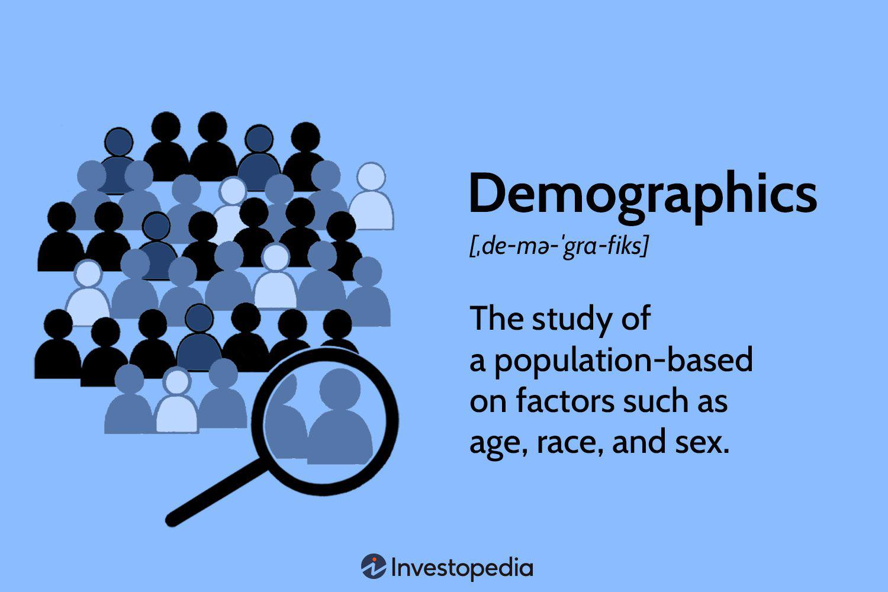

The evolving dynamics in finance are influenced by various factors that continually reshape investment landscapes. Among the most significant of these factors are demographic trends and advancements in algorithmic trading. As global populations age, shifts in workforce demographics and retirement patterns present both challenges and opportunities for investors. These changes compel adjustments in asset allocation, risk assessment, and long-term investment strategies.

Alongside demographic trends, the rise of algorithmic trading has introduced a transformative element to financial markets. By harnessing sophisticated algorithms and vast computational power, investors can execute rapid trades based on complex data analyses. This technological advancement allows for more efficient market participation, optimizing transactions and potentially enhancing returns.



A comprehensive understanding of the intersection between demographic shifts and technology-driven trading strategies is essential for investors aiming to optimize their portfolios for future success. This involves recognizing how demographic changes influence market trends and leveraging algorithmic trading to respond to these shifts effectively. With the aging of populations and continuous evolution of technology, staying informed and adaptable is critical for identifying new investment opportunities and mitigating emerging risks.

By exploring the interplay between demographic developments and algorithmic trading innovations, investors are better equipped to navigate the complex landscape of modern finance. This approach not only aids in addressing current market dynamics but also in preparing for the challenges and opportunities that lie ahead.

## Table of Contents

## Demographic Trends and Their Impact on Investments

Demographic changes, particularly the aging population, exert a substantial influence on financial markets and investment strategies. With the global population experiencing an unprecedented increase in the proportion of older adults, the implications for asset allocation are profound. This shift leads to a decrease in equities within investment portfolios as retirees often reduce their risk exposure. Consequently, there is an elevated demand for conservative investments, such as bonds and fixed-income securities, which are perceived as less volatile and provide steady returns.

The tendency of aging individuals to prefer stability over high-risk investments is a key consideration for investors and financial advisors. As the proportion of retirees in the population grows, there is a need for a strategic reallocation of assets within portfolios to mitigate risks. This demographic trend necessitates careful monitoring to anticipate shifts in market dynamics. For instance, sectors traditionally seen as safe havens or those resistant to economic cycles, like utilities or certain consumer staples, may witness increased investor interest as older investors seek reliable income streams.

Furthermore, demographic shifts can signal forthcoming market trends, prompting investors to adjust their portfolios proactively. The need for tailored financial products tailored to an aging population becomes evident. Financial advisors play a crucial role in helping investors navigate these shifts, ensuring that their portfolios remain aligned with their evolving risk tolerance and income needs.

Investors should recognize the impact of demographic trends on future market conditions and develop strategies accordingly. Maintaining an adaptable investment strategy that considers demographic influences will be essential for optimizing returns and ensuring sustained financial stability in the face of an aging global population.

## Financial Implications of Aging Populations

An aging population presents distinct financial implications for investment portfolios. One of the main challenges is the potential reduction in equity investments as older individuals seek to minimize risk. As people age, their capacity for generating income typically decreases, leading them to favor more stable, lower-risk investments over equities. This shift can result in a reduction in capital flowing into equity markets, potentially impacting market valuations and returns.

Moreover, as the demographic profile shifts, certain sectors are likely to experience increased demand. The healthcare sector, for instance, stands to benefit significantly due to the heightened need for medical services, products, and technologies that cater to older adults. Investments targeted towards pharmaceuticals, biotechnology, and medical devices could yield positive returns as these industries expand to meet the demands of an aging population.

Similarly, the financial services sector may also encounter opportunities as it adapts to the needs of older adults. Products such as retirement planning services, annuities, and long-term care insurance are likely to see growing demand. Financial institutions that strategically focus on developing these services and products can tap into a burgeoning market.

To optimize portfolios in light of these demographic shifts, investors should consider incorporating sectors that are poised to benefit from an aging population. This could include increasing allocations in healthcare and financial services while reducing exposure to riskier asset classes. A strategic portfolio adjustment not only aligns with demographic trends but also provides a more balanced risk-return profile tailored to the evolving market landscape.

Investors who remain adaptable and attuned to these demographic changes can achieve sustained returns by aligning their portfolios with the changing economic realities. By strategically positioning their investments to capture the growth within sectors driven by an aging demographic, investors can mitigate risks associated with a potential decline in equities and capitalize on emerging opportunities.

## Algorithmic Trading and Modern Investment Strategies

Algorithmic trading has become an essential component in the evolution of modern investment strategies, leveraging the power of technology to execute financial decisions with unprecedented speed and precision. It involves the use of complex algorithms to automate trading entries and exits, minimizing human intervention and thereby reducing potential errors.

The core advantage of [algorithmic trading](/wiki/algorithmic-trading) lies in its ability to process and analyze vast amounts of financial data in real-time. This capability enables faster decision-making, which is critical in volatile markets where timing can significantly influence profitability. By using sophisticated data analysis techniques, algorithmic trading systems can identify patterns and trends that might be imperceptible to human traders.

A fundamental component of algorithmic trading is the use of mathematical models for predictive analysis. These models can include statistical methods, [machine learning](/wiki/machine-learning) algorithms, and other forms of quantitative analysis. For example, moving averages and other statistical indicators can be used to predict stock price movements:

$$
\text{Simple Moving Average (SMA)} = \frac{P_1 + P_2 + \ldots + P_n}{n}
$$

where $P_1, P_2, \ldots, P_n$ are the stock prices, and $n$ is the number of periods.

Investors utilizing algorithmic trading can enhance portfolio performance through strategic automation. By automating the execution of trades, investors can capitalize on market opportunities immediately as they arise, without the delays associated with manual trading. This is particularly advantageous when executing high-frequency trading strategies, where hundreds or thousands of trades might be completed in mere seconds.

In addition to speed, algorithmic trading offers the benefit of disciplined execution. It eliminates the emotional and psychological biases that can affect human traders, ensuring consistent adherence to a predetermined strategy. This discipline can be crucial in maintaining a long-term investment strategy, especially during periods of market stress.

Moreover, algorithmic trading can help optimize transaction costs through smart order routing, which identifies the best possible price across multiple market venues. This can result in significant savings, especially for large [volume](/wiki/volume-trading-strategy) trades.

The following Python snippet provides a simplified example of how an algorithmic strategy might be implemented to automate trades based on moving averages:

```python
import pandas as pd

# Sample stock data
data = pd.DataFrame({
    'price': [100, 102, 101, 105, 107, 110, 108, 111, 112, 115]
})

# Calculate moving averages
data['sma_3'] = data['price'].rolling(window=3).mean()
data['sma_5'] = data['price'].rolling(window=5).mean()

# Define trading signals
data['signal'] = 0
data['signal'][3:] = np.where(data['sma_3'][3:] > data['sma_5'][3:], 1, 0)

# Determine position changes
data['position'] = data['signal'].diff()

# Print trading strategy
print(data)
```

This code calculates simple moving averages and generates trading signals when the short-term moving average crosses above or below the long-term moving average. Such an approach exemplifies the potential for algorithmic trading strategies to enhance investment decisions, driving efficiency and potentially improving returns.

In conclusion, as technology continues to advance, the role of algorithmic trading in shaping modern investment strategies will likely grow. Investors who integrate these technologies into their approach can expect to benefit from faster, more informed trading decisions, potentially leading to superior portfolio performance.

## Integrating Demographic Insights and Algorithmic Trading

Integrating demographic analysis with algorithmic trading offers significant potential for tailoring investment portfolios to align with demographic trends. By harnessing advanced technological tools, investors can enhance their ability to predict and capitalize on market shifts driven by population changes.

Demographic insights provide valuable information on market behavior. For example, an aging population may lead to increased demand for healthcare services, which can drive stock prices in that sector. Incorporating these insights into algorithmic trading systems enables investors to automate decision-making processes, responding proactively to demographic changes.

Algorithmic trading systems utilize quantitative models to analyze vast datasets and execute trades based on predefined criteria. By integrating demographic data, these models can be fine-tuned to recognize patterns associated with specific population trends. For instance, algorithms might identify the early stages of increased demand for retirement financial products as the proportion of retirees rises.

A practical approach to integrating these elements is through the development of predictive models that consider factors such as age distributions, birth rates, and migration patterns. Using machine learning techniques, predictive models can evolve continuously, improving their accuracy in forecasting demographic impacts on markets.

Here is a simple example using Python for creating a basic predictive model:

```python
from sklearn.model_selection import train_test_split
from sklearn.linear_model import LinearRegression
import numpy as np
import pandas as pd

# Sample data on demographic trends and market sectors
data = {
    'Age Group': np.random.randint(20, 70, size=100),
    'Investment in Healthcare': np.random.rand(100) * 100
}

df = pd.DataFrame(data)

# Feature and target variable
X = df[['Age Group']]
y = df['Investment in Healthcare']

# Split the data
X_train, X_test, y_train, y_test = train_test_split(X, y, test_size=0.2, random_state=42)

# Create a model
model = LinearRegression()

# Train the model
model.fit(X_train, y_train)

# Predict
predictions = model.predict(X_test)
```

This simplified model illustrates how demographic data can be used to predict investment trends in specific sectors. Investors can expand on this approach, deploying more complex algorithms to manage portfolios dynamically.

The integration of demographic analysis with algorithmic trading ultimately leads to diversified portfolios that are resilient to both demographic and market changes. This strategy not only enhances portfolio diversity but also fortifies it against the inherent uncertainties of changing population dynamics and technological advancements in trading.

## Future Outlook and Strategic Recommendations

As the financial world continues to evolve, investors must actively integrate demographic insights and technological advancements to stay ahead. Embracing demographic research allows investors to anticipate shifts in market demands, particularly as global populations age, potentially affecting asset allocation and sectoral investment focus. For instance, understanding the aging demographic can guide strategic investment in sectors like healthcare, which may see increased demand. 

Moreover, staying current with technological advancements, particularly in algorithmic trading, is crucial. This involves leveraging tools that enhance trading efficiency and decision-making. Algorithmic trading systems use complex mathematical models and computers to outperform human capabilities in analyzing extensive datasets quickly, thus offering a competitive edge in trading. These systems can adjust strategies based on real-time market conditions, which is essential as markets become more volatile and data-driven.

A continuous evaluation process is vital for identifying relevant demographic patterns and technological innovations. Investors should routinely assess and incorporate such trends to ensure their strategies remain aligned with future market conditions. Ensuring that portfolios are responsive to these changes involves regular rebalancing, which allows portfolios to remain diversified and mitigate risk while tapping into new growth opportunities.

Strategically, investors might consider employing a dynamic investment strategy that leverages algorithmic models tuned to demographic insights. For example, Python can be used to create a simple market analysis script that could process demographic and market data, identifying potential investment opportunities related to aging populations:

```python
import pandas as pd
import numpy as np

# Load demographic and market data
demographic_data = pd.read_csv('demographic_trends.csv')
market_data = pd.read_csv('market_opportunities.csv')

# Analyze data to find investment opportunities
def analyze_data(demo_data, market_data):
    aging_trend = demo_data[demo_data['age_group'] == '65+'].mean()
    healthcare_trend = market_data[market_data['sector'] == 'Healthcare'].sum()

    if aging_trend['growth_rate'] > 0.02 and healthcare_trend['investment_return'] > 0.05:
        return "Invest in Healthcare Sector"
    else:
        return "Re-evaluate investment strategy"

recommendation = analyze_data(demographic_data, market_data)
print(recommendation)

```

Investors who consistently adapt their strategies to accommodate demographic changes and technological advancements will likely maintain an advantage in the evolving financial landscape. Remaining competitive means monitoring these external factors closely, ensuring portfolios are not only aligned with current realities but are also positioned to seize emerging opportunities.

## Conclusion

Demographic trends and algorithmic trading play vital roles in shaping future investment strategies. As populations age and market dynamics evolve, these factors are increasingly significant in determining financial outcomes. Investors who successfully integrate insights from demographic shifts and leverage the capabilities of algorithmic trading stand a greater chance of capitalizing on the emergent opportunities within the financial markets.

Adapting investment portfolios to reflect demographic changes requires understanding not just the present landscape but also the future trajectory of population dynamics. For example, an aging population can significantly influence the demand for different asset classes, such as fixed-income securities becoming more favorable compared to equities due to reduced risk appetite among retirees. By identifying these trends, investors can position their portfolios to anticipate sector growth and potential shifts in market demand.

Algorithmic trading, with its ability to process large volumes of data at high speeds, offers a considerable advantage in optimizing investment strategies. This technological advancement facilitates the implementation of complex strategies, allowing for precision in execution and the potential to enhance portfolio performance. By using real-time data analysis and predictive models, investors can respond swiftly to market changes, thus minimizing risks and maximizing returns.

Staying informed about demographic and technological advancements is crucial. The financial landscape is inherently dynamic, with shifts that may occur rapidly and unexpectedly. Continuous learning and portfolio reassessment are essential strategies to maintain competitiveness and resilience. Investors must be proactive in integrating new information and technologies, ensuring that their investment strategies reflect the latest insights and innovations. 

By embracing demographic research and harnessing the power of algorithmic trading, investors can navigate the complexities of the modern financial environment effectively. This integrated approach not only enhances opportunities for growth but also strengthens the ability to withstand and adapt to market fluctuations. As a result, investors equipped with both demographic insights and technological tools are better positioned to achieve sustained investment success in the constantly evolving financial markets.

## References & Further Reading

[1]: Bergstra, J., Bardenet, R., Bengio, Y., & Kégl, B. (2011). ["Algorithms for Hyper-Parameter Optimization."](https://dl.acm.org/doi/10.5555/2986459.2986743) Advances in Neural Information Processing Systems 24.

[2]: ["Advances in Financial Machine Learning"](https://www.amazon.com/Advances-Financial-Machine-Learning-Marcos/dp/1119482089) by Marcos Lopez de Prado

[3]: ["Evidence-Based Technical Analysis: Applying the Scientific Method and Statistical Inference to Trading Signals"](https://www.amazon.com/Evidence-Based-Technical-Analysis-Scientific-Statistical/dp/0470008741) by David Aronson

[4]: ["Machine Learning for Algorithmic Trading"](https://github.com/stefan-jansen/machine-learning-for-trading) by Stefan Jansen

[5]: ["Quantitative Trading: How to Build Your Own Algorithmic Trading Business"](https://github.com/LucindaYa/quant-resources/blob/master/Quantitative%20Trading%20How%20to%20Build%20Your%20Own%20Algorithmic%20Trading%20Business.pdf) by Ernest P. Chan