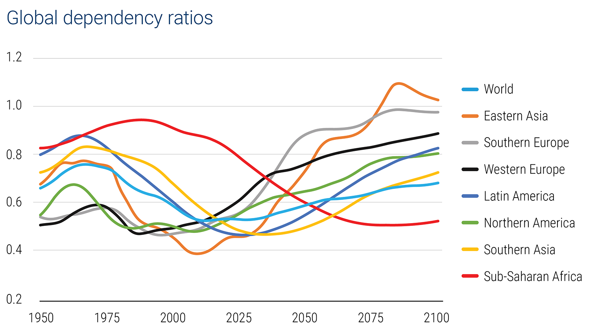

## Table of Contents

## What are demographic trends and why are they important for investors?

Demographic trends are patterns in how populations change over time. This includes things like how many people are born, how many people die, and how many people move to different places. These trends can show us if a population is getting bigger or smaller, older or younger, and more diverse or less diverse. For example, if more babies are being born than people dying, the population is growing. If people are living longer, the population is getting older.

These trends are important for investors because they help predict what people will need or want in the future. If a country's population is getting older, investors might put money into businesses that help older people, like healthcare or retirement homes. If a country's population is growing quickly, investors might invest in things like schools, houses, or baby products. By understanding demographic trends, investors can make smarter choices about where to put their money to meet the needs of the changing population.

## How do population growth rates influence investment decisions?

Population growth rates tell investors how fast the number of people in a place is changing. If the population is growing quickly, it means more people will need things like homes, food, and services. Investors might see this as a good chance to put money into businesses that build houses, make food, or provide services like education and healthcare. They think that as the population grows, these businesses will do well because more people will need what they offer.

On the other hand, if the population is not growing or is shrinking, investors might be more careful. They might not want to invest in things like new homes or schools because fewer people will need them. Instead, they might look for other opportunities, like investing in businesses that help older people if the population is getting older. Understanding population growth rates helps investors decide where to put their money to make the most of the changing needs of the population.

## What is the impact of aging populations on different sectors of the economy?

When a country's population gets older, it changes what people need and want. This can be good for some parts of the economy, like healthcare and retirement homes. More old people means more need for doctors, nurses, medicines, and places where old people can live and get help. Companies that make things like wheelchairs, hearing aids, and other health products might do well too. Also, old people might spend more money on travel and hobbies, so businesses in those areas could see more customers.

On the other hand, an aging population can be tough on other parts of the economy. When people get older, they might not buy as many new things, like cars or houses. This can hurt businesses that make or sell these things. Also, old people often stop working, which means fewer people are paying into things like social security and taxes. This can make it harder for the government to pay for things everyone needs, like schools and roads. So, while some sectors might grow, others might struggle because of an aging population.

## How can changes in birth rates affect long-term investment strategies?

Changes in birth rates can have a big impact on long-term investment strategies. If birth rates go up, it means more babies are being born, and the population will grow. Investors might see this as a good sign to put money into businesses that make things like baby food, diapers, and toys. They might also invest in companies that build schools and houses, because more people will need these things in the future. A growing population can mean more customers and more money for these kinds of businesses.

On the other hand, if birth rates go down, fewer babies are being born, and the population might not grow as much or might even shrink. This can change what investors do with their money. They might be less likely to invest in businesses that depend on a lot of new families, like baby products or new homes. Instead, they might look for other opportunities, like investing in businesses that help older people, because if fewer babies are being born, the population might be getting older. Understanding changes in birth rates helps investors plan for the long term and decide where to put their money to meet the needs of the changing population.

## What role do migration patterns play in shaping investment opportunities?

Migration patterns show how people move from one place to another. When lots of people move to a new place, it can create new chances for investors. For example, if many people move to a city, there will be more need for homes, shops, and services like schools and hospitals. Investors might see this as a good time to put money into building new houses or starting new businesses in that city. They think that as more people come, these businesses will do well because they will have more customers.

On the other hand, if people are moving away from a place, it can change what investors do. If a town is losing people, there might be less need for new homes or businesses. Investors might be less likely to put money into building things there because fewer people will need them. Instead, they might look for other places where people are moving to and invest there. Understanding where people are moving can help investors decide where to put their money to make the most of the changing needs of the population.

## How do demographic shifts influence consumer behavior and spending patterns?

Demographic shifts change who lives in a place and what they need. When the population gets older, older people might spend more on healthcare and less on things like new cars or clothes. They might also have more time and money for hobbies or travel. If more young people move to a city, they might spend more on renting apartments, going out to eat, and buying new gadgets. These changes mean that businesses need to think about what different groups of people want and how much they will spend.

When birth rates go up, more families with young kids might spend more on baby stuff like diapers and toys. They might also need bigger homes or cars. If birth rates go down, fewer families might mean less spending on these things. Migration patterns can also change spending. If lots of people move to a new place, they might spend money on setting up homes and buying things they need. If people move away, the ones left might spend less because there are fewer people to buy things. Understanding these shifts helps businesses know what to sell and how to plan for the future.

## What are the implications of urbanization on investment portfolios?

Urbanization means more people are moving to cities. This can be good for investors because cities need more buildings, like apartments and offices. Investors might put money into real estate, building new homes or fixing up old ones. They might also invest in businesses that help people in cities, like restaurants, shops, and public transport. As more people live in cities, these businesses can do well because they have more customers.

But urbanization can also make some investments less good. If people are leaving small towns and rural areas, businesses there might not do as well. Investors might not want to put money into things like farms or small town shops because fewer people will need them. They might also worry about city problems, like traffic and pollution, which can make some investments riskier. Understanding where people are moving helps investors decide where to put their money to make the most of the changes.

## How can investors use demographic data to predict market trends?

Investors can use demographic data to predict market trends by looking at how the population is changing. For example, if they see that more babies are being born, they might predict that there will be more need for baby products and schools in the future. If they notice that the population is getting older, they might expect more demand for healthcare and retirement homes. By understanding these trends, investors can guess what people will need and want, and then put their money into businesses that will meet those needs.

Migration patterns are another part of demographic data that can help predict market trends. If lots of people are moving to a city, investors might predict that there will be a bigger need for homes, shops, and services like public transport. This could make them want to invest in real estate or businesses in that city. On the other hand, if people are moving away from a place, investors might predict less need for new buildings or businesses there, and they might look for other places to invest. By keeping an eye on where people are moving, investors can make smarter choices about where to put their money.

## What are the potential risks associated with investing based on demographic trends?

Investing based on demographic trends can be risky because these trends can change in ways that are hard to predict. For example, if investors put a lot of money into baby products because they think birth rates will stay high, but then birth rates suddenly drop, they might lose money. Demographic data is based on what has happened in the past, but the future can be different. Things like new laws, big world events, or changes in what people want can all change demographic trends quickly.

Another risk is that demographic trends might not affect all parts of the economy the same way. If investors focus too much on one trend, like an aging population, they might miss out on other good investment opportunities. For example, if they only invest in healthcare and retirement homes, they might not see chances to invest in new technology or green energy. It's important for investors to look at many different kinds of data and not just rely on one trend to make their choices.

## How do demographic trends in emerging markets differ from those in developed countries, and what does this mean for global investment strategies?

Demographic trends in emerging markets are often different from those in developed countries. In many emerging markets, the population is younger and growing faster. This means there are more young people who need jobs, schools, and homes. Countries like India and many in Africa are seeing their populations get bigger and younger. This can be good for investors because it means more people will need things like food, clothes, and services. But it can also be hard because these countries might not have enough jobs or good schools for everyone.

In developed countries, the population is often older and growing more slowly. Countries like Japan and many in Europe have more old people and fewer young people being born. This means there might be more need for healthcare and retirement homes. Investors might put money into these kinds of businesses. But it can also mean fewer people buying new things like houses or cars. So, investors need to think about these differences when they plan where to put their money around the world. They might want to invest in growing markets where young people are, but also think about how to help older people in developed countries.

## What advanced statistical models can be used to analyze the impact of demographic trends on investment returns?

To understand how demographic trends affect investment returns, investors can use advanced statistical models like regression analysis. This model helps them see how changes in things like population age, birth rates, and migration patterns might change how much money they make from their investments. For example, if more old people means more money spent on healthcare, regression analysis can show how this trend might make healthcare stocks go up or down. This helps investors guess what might happen to their money if these trends keep going the way they are.

Another useful model is time series analysis. This model looks at how demographic trends change over time and how these changes might affect investment returns in the future. For example, if birth rates have been going up for the last few years, time series analysis can help predict if they will keep going up and what that might mean for businesses that make baby products. By using this model, investors can see patterns in the data and make better guesses about what might happen next, helping them decide where to put their money for the best returns.

## How can portfolio managers integrate demographic trend analysis into their asset allocation and risk management strategies?

Portfolio managers can use demographic trend analysis to decide how to spread their money across different investments. If they see that a country's population is getting older, they might put more money into healthcare and retirement homes because these businesses will likely do well. If they notice that a lot of young people are moving to a city, they might invest in real estate and businesses that help young people, like tech startups or education services. By looking at demographic trends, portfolio managers can guess what people will need and want in the future, and then choose investments that will meet those needs.

Demographic trend analysis can also help with managing risks. If a portfolio manager sees that birth rates are going down, they might be careful about investing too much in baby products or new schools. They might spread their money across different kinds of investments to be safe, in case the trends change. By understanding demographic trends, portfolio managers can make better choices about where to put their money to avoid big losses and make the most of the changing population's needs.

## What are Algorithmic Trading and Modern Investment Strategies?

Algorithmic trading has become an essential component in the evolution of modern investment strategies, leveraging the power of technology to execute financial decisions with unprecedented speed and precision. It involves the use of complex algorithms to automate trading entries and exits, minimizing human intervention and thereby reducing potential errors.

The core advantage of [algorithmic trading](/wiki/algorithmic-trading) lies in its ability to process and analyze vast amounts of financial data in real-time. This capability enables faster decision-making, which is critical in volatile markets where timing can significantly influence profitability. By using sophisticated data analysis techniques, algorithmic trading systems can identify patterns and trends that might be imperceptible to human traders.

A fundamental component of algorithmic trading is the use of mathematical models for predictive analysis. These models can include statistical methods, [machine learning](/wiki/machine-learning) algorithms, and other forms of quantitative analysis. For example, moving averages and other statistical indicators can be used to predict stock price movements:

$$
\text{Simple Moving Average (SMA)} = \frac{P_1 + P_2 + \ldots + P_n}{n}
$$

where $P_1, P_2, \ldots, P_n$ are the stock prices, and $n$ is the number of periods.

Investors utilizing algorithmic trading can enhance portfolio performance through strategic automation. By automating the execution of trades, investors can capitalize on market opportunities immediately as they arise, without the delays associated with manual trading. This is particularly advantageous when executing high-frequency trading strategies, where hundreds or thousands of trades might be completed in mere seconds.

In addition to speed, algorithmic trading offers the benefit of disciplined execution. It eliminates the emotional and psychological biases that can affect human traders, ensuring consistent adherence to a predetermined strategy. This discipline can be crucial in maintaining a long-term investment strategy, especially during periods of market stress.

Moreover, algorithmic trading can help optimize transaction costs through smart order routing, which identifies the best possible price across multiple market venues. This can result in significant savings, especially for large [volume](/wiki/volume-trading-strategy) trades.

The following Python snippet provides a simplified example of how an algorithmic strategy might be implemented to automate trades based on moving averages:

```python
import pandas as pd

# Sample stock data
data = pd.DataFrame({
    'price': [100, 102, 101, 105, 107, 110, 108, 111, 112, 115]
})

# Calculate moving averages
data['sma_3'] = data['price'].rolling(window=3).mean()
data['sma_5'] = data['price'].rolling(window=5).mean()

# Define trading signals
data['signal'] = 0
data['signal'][3:] = np.where(data['sma_3'][3:] > data['sma_5'][3:], 1, 0)

# Determine position changes
data['position'] = data['signal'].diff()

# Print trading strategy
print(data)
```

This code calculates simple moving averages and generates trading signals when the short-term moving average crosses above or below the long-term moving average. Such an approach exemplifies the potential for algorithmic trading strategies to enhance investment decisions, driving efficiency and potentially improving returns.

In conclusion, as technology continues to advance, the role of algorithmic trading in shaping modern investment strategies will likely grow. Investors who integrate these technologies into their approach can expect to benefit from faster, more informed trading decisions, potentially leading to superior portfolio performance.

## References & Further Reading

[1]: Bergstra, J., Bardenet, R., Bengio, Y., & Kégl, B. (2011). ["Algorithms for Hyper-Parameter Optimization."](https://dl.acm.org/doi/10.5555/2986459.2986743) Advances in Neural Information Processing Systems 24.

[2]: ["Advances in Financial Machine Learning"](https://www.amazon.com/Advances-Financial-Machine-Learning-Marcos/dp/1119482089) by Marcos Lopez de Prado

[3]: ["Evidence-Based Technical Analysis: Applying the Scientific Method and Statistical Inference to Trading Signals"](https://www.amazon.com/Evidence-Based-Technical-Analysis-Scientific-Statistical/dp/0470008741) by David Aronson

[4]: ["Machine Learning for Algorithmic Trading"](https://github.com/stefan-jansen/machine-learning-for-trading) by Stefan Jansen

[5]: ["Quantitative Trading: How to Build Your Own Algorithmic Trading Business"](https://github.com/LucindaYa/quant-resources/blob/master/Quantitative%20Trading%20How%20to%20Build%20Your%20Own%20Algorithmic%20Trading%20Business.pdf) by Ernest P. Chan